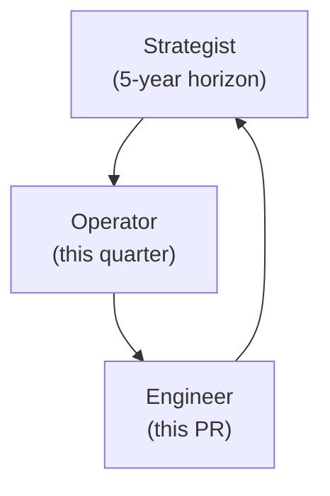
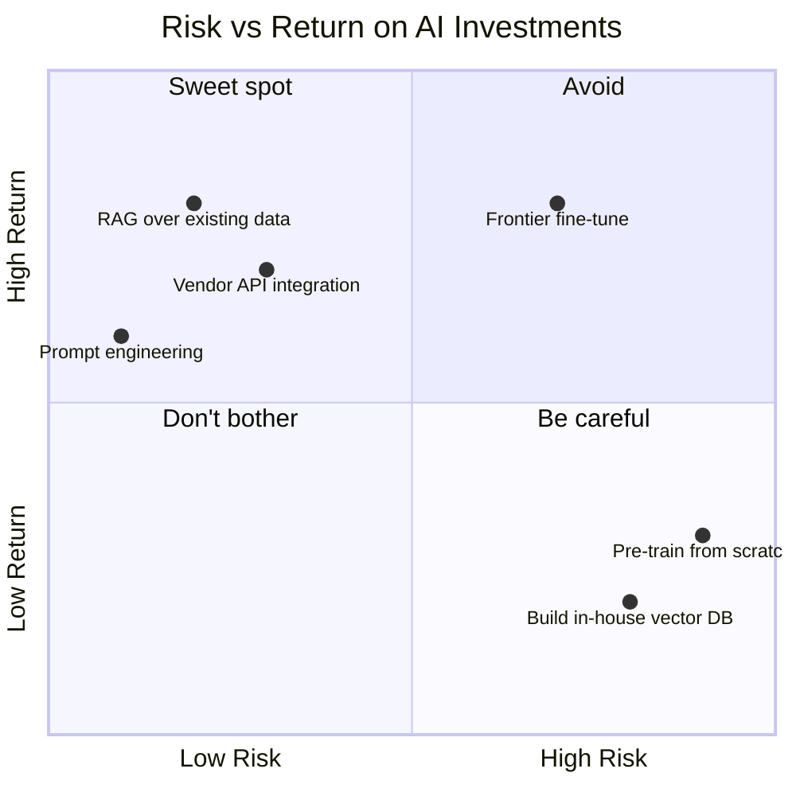

# AI Engineering Director Playbook
## Chapter 1

# What an AI Engineering Director Actually Does

> *"The job is not to be the smartest person in the room about AI. The job is to make sure the company gets the most out of AI without getting destroyed by it."*

---

## 1. Epigraph

The job is not to be the smartest person in the room about AI. The job is to make sure the company gets the most out of AI without getting destroyed by it.

---

## 2. Problem

Your CEO walks in and says: "We're betting the next product cycle on AI. Own it." You have 90 days, 8 reports, no precedent, and a board that has just read three articles about competitors. The first decision you make will set the tone for the next two years. This is the chapter that tells you what to optimize for in those 90 days — and what to avoid.

**Decision in one sentence:** An AI Engineering Director is the single accountable owner of how the company invests in, builds with, and is changed by AI — across engineering, product, and the business.

---

## 3. Why AI Engineering Directors Fail Here

Five named failure modes of stepping into the role.

- **Builder's Trap.** The new Director spends the first 90 days building — demos, prototypes, internal tools — and never builds the organizational surface area that makes AI work sustainable. By month 6, the demos are still demos.
- **Demo-Ware Delusion.** The Director signs off on the most polished demo and treats it as production-ready. Six months later, the feature is broken in production and the team is firefighting the gaps the demo never showed.
- **Vendor-Selection Rabbit Hole.** The Director spends months picking between OpenAI, Anthropic, Google, and open-source, evaluating on benchmarks that don't predict production performance. Meanwhile, the actual feature work hasn't started.
- **Strategy-Document Theater.** The Director writes a 30-page AI strategy doc, gets it signed off, and treats the doc as a substitute for execution. Six months later, the doc hasn't been read since sign-off and the org has no shared mental model of what "good" looks like.
- **Hire-First Mentality.** The Director's first instinct is to hire 12 ML engineers. The org doesn't yet have the platform, data, or product context to make those hires productive. By the time the org catches up, half the hires have left.

---

## 4. Mental Models

Four mental models that compress the Director role into something you can navigate.

**Mental model 1: The Three Hats.** A Director wears three hats on a rotating basis: the **Strategist** (5-year horizon, board conversations), the **Operator** (this quarter, this team, this release), and the **Engineer** (still writes code, still reviews PRs, still on-call for the AI feature they own). Most new Directors default to one hat and neglect the other two.



**Mental model 2: The Decision Stack.** Every Director-level decision has three layers: the **frame** (what question are we answering?), the **alternatives** (what are we choosing between?), and the **criteria** (how will we judge?). Most Director failures are frame failures — they answered the wrong question perfectly.

**Mental model 3: The Risk-Return Quadrant.** AI investments fall into four quadrants: **High-Risk / High-Return** (frontier model fine-tunes, novel agent architectures), **Low-Risk / High-Return** (RAG over existing data, prompt engineering, vendor API integration), **High-Risk / Low-Return** (pre-training from scratch, building in-house vector DBs), and **Low-Risk / Low-Return** (rewriting prompts that already work, swapping APIs that already meet SLA). The Director's job is to maximize time spent in the top-right quadrant and minimize time in the bottom-right.



**Mental model 4: The 3-Customer Rule.** Every AI feature has at most three real customers: the **end user** (who uses the feature), the **product/business owner** (who pays for it), and the **model** (which serves it). If you cannot name all three for a feature, the feature has no owner. If the three are misaligned (the model optimizes for what the user doesn't want), the feature fails.

---

## 5. Frameworks

Three frameworks for the conversations you will have in your first 90 days.

### Framework 1: The 90-Day Director Plan

Three phases, 30 days each.

```
Phase 1 — LISTEN (Days 1-30)
- 1:1 with every direct report (90 min each)
- 1:1 with every peer Director + skip-level (60 min each)
- Audit: every AI feature in production, every AI project in flight
- Deliverable: a 4-page "State of AI" memo to the CEO

Phase 2 — DECIDE (Days 31-60)
- Run Frameworks 2 and 3 below on every active AI project
- Pick the 2-3 things to invest in, the 2-3 things to stop, and the
  1-2 things to watch for 6 more months
- Hire 1-2 key roles (platform engineer, eval lead); defer the rest
- Deliverable: a 2-page "AI Investment Plan" memo to the CEO + CTO

Phase 3 — DELIVER (Days 61-90)
- Ship one quick win from the Phase 2 plan (a measurable improvement
  to an existing AI feature in production)
- Establish the weekly cadence (Framework 3 below)
- Run the first quarterly portfolio review
- Deliverable: a 1-page "30-day Progress" memo
```

### Framework 2: The Decision Memo

Every AI investment > $50K or > 1 quarter of team time goes through this 7-question memo before sign-off:

```
1. What decision are we making? (Frame the question.)
2. What is the cost of NOT deciding for one more quarter?
3. What alternatives did we consider? (List at least 2.)
4. Why are we rejecting each alternative? (One sentence per.)
5. What is the reversibility profile? (Reversible / soft-write / hard-write / irreversible.)
6. What is the de-risking plan? (Kill criteria + flip rules.)
7. What would change our mind in 6 months? (Re-evaluation trigger.)
```

The memo is a forcing function. The Director who cannot fill it in 90 minutes is not ready to sign off.

### Framework 3: The Weekly Cadence

A Director's week has three recurring meetings, no more:

```
Monday 60-min: 1:1 with each direct report (rotating)
Wednesday 30-min: AI portfolio review with cross-functional peers
  (PM, Design, Data, Legal/Security)
Friday 30-min: skip-level with CTO/CEO (rotating)
Everything else is calendar noise. Cancel what doesn't fit.
```

---

## 6. Drill

You are the newly hired Director of AI at **acme-corp**, a 400-person B2B SaaS company. The CEO has given you 90 days.

### Current state (realistic)

- 6 AI features in production (most are LLM-wrapped search or chatbot features)
- 1 dedicated AI team of 8 engineers (mix of ML, backend, frontend)
- $2.4M annual AI spend (mostly OpenAI + Anthropic API costs)
- No eval system; regressions caught by customer complaints
- CEO pressure to ship a "transformative" AI feature by Q4 board meeting
- CTO is supportive but skeptical of fine-tuning, prefers prompt engineering
- CFO has flagged AI spend as growing 30% Q-over-Q with no clear ROI

You have **90 minutes**. Produce a 90-Day Director Plan memo (`portfolio/chapter-01-90-day-plan.md`) using Framework 1 (90-Day Plan), with at least one decision memo (Framework 2) for the highest-stakes decision in your first 30 days, and a draft weekly cadence (Framework 3).

**Deliverable:** `portfolio/chapter-01-90-day-plan.md` — under 1,200 words.

---

## 7. Worked Example

**Decision:** What is your 90-day plan at acme-corp?

**Phase 1 — LISTEN (Days 1–30)**

1:1s with: 8 direct reports, 4 peer Directors (Product, Engineering, Data, Design), CTO, CFO, CEO. **Time cost:** ~25 hours over 30 days. Audit of 6 AI features: cost, traffic, eval coverage, customer satisfaction. **Deliverable:** a 4-page "State of AI at acme-corp" memo. Findings: $2.4M annual spend is concentrated in 2 features (1 chatbot = 60%, 1 search = 25%); 4 of 6 features have no eval; the chatbot is the source of the cost growth but also the source of the CEO's pressure.

**Phase 2 — DECIDE (Days 31–60)**

Two investments to greenlight:

1. **Eval system for the chatbot** (the cost driver and the CEO's pet feature). Hire 1 eval lead. Build offline + online + human eval per Ch 9 framework. Budget: $200K + 1 FTE.
2. **Cost reduction on the chatbot** (leveraging Ch 7 framework). Target 30% cost reduction with prompt compression + L1 cache. Budget: $80K + 0.5 FTE.

Two things to stop:

1. The "Q4 transformative feature" — too vague. Defer to Phase 3 scoping.
2. The fine-tuning experiment the team has been running — not aligned with the Moat Test (Ch 4).

One thing to watch:

1. Two new product ideas in the pipeline (an AI co-pilot for sales; an AI summarizer for support). Don't kill them; let them incubate another quarter.

**Decision memo for the eval-system investment (Framework 2):**

1. *What decision?* "Build a first-class eval system for the customer chatbot by end of Q2."
2. *Cost of NOT deciding?* Cost of one more quarter of eval-less chatbot: ~$300K in cost over-runs + customer churn from quality regressions.
3. *Alternatives?* (a) Buy a third-party eval platform (rejected: $500K/year, integration cost > build cost); (b) Wait and let the team build ad-hoc evals (rejected: no ownership, no cadence); (c) Build in-house (chosen).
4. *Why reject alternatives?* (a) over-priced for our scale; (b) no ownership = no eval system.
5. *Reversibility?* Reversible — eval system is additive; no customer-facing change.
6. *De-risking plan?* 90-day eval-coverage target = 100% offline + 100% online + monthly human audit on chatbot. Kill criterion: eval system not shipped in 90 days → escalate to CTO.
7. *Re-evaluation trigger?* If eval system shows chatbot quality is already 90%+ on production traffic, re-evaluate the scope.

**Phase 3 — DELIVER (Days 61–90)**

Ship the L1 cache cost reduction (the smaller of the two greenlit investments). Establish the weekly cadence. Run the first quarterly portfolio review.

**Score: 23/25 on the rubric.**

---

## 8. Failure Mode Postmortem

A Director of AI at a 1,500-person B2B SaaS company spent their first 90 days shipping a flashy AI demo to the CEO. The demo was a 4-minute walkthrough of a multi-agent system that "could automate customer onboarding." The CEO loved it. The board loved it. The demo got coverage in a trade publication.

Six months later, the Director was asked to leave. The multi-agent system never made it past the demo. The team had been pulled off the cost-reduction work the Director had inherited. Eval coverage on the existing chatbot dropped from 60% to 40% during the 6 months. Cost grew 45% Q-over-Q. Customer churn on the chatbot tier accelerated.

What they missed: every framework above. No 90-day plan — the first 90 days were spent building the demo. No decision memo — the multi-agent system was greenlit on the strength of the demo, not on a memo. No weekly cadence — the Director was in "demo mode" instead of "operating mode." Builder's Trap + Demo-Ware Delusion + Strategy-Document Theater (the trade publication article functioned as the strategy document).

The lesson: a Director's first 90 days are not a sandbox. They are the most consequential 90 days in the role. Spend them listening and investing, not building and demoing.

---

## 9. Self-Assessment Rubric

| # | Dimension | 1 (Novice) | 3 (Competent) | 5 (Expert) |
|---|---|---|---|---|
| 1 | Three Hats in balance | Defaults to one hat | Names all three, rotates weekly | Balances all three with named weekly split |
| 2 | Decision Stack framing | Answers the surfaced question | Names frame + alternatives + criteria | Names the frame behind the frame |
| 3 | Risk-Return placement | Picks the demo | Names quadrant for each project | Maps portfolio + explains concentration limits |
| 4 | 3-Customer Rule | Names "the user" | Names end user + business owner | Names all three including the model |
| 5 | 90-Day Plan structure | Builds in first 30 days | LISTEN / DECIDE / DELIVER with deliverables | Includes kill criteria + flip rules per deliverable |

**Disqualifier:** any 1 on dimension 1 or 5. Defaulting to one hat or building before listening is the path to Builder's Trap + Demo-Ware Delusion.

**Total:** ___ / 25. **Pass threshold:** 18/25, no dimension below 3.

---

## 10. Portfolio Artifact Note

Save your filled-in drill as `portfolio/chapter-01-90-day-plan.md` — this is interview evidence for "What would your first 90 days as Director of AI look like?" and the Decision Memo you write is evidence for "Walk me through a $200K+ investment decision you made."

---

## 11. Interview Questions

1. **You've been hired as Director of AI at a 1,000-person company. What do you do in your first week?** (Grading: tests the LISTEN phase. The right answer is "1:1s + audit", not "ship a demo".)
2. **Your CEO wants a "transformative AI feature" by Q4. How do you respond?** (Grading: tests Decision Stack + Risk-Return. The right answer engages with the frame before the answer.)
3. **You have $2M annual AI spend and growing 30% Q-over-Q. What's your move?** (Grading: tests cost discipline + eval discipline. The right answer is "audit + eval system + cost reduction in that order", not "switch vendors".)
4. **Your CTO says fine-tuning is a waste of time. Your team disagrees. How do you handle it?** (Grading: tests influencing without authority. The right answer runs the Moat Test and presents the memo, not the opinion.)
5. **Walk me through the most consequential first-90-days decision you've made.** (Grading: tests whether the candidate has actually done this; look for specific deliverables and kill criteria.)