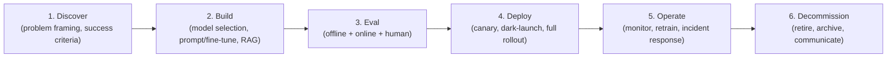
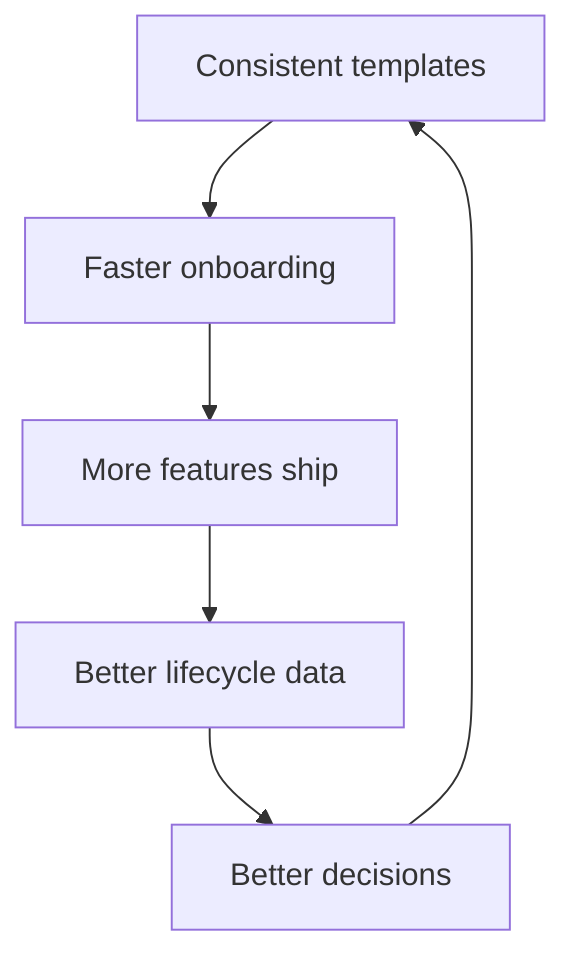

# AI Engineering Director Playbook
## Chapter 10

# MLOps / LLMOps Lifecycle

> *"The model is the easy part. The lifecycle is the hard part."*

---

## 1. Epigraph

The model is the easy part. The lifecycle is the hard part.

---

## 2. Problem

Your team has 14 AI features in production. Each was built by a different pod. Each has its own eval cadence, its own retraining trigger (or none), its own serving infra, its own monitoring stack, and its own "we'll figure it out" rollback plan. A regulatory auditor asks: "Show me the model card for each feature, the training data lineage for each, and the rollback procedure for each." You have 14 different answers, in 14 different formats, and most of them are wrong.

This chapter is the operating manual for the AI feature lifecycle: the disciplined sequence every AI feature follows from "idea" to "decommissioned." A team that doesn't have a lifecycle produces the kind of chaos you inherit. A Director who defines and enforces a lifecycle produces a team that ships faster, breaks less, and answers auditors in 5 minutes instead of 5 weeks.

**Decision in one sentence:** Define a 6-stage lifecycle (Discover → Build → Eval → Deploy → Operate → Decommission) with a written contract for each stage, mandatory artifacts at each gate, and a single named owner per feature — then enforce it without exception.

---

## 3. Why AI Engineering Directors Fail Here

Five named failure modes of lifecycle discipline at the Director level.

- **The "Just Ship It" Culture.** The Director treats lifecycle as a tax that slows shipping. The team ships 4 features in a quarter with no lifecycle artifacts. Six months later, no one can answer "what's in production, what data was it trained on, who's responsible."
- **The One-Off Lifecycle.** The Director approves a different lifecycle process for each new feature because "this one is special." Six months later there are 14 different lifecycles and no shared infrastructure.
- **The MLOps Theater.** The Director invests in MLOps tooling (Feast, MLflow, Kubeflow, Weights & Biases) without first defining the lifecycle. The tools are under-used; the lifecycle is implicit; the data is in scattered notebooks.
- **The Decommission Vacuum.** The Director never builds the decommission stage. Features accumulate forever. The cost of "we might want to revisit it" is real but invisible. The team owns 14 features; only 6 are active.
- **The Single-Owner Myth.** The Director names an ML engineer as the "feature owner" but doesn't give them authority over the eval, the deploy, or the on-call rotation. The owner is a name on a doc; the feature is owned by whoever has time.

---

## 4. Mental Models

Four mental models that compress lifecycle discipline into something you can defend.

**Mental model 1: The 6-Stage Lifecycle.** Every AI feature moves through 6 stages.



Each stage has a written exit artifact: Discover → Problem Brief + Success Criteria. Build → Eval Report. Eval → Ship Decision Memo. Deploy → Rollout Runbook. Operate → On-call Runbook + Drift Report. Decommission → Retirement Memo.

**Mental model 2: The Stage Gate.** No stage advances without an artifact and a named approver.

```
Discover → Build:    Problem Brief + Success Criteria signed by PM + Director
Build → Eval:        Eval Report (offline pass rates by capability dimension)
Eval → Deploy:       Ship Decision Memo (rollout plan, kill criteria, owner)
Deploy → Operate:    Rollout Runbook + On-call Runbook signed by SRE
Operate → Decom.:    Retirement Memo (data archive, customer comm, cost savings)
```

A feature that skips a gate is a feature that bypasses the discipline. The Director's job is to make the gate visible enough that skipping it requires explicit override.

**Mental model 3: The Lifecycle as a Flywheel.** Lifecycle discipline produces flywheel: faster Discover, more reliable Build, faster Deploy, better Operate.



A Director who treats lifecycle as tax misses the flywheel. A Director who treats lifecycle as leverage accelerates every future feature.

**Mental model 4: The Lifecycle-Cost Stack.** The cost of a feature over its lifetime is dominated by Operate, not Build.

```
Discover:    ~5% of lifetime cost
Build:       ~15%
Eval:        ~10%
Deploy:      ~5%
Operate:     ~60%  ← dominant
Decom.:      ~5%
```

A team that optimizes Build time at the expense of Operate time is shifting cost from a 1-month sprint to a 3-year tail. The Director's metric: cost per quarter per active feature, with Operate as the line item.

---

## 5. Frameworks

Three frameworks for the conversations you will have.

### Framework 1: The Lifecycle Gate Audit

For every feature in production, complete this audit quarterly:

```
1. Discover:   Problem Brief exists? Success Criteria defined?
2. Build:      Eval Report exists? Model/prompt/fine-tune documented?
3. Eval:       Ship Decision Memo exists? Kill criteria defined?
4. Deploy:     Rollout Runbook exists? Canary monitored?
5. Operate:    On-call Runbook exists? Drift report monthly? Eval refresh quarterly?
6. Decom.:     Retirement plan exists? Data archive plan?
```

Score per feature: 6/6 = green; 4–5/6 = yellow; <4/6 = red. Red features trigger a remediation plan within 30 days.

### Framework 2: The Lifecycle Standard

For every new feature, the standard is the same:

```
- Templates for every stage artifact (linked in _shared/templates/)
- Stage gates with named approver per gate
- Single named owner per feature (engineering, not PM)
- Quarterly lifecycle audit (Framework 1)
- Retrospective 90 days post-launch
- Decommission plan defined at Deploy (not at retirement)
```

### Framework 3: The Retrospective Trigger

A 90-day post-launch retrospective fires for every shipped feature. Questions:

```
1. Did the feature meet the Success Criteria from Discover?
2. What eval gaps did we discover in production?
3. What cost surprises did we hit? Was the cost_estimator.py estimate within 20%?
4. What would we do differently next time?
5. Should the feature be (kept / iterated / decommissioned)?
```

The retrospective produces 1–2 changes to the lifecycle templates or the standard — closing the flywheel.

---

## 6. Drill

You are the Director of AI at **acme-corp**. You have 14 AI features in production. A regulatory audit is scheduled in 60 days. The auditor wants:

1. Model cards for all 14 features.
2. Training-data lineage for any feature that includes a fine-tune.
3. Rollback procedures for all 14 features.
4. Drift monitoring for all 14 features.

You have **90 minutes**. Produce a **lifecycle compliance plan** (`portfolio/chapter-10-lifecycle-plan.md`) using Framework 1 (Lifecycle Gate Audit) applied to all 14 features, plus a remediation timeline for any feature scoring <6/6. Specify:

- The 14 features' current scores (make realistic assumptions; mix of green/yellow/red).
- A 60-day remediation plan with named owners.
- The 3 lifecycle gaps that are systemic (across multiple features).
- The 2 template changes you will make as a result of this audit.

**Deliverable:** `portfolio/chapter-10-lifecycle-plan.md` — under 900 words.

---

## 7. Worked Example

**Lifecycle Gate Audit (sample 14 features):**

| Feature | Discover | Build | Eval | Deploy | Operate | Decom. | Score |
|---|---|---|---|---|---|---|---|
| Support Assistant | ✅ | ✅ | ✅ | ✅ | ✅ | ❌ | 5/6 |
| Search / Discovery | ✅ | ✅ | ✅ | ✅ | ❌ | ❌ | 4/6 |
| Email Draft | ✅ | ✅ | ✅ | ❌ | ❌ | ❌ | 3/6 |
| Code Suggestion | ✅ | ✅ | ❌ | ❌ | ❌ | ❌ | 2/6 |
| Sales Email Gen | ✅ | ✅ | ✅ | ✅ | ✅ | ❌ | 5/6 |
| Doc Summarizer | ✅ | ✅ | ✅ | ✅ | ✅ | ✅ | 6/6 |
| Image Tagging | ✅ | ✅ | ❌ | ❌ | ❌ | ❌ | 2/6 |
| Translation | ✅ | ✅ | ✅ | ✅ | ❌ | ❌ | 4/6 |
| ... (6 more) | | | | | | | avg 4.1/6 |

Average score: **4.1/6.** Yellow. Two features at 2/6 (red).

**60-day remediation plan:**

- **Week 1–2:** Audit working group. Assign each red feature a named owner with 1-week deadline to produce missing artifacts.
- **Week 3–6:** Owners produce artifacts. Director signs off.
- **Week 7–8:** Build/roll out the missing pieces (e.g., rollback runbook for Image Tagging = 2 days; drift monitoring for Code Suggestion = 1 sprint).
- **Week 9:** Pre-audit dry-run with internal team acting as auditor.
- **Week 10–12:** Finalize artifacts, brief the exec team, host the auditor.

**3 systemic gaps identified:**

1. **Decommission plan never defined at Deploy.** Only 1 feature (Doc Summarizer) has a Decommission plan. The standard is broken — the gate requires a Decom plan, but no template exists.
2. **Drift monitoring absent on 9 of 14 features.** The Operate gate is poorly defined — no requirement for drift monitoring cadence. Build a default monitoring template.
3. **Feature owner ambiguity.** 6 features have ambiguous ownership (3 ML engineers all listed). The standard requires "single named owner" but no enforcement.

**2 template changes:**

1. **Decommission-plan template added to Deploy gate.** Required at Deploy, not at Decommission. Includes data archive plan + customer communication plan + cost-savings accounting.
2. **Drift-monitoring default added to Deploy gate.** Every feature ships with a Grafana dashboard + alert on 3 standard metrics (eval-pass-rate, latency p95, cost-per-request).

**Cost of remediation:** ~3 FTE-weeks. Cost of NOT remediating: regulatory audit failure + ongoing $400K/year drift-detection debt.

---

## 8. Failure Mode Postmortem

A Director of AI at a 1,800-person fintech inherited a team with 11 AI features. No lifecycle. No templates. Each feature had its own artifact format (or none). A regulatory exam asked for model cards, training lineage, and rollback procedures.

The team spent 6 weeks producing the artifacts manually. Three features were deprecated mid-audit when the team discovered they couldn't produce the lineage. One feature was non-compliant on a privacy control (training data included PII without proper consent). The Director was asked to remediate within 90 days. The Director hired a compliance contractor for $400K to build the artifacts.

What they missed: every Framework 1 question. The features had been shipped without lifecycle discipline. The Director inherited a "Just Ship It" culture and didn't change it. The cost of the compliance contractor was the cost of *every* feature's lifecycle being built in retrospect.

The lesson: lifecycle discipline is cheap. Retroactive lifecycle is expensive.

---

## 9. Self-Assessment Rubric

| # | Dimension | 1 (Novice) | 3 (Competent) | 5 (Expert) |
|---|---|---|---|---|
| 1 | Defines the 6-stage lifecycle | Has a vague process | Names all 6 stages with artifacts | Standard published + adopted by every team |
| 2 | Enforces stage gates | Skips for "special" features | Requires gate artifacts before advancing | Has gate-override mechanism that requires exec sign-off |
| 3 | Tracks lifecycle-cost stack | Optimizes Build time | Tracks cost per stage | Optimizes Operate (60% of lifetime cost) |
| 4 | Runs lifecycle audits | Never audits | Yearly audit | Quarterly audit + remediation plan |
| 5 | Captures retrospective signal | No retrospectives | Runs them ad-hoc | Runs them at 90 days + updates the templates |

**Disqualifier:** any 1 on dimension 1 or 2. Skipping stages or skipping gates is the path to the "Just Ship It" Culture.

**Total:** ___ / 25. **Pass threshold:** 18/25, no dimension below 3.

---

## 10. Portfolio Artifact Note

Save your filled-in drill as `portfolio/chapter-10-lifecycle-plan.md` — interview evidence for "How do you manage an AI feature from idea to retirement?" (see Portfolio Map in Chapter 27).

---

## 11. Interview Questions

1. **Walk me through the lifecycle of an AI feature at your company — from idea to retirement.**
2. **A regulator asks for model cards on every AI feature in production. How long does that take you?**
3. **Your team says "lifecycle is tax." How do you respond?**
4. **Walk me through how you'd run a quarterly lifecycle audit on 14 features.**
5. **Your company has 14 AI features. 6 of them have ambiguous ownership. What do you do first?**