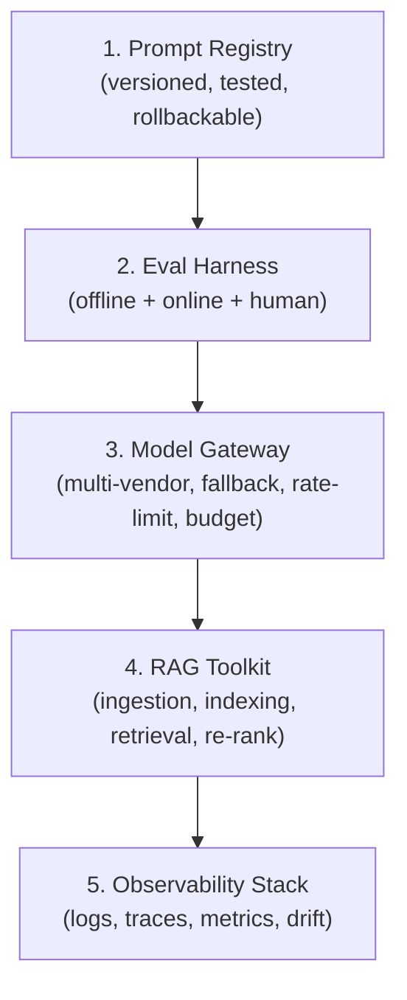
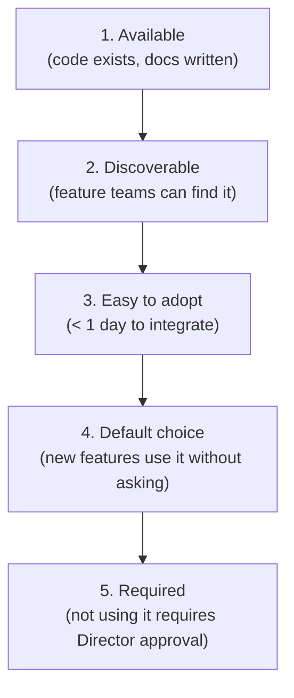
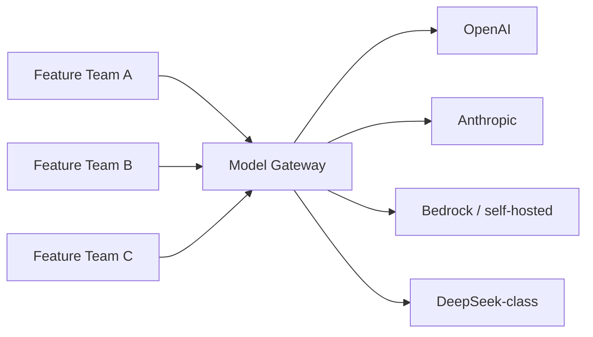

# AI Engineering Director Playbook
## Chapter 11

# AI Platform Engineering

> *"Build a platform that makes the easy things easy and the hard things possible."*

---

## 1. Epigraph

Build a platform that makes the easy things easy and the hard things possible.

---

## 2. Problem

Your team has 9 AI features in production. Each one uses a different model vendor. Each has its own prompt-management system (or no system — the prompts are in a Slack thread). Each has its own vector DB (or no vector DB — there's a CSV somewhere). Each team has rebuilt the same eval harness 3 times. The CTO asks: "Why does it take 8 weeks to ship an AI feature when our competitors ship in 2?"

This chapter is the operating manual for AI platform engineering: the discipline of building shared infrastructure that makes the *next* AI feature 5x cheaper to ship than the *last* one. A team without an AI platform rebuilds the same plumbing 9 times. A team with a great AI platform ships features as fast as the customer need demands.

**Decision in one sentence:** Stand up an AI platform with 5 capabilities (Prompt Registry, Eval Harness, Model Gateway, RAG Toolkit, Observability Stack) — owned by a platform team — consumed as services by every AI feature team — and measure success by feature-lead-time reduction, not by the platform's own output.

---

## 3. Why AI Engineering Directors Fail Here

Five named failure modes of AI platform engineering at the Director level.

- **The "Just Use the Vendor's UI" Anti-Pattern.** The Director defers all AI tooling to vendor UIs (OpenAI Playground, Anthropic Console, Pinecone dashboard). The team loses all ability to manage prompts as code, evals as data, or rollback as a workflow. Switching vendors becomes impossible.
- **The Build-the-OS Trap.** The Director green-lights a 12-month AI platform project with 8 engineers to build "the AI infrastructure." The platform ships 8 months late. The features that needed it have already shipped on direct vendor APIs. The platform team is a tax on the org chart.
- **The Ivory-Tower Platform.** The Director builds the platform without input from feature teams. The platform team optimizes for elegance; feature teams optimize for "ship this quarter." The platform is unused.
- **The One-Off Tooling.** The Director lets each feature team pick its own tools (LangChain, LlamaIndex, raw API). There is no shared abstraction. Prompts are not portable. Vendors are not swappable. The team has 9 different stacks.
- **The Platform-as-Feature Confusion.** The Director measures the platform team's success by features shipped, not by consumption. The platform team builds bespoke AI features for 2 flagship customers instead of building shared infrastructure.

---

## 4. Mental Models

Four mental models that compress AI platform engineering into something you can defend.

**Mental model 1: The 5-Capability AI Platform.** A complete AI platform has 5 capabilities.



Each capability is owned by the platform team, exposed as a service, and consumed by every feature team. Feature teams should not be writing prompt-management code; they should be calling the Prompt Registry.

**Mental model 2: The Platform Adoption Ladder.** Adoption follows a predictable pattern.



Most platform teams stop at A2. The platform exists; nobody uses it. The path to A5 is months of investment in the Easy-to-Adopt stage.

**Mental model 3: The Multi-Vendor Gateway.** A Model Gateway sits between feature teams and model vendors.



The Gateway provides: rate limiting per team, budget enforcement per team, automatic fallback on outage, response caching, request/response logging, and the *ability to swap vendors with a config change*.

**Mental model 4: The Prompt-as-Code Discipline.** Prompts are code: versioned, tested, code-reviewed, rollback-able.

- Prompts live in git, not in a vendor UI.
- Each prompt change is a PR with eval-set results attached.
- Each prompt has a designated owner.
- Prompt versions are linked to the model version + RAG version that produced them.

A team that manages prompts in Slack threads cannot reproduce, cannot A/B, cannot rollback, cannot audit.

---

## 5. Frameworks

Three frameworks for the conversations you will have.

### Framework 1: The Platform Investment Audit

For each of the 5 capabilities, score the current state:

```
Capability          | Available | Discoverable | Easy | Default | Required
--------------------|-----------|--------------|------|---------|---------
Prompt Registry     |    Y/N    |     Y/N      | Y/N  |   Y/N   |   Y/N
Eval Harness        |    Y/N    |     Y/N      | Y/N  |   Y/N   |   Y/N
Model Gateway       |    Y/N    |     Y/N      | Y/N  |   Y/N   |   Y/N
RAG Toolkit         |    Y/N    |     Y/N      | Y/N  |   Y/N   |   Y/N
Observability Stack |    Y/N    |     Y/N      | Y/N  |   Y/N   |   Y/N
```

Targets: 5/5 "Default" within 12 months; 3/5 "Required" within 18 months.

### Framework 2: The Platform Roadmap

A platform roadmap has 3 time horizons:

```
Now (this quarter):
  - The 1 capability that's blocking the most feature teams
  - Quick win that establishes the "platform is shipping" cadence

Next (this half):
  - The 2 capabilities adjacent to Now
  - Adoption work (Easy + Default adoption)

Later (this year):
  - The remaining 2 capabilities
  - Required-adoption stage
```

The Now work must be visible to feature teams within 30 days or they will lose faith.

### Framework 3: The Platform Health Metrics

The platform team's success is measured by consumption, not by output.

```
Metric                                | Target       | Source
--------------------------------------|--------------|-----------
Feature lead time (idea → prod)       | < 6 weeks    | Tracker
% new features using Prompt Registry  | > 80%        | Registry logs
% features using Eval Harness        | > 90%        | Eval logs
% features using Model Gateway        | 100%         | Gateway logs
P95 latency overhead (gateway)        | < 50ms       | Gateway metrics
Vendor-switch lead time               | < 1 day      | Drill
```

The platform team is *underinvested* if features can ship faster without it. The platform team is *overinvested* if features are waiting on it.

---

## 6. Drill

You are the Director of AI at **acme-corp**. You have 9 AI features in production, each with its own stack. The CTO has asked: "Cut the time-to-ship for a new AI feature from 8 weeks to 4 weeks. Also, I want to be able to switch model vendors without re-deploying 9 features."

You have **90 minutes**. Produce an **AI platform strategy** (`portfolio/chapter-11-platform-strategy.md`) using Framework 1 (Platform Investment Audit), Framework 2 (Roadmap), and the 5-Capability model. Specify:

- The current state of each capability (Available/Discoverable/Easy/Default/Required).
- The 1 capability to invest in this quarter, with rationale.
- The roadmap for the next 12 months.
- 3 features that would adopt the platform in the first 30 days (named pilots).
- The platform-team size + budget.
- The 1 vendor-switch drill you'd run to prove the platform works.

**Deliverable:** `portfolio/chapter-11-platform-strategy.md` — under 900 words.

---

## 7. Worked Example

**Current state (Platform Investment Audit):**

| Capability | Available | Discoverable | Easy | Default | Required |
|---|---|---|---|---|---|
| Prompt Registry | ✅ | ❌ | ❌ | ❌ | ❌ |
| Eval Harness | ✅ | ✅ | ❌ | ❌ | ❌ |
| Model Gateway | ❌ | ❌ | ❌ | ❌ | ❌ |
| RAG Toolkit | ✅ | ✅ | ❌ | ❌ | ❌ |
| Observability Stack | ✅ | ✅ | ✅ | ❌ | ❌ |

**This quarter: Model Gateway.**

Rationale:
- Unblocks vendor-switch CTO ask.
- Unblocks per-team budget enforcement.
- 3 of 9 features have had vendor-outage incidents in the last 6 months.

Investment: 1 senior platform engineer + 0.5 SRE + $20K infrastructure (Redis for rate-limit, Postgres for budget table, basic OpenAI/Anthropic/Bedrock adapters). Time: 8 weeks.

**30-day pilots (3 features):**
1. **Support Assistant** — highest revenue, biggest vendor risk.
2. **Code Suggestion** — high volume, needs budget enforcement.
3. **Email Draft** — internal use, low-risk pilot consumer.

**12-month roadmap:**

```
Now (Q1):
  - Model Gateway (8 weeks)
  - Prompt Registry v1 (4 weeks, scoped)
  - Observability: drift detection template (4 weeks)

Next (Q2):
  - Eval Harness: from "available" to "default" (8 weeks)
  - Prompt Registry v1 → "default" (6 weeks adoption work)
  - RAG Toolkit: from "available" to "easy" (8 weeks)

Later (Q3-Q4):
  - All 5 capabilities → "default" by Q3
  - 3 of 5 capabilities → "required" by Q4
  - 1 director-approval gate for "bypass the platform"
```

**Platform team size:** 1 senior platform engineer (lead) + 1 platform engineer + 0.5 SRE (shared) + 0.25 PM.

**Vendor-switch drill:** Run on day 90. Take 1 feature, swap its primary vendor (OpenAI → Anthropic) via a Gateway config change. Validate latency, cost, eval pass rate. Target: < 1 day, < 5% eval regression.

---

## 8. Failure Mode Postmortem

A Director of AI at a 2,500-person health-tech company approved a $4M, 12-month AI platform project. The platform team hired 8 engineers and built: a custom Prompt Registry, a custom Eval Harness, a custom Model Gateway, a custom RAG Toolkit, and a custom Observability Stack.

The platform shipped 8 months late. By the time it shipped, 14 AI features had been built on direct vendor APIs (no platform). The platform team's pitch to migrate: "give us 6 months per feature to migrate." Feature teams refused — they'd already shipped. The platform team became a 8-person cost center building features for 2 flagship customers instead.

What they missed: every Framework 1 column except Available. The platform team built for elegance, not adoption. They didn't invest in Discoverable/Easy/Default/Required. They didn't pilot with feature teams. They didn't measure consumption.

The lesson: AI platform engineering succeeds or fails on adoption, not on capability. A platform that 14 teams don't use is a $4M loss.

---

## 9. Self-Assessment Rubric

| # | Dimension | 1 (Novice) | 3 (Competent) | 5 (Expert) |
|---|---|---|---|---|
| 1 | Names the 5 platform capabilities | Has 1-2 capabilities | Names all 5 with definitions | Maps current state + target state per capability |
| 2 | Prioritizes adoption | "Build it and they will come" | Drives Discoverable → Easy adoption | Targets Default + Required with named migration plan |
| 3 | Uses multi-vendor Gateway | Single vendor (no gateway) | Has gateway, partial adoption | 100% features behind gateway, vendor-switch drill run quarterly |
| 4 | Manages prompts as code | Prompts in Slack/UI | Prompts in git, tested manually | Prompts in git, A/B tested, code-reviewed, rollback-able |
| 5 | Measures platform health | Vanity metrics (e.g., features built) | Tracks adoption metrics | Tracks feature lead-time reduction as primary metric |

**Disqualifier:** any 1 on dimension 2 or 5. Skipping adoption or measuring wrong metrics is the path to the Ivory-Tower Platform.

**Total:** ___ / 25. **Pass threshold:** 18/25, no dimension below 3.

---

## 10. Portfolio Artifact Note

Save your filled-in drill as `portfolio/chapter-11-platform-strategy.md` — interview evidence for "How do you build a platform team for AI features?" (see Portfolio Map in Chapter 27).

---

## 11. Interview Questions

1. **Walk me through the 5 capabilities of an AI platform.**
2. **Your CTO says "build me an AI platform." What do you build first?**
3. **The platform team built everything but no feature team uses it. What went wrong?**
4. **Walk me through how you'd do a vendor switch without re-deploying 9 features.**
5. **How do you measure whether your AI platform is succeeding?**