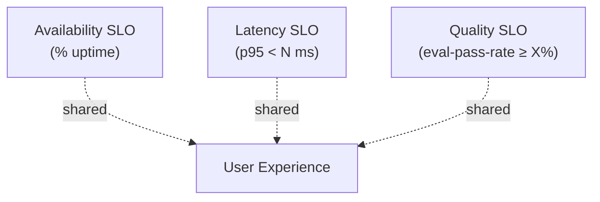
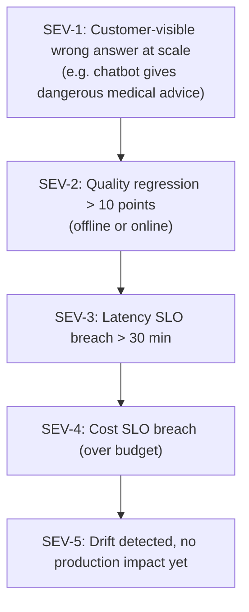

# AI Engineering Director Playbook
## Chapter 12

# Reliability, Observability, and Incident Response for AI

> *"AI features fail silently. The discipline is to make them fail loudly."*

---

## 1. Epigraph

AI features fail silently. The discipline is to make them fail loudly.

---

## 2. Problem

Your AI feature has been quietly regressing for 3 weeks. The eval-pass-rate has dropped from 92% to 78% but nobody noticed because nobody is looking at the dashboard. The customer support tickets started arriving 2 weeks ago but they're routed to "general feedback" because nobody put an alert on the eval-pass-rate metric. By the time the CEO sees the Twitter thread, you're in crisis mode.

This chapter is the operating manual for AI reliability and observability: the discipline of making AI failures visible, measurable, and recoverable. Traditional SRE practices (latency SLOs, error rates, dashboards) are necessary but not sufficient for AI. AI features have a third dimension — *quality* — that fails without raising a single traditional alert.

**Decision in one sentence:** Define a Quality SLO alongside the Latency SLO and Availability SLO; instrument every AI feature with the 7 standard metrics; run incident-response drills on quality failures as often as on availability failures.

---

## 3. Why AI Engineering Directors Fail Here

Five named failure modes of AI reliability at the Director level.

- **The Traditional-SLO-Only Trap.** The Director defines an availability SLO (99.9%) and a latency SLO (p95 < 2s) but no quality SLO. The feature is "up" and "fast" while quietly producing wrong answers.
- **The Silent-Regression Disaster.** The Director ships a model update with offline eval pass rate improving 5 points. Production traffic drift causes quality regression 8 points. Nobody notices for 3 weeks.
- **The Eval-Ownership Gap.** The Director names an ML engineer as the eval owner but doesn't give them on-call authority. Eval alerts fire into a Slack channel that nobody reads. Production drifts.
- **The Incident-Response-Theater.** The Director runs incident-response drills on availability outages (the easy case) but not on quality failures (the hard case). When a quality incident hits, the team has no playbook.
- **The Postmortem-Bias.** The Director treats AI incidents as engineering problems to be fixed, not as data problems to be analyzed. The team fixes the immediate bug but misses the systemic cause (eval-set gap, drift monitoring gap).

---

## 4. Mental Models

Four mental models that compress AI reliability into something you can defend.

**Mental model 1: The Three-SLO Trinity.** AI features need three SLOs, not two.



A team that only tracks Availability and Latency ships a "fast down" feature — up and responsive but wrong. The Quality SLO is what makes AI features *trustworthy*.

**Mental model 2: The 7 Standard Metrics.** Every AI feature should be instrumented with 7 metrics.

```
1. Availability (% uptime)
2. Latency (p50, p95, p99)
3. Quality (eval-pass-rate, sampled in production)
4. Cost per request
5. Token usage (input, output, total)
6. Drift score (distribution distance from baseline)
7. Error / refusal rate
```

Drift score is the leading indicator of quality failure. Token usage is the leading indicator of cost failure. Quality is the lagging indicator of both.

**Mental model 3: The Incident Severity Ladder.** AI incidents have 5 severity levels.



S5 is the early warning; S1 is the crisis. The discipline is to treat S5 as a real incident (with runbook + postmortem), not as noise.

**Mental model 4: The Postmortem Template.** AI postmortems have 4 sections that traditional postmortems miss.

```
1. What broke (traditional)
2. Why eval didn't catch it (NEW)
3. Why drift wasn't detected (NEW)
4. What eval example was added to prevent recurrence (NEW)
```

The eval-example addition is the close-the-loop action. Without it, the regression will recur.

---

## 5. Frameworks

Three frameworks for the conversations you will have.

### Framework 1: The AI Feature Reliability Checklist

For every AI feature, complete this checklist:

```
1. Three-SLO Trinity defined (Availability, Latency, Quality)?
2. 7 standard metrics instrumented and dashboarded?
3. Drift monitoring on (with alert threshold)?
4. Eval refresh cadence documented?
5. On-call runbook includes quality-incident playbook?
6. Postmortem template includes AI-specific sections?
7. SEV-1 through SEV-5 ladder documented?
8. Incident-response drill run quarterly on quality incident?
```

Score per feature: 8/8 = green; 6–7/8 = yellow; <6/8 = red.

### Framework 2: The Quality Incident Playbook

When a quality incident is declared (SEV-1 or SEV-2):

```
T+0:    IC (incident commander) assigned. Service degradation declared.
T+15m:  Initial assessment: scope (which users, which queries, how long).
T+30m:  Decision: rollback / disable / reduce-traffic / communicate.
T+2h:   Root cause hypothesis. Communicate to stakeholders.
T+24h:  Customer communication drafted (if user-facing).
T+72h:  Postmortem doc opened (Sections 1-4 of the AI template).
T+2w:   Postmortem complete. Eval example added. Runbook updated.
```

The T+30m decision is the hardest: rollback (data risk), disable (revenue risk), reduce-traffic (mitigation only). The IC needs Director authority to make this call.

### Framework 3: The Drift Alert Threshold

Drift alerts should fire at thresholds matched to the risk profile.

```
Low-risk feature (internal tool):
  - Alert at drift score > 0.15 (15% distribution shift)
  - Quality SLO: 85% pass rate
  - Eval refresh: quarterly

Medium-risk feature (customer-facing, no PII):
  - Alert at drift score > 0.10
  - Quality SLO: 90% pass rate
  - Eval refresh: monthly

High-risk feature (regulated, PII, financial):
  - Alert at drift score > 0.05
  - Quality SLO: 95% pass rate
  - Eval refresh: weekly
```

A one-size-fits-all drift threshold treats all features as equally risky. The threshold should match the blast radius.

---

## 6. Drill

You are the Director of AI at **acme-corp**. Your team has 9 AI features in production. Last quarter there were 4 SEV-2 incidents that took 6+ hours each to detect because nobody was watching the Quality SLO dashboard. Each incident cost the company between $50K and $200K in customer churn / refunds / engineering time.

You have **75 minutes**. Produce a **reliability upgrade plan** (`portfolio/chapter-12-reliability-plan.md`) using Framework 1 (Reliability Checklist) and Framework 2 (Quality Incident Playbook). Specify:

- The 4 features that need reliability upgrades most (justify).
- The dashboard + alerting stack you'd build (or buy).
- The on-call rotation you'd implement.
- The quarterly drill schedule.
- The 1 process change that would have caught the most recent SEV-2.

**Deliverable:** `portfolio/chapter-12-reliability-plan.md` — under 800 words.

---

## 7. Worked Example

**Current state (Reliability Checklist):**

```
Feature                | Score
-----------------------|--------
Support Assistant      | 5/8 (no drift monitoring, no drill)
Code Suggestion        | 4/8 (no Quality SLO, no postmortem template)
Email Draft            | 3/8 (no on-call runbook for quality)
Image Tagging          | 6/8 (close to green, just needs drill schedule)
Doc Summarizer         | 7/8 (green)
... (4 more)           | avg 4.4/8
```

Average: 4.4/8. Yellow. 2 features at 3/8 (red).

**This quarter: Reliability upgrades for top 4 features.**

**Dashboard + alerting stack:** Grafana + Prometheus (already deployed). Add:
- Eval-pass-rate panel (per feature)
- Drift-score panel (per feature)
- Token-usage panel (per feature, with budget alerts)
- Quality-incident playbook link (per dashboard)
- PagerDuty integration for Quality SLO breach (SEV-2+)

**On-call rotation:** Platform team owns the dashboards + alerting. Feature teams own the Quality SLO. Director is the IC for SEV-1; senior engineer for SEV-2.

**Quarterly drill schedule:**
- Q1: SEV-2 quality incident on Support Assistant.
- Q2: Drift detection drill on Code Suggestion (simulate drift via shadow traffic).
- Q3: Vendor-outage + quality degradation joint drill on Email Draft.
- Q4: Full SEV-1 simulation on Doc Summarizer (worst-case blast).

**The 1 process change:** Make Quality SLO a *Deploy gate*. A feature cannot ship without a Quality SLO + dashboard + alert. This would have prevented 3 of the 4 SEV-2 incidents (they shipped without monitoring).

**Cost:** ~$30K dashboard work + 0.5 FTE SRE for rotation + 4 hours/quarter drill time per team.

---

## 8. Failure Mode Postmortem

A Director of AI at a 1,400-person legal-tech company shipped an AI-powered contract-review tool to 800 paying customers. The feature had a 99.95% availability SLO and a p95 latency SLO of 1.5s — both met. There was no Quality SLO, no drift monitoring, no eval refresh cadence.

Three months post-launch, a model update shipped with a subtle regression on indemnification-clause detection. Production traffic gradually shifted toward non-standard indemnification clauses (a market trend the team didn't track). The feature's accuracy on this clause type dropped from 91% to 64% over 4 months. The Director didn't know. The team didn't know. The customers didn't know for another 2 months — until a Fortune 500 customer filed a complaint that triggered an internal investigation.

What they missed: every Framework 1 item. No Quality SLO. No drift monitoring. No eval refresh. No incident-response drill. The team's postmortem was traditional (engineering) but missed the eval-set gap and the drift-detection gap.

Total cost: $4.2M in customer refunds, churn, and a regulatory inquiry.

The lesson: AI features fail silently. The discipline is to make them fail loudly.

---

## 9. Self-Assessment Rubric

| # | Dimension | 1 (Novice) | 3 (Competent) | 5 (Expert) |
|---|---|---|---|---|
| 1 | Three-SLO Trinity (Availability + Latency + Quality) | Has 2 of 3 | Has 3 of 3 for top features | Has 3 of 3 enforced as Deploy gate for every feature |
| 2 | 7 standard metrics | Tracks 3-4 | Tracks all 7 | Tracks all 7 + automated drift detection |
| 3 | Quality incident playbook | No playbook | Has runbook | Has runbook + drills quarterly |
| 4 | Drift monitoring | None | Threshold per feature | Matched to risk profile + auto-refresh |
| 5 | Postmortem discipline | Engineering-only postmortems | AI template adopted | Eval example added + tracked in eval coverage dashboard |

**Disqualifier:** any 1 on dimension 1 or 5. Skipping Quality SLO or skipping AI-specific postmortems is the path to the Silent-Regression Disaster.

**Total:** ___ / 25. **Pass threshold:** 18/25, no dimension below 3.

---

## 10. Portfolio Artifact Note

Save your filled-in drill as `portfolio/chapter-12-reliability-plan.md` — interview evidence for "How do you detect and respond to AI quality regressions?" (see Portfolio Map in Chapter 27).

---

## 11. Interview Questions

1. **What's the difference between a traditional SLO and an AI SLO?**
2. **Your team's AI feature has been quietly regressing for 3 weeks. Walk me through your detection.**
3. **Walk me through how you'd run a SEV-2 quality incident.**
4. **Drift detection: what threshold, what cadence, what action?**
5. **Your team had a quality incident. Walk me through the postmortem.**