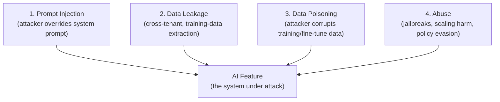
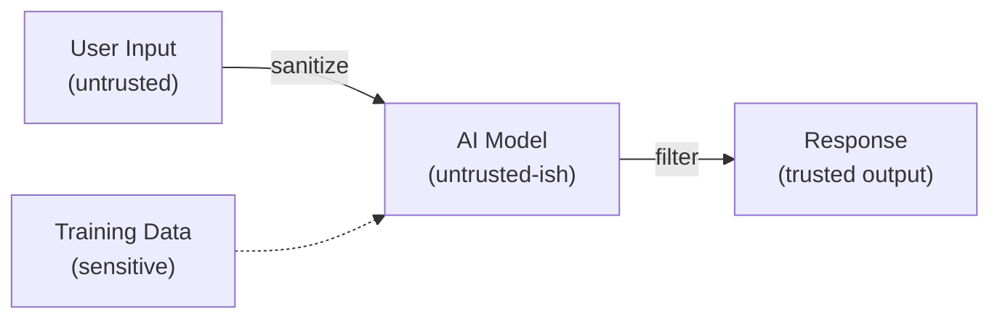
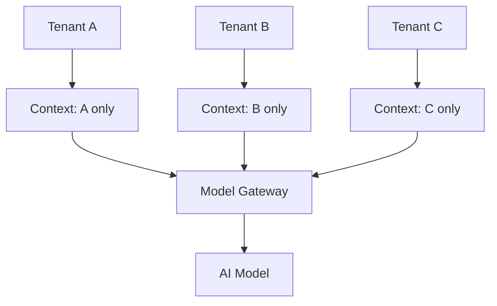

# AI Engineering Director Playbook
## Chapter 13

# Security, Privacy, and Abuse Vectors

> *"AI features are attack surfaces. Treat them like production databases — because they are."*

---

## 1. Epigraph

AI features are attack surfaces. Treat them like production databases — because they are.

---

## 2. Problem

Your AI customer-support assistant is leaking other customers' data in responses. Your prompt is loaded with PII from a prior conversation in the same context window. A user submits a prompt injection that gets your internal admin tool to email your customer list to themselves. The security team has just asked: "What's your threat model for the AI feature?" You have 30 seconds to answer.

This chapter is the operating manual for AI security: the discipline of treating AI features as production data systems with their own attack surface, their own privacy implications, and their own abuse vectors. A team that treats AI as "just an API call" misses the threat model entirely.

**Decision in one sentence:** Threat-model every AI feature with the 4-vector model (Prompt Injection, Data Leakage, Data Poisoning, Abuse); enforce the 5 controls (Input Sanitization, Output Filtering, Context Isolation, Audit Trail, Abuse Monitoring); make the privacy review a Deploy gate, not an afterthought.

---

## 3. Why AI Engineering Directors Fail Here

Five named failure modes of AI security at the Director level.

- **The "Just an API Call" Delusion.** The Director treats AI features as stateless API calls with no security surface. Misses prompt injection, context leakage, training-data extraction. Gets compromised.
- **The Cross-Tenant Data Leak.** The Director ships a multi-tenant AI feature with shared context windows or shared vector indexes. Customer A's data leaks into Customer B's responses. Catastrophic.
- **The Prompt-Injection Blindness.** The Director is unaware of prompt injection as a category. Users (or attackers) submit prompts that override system instructions, exfiltrate data, or trigger unauthorized actions.
- **The Training-Data Extraction.** The Director fine-tunes on customer data without proper isolation. An attacker crafts prompts that extract the training data verbatim. PII breach.
- **The Privacy-Review-Theater.** The Director treats the privacy review as a checkbox before launch. The review happens after the model is fine-tuned on customer data without consent. The "review" cannot fix a thing already done.

---

## 4. Mental Models

Four mental models that compress AI security into something you can defend.

**Mental model 1: The 4-Vector Threat Model.** AI features face 4 distinct threat vectors.



A team that threat-models only V1 (prompt injection) misses V2 (the most common and most catastrophic), V3 (relevant only if you fine-tune), and V4 (the cost of reputational damage).

**Mental model 2: The Trust Boundary.** The AI model is a trust boundary, like a database.



Inputs are untrusted. The model's outputs are *less* untrusted (because you've filtered them) but still not fully trusted. The training data is sensitive and must be controlled.

**Mental model 3: The Context Isolation Pattern.** Multi-tenant AI features must isolate context by tenant.



A shared vector index with no per-tenant access control is a data-leak waiting to happen. The discipline: per-tenant namespaces, per-tenant retrieval filters, per-tenant context windows.

**Mental model 4: The PII Tiers.** PII has 4 tiers of sensitivity, and each requires different handling.

```
Tier 1 (Public):     No protection needed.
Tier 2 (Internal):   Mask in logs, no model training.
Tier 3 (Sensitive):  Encrypted at rest, no model training without consent, no retention.
Tier 4 (Regulated):  Healthcare (PHI), financial (PCI), children's data (COPPA).
                     Most-restrictive: explicit consent, no training, audit trail.
```

A team that trains a model on Tier 4 data without Tier 4 controls is committing a regulatory violation. The privacy review must classify data per tier before training is approved.

---

## 5. Frameworks

Three frameworks for the conversations you will have.

### Framework 1: The AI Threat-Model Checklist

For every AI feature, complete this checklist before launch:

```
1. Has the 4-vector threat model been documented?
2. Input sanitization implemented (length cap, injection filter, jailbreak filter)?
3. Output filtering implemented (PII redaction, refusal-allowed topics)?
4. Context isolation implemented per tenant?
5. Training data classified per PII tier?
6. Audit trail captured (every prompt + response + user + timestamp)?
7. Abuse monitoring implemented (anomaly detection on prompt patterns)?
8. Privacy review signed off?
```

Score per feature: 8/8 = ship-ready; 6–7/8 = ship with Director-acknowledged gap; <6/8 = do not ship.

### Framework 2: The Prompt Injection Defense Stack

Defenses layered from cheap to expensive:

```
Layer 1 (free):      Length capping (e.g. < 4K tokens input)
Layer 2 (cheap):     Keyword-based jailbreak filter (e.g. "ignore previous instructions")
Layer 3 (moderate):  LLM-as-judge on suspicious inputs (with eval set)
Layer 4 (expensive): Structured-output enforcement (model returns JSON; UI ignores text)
Layer 5 (expensive): Human-in-the-loop for high-stakes actions (see Ch 8)
```

A feature with no defense layer is 1 prompt-injection away from compromise. A feature with Layers 1–3 is defended against 95% of attacks.

### Framework 3: The Privacy Review Gate

For every AI feature touching customer data, the privacy review must answer:

```
1. What data does this feature see? (Per PII tier.)
2. Is any of this data used for model training? If so, with consent?
3. What is the retention policy?
4. Can the customer request deletion? Within what SLA?
5. Is the data shared with any third party (e.g. model vendor)?
6. Is there an audit trail?
7. Does this feature trigger any regulatory requirement (GDPR, HIPAA, PCI)?
8. Has Legal reviewed and signed off?
```

A privacy review signed off after the model is trained is a review of damage, not a gate. The privacy review happens *before* data is committed to the training set.

---

## 6. Drill

You are the Director of AI at **acme-corp**. The security team has flagged 3 concerns about your AI features:

1. The Support Assistant sometimes includes PII from prior conversations in responses.
2. The Code Suggestion tool has no input sanitization (a malicious prompt could exfiltrate internal code).
3. The Email Draft tool was recently used to draft 47 phishing emails by an attacker who exploited prompt injection.

You have **90 minutes**. Produce a **security remediation plan** (`portfolio/chapter-13-security-plan.md`) using Framework 1 (Threat-Model Checklist) and Framework 2 (Prompt Injection Defense Stack). Specify:

- For each of the 3 features: current threat-model score, target score, timeline, and named owner.
- The 1 process change that would have prevented the phishing attack.
- The PII-tier classification for each feature's data.
- The 3rd-party vendor data-handling audit you'd run (OpenAI, Anthropic, etc).

**Deliverable:** `portfolio/chapter-13-security-plan.md` — under 900 words.

---

## 7. Worked Example

**Threat-Model Checklist (3 features):**

```
Feature              | Score | Gap
---------------------|-------|----
Support Assistant    | 5/8   | No output filtering; cross-tenant retrieval
Code Suggestion      | 3/8   | No input sanitization; no audit trail
Email Draft          | 2/8   | No abuse monitoring; no privacy review; cross-tenant context
```

All 3 are below the ship-ready threshold.

**Remediation plan:**

**Support Assistant** (target 8/8, 4 weeks):
- Week 1: Output filter for PII (regex + LLM-as-judge fallback).
- Week 2: Per-tenant vector namespace + retrieval filter.
- Week 3: Audit trail integrated.
- Week 4: Privacy review + Legal signoff.
- Owner: Senior ML engineer + Legal.

**Code Suggestion** (target 7/8, 2 weeks):
- Week 1: Input sanitization (length cap, jailbreak filter).
- Week 1: Audit trail integrated.
- Week 2: Privacy review + Legal signoff.
- Owner: Platform team.
- Trade-off accepted: No abuse monitoring (internal tool, lower risk).

**Email Draft** (target 8/8, 6 weeks):
- Week 1-2: Per-tenant context isolation.
- Week 2-3: Abuse monitoring (anomaly detection on draft patterns).
- Week 3-4: Output filter for harmful content categories.
- Week 4-5: Privacy review (PII tier 3 + 4 in some customer data).
- Week 5-6: Legal signoff + red-team exercise.
- Owner: Senior ML engineer + Security team.

**The 1 process change that would have prevented the phishing attack:** Make Threat-Model Checklist score ≥6/8 a Deploy gate. The Email Draft tool shipped at 2/8.

**PII tier classification:**
- Support Assistant: Tier 2 (Internal) + Tier 3 (Sensitive customer PII).
- Code Suggestion: Tier 1 (Public) + Tier 2 (Internal code).
- Email Draft: Tier 2 + Tier 3 (customer email content) + Tier 4 (some regulated industries).

**3rd-party vendor audit (OpenAI, Anthropic, Bedrock):**
- Confirm: zero-retention mode enabled.
- Confirm: customer data NOT used for training.
- Confirm: SOC 2 Type II report current.
- Confirm: data-residency option matches customer's regulatory requirement.

---

## 8. Failure Mode Postmortem

A Director of AI at a 2,200-person health-tech company shipped an AI symptom-checker to 4 million patients. The feature had no input sanitization and no output filtering. Six months post-launch, a security researcher demonstrated that the feature could be prompted to:

1. Extract other patients' recent symptom queries via prompt injection.
2. Provide diagnostic-style advice (medical-grade) despite the disclaimer, by overriding the safety system prompt.
3. Generate plausible-looking prescription instructions.

The Director learned about this via a New York Times article 8 weeks after the researcher disclosed it privately. The feature was shut down. A class-action lawsuit followed. The Director was asked to leave.

What they missed: every Framework 1 question. The threat model was "users are patients." The reality: users include attackers, security researchers, journalists, and hostile competitors. The PII tier was classified wrong — symptom data is PHI (Tier 4). The privacy review happened *after* launch. The output filter was a generic regex that didn't catch the attacks.

Total cost: $80M+ in settlement, regulatory fines, and customer churn.

The lesson: AI features are production data systems with their own attack surface. Threat-modeling is a Deploy gate, not an afterthought.

---

## 9. Self-Assessment Rubric

| # | Dimension | 1 (Novice) | 3 (Competent) | 5 (Expert) |
|---|---|---|---|---|
| 1 | Threat model coverage | 1 of 4 vectors | 3 of 4 vectors documented | All 4 vectors + per-feature risk-tier |
| 2 | Prompt injection defenses | None | Layers 1-2 (length + keyword) | Layers 1-4 + human-in-the-loop for high-stakes |
| 3 | Context isolation | Single shared context | Per-tenant vector namespace | Per-tenant context + retrieval filter + audit trail |
| 4 | PII classification | Unclassified | Tier 1-3 classified | All tiers classified + Tier 4 triggers regulatory gate |
| 5 | Privacy review as gate | After launch | Before training | Before training + before launch + annual audit |

**Disqualifier:** any 1 on dimension 1 or 5. Missing the threat model or treating privacy as afterthought is the path to catastrophic data breaches.

**Total:** ___ / 25. **Pass threshold:** 18/25, no dimension below 3.

---

## 10. Portfolio Artifact Note

Save your filled-in drill as `portfolio/chapter-13-security-plan.md` — interview evidence for "How do you threat-model an AI feature?" (see Portfolio Map in Chapter 27).

---

## 11. Interview Questions

1. **Walk me through the 4-vector AI threat model.**
2. **Your AI feature was used to draft phishing emails via prompt injection. What's your response?**
3. **How do you classify data for PII tier, and what changes at Tier 4?**
4. **Walk me through the prompt injection defense stack — which layers does your team use?**
5. **A regulator asks "show me your threat model for the AI feature." What do you show?**