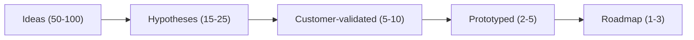
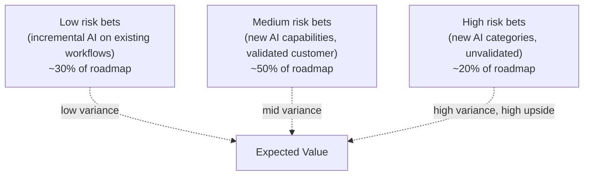

# AI Engineering Director Playbook
## Chapter 14

# AI Product Discovery and Roadmaps

> *"AI features are not products. AI features can become products, but only if you do the discovery."*

---

## 1. Epigraph

AI features are not products. AI features can become products, but only if you do the discovery.

---

## 2. Problem

Your team has shipped 9 AI features in 12 months. Each one was a request from a different exec ("can we have AI do X?"). The roadmap is a wishlist of 23 more AI features ranked by who shouted loudest. None of them has a clear product owner. None of them has a clear customer. None of them has a clear hypothesis. You're shipping features that nobody asked for, that nobody measured, and that nobody will be sad to see die.

This chapter is the operating manual for AI product discovery: the discipline of finding *which* AI features to build, *why* they'll work, and *how* you'll know if they did. The Director's job is not to ship AI features — it is to ship AI features that customers pay more for, churn less over, and tell their friends about. That requires discovery.

**Decision in one sentence:** Run every AI feature through a 5-stage discovery process (Hypothesis → Customer Interviews → Prototype → Validation → Roadmap Decision) before writing any code; the only artifact that survives the process is the validated customer pain, not the AI capability.

---

## 3. Why AI Engineering Directors Fail Here

Five named failure modes of AI product discovery at the Director level.

- **The Capability-Driven Roadmap.** The Director builds the roadmap around "what can we do?" rather than "what does the customer need?" GPT-4 can summarize, so they ship summarization. Nobody uses it. The capability was real; the customer was not.
- **The Executive-Shoutlist.** The Director accepts AI feature requests from executives without validating customer demand. The roadmap becomes a proxy for org politics, not customer value. Engineering is a tax on office politics.
- **The Prototype-Theater.** The Director funds 6 "AI prototypes" that demo well to the leadership team but ship to no customer. The prototypes have no validation criteria, no customer, no plan to ship. They are demos in a slide deck.
- **The Single-Customer Trap.** The Director builds an AI feature for one anchor customer who "really wants this." The feature ships. The anchor customer churns. The feature has no other customers. The Director has built a custom feature with platform-team effort.
- **The Discovery-Theory Trap.** The Director treats discovery as a separate phase from engineering. Discovery takes 6 months. By the time the Director has a validated hypothesis, the technology has moved 2 generations forward. The hypothesis is stale.

---

## 4. Mental Models

Four mental models that compress AI product discovery into something you can defend.

**Mental model 1: The Discovery Funnel.** AI feature ideas pass through 5 stages; only a fraction survive each stage.



The funnel is the discipline. The Director who skips the funnel — who takes 50 ideas straight to a roadmap of 23 — has not done discovery. The Director who ships the funnel as a process has built the *capability* to keep shipping relevant AI features for years.

**Mental model 2: The Customer Pain Test.** Every AI feature starts with a validated customer pain.

```
Three questions to validate the pain:

1. Is the customer actively trying to solve this today?
   (workarounds, hacks, manual processes, spreadsheets)

2. If we built the AI feature tomorrow, would the customer
   change their behavior to use it?
   (not "would they consider it" — would they actually use it)

3. Can the customer describe the pain in their own words
   without us prompting them?
```

If the answer to any question is "no," the pain is not validated. The Director's job is to kill the feature before code is written.

**Mental model 3: The Hypothesis Card.** Every AI feature has a 1-page hypothesis card before any code is written.

```
# AI Feature Hypothesis — [Name]

## Customer
- Persona: ___
- Job to be done: ___
- Trigger (when this becomes a problem): ___

## Pain
- Today's workaround: ___
- Cost of the workaround (time, money, error rate): ___

## Solution (the AI feature)
- What it does: ___
- Why AI (vs. rules, vs. simpler ML): ___

## Success Metric
- Leading: ___
- Lagging: ___

## Validation Plan
- How we'll know in 4 weeks if it's worth building: ___

## Kill Criteria
- What result in the validation phase would make us stop: ___
```

A feature without a hypothesis card is a feature without a discovery process.

**Mental model 4: The Roadmap as a Bet Portfolio.** A roadmap is not a list; it's a portfolio of bets with different risk profiles.



A roadmap that's 80% low-risk is a roadmap of incremental optimizations with no learning. A roadmap that's 80% high-risk is a roadmap of demos. The right mix is roughly 30/50/20 — enough incremental value to ship revenue, enough medium-risk to learn, enough high-risk to find the next platform.

---

## 5. Frameworks

Three frameworks for the conversations you will have.

### Framework 1: The Discovery Stage Gate

Every AI feature passes through 5 gates before shipping.

```
Gate 1 (Hypothesis):     1-page hypothesis card signed by PM + Director
Gate 2 (Customer):       5-10 customer interviews validating the pain
Gate 3 (Prototype):      Demo prototype + 5-10 customer reactions
Gate 4 (Validation):     Quantitative validation (≥X% conversion in pilot)
Gate 5 (Roadmap):        Resource allocation + kill criteria + ship date
```

A feature that skips a gate is a feature that bypasses the discipline. The Director's job: enforce the gates without exception.

### Framework 2: The Hypothesis Card Workshop

A 90-minute workshop produces a hypothesis card for any AI feature idea.

```
Participants: PM + Director + 1 ML engineer + 1 designer
Agenda:
  - 0-15m: Frame the problem (PM)
  - 15-35m: Customer pain brainstorm (all)
  - 35-55m: Solution sketch (ML engineer)
  - 55-75m: Success metrics (PM)
  - 75-90m: Kill criteria + sign-off (Director)
Output: 1-page hypothesis card (template in _shared/templates/)
```

A workshop that produces a card with no kill criteria is a workshop that didn't do discovery.

### Framework 3: The Roadmap Quarterly Review

Quarterly roadmap reviews answer 3 questions:

```
1. Of the bets in flight, which are tracking to plan? Which are not?
2. Of the bets not tracking, which should we re-scope vs. kill?
3. Of the bets killed, what did we learn that should change our discovery process?
```

A roadmap with no killed bets is a roadmap with no learning. The Director's metric: ratio of bets killed to bets shipped (target: 2-3x; healthy discovery kills many ideas before any ship).

---

## 6. Drill

You are the Director of AI at **acme-corp**. The executive team has just sent you a list of 23 AI feature requests for the next 12 months. Your current team can ship 4-6 features in that window. You have **90 minutes**.

Produce a **roadmap prioritization memo** (`portfolio/chapter-14-roadmap-memo.md`) using Framework 1 (Discovery Stage Gate) and the Roadmap Bet Portfolio mental model. Specify:

- The funnel: from 23 ideas to your final 5-bet roadmap.
- The 3 bets you kill and why (using the Customer Pain Test).
- The 5-bet roadmap with risk-tier (Low / Medium / High) per bet.
- The kill criteria for each of the 5 bets.
- The discovery work you'd commission in parallel (not engineering).

**Deliverable:** `portfolio/chapter-14-roadmap-memo.md` — under 900 words.

---

## 7. Worked Example

**23 ideas (sample):**

```
Customer Service: AI chatbot, sentiment analysis, auto-summarization,
  agent coaching, ticket routing
Sales: Lead scoring, email drafting, call summarization, deal risk
  scoring, proposal generation
Engineering: Code suggestion, code review, PR description drafting,
  test generation
Marketing: Content generation, SEO optimization, ad copy, persona
  building
Internal: Meeting summarization, status report drafting, expense
  categorization, vendor contract analysis
```

**The funnel:**

```
Stage 1 — Hypothesis Card (filter 23 → 8):
  - For each of the 23 ideas, run a 30-min workshop.
  - Output: 1-page card with Customer / Pain / Solution / Metric / Kill.
  - Filter: 8 cards survive (others have unvalidated pain or no metric).

Stage 2 — Customer Interviews (filter 8 → 5):
  - 3-5 customer interviews per surviving card.
  - Filter using Customer Pain Test: kill if any of the 3 questions fails.

Stage 3 — Prototype (filter 5 → 3):
  - Demo prototype for top 5.
  - Get 3-5 customer reactions.
  - Kill if no customer would change behavior to use it.

Stage 4 — Validation (filter 3 → 3, prioritized):
  - Pilot top 3 for 8 weeks.
  - Measure conversion + retention + qualitative feedback.

Stage 5 — Roadmap (final 5-bet portfolio):
  - 2 confirmed (low-risk incremental on validated workflows)
  - 2 medium-risk (validated hypothesis, new capability)
  - 1 high-risk (new AI category, unvalidated)
```

**3 bets killed + why:**

- **"AI vendor contract analysis"** — Customer Pain Test Q1 fails: customers are not actively trying to solve this today (legal team handles it manually and is fine). **Killed.**
- **"AI persona building"** — Customer Pain Test Q2 fails: customers "would consider" using it but wouldn't change their behavior. **Killed.**
- **"AI test generation"** — Customer Pain Test Q3 fails: customers can't describe the pain in their own words; it's a "nice-to-have" not a "must-have." **Killed.**

**5-bet roadmap:**

| Bet | Risk | Hypothesis summary | Kill criteria |
|---|---|---|---|
| AI chatbot | Low | Reduce support cost by 25% | <10% deflection after 90 days |
| Email drafting | Low | Reduce sales cycle by 2 days | <5% reply rate lift after 90 days |
| Code suggestion | Medium | Engineering velocity +15% | <5% adoption after 90 days |
| Lead scoring | Medium | Win rate +5 points | <3-point lift after 90 days |
| Auto-summarization (calls) | High | New product category | <100 paying customers after 6 months |

**Discovery work in parallel (not engineering):**

- 12 customer interviews per month (PM-led).
- Quarterly Hypothesis Card workshops (every 6 weeks, 5 cards each).
- Annual roadmap bet-portfolio review (presented to exec team).
- Quarterly "what we killed and why" post (org-wide learning).

---

## 8. Failure Mode Postmortem

A Director of AI at a 3,000-person fintech inherited a roadmap of 23 AI features ranked by executive request order. The team shipped 6 features in 18 months. Each took 3 months. Each was a different category (chat, summarization, scoring, generation, etc.). None had a clear customer. None had a success metric. None had kill criteria.

When the CFO asked "what's the ROI on our AI investment?", the Director had no answer. 3 of the 6 features had <5% adoption. 2 had been quietly deprecated. 1 was generating ~$80K/year in cost savings — which the Director could not prove was net of the engineering cost.

The Director was asked to put together a new roadmap. The Director started from scratch. The team had spent 18 months shipping 6 features, only 1 of which was clearly net-positive. The Director learned the lesson: discovery is cheaper than engineering.

What they missed: every Framework 1 question. The features had no hypothesis cards, no customer interviews, no prototype validation. The roadmap was an executive wishlist.

The lesson: AI features that nobody asks for are features nobody uses.

---

## 9. Self-Assessment Rubric

| # | Dimension | 1 (Novice) | 3 (Competent) | 5 (Expert) |
|---|---|---|---|---|
| 1 | Discovery funnel discipline | Skips stages | Runs 3 of 5 gates | All 5 gates enforced, kills tracked |
| 2 | Customer Pain Test application | Trusts exec requests | Runs 3-question test on every feature | Kills ideas that fail the test (2-3x kill ratio) |
| 3 | Hypothesis Card rigor | No card | Card exists, no kill criteria | Card has kill criteria + 4-week validation plan |
| 4 | Roadmap as bet portfolio | "List of features" | Tags risk tier | 30/50/20 mix maintained, rebalanced quarterly |
| 5 | Discovery-vs-engineering cadence | Discovery blocks engineering | Sequential phases | Continuous discovery in parallel with engineering |

**Disqualifier:** any 1 on dimension 1 or 2. Skipping the funnel or accepting exec requests unvalidated is the path to the Capability-Driven Roadmap.

**Total:** ___ / 25. **Pass threshold:** 18/25, no dimension below 3.

---

## 10. Portfolio Artifact Note

Save your filled-in drill as `portfolio/chapter-14-roadmap-memo.md` — interview evidence for "How do you prioritize which AI features to build?" (see Portfolio Map in Chapter 27).

---

## 11. Interview Questions

1. **Your CEO sends you 20 AI feature requests. How do you triage?**
2. **Walk me through a hypothesis card for an AI feature you've shipped.**
3. **A feature is tracking below plan after 90 days. What do you do?**
4. **Your roadmap has no killed bets. What does that tell you?**
5. **Walk me through a customer interview for an AI feature.**