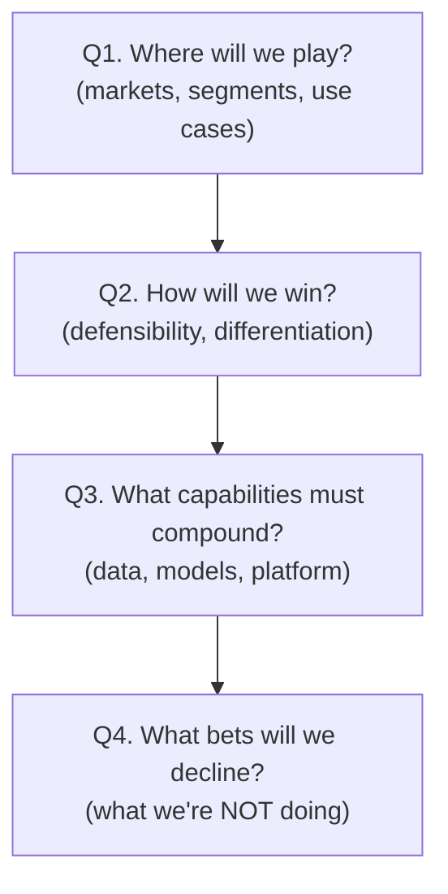
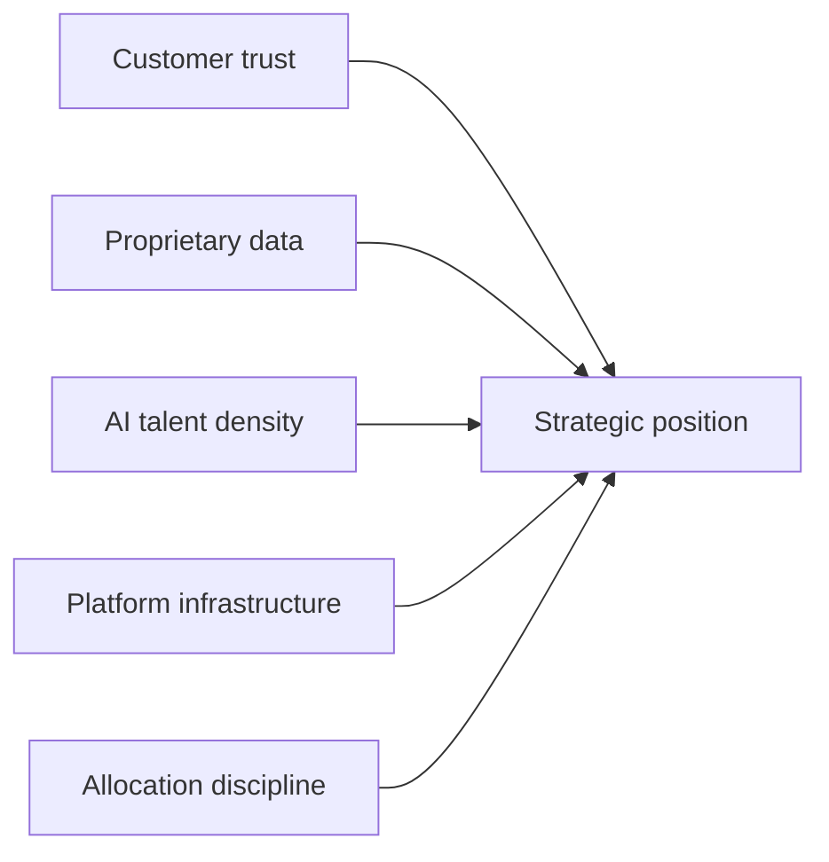

# AI Engineering Director Playbook
## Chapter 15

# AI Strategy and Roadmapping at Company Scale

> *"AI strategy is not 'use AI everywhere.' AI strategy is the choices that compound over 3 years."*

---

## 1. Epigraph

AI strategy is not "use AI everywhere." AI strategy is the choices that compound over 3 years.

---

## 2. Problem

Your CEO has asked: "What's our AI strategy?" You have 5 minutes to answer. The board wants a 1-page memo. The exec team wants a 12-month roadmap. Your engineering team wants clarity on which bets to make. Your customers want to know if you're going to lead or follow. Your competitors want to know what you're building. All of these want the same thing: a *strategy* — the small number of choices that compound into competitive advantage over 3 years.

This chapter is the operating manual for AI strategy at company scale. AI strategy is not a roadmap (Chapter 14 covers that). It is the *positioning* and *bets* that the roadmap serves. A Director who confuses strategy with roadmap has built a list; a Director who distinguishes them has built a *position*.

**Decision in one sentence:** AI strategy is the answer to 4 questions (Where will we play? How will we win? What capabilities must compound? What bets will we decline?) — and a Director who has not answered all 4 has not done strategy.

---

## 3. Why AI Engineering Directors Fail Here

Five named failure modes of AI strategy at the Director level.

- **The Strategy-as-Roadmap Confusion.** The Director produces a roadmap of AI features and calls it "strategy." It's not. A roadmap is a list; strategy is the *choices* the list serves. A roadmap without strategy is a wishlist.
- **The "AI Everywhere" Non-Strategy.** The Director responds to "what's our AI strategy?" with "we use AI everywhere." This is not a strategy; it is an admission that there is no strategy. "Use AI everywhere" produces 9 mediocre AI features and 0 competitive advantage.
- **The Vendor-Mirror Trap.** The Director builds the AI strategy by copying what OpenAI / Anthropic / Google publishes. "We're going to build agentic workflows" sounds like strategy; it's a vendor's marketing message. A strategy is unique to your company.
- **The Year-Long Strategy Doc.** The Director commissions a 50-page strategy document. Nobody reads it. It goes stale within 6 months. The Director has built a deliverable, not a strategy.
- **The Strategy-Theater.** The Director produces a strategy memo for the board. The team never uses it. The strategy is decoration. Real strategy is the *choices the team makes under pressure* — and a strategy memo that doesn't change the team's choices is theater.

---

## 4. Mental Models

Four mental models that compress AI strategy into something you can defend.

**Mental model 1: The 4-Question Strategy Frame.** AI strategy answers 4 questions.



A Director who has answered Q1+Q2 but not Q4 has built a wishlist, not a strategy. Q4 is the discipline.

**Mental model 2: The Compound-Capability Curve.** Some AI capabilities compound; others don't.

```
Compound:
  - Proprietary data flywheel (Ch 7 references this)
  - Eval harness + drift detection (Ch 9, Ch 12)
  - Domain-specific fine-tunes (Ch 6)
  - Production telemetry → RAG corpus (Ch 8)

Don't compound:
  - Generic chat features (any vendor can ship)
  - One-off prompt hacks (don't generalize)
  - Vendor-locked workflows (Ch 4 — switching cost is anti-compound)
```

A strategy that invests 80% in non-compound capabilities produces a roadmap that resets every 12 months. A strategy that invests 80% in compound capabilities produces a roadmap that gets *easier* every 12 months.

**Mental model 3: The Strategic Position.** Strategy is not what you do; it's what you're *positioned to do*.



The 5 inputs to strategic position: customer trust (you have it or you don't), proprietary data (you collect it or you don't), AI talent density (you hire/retain or you don't), platform infrastructure (you build or you don't), and allocation discipline (you decline bets or you don't).

**Mental model 4: The Decline List.** Strategy is what you say no to.

```
A great strategy has 3 things you're NOT doing, named explicitly:
  - We're not building a foundation model (compete with OpenAI = losing strategy)
  - We're not building consumer AI (B2B focus, focus matters)
  - We're not chasing the latest research paper (product maturity > frontier)
```

A strategy without a decline list is a wishlist with no discipline.

---

## 5. Frameworks

Three frameworks for the conversations you will have.

### Framework 1: The 1-Page Strategy Memo

A strategy memo fits on 1 page. It has 5 sections:

```
1. Where we play (2-3 sentences)
2. How we win (2-3 sentences)
3. Compound capabilities (3-5 bullets)
4. Decline list (3-5 bullets)
5. 3-year outcome (1 sentence)
```

A memo that doesn't fit on 1 page is not a strategy memo; it's a strategy report.

### Framework 2: The Strategy Review Cadence

Strategy is reviewed on 2 cadences:

```
Annual (board + exec team):
  - 1-page strategy memo refresh
  - 3-year outcome review: are we tracking?
  - Decline list review: any bets we should add or remove?

Quarterly (engineering + product):
  - Roadmap alignment check: is the roadmap serving strategy?
  - Compound-capability scorecard: are compound capabilities growing?
  - 1 strategic question to address
```

A strategy reviewed only annually goes stale. A strategy reviewed monthly wastes leadership time. Quarterly is the right cadence for engineering/product; annual is the right cadence for the board.

### Framework 3: The Strategy Under Pressure Test

The real test of a strategy: does it survive pressure?

```
Pressure scenarios:
  - A competitor announces a flagship AI feature. Our team wants to copy.
    Strategy says: aligned with "where we play"? Yes → build it.
                                     No → decline.
  - An exec asks for a flashy demo for the board meeting.
    Strategy says: aligned with "compound capabilities"? Yes → build it.
                                              No → find a demo that doesn't dilute the roadmap.
  - A customer requests a custom AI feature.
    Strategy says: aligned with "how we win"? Yes → productize.
                                              No → custom engagement, not platform.
```

A strategy that gets rewritten under pressure is not a strategy; it's a list of preferences.

---

## 6. Drill

You are the Director of AI at **acme-corp**, a 1,200-person B2B SaaS company. The CEO has just asked: "Walk me through our AI strategy in 5 minutes. The board wants a memo."

You have **90 minutes**. Produce a **1-page AI strategy memo** (`portfolio/chapter-15-strategy-memo.md`) using Framework 1 (1-Page Strategy Memo) + the 4-Question Strategy Frame + the Decline List mental model. Specify:

- Where acme-corp plays (segments + use cases).
- How acme-corp wins (defensibility).
- The 3-5 compound capabilities you'll invest in over 3 years.
- The 3-5 declines (what you're NOT doing).
- The 3-year outcome (1 sentence).
- The 1 strategy-under-pressure test you'd run this quarter.

**Deliverable:** `portfolio/chapter-15-strategy-memo.md` — under 800 words.

---

## 7. Worked Example

**Where we play:**
B2B SaaS for mid-market customer-support teams (50-500 seats). We play in the workflow automation + AI-assisted agent tier. We do NOT play in enterprise (500+ seats) or consumer.

**How we win:**
- Proprietary corpus of customer-support conversations (3 years, 8M tickets, consent-cleaned).
- Eval harness tuned to the customer's domain (not generic benchmarks).
- Tight integration with the customer's existing support tooling (Zendesk, Salesforce).

**Compound capabilities (5):**
1. Customer-specific eval harness + drift detection.
2. Proprietary support-conversation data flywheel (consent-based, federated where needed).
3. Multi-tenant RAG with per-customer retrieval namespaces (security + quality).
4. Domain-specific fine-tunes for top 3 use cases (ticket routing, response drafting, intent detection).
5. AI observability platform (Ch 12) that customers trust enough to deploy our AI in regulated environments.

**Decline list (5):**
1. No foundation model. We use OpenAI/Anthropic/Bedrock. Building our own = losing strategy.
2. No consumer AI features. We're B2B. Consumer = distraction.
3. No chasing every new research paper. We ship product at 80% of frontier; not frontier.
4. No "AI for X" generic features (e.g., generic chatbot for any industry). Specificity = moat.
5. No custom AI engagements. We productize or we decline. Custom = platform-team tax.

**3-year outcome:**
By 2029, acme-corp is the default AI layer for mid-market customer-support teams — measured by "if you use any of {Salesforce, Zendesk, HubSpot}, you also use acme-corp for AI." (Target: 30% attach rate.)

**Strategy under pressure test this quarter:**
A competitor announces an AI agent that autonomously resolves tickets without a human in the loop. Our PM wants to copy.

Test:
- "Where we play"? Mostly aligned, but mid-market customers want human-in-the-loop (per our interviews).
- "Compound capabilities"? Adds 1 new requirement (agent safety, Ch 8).
- Decision: Build a *limited-scope* agent (Tier-1 ticket routing + RAG-augmented drafting) WITH human-in-the-loop for any hard-write. Don't ship autonomous agent. Document the decline.

---

## 8. Failure Mode Postmortem

A Director of AI at a 1,800-person B2B SaaS company produced a 47-page "AI Strategy" document for the board. The document had 12 sections, 3 appendices, and a 5-year outlook. The board read the executive summary, approved the strategy, and forgot about it.

The team never used the strategy. Roadmaps were built by executive request, not by the strategy's "where we play" / "how we win" framing. The strategy was decoration.

When the CEO asked 18 months later "what's our AI strategy?", the Director pulled up the same document, said "this is it," and the CEO said "but we don't do any of this." The Director had built a deliverable, not a strategy. The team had made 30+ AI feature decisions in the intervening 18 months, none of which were guided by the strategy memo.

What they missed: the 1-page discipline. A strategy memo that doesn't fit on 1 page cannot survive pressure. A 47-page document is a report. The team needed 5 bullets they could recite from memory.

The lesson: a strategy is the choices the team makes under pressure, not the document the board approves.

---

## 9. Self-Assessment Rubric

| # | Dimension | 1 (Novice) | 3 (Competent) | 5 (Expert) |
|---|---|---|---|---|
| 1 | 4-Question Strategy Frame | Has roadmap only | Names all 4 questions | Names all 4 + decline list is explicit |
| 2 | Compound vs non-compound capabilities | Optimizes for revenue | Names 2-3 compound capabilities | Invests 80%+ in compound capabilities |
| 3 | 1-page strategy discipline | Writes 30+ page docs | Forces 1-page draft | Updates quarterly + cites from memory |
| 4 | Decline list | Never declines | Has implicit decline list | Explicit, named, cited under pressure |
| 5 | Strategy under pressure | Rewrites strategy quarterly | Tests against scenarios | Strategy survives unchanged under pressure |

**Disqualifier:** any 1 on dimension 3 or 4. A strategy memo that doesn't fit on 1 page or has no decline list is the path to the Strategy-Theater.

**Total:** ___ / 25. **Pass threshold:** 18/25, no dimension below 3.

---

## 10. Portfolio Artifact Note

Save your filled-in drill as `portfolio/chapter-15-strategy-memo.md` — interview evidence for "Walk me through your AI strategy in 5 minutes." (see Portfolio Map in Chapter 27).

---

## 11. Interview Questions

1. **Walk me through your AI strategy in 5 minutes.**
2. **Your strategy and your roadmap — how are they different?**
3. **A competitor announces something amazing. Does your strategy change?**
4. **What are you NOT doing in AI, and why?**
5. **Walk me through a strategic decision you made under pressure.**