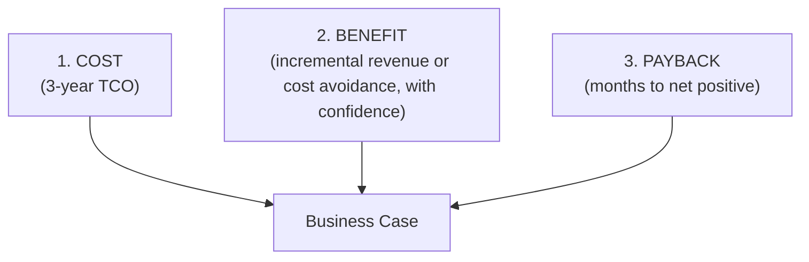

# AI Engineering Director Playbook
## Chapter 16

# Build a Compelling AI Business Case

> *"The CFO does not care about your model. The CFO cares about payback."*

---

## 1. Epigraph

The CFO does not care about your model. The CFO cares about payback.

---

## 2. Problem

Your staff engineer has built a $400K business case for an AI fine-tuning project. The case has 12 pages of model architecture, 5 pages of vendor comparisons, and 1 page on financial impact. The CFO reads the financial impact page, asks 3 questions the case can't answer, and declines the funding.

The Director's job is to *build the business case the CFO can sign*. That means: the financial page is not an appendix; it is the whole document. The technical depth is a footnote. The case must answer the CFO's 3 questions in 30 seconds, not in 30 minutes.

This chapter is the operating manual for the AI business case: the discipline of building a 1-page financial case that survives a CFO / board scrutiny, plus the appendix of supporting detail that makes the case defensible.

**Decision in one sentence:** A business case is built around 3 numbers — cost (total 3-year), benefit (incremental revenue or cost-avoidance with confidence), and payback (months to net positive); if you cannot defend each of these 3 numbers in 30 seconds, the case is not ready.

---

## 3. Why AI Engineering Directors Fail Here

Five named failure modes of AI business cases at the Director level.

- **The Architecture-as-Business-Case Fallacy.** The Director produces a 20-page document explaining the AI architecture and calls it a business case. The CFO doesn't care about architecture; the CFO cares about payback. The case is not what the decision-maker needs.
- **The Hand-Waved Revenue Forecast.** The Director projects "$5M in incremental revenue from AI features" with no supporting analysis. The CFO asks: "where does that number come from?" The Director says: "industry benchmarks." The case dies.
- **The Cost-Theater.** The Director quotes "$2.50 per 1M input tokens" and "30K requests per day" and "model X vs model Y." The CFO doesn't do unit economics. The CFO wants a 3-year TCO and a payback period.
- **The One-Time-Savings Mistake.** The Director quotes savings as one-time. "We save $500K by automating customer-support triage." But the savings require ongoing engineering, monitoring, and improvement. The ongoing cost isn't counted. The CFO catches it.
- **The Case-Theory-Engineering Gap.** The Director writes a business case in isolation. The engineering team has not validated the assumptions. The case ships; the engineering team finds the assumptions were wrong; the project misses the budget by 2x. The Director is asked why.

---

## 4. Mental Models

Four mental models that compress business-case construction into something you can defend.

**Mental model 1: The 3-Number Business Case.** Every AI business case has 3 numbers that must survive scrutiny.



If you cannot defend any of these 3 numbers in 30 seconds, the case is not ready.

**Mental model 2: The Cost Stack.** Cost has 5 layers; the case must cover all 5.

```
1. Build cost (engineering time + tools)
2. Run cost (vendor tokens + infra + serving)
3. Operate cost (monitoring + on-call + eval refresh)
4. Switching cost (cost to leave the vendor if needed)
5. Opportunity cost (what you could build with the same time)
```

Most cases cover layers 1–2. The CFO asks about layers 3–5. The case must answer.

**Mental model 3: The Benefit Confidence Triad.** Benefits have 3 confidence levels.

```
HIGH confidence:
  - Cost avoidance (we know we're spending $X; AI replaces it)
  - Productivity gain (we have time-tracking data showing the workload)

MEDIUM confidence:
  - Revenue lift (we have comparable-product data)
  - Conversion lift (we have A/B test data from prior feature)

LOW confidence:
  - "Industry reports say..." (no internal data)
  - "Customers tell us they want this" (no commitment)
```

A case with only LOW-confidence benefits dies. The Director's job: reframe benefits as HIGH-confidence by anchoring to internal data.

**Mental model 4: The Payback Ladder.** Payback periods drive approval.

```
< 6 months:   STRONG APPROVE — even with mediocre confidence, short payback covers risk
6-12 months:  APPROVE — if HIGH or MEDIUM confidence
12-24 months: APPROVE WITH CONDITIONS — milestone-based funding, kill criteria
> 24 months:  DECLINE — long payback = high risk, unless this is a moat investment
```

A case with >24-month payback requires special framing (moat investment, defensibility argument from Ch 4).

---

## 5. Frameworks

Three frameworks for the conversations you will have.

### Framework 1: The 1-Page Business Case

A business case fits on 1 page. 6 sections:

```
1. THE ASK
   $ ___ for ___ months to build ___

2. THE COST (3-year TCO)
   - Build:     $___
   - Run:       $___
   - Operate:   $___
   - Switching: $___
   - TOTAL:     $___

3. THE BENEFIT (3-year)
   - Revenue lift:           $___ (HIGH confidence)
   - Cost avoidance:         $___ (HIGH confidence)
   - Productivity gain:      $___ (MEDIUM confidence)
   - TOTAL ANNUAL:           $___

4. THE PAYBACK
   ___ months to net positive

5. THE RISKS (top 3)
   - ___ risk, mitigation: ___
   - ___ risk, mitigation: ___
   - ___ risk, mitigation: ___

6. THE KILL CRITERIA
   At ___ months, if ___ metric is below ___, we kill and recover $___.
```

A case that doesn't fit on 1 page is a case the CFO will not read.

### Framework 2: The Cost Layer Audit

For every business case, validate all 5 cost layers:

```
1. Build cost:     engineering FTE × months × loaded cost
2. Run cost:        vendor tokens + infra + serving (use cost_estimator.py)
3. Operate cost:    0.2-0.5 FTE × 3 years (monitoring + on-call + eval refresh)
4. Switching cost:  estimated if we need to leave vendor in 12 months
5. Opportunity cost: what 2-3 FTE for 6 months would build instead
```

A case missing layer 5 is a case that doesn't account for the alternative.

### Framework 3: The Benefit Confidence Score

For each benefit claim, assign a confidence score:

```
HIGH    (×1.0): internal data supports
MEDIUM  (×0.6): comparable-product data or strong qualitative
LOW     (×0.3): industry reports only
DISCARD (×0.0): no supporting data

Benefit (discounted) = Benefit (gross) × Confidence score
```

A case with HIGH-confidence benefits totaling $500K is more defensible than one with LOW-confidence benefits totaling $5M.

---

## 6. Drill

You are the Director of AI at **acme-corp**. You have 3 AI projects competing for $800K of budget in the next quarter:

1. **Customer Support AI Assistant** — internal tool, automates triage.
2. **Sales Email Drafting AI** — customer-facing, drafts personalized emails.
3. **Code Suggestion Tool** — internal tool, suggests code completions.

The CFO has $800K to allocate. You cannot fund all three.

You have **90 minutes**. Produce a **1-page business case comparison** (`portfolio/chapter-16-business-case-comparison.md`) using Framework 1 (1-Page Business Case) applied to all 3 projects. Use `_shared/tools/cost_estimator.py` for run-cost projections. Specify:

- The 3-year TCO per project.
- The benefit (HIGH/MEDIUM/LOW confidence) per project.
- The payback period per project.
- The 1 project you fund, the 1 you defer, and the 1 you decline.
- The kill criteria for the funded project.

**Deliverable:** `portfolio/chapter-16-business-case-comparison.md` — under 900 words.

---

## 7. Worked Example

**Project 1: Customer Support AI Assistant**

```
COST (3-year):
  - Build: 2 FTE × 6 months × $200K loaded = $200K
  - Run:   cost_estimator.py:
           $ python3 _shared/tools/cost_estimator.py \
             --input 1200 --output 350 --model gpt-4o \
             --rpd 28000 --growth 0.20
           Per year (flat):   $66,430
           Per year (growth): $79,716 (year 1), $95,659 (year 2), $114,791 (year 3)
           3-year run:        $66,430 + $79,716 + $95,659 = $241,805
  - Operate: 0.5 FTE × 3 years × $200K = $300K
  - Switching: ~$50K (mid-tier, switchable)
  - TOTAL:   $200K + $242K + $300K + $50K = ~$792K

BENEFIT (3-year, HIGH confidence):
  - Cost avoidance: 4 customer-support reps × $80K × 3 years = $960K
                   (AI deflects 25% of tickets → 1 rep reallocated, 3 reduced)
  - Productivity gain: existing reps handle 30% more tickets → $240K
  - TOTAL: $1,200K

PAYBACK: ~8 months

KILL CRITERIA: At 6 months, if ticket deflection < 15%, kill. Recover $400K.
```

**Project 2: Sales Email Drafting AI**

```
COST (3-year):
  - Build: 1 FTE × 4 months × $200K = $67K
  - Run:   $40K/year (volume is low: 5K drafts/day, simple prompts)
  - Operate: 0.3 FTE × 3 years = $180K
  - Switching: ~$10K
  - TOTAL:   ~$377K

BENEFIT (3-year, MEDIUM confidence):
  - Sales productivity: 5% lift × 50 sales reps × $200K OTE × 3 years = $1,500K gross
                       discounted 0.6 = $900K
  - TOTAL: $900K

PAYBACK: ~5 months

KILL CRITERIA: At 90 days, if reply rate lift < 2%, kill.
```

**Project 3: Code Suggestion Tool**

```
COST (3-year):
  - Build: 3 FTE × 9 months × $200K = $450K (this is a multi-team coordination)
  - Run:   $150K/year (high volume)
  - Operate: 0.5 FTE × 3 years = $300K
  - Switching: ~$100K (Copilot-style lock-in)
  - TOTAL:   ~$1,200K (over budget by itself)

BENEFIT (3-year, LOW confidence):
  - Engineering velocity: "15% productivity lift" × 200 engineers × $200K × 3 = $18M
                         (industry report; we have no internal data)
                         discounted 0.3 = $5.4M
  - Confidence is LOW because no internal benchmark.

PAYBACK: ~10 months on paper; high risk.

KILL CRITERIA: At 6 months, if adoption < 30%, kill.
```

**Decision:**

```
Fund:       Project 1 (Customer Support AI) — HIGH confidence, 8-month payback
Defer:      Project 2 (Sales Email) — MEDIUM confidence, 5-month payback but smaller scale
Decline:    Project 3 (Code Suggestion) — LOW confidence + over budget
```

**Reallocation of declined budget:** Combine Project 1 + Project 2 budget ($1.17M, available $800K) — fund Project 1 fully ($792K) + small Pilot for Project 2 ($8K, validate productivity claim in pilot before committing).

---

## 8. Failure Mode Postmortem

A Director of AI at a 1,400-person legal-tech company produced a 22-page business case for an AI contract-review tool. The case projected $8M in annual savings from "faster contract review by associates." The CFO approved $1.5M to build.

The project shipped 14 months later. The AI tool reviewed contracts at 80% of human accuracy. The firm kept the humans in the loop. The actual savings: $300K/year (mostly from reduced overtime, not the projected $8M). The project was over budget by $400K. The Director was asked why.

What they missed: every Framework 1 question. The benefit was framed at industry-report confidence (LOW). The cost layers missed Operate (the AI needed ongoing eval + drift monitoring, $300K/year not counted). The payback period was calculated against the gross benefit, not the discounted benefit. The case survived a CFO scrutiny because the CFO didn't dig into the discount factor.

The lesson: a business case that survives scrutiny because nobody dug into the assumptions is a business case that doesn't deserve the funding. The Director's job is to do the scrutiny before the CFO does.

---

## 9. Self-Assessment Rubric

| # | Dimension | 1 (Novice) | 3 (Competent) | 5 (Expert) |
|---|---|---|---|---|
| 1 | 1-page case discipline | 20+ pages | Forces 1-page draft | Cites the 3 numbers from memory |
| 2 | 5-layer cost stack | Build + Run only | Covers 3 of 5 layers | Covers all 5 + opportunity cost |
| 3 | Benefit confidence scoring | "It'll be $5M" | Distinguishes HIGH/MED/LOW | Discounts benefits by confidence score |
| 4 | Payback discipline | No payback analysis | Names payback period | Sets kill criteria tied to payback |
| 5 | Engineering-cases alignment | Engineering builds in isolation | Reviews cases with engineering | Validates every assumption with engineering |

**Disqualifier:** any 1 on dimension 1 or 3. A 20-page document or hand-waved revenue forecast is the path to the Architecture-as-Business-Case Fallacy.

**Total:** ___ / 25. **Pass threshold:** 18/25, no dimension below 3.

---

## 10. Portfolio Artifact Note

Save your filled-in drill as `portfolio/chapter-16-business-case-comparison.md` — interview evidence for "Walk me through how you build a business case for an AI project." (see Portfolio Map in Chapter 27).

---

## 11. Interview Questions

1. **Walk me through the 3 numbers in any AI business case.**
2. **The CFO says your benefit projection is hand-waved. What do you say?**
3. **A project has 36-month payback. How do you frame it?**
4. **Walk me through the 5 cost layers of an AI business case.**
5. **Your project shipped below projection. What does your postmortem say?**