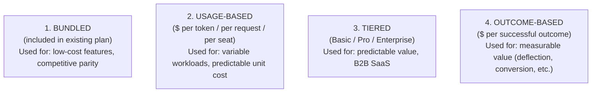
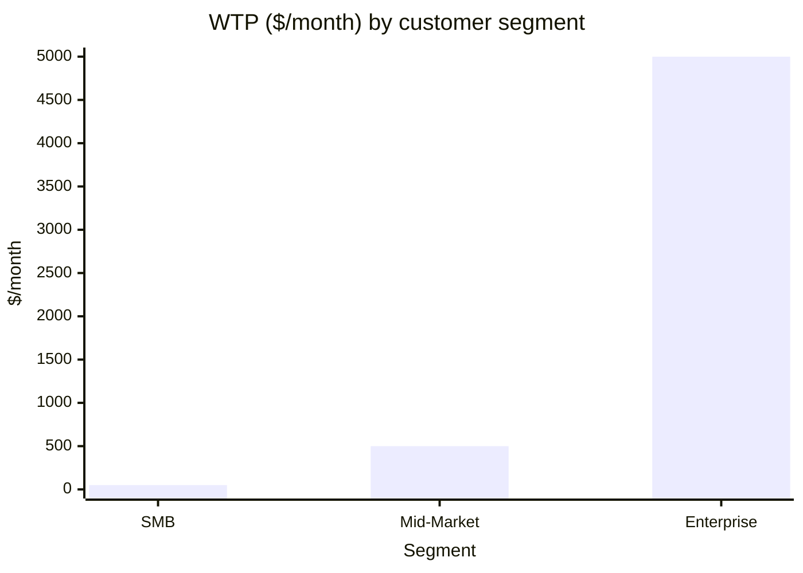

# AI Engineering Director Playbook
## Chapter 17

# Pricing, Packaging, and GTM for AI Features

> *"AI features don't ship at 0 marginal cost. The pricing has to reflect the unit economics."*

---

## 1. Epigraph

AI features don't ship at 0 marginal cost. The pricing has to reflect the unit economics.

---

## 2. Problem

Your team has shipped 4 AI features. Each is bundled into the existing SaaS subscription at "no extra cost." Customer usage is growing 30% quarter-over-quarter. The CFO has noticed that your AI cost line has grown from $50K/quarter to $400K/quarter. The CFO asks: "Are we making money on these features?" You don't know. Your pricing model treats AI as a cost center; your customers treat it as a free feature; your engineers treat it as a thing to scale.

This chapter is the operating manual for AI pricing, packaging, and go-to-market: the discipline of turning AI features into products that are *priced*, *packaged*, and *sold* in a way that reflects the unit economics. AI features that are free are features that lose money as they scale.

**Decision in one sentence:** Every AI feature ships with one of 4 pricing models (Bundled, Usage-Based, Tiered, Outcome-Based) — chosen based on unit economics, customer willingness to pay, and competitive position — and the pricing model is decided before engineering starts, not after launch.

---

## 3. Why AI Engineering Directors Fail Here

Five named failure modes of AI pricing/GTM at the Director level.

- **The "Free in the Bundle" Trap.** The Director ships AI features inside the existing subscription. Customers love it. Usage scales. Cost scales faster. The AI features are a net loss that the company can't unwind without angering customers.
- **The Cost-Plus Pricing.** The Director prices AI features at "vendor cost + 30%." The feature is profitable on paper. Customers don't value it enough to upgrade. The feature ships but nobody buys.
- **The Outcome-Promise-Pricing.** The Director promises "AI will save you 4 hours/week" and prices accordingly. When the AI delivers 1 hour/week, customers demand refunds. Pricing on promises is pricing on lawsuits.
- **The One-Packaging Disaster.** The Director ships all AI features in a single "AI Bundle" at one price. Power users feel they're subsidizing light users. Light users feel they're paying for features they don't use. The bundle is wrong for both.
- **The Sales-Team-Confusion.** The Director ships AI features without briefing the sales team. Sales reps don't know how to position the AI features, don't know the pricing tiers, and tell customers "it's included." The pricing model dies in the field.

---

## 4. Mental Models

Four mental models that compress AI pricing into something you can defend.

**Mental model 1: The 4 Pricing Models.** AI features ship under one of 4 pricing models.



Each model has a different risk/reward profile. The wrong model is expensive to unwind.

**Mental model 2: The Unit Economics Stack.** Pricing must reflect unit economics.

```
Revenue per request:        $___
Cost per request:           $___  (cost_estimator.py)
Gross margin per request:   $___  (%)

Break-even volume:          $___/month / margin % = ___ requests
Realistic volume:           ___ requests/month
Pricing-model fit:          [Bundled / Usage / Tiered / Outcome]
```

A pricing model where the gross margin per request is < 30% is a model that loses money at scale. The Director's job: name the unit economics, then choose the pricing model.

**Mental model 3: The Customer Willingness-to-Pay Curve.** Different customer segments value AI features differently.



A single pricing model rarely fits all segments. SMB customers won't pay $500/month for an AI feature; enterprise customers won't buy a $50/month feature. Tiered pricing matches the segments.

**Mental model 4: The Pricing-Decision Lock-in.** Pricing decisions are hard to unwind.

```
Once customers are paying $0 for an AI feature:
  - Charging $X/month requires either cutting the feature (angry customers)
  - Or grandfathering existing customers (revenue doesn't grow with usage)
  - Both options have long-tail cost.
```

Pricing model decisions made at launch determine 3 years of revenue. Pricing model changes after launch cost 2-3x what the right initial decision would have.

---

## 5. Frameworks

Three frameworks for the conversations you will have.

### Framework 1: The Pricing Model Decision

For each AI feature, walk through this decision tree:

```
1. Is unit cost < 5% of customer LTV?
   YES → BUNDLED (include in subscription; competitive parity)
   NO  → continue.

2. Is usage variable across customers (10x variance or more)?
   YES → USAGE-BASED (price per request/token)
   NO  → continue.

3. Is customer value predictable (most customers get similar value)?
   YES → TIERED (Basic/Pro/Enterprise with feature gates)
   NO  → continue.

4. Is outcome measurable (deflection, conversion, time-saved)?
   YES → OUTCOME-BASED (price per successful outcome)
   NO  → return to TIERED with usage caps.
```

### Framework 2: The Unit Economics Worksheet

For each AI feature, complete before pricing:

```
Per-request cost:           $___  (cost_estimator.py)
Per-customer monthly cost:  $___  (cost × requests/month)
Per-customer monthly value: $___  (estimated customer willingness to pay)

Tier 1 (Basic):     Price: $___/mo    Includes: ___
Tier 2 (Pro):       Price: $___/mo    Includes: ___
Tier 3 (Enterprise): Price: $___/mo   Includes: ___

Usage cap per tier:   Basic: ___    Pro: ___    Enterprise: ___
Overage rate:         $___ per ___ over cap
```

A pricing model without unit economics is a guess.

### Framework 3: The Sales Enablement Brief

For each AI feature shipped, the sales team gets a 1-page brief:

```
Feature:                ___
Pricing model:          Bundled / Usage / Tiered / Outcome
Tier(s):                ___
Value proposition:      ___
Customer pain (validated): ___
Top objections:         ___
Battle card vs top 3 competitors:  ___
```

A sales team without a battle card will tell customers "it's included." A sales team with a battle card will defend the pricing.

---

## 6. Drill

You are the Director of AI at **acme-corp**. You have 4 AI features in production:

1. **AI Customer Support Assistant** — internal cost-avoidance ($0.0065/req).
2. **Sales Email Drafting** — customer-facing ($0.001/req).
3. **Code Suggestion** — internal engineering tool ($0.002/req).
4. **Document Summarization** — customer-facing ($0.005/req).

You have **90 minutes**. Produce a **pricing/GTM strategy memo** (`portfolio/chapter-17-pricing-strategy.md`) using Framework 1 (Pricing Model Decision) + Framework 2 (Unit Economics Worksheet) applied to all 4 features. Specify:

- Pricing model per feature (Bundled / Usage / Tiered / Outcome) with rationale.
- Tiered pricing for the customer-facing features (Basic / Pro / Enterprise).
- Usage caps per tier.
- Overages per 1K requests.
- Sales enablement brief template.
- The 1 customer segment that should be excluded (because unit economics don't work).

**Deliverable:** `portfolio/chapter-17-pricing-strategy.md` — under 900 words.

---

## 7. Worked Example

**Feature 1: AI Customer Support Assistant (internal)**
- Unit cost: $0.0065/req (cost_estimator.py).
- Value: cost avoidance, not customer-facing.
- Decision: **NOT PRICED.** Internal cost center; budgeted by Finance.

**Feature 2: Sales Email Drafting (customer-facing)**
- Unit cost: $0.001/req.
- Volume: 5K drafts/day across customers.
- Decision: **TIERED.**
  - Basic: $0/mo (up to 50 drafts/mo, included in current plan).
  - Pro: $49/user/mo (up to 500 drafts/mo).
  - Enterprise: $99/user/mo (unlimited drafts + custom styles + analytics).
- Overages: $0.05/draft over cap.
- Unit economics: Pro tier at 50% utilization → $49 / 500 = $0.098/draft → gross margin 95%.

**Feature 3: Code Suggestion (internal)**
- Unit cost: $0.002/req.
- Value: engineering productivity, hard to monetize externally.
- Decision: **NOT PRICED.** Tracked as engineering overhead. Director negotiates with Engineering VP for cost allocation.

**Feature 4: Document Summarization (customer-facing)**
- Unit cost: $0.005/req.
- Volume: 2K summaries/day.
- Decision: **TIERED + USAGE overage.**
  - Basic: $0/mo (up to 100 summaries/mo).
  - Pro: $99/mo (up to 2K summaries/mo).
  - Enterprise: $499/mo (unlimited + compliance features + audit trail).
- Overages: $0.10/summary over cap.
- Unit economics: Pro tier at 50% utilization → $99 / 2K = $0.05/summary → gross margin 90%.

**Customer segment excluded:** Free-tier customers. Unit economics don't work for unlimited summaries on the free tier. Either downgrade usage (100/mo cap is current) or pay.

**Sales enablement brief template:** 1-page, 5 sections (Feature / Pricing / Value / Objections / Battle Card).

---

## 8. Failure Mode Postmortem

A Director of AI at a 2,000-person productivity SaaS company shipped 6 AI features over 18 months. All were bundled into the existing subscription at "no extra cost." Marketing positioned them as "AI included."

Usage scaled. Customer love grew. AI cost line went from $100K/quarter to $2.5M/quarter in 18 months. The Director asked the CFO for a budget increase to $4M/quarter for the next year.

The CFO declined. The CFO asked: "Can we cut features? Can we charge for usage? Can we limit free tier?" The Director had no plan. The features had been positioned as "free" — there was no pricing model to fall back on.

The Director proposed cutting 2 of the 6 features. Customers revolted. The Director proposed usage caps. Customers revolted. The Director proposed a "Pro AI" tier at $50/seat/mo. Existing customers revolted. The Director was asked to resign.

What they missed: Framework 1's "is unit cost < 5% of customer LTV?" question. The unit cost was 12% of LTV by year 2. Bundled was wrong. The Director should have proposed tiered pricing at launch. By launch+18 months, the decision was locked in.

The lesson: pricing decisions made at launch determine 3 years of revenue. Pricing model changes after launch cost 2-3x what the right initial decision would have.

---

## 9. Self-Assessment Rubric

| # | Dimension | 1 (Novice) | 3 (Competent) | 5 (Expert) |
|---|---|---|---|---|
| 1 | Pricing model selection | Bundles everything | Names 2 of 4 models | Picks from all 4 with rationale per feature |
| 2 | Unit economics discipline | Ignores unit cost | Has cost estimates | Has full per-request economics + tier mapping |
| 3 | Tiered pricing design | One tier for all | 2-3 tiers | 3+ tiers with usage caps + overages |
| 4 | Customer segment exclusion | Sells to everyone | Excludes unprofitable segments | Excludes segments + defines alternative (downgrade, paid) |
| 5 | Sales enablement | No brief | Has 1-pager | Battle card + objection handling + value prop |

**Disqualifier:** any 1 on dimension 1 or 2. Bundling everything or ignoring unit economics is the path to the "Free in the Bundle" Trap.

**Total:** ___ / 25. **Pass threshold:** 18/25, no dimension below 3.

---

## 10. Portfolio Artifact Note

Save your filled-in drill as `portfolio/chapter-17-pricing-strategy.md` — interview evidence for "How do you price an AI feature?" (see Portfolio Map in Chapter 27).

---

## 11. Interview Questions

1. **Walk me through how you'd price an AI feature.**
2. **Your AI feature is losing money at scale. What's your plan?**
3. **What's the difference between usage-based and outcome-based pricing?**
4. **Your customers love the free AI feature. The CFO wants to charge. How do you navigate?**
5. **Walk me through the unit economics of an AI feature you've shipped.**