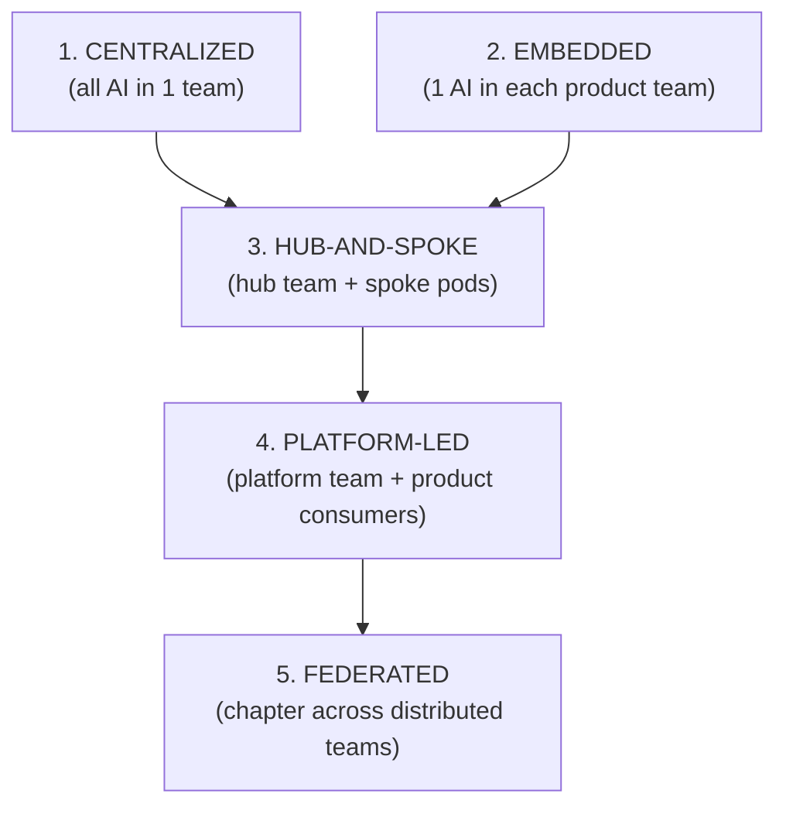
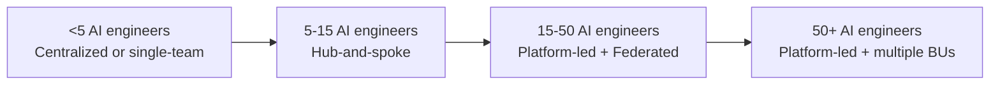

# AI Engineering Director Playbook
## Chapter 18

# Org Design and Team Topologies for AI

> *"Org design is strategy made concrete. If the teams don't align, the strategy won't either."*

---

## 1. Epigraph

Org design is strategy made concrete. If the teams don't align, the strategy won't either.

---

## 2. Problem

Your CEO hired you to "do AI for the company." You have 4 ML engineers and 1 platform engineer. Your VP of Engineering has 200 engineers organized into 12 product teams. Each product team needs AI features. Each product team thinks AI is "their thing." You're being asked to serve 12 teams, ship 9 AI features, and build a platform — all with a team of 5. Something has to give, and what gives is usually the org design.

This chapter is the operating manual for AI org design at company scale: the discipline of designing *who owns what*, *who builds what*, *who consumes what*, and *who decides what*. The Director's job is to design an org that can ship AI at scale without the org becoming the bottleneck.

**Decision in one sentence:** Choose one of 5 AI org topologies (Centralized, Embedded, Hub-and-Spoke, Platform-led, Federated) based on your company's AI maturity, talent density, and product mix — and accept that the topology changes as the company grows.

---

## 3. Why AI Engineering Directors Fail Here

Five named failure modes of AI org design at the Director level.

- **The Ivory-Tower Central Team.** The Director builds a centralized AI team of 15 engineers. The team builds "platform" and "infrastructure" for 2 years. Product teams have no AI talent. AI features get built (poorly) by product teams without AI expertise. The centralized team becomes an ivory tower that nobody trusts.
- **The Embedded-Only Trap.** The Director embeds 1 AI engineer in each of 12 product teams. Each embedded engineer works on isolated features. No shared platform. No shared learnings. Every team rebuilds the same eval harness. The embedded-only org produces 12 different stacks.
- **The Topology Mismatch.** The Director adopts a Hub-and-Spoke topology that worked at a 200-person startup and tries to apply it at a 5,000-person enterprise. The hub becomes a bottleneck. The spokes can't get unblocked. AI delivery slows.
- **The Reporting-Line Confusion.** The Director reports to the CTO but the AI engineers are managed by product VPs. The Director has authority over an org chart that doesn't report to them. Decisions get stalled in cross-VP negotiations.
- **The Talent-Spread Failure.** The Director spreads 4 AI engineers across 12 product teams. Each team gets <0.5 FTE. No team has enough AI talent to ship anything. The Director has distributed talent thinly enough that no team has critical mass.

---

## 4. Mental Models

Four mental models that compress AI org design into something you can defend.

**Mental model 1: The 5 AI Org Topologies.** Five topologies, each with a different tradeoff.



Each topology has a "right size" — too small and you can't afford the platform team; too large and the platform team becomes an ivory tower.

**Mental model 2: The Conway's Law Inversion.** Conway's Law: "systems reflect the orgs that build them." For AI, the inversion matters: the org must reflect the AI strategy.

```
If AI strategy = "platform plays" → Platform-led topology
If AI strategy = "AI features everywhere" → Hub-and-spoke or Embedded
If AI strategy = "single AI product" → Centralized
If AI strategy = "domain-specific AI" → Federated by domain
```

A Director who designs the org before the strategy is building an org that may not serve the strategy. The order matters.

**Mental model 3: The Talent Density Curve.** AI org design is constrained by talent density.



A Director with 3 AI engineers cannot run a Platform-led topology (need 5+ for the platform). A Director with 100 AI engineers cannot run Centralized (the team is too large to coordinate). Talent density drives topology choice.

**Mental model 4: The Topology Change Triggers.** Org topology changes as the company grows.

```
Stage 1 (early, <5 AI):   Centralized (1 team, building the foundation)
Stage 2 (5-15 AI):        Hub-and-spoke (hub team + 2-3 product pods)
Stage 3 (15-50 AI):       Platform-led + Federated (platform + chapter model)
Stage 4 (50+ AI, multi-product): Platform-led + Federated + AI-specific product lines
```

A team that stays in Stage 1 topology past 15 engineers is creating coordination debt. A team that jumps to Stage 3 with 8 engineers has built an org they can't fill.

---

## 5. Frameworks

Three frameworks for the conversations you will have.

### Framework 1: The Topology Decision

For your current state, walk through this:

```
1. How many AI engineers do you have?
   <5: Centralized (Stage 1)
   5-15: Hub-and-spoke (Stage 2)
   15-50: Platform-led + Federated (Stage 3)
   50+: Platform-led + Federated + AI product lines (Stage 4)

2. How many product teams need AI features?
   1-2: Centralized is fine.
   3-6: Hub-and-spoke (1 hub serves 3-6 pods).
   7-15: Platform-led (platform serves all; pods embed AI engineers).
   15+: Federated + chapter model.

3. Is there a shared AI platform?
   No:  Build one (Platform-led).
   Yes: Focus on adoption (Federated).

4. Is the org aligned with the AI strategy?
   No:  Re-org.
   Yes: Optimize current topology.
```

### Framework 2: The Hub-and-Spoke Design

For Stage 2 (5-15 AI engineers), the canonical design:

```
HUB TEAM (5-7 engineers):
  - 1 Senior platform engineer (lead)
  - 1 Platform engineer
  - 1 Eval engineer
  - 1 ML engineer (model selection + RAG patterns)
  - 1 ML engineer (cost optimization + serving)
  - 0.5 SRE (shared)

SPOKE PODS (1-2 engineers each, 2-3 pods):
  - Embedded in product team
  - Report dotted-line to AI Director, solid-line to product VP
  - Use hub team's platform
  - Contribute learnings back to hub

DECISIONS:
  - Hub makes: platform choices, vendor decisions, eval standards
  - Spokes make: feature-specific decisions, prompt design, UX
```

### Framework 3: The Federated Chapter Model

For Stage 3+ (15+ AI engineers), the canonical design:

```
PLATFORM TEAM (5-7 engineers):
  - Owns the platform, eval, observability, model gateway

PRODUCT TEAMS (3-6 AI engineers each, 4-6 teams):
  - Own their product's AI features
  - Use platform team's services
  - Report solid-line to product VP

CHAPTER (cross-team):
  - 1 Director of AI (you)
  - Sets cross-team standards (eval, lifecycle, security)
  - Runs chapter meetings (1× per week)
  - Owns career ladders for AI roles
  - Owns hiring standards

This is the "Spotify model" applied to AI. Chapter sets standards; teams retain autonomy.
```

---

## 6. Drill

You are the Director of AI at **acme-corp**. You have 8 AI engineers and need to serve 9 product teams. The CEO wants to ship "AI everywhere." The CTO wants a platform. Product VPs want AI engineers in their teams.

You have **90 minutes**. Produce an **org design memo** (`portfolio/chapter-18-org-design.md`) using Framework 1 (Topology Decision) + Framework 2 (Hub-and-Spoke) applied to acme-corp. Specify:

- The chosen topology (with rationale).
- The org chart (hires, reporting lines).
- The 3 most contentious decisions (e.g., "do AI engineers report to me or to product VPs?").
- The migration plan from current state to target state.
- The 1 thing you'll explicitly NOT do.

**Deliverable:** `portfolio/chapter-18-org-design.md` — under 900 words.

---

## 7. Worked Example

**Current state:**
- 8 AI engineers (1 senior platform, 4 ML, 1 platform, 1 SRE, 1 PM).
- 9 product teams.
- No shared platform.
- AI engineers report to product VPs (dotted-line to AI Director).
- AI features shipped: 14 (across 9 teams).

**Topology decision:**
- 8 engineers + 9 teams → **Hub-and-Spoke (Stage 2).**
- Not Platform-led (need 5+ engineers dedicated to platform; we have 1).
- Not Federated (need 15+ engineers and existing platform; we have neither).

**Target org chart:**

```
HUB TEAM (5 engineers, reports to AI Director):
  - 1 Senior ML engineer (lead)
  - 1 Platform engineer
  - 1 Eval engineer
  - 1 Cost/serving engineer
  - 0.5 SRE

SPOKE PODS (3 engineers, embedded in product teams):
  - Pod 1: Product A + B (1 engineer)
  - Pod 2: Product C + D + E (1 engineer)
  - Pod 3: Product F + G + H + I (1 engineer)
  - Each pod reports solid-line to product VP, dotted-line to AI Director
```

**3 contentious decisions:**

1. **AI Director's authority.** Spokes have dotted-line to AI Director. Director has hiring-veto + standards-setting authority, but no direct management. Trade-off: lost some control, gained product-VP buy-in.
2. **Eval ownership.** Hub owns eval standards and shared eval harness. Product teams own eval content (use cases). Trade-off: standardization vs. flexibility.
3. **Platform prioritization.** Hub chooses platform priorities; spokes influence via quarterly review. Trade-off: coherence vs. responsiveness.

**Migration plan (90 days):**

```
Month 1: Hire 1 more platform engineer + 1 more ML engineer (now 10).
         Re-org announced.
         Hub team begins platform work.

Month 2: Hub team picks platform priorities (3-month roadmap).
         Spoke pods officially form.

Month 3: First migration — 5 of 14 features migrated to platform.
         Old AI features (not on platform) continue working.
```

**The 1 thing NOT to do:** Do NOT jump to Federated model. With 10 engineers, a federated chapter creates more overhead than value. Stay Hub-and-Spoke until 15+ engineers.

---

## 8. Failure Mode Postmortem

A Director of AI at a 2,500-person fintech was hired to "do AI." The Director had 6 AI engineers and 14 product teams. The Director chose Platform-led (Stage 3) immediately, hiring 4 more engineers to build a platform team. The platform team spent 12 months building infrastructure. Product teams shipped 0 AI features in that 12 months (waiting for platform).

After 12 months, the Director was asked: "What did the AI team ship?" The answer: "A platform that 2 product teams have started to use." 12 product teams had built nothing. The Director had built an ivory tower.

What they missed: Stage 2 topology should have preceded Stage 3. With 6 engineers, Hub-and-Spoke would have shipped 5-7 AI features in the same 12 months while building the platform as a side effect.

The lesson: org topology must match talent density. Skipping stages creates org debt that compounds.

---

## 9. Self-Assessment Rubric

| # | Dimension | 1 (Novice) | 3 (Competent) | 5 (Expert) |
|---|---|---|---|---|
| 1 | Topology selection | Ad-hoc org | Picks from 2-3 topologies | Picks from all 5 with rationale tied to talent density |
| 2 | Conway's Law application | Org doesn't match strategy | Re-orgs after strategy | Designs org to fit strategy upfront |
| 3 | Hub-and-spoke design | No hub team | Has hub + spokes | Hub has 5+ dedicated engineers; spokes dotted-line correctly |
| 4 | Federated chapter model | No chapter | Has chapter meetings | Chapter sets standards + owns career ladders + hires |
| 5 | Migration planning | Re-orgs suddenly | Phased over 90 days | Phased + measures adoption + has flip rules |

**Disqualifier:** any 1 on dimension 1 or 5. Wrong topology or sudden re-org is the path to the Ivory-Tower Central Team.

**Total:** ___ / 25. **Pass threshold:** 18/25, no dimension below 3.

---

## 10. Portfolio Artifact Note

Save your filled-in drill as `portfolio/chapter-18-org-design.md` — interview evidence for "How do you design an AI org?" (see Portfolio Map in Chapter 27).

---

## 11. Interview Questions

1. **Walk me through how you'd design an AI org for a 1,200-person company.**
2. **Your CEO says "AI everywhere." What topology do you pick?**
3. **How do you decide if AI engineers should report to you or to product VPs?**
4. **Walk me through a Hub-and-Spoke org you've built or seen.**
5. **A re-org failed. What went wrong?**