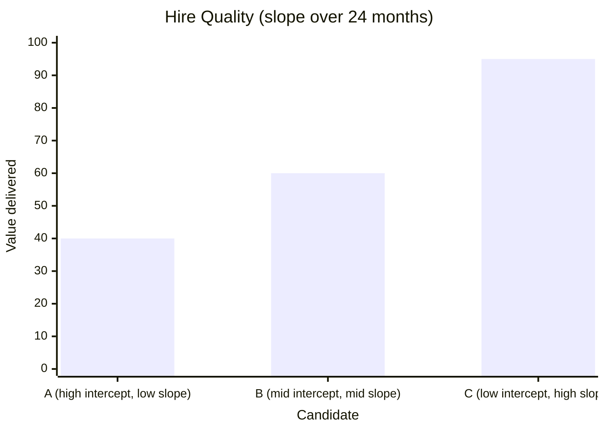
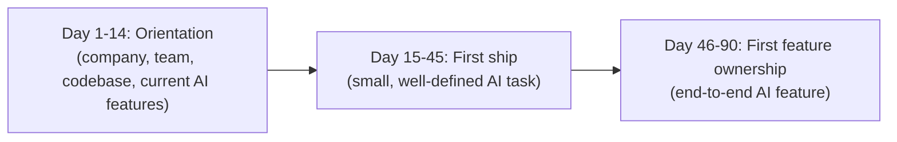

# AI Engineering Director Playbook
## Chapter 19

# Hiring, Onboarding, and Growing AI Talent

> *"AI talent is scarce. Hire for slope, not intercept."*

---

## 1. Epigraph

AI talent is scarce. Hire for slope, not intercept.

---

## 2. Problem

You have 1 open requisition for a Senior ML Engineer. You've been interviewing for 3 months. You've seen 47 candidates. 5 got offers. 4 declined. 1 accepted and quit after 8 weeks. The team is burned out from interviewing. Your CTO asks: "Why is this taking so long?"

This chapter is the operating manual for AI hiring: the discipline of finding, evaluating, and closing AI talent in a market where the supply is constrained and the demand is overwhelming. The Director's job is not to hire fast; it's to hire well, with a system that compounds.

**Decision in one sentence:** Hire for slope (learning velocity, judgment, range) over intercept (current skills, brand-name credentials); build a system that turns "good hires" into "great teammates" via structured onboarding; and accept that AI talent retention is won on growth, not compensation.

---

## 3. Why AI Engineering Directors Fail Here

Five named failure modes of AI hiring at the Director level.

- **The Brand-Name Bias.** The Director hires only from "top AI labs" (OpenAI, Anthropic, DeepMind, Google Brain). The hire pipeline is constrained to ~200 candidates globally. Offer-acceptance rate is low because the brand-name labs can outbid. The Director has filtered out 95% of the talent pool.
- **The LeetCode-ML Interview.** The Director interviews ML engineers with LeetCode-style coding questions. The candidates ace them; the candidates can't ship a model in production. The Director has hired engineers who can't engineer in production.
- **The "AI Researcher" Hire.** The Director hires a pure ML researcher (PhD, papers, no production experience). The hire produces a beautiful model that doesn't ship. The Director has hired for the wrong role.
- **The 90-Day Quitter.** The Director hires well but the new hire quits in 90 days. Common cause: no structured onboarding. The hire feels lost, doesn't know the system, doesn't have a clear first deliverable. The hire leaves for the next opportunity that has structure.
- **The Compensation-Only Retention.** The Director retains AI talent by matching or beating compensation. The Director has a retention strategy that is also every competitor's strategy. The Director is in a bidding war that compounds.

---

## 4. Mental Models

Four mental models that compress AI hiring into something you can defend.

**Mental model 1: The Slope-vs-Intercept Hire.** Slope is the rate of learning; intercept is the current skill level.



A Director who hires for intercept gets the current skill level; that skill level depreciates over 24 months. A Director who hires for slope gets a teammate who grows into the role.

**Mental model 2: The Production-AI Skill Stack.** Production AI skills are different from research AI skills.

```
Production AI:
  - Eval harness design (Ch 9)
  - Inference cost engineering (Ch 7)
  - Lifecycle discipline (Ch 10)
  - Prompt engineering + RAG patterns (Ch 8)
  - Observability + drift detection (Ch 12)
  - Security + privacy (Ch 13)
  - Vendor selection + switching (Ch 4)

Research AI:
  - Novel architecture design
  - Paper-writing skills
  - Benchmark performance
```

A hire from a research lab has 0/7 production skills on day 1. A hire from a strong production team has 7/7. A great hire has 3-4/7 production skills and high slope.

**Mental model 3: The Onboarding Ramp.** New hires need a 90-day ramp to full productivity.



A hire that ships in their first 14 days feels like they belong. A hire that doesn't ship for 90 days feels lost. The Director's job is to design the first 90 days.

**Mental model 4: The Retention Triangle.** Retention is built on growth + autonomy + community, not just compensation.

```
Growth:        "I'm learning new things here."
Autonomy:      "I have ownership over meaningful work."
Community:     "I respect and like the people I work with."
Compensation:  "I can pay my rent."

Compensation is the bottom of Maslow's hierarchy. Below it, people leave.
Above it, growth + autonomy + community are what keep people.
```

A Director who only invests in compensation is in a bidding war. A Director who invests in growth + autonomy + community has a defensible retention strategy.

---

## 5. Frameworks

Three frameworks for the conversations you will have.

### Framework 1: The Production-AI Interview Loop

A 4-round interview loop that predicts production AI success:

```
Round 1: Phone screen (1 hour)
  - Past projects: what did you ship, what was your role, what was the outcome?
  - Production-AI motivation: why do you want to do AI in production, not research?

Round 2: System design (1.5 hours)
  - Design an AI feature (e.g., "Design a customer-support chatbot for X company")
  - Cover: data layer, model choice, eval, deployment, cost, security, observability.
  - Look for: do they ask about lifecycle, eval, cost? Or do they jump to "fine-tune"?

Round 3: Coding + debugging (2 hours)
  - Live debugging: "This AI feature is regressing. Walk me through your diagnosis."
  - Code review: review a sample prompt + RAG pipeline. Identify what they'd change.

Round 4: Team + culture fit (1 hour)
  - Growth mindset: tell me about a time you learned something hard.
  - Collaboration: tell me about a time you disagreed with a teammate.
  - Mission alignment: why this company, this team, this role?

DECISION:
  - Strong: All 4 rounds show production-AI judgment + slope.
  - Mixed: Strong technical + weak product/communication. Could be a hire if growth potential is high.
  - Weak: Strong research + weak production. Pass.
```

### Framework 2: The 90-Day Onboarding Plan

For every new AI hire, the 90-day plan is structured:

```
Day 1:    Welcome + buddy assignment + first-1:1.
Day 2-3:  Read the 9 written AI chapters (Ch 1-9).
Day 4-7:  Pair with a senior engineer on current production AI features.
Day 8-14: Ship a small, well-defined task (e.g., add a metric to a dashboard).
Day 15:   First 1:1 with Director. Reflect on first 14 days.
Day 16-45: Own a small AI feature (e.g., prompt refresh + eval update).
Day 46:   Mid-point 1:1. Reflect on first 45 days. Identify growth area.
Day 47-90: Own an end-to-end AI feature (eval → deploy → monitor).
Day 90:   Final 1:1. Promotion-readiness check + next-90-days plan.
```

### Framework 3: The Retention Investment Audit

Quarterly, audit each team member's retention investment:

```
For each AI engineer on your team:
- Growth:        ___ (1-5, last 90 days of learning)
- Autonomy:      ___ (1-5, ownership of meaningful work)
- Community:     ___ (1-5, quality of peer relationships)
- Compensation:  ___ (1-5, market-competitive)

If any dimension <3, action required:
- Growth <3:       assign stretch project, conference budget, mentorship
- Autonomy <3:     promote ownership of a feature
- Community <3:    1:1 about relationships, team offsite
- Compensation <3: comp adjustment
```

---

## 6. Drill

You are the Director of AI at **acme-corp**. You have 3 open requisitions: 1 Senior ML Engineer, 1 Platform Engineer, 1 Eval Engineer. The team currently has 8 AI engineers.

You have **90 minutes**. Produce a **hiring plan** (`portfolio/chapter-19-hiring-plan.md`) using Framework 1 (Production-AI Interview Loop) + Framework 2 (90-Day Onboarding Plan) + Framework 3 (Retention Investment Audit). Specify:

- The 3 roles with detailed job descriptions (production-AI skill emphasis).
- The interview loop for each role.
- The 90-day onboarding plan for each role.
- A retention audit of your current 8 engineers (with hypothetical scores).
- The 1 retention investment you'd make this quarter.

**Deliverable:** `portfolio/chapter-19-hiring-plan.md` — under 900 words.

---

## 7. Worked Example

**Role 1: Senior ML Engineer**

```
Mission: Ship 3-5 AI features in 6 months with measurable business impact.

Skills:
  - Production ML: evals, inference cost, lifecycle (Ch 9, 7, 10)
  - 3+ years production AI experience
  - Slope: past projects with measurable scale

Interview loop:
  - Round 1: 1-hour phone screen (production-AI motivation)
  - Round 2: 1.5-hour system design (AI feature)
  - Round 3: 2-hour coding + debugging (live)
  - Round 4: 1-hour team + culture fit

90-day onboarding:
  - Day 1-14: Read Ch 1-9 + pair with senior engineer
  - Day 15-45: Own prompt refresh for Support Assistant
  - Day 46-90: Own Sales Email Drafting eval refresh end-to-end
```

**Role 2: Platform Engineer**

```
Mission: Build AI platform capabilities (Model Gateway, RAG toolkit).

Skills:
  - Backend engineering + AI infrastructure
  - Multi-vendor API integration
  - Production reliability experience

Interview loop:
  - Round 1: 1-hour phone screen
  - Round 2: 1.5-hour system design (Model Gateway)
  - Round 3: 2-hour coding + infra debugging
  - Round 4: 1-hour team fit

90-day onboarding:
  - Day 1-14: Read Ch 11 + pair with platform team
  - Day 15-45: Ship first Model Gateway adapter (OpenAI → Anthropic fallback)
  - Day 46-90: Ship first eval integration (LLM-as-judge)
```

**Role 3: Eval Engineer**

```
Mission: Build + maintain the eval system across all AI features.

Skills:
  - Eval methodology + LLM-as-judge
  - Statistics background
  - Production eval harness experience

Interview loop:
  - Round 1: 1-hour phone screen
  - Round 2: 1.5-hour system design (eval system)
  - Round 3: 2-hour debugging (drift detection failure scenario)
  - Round 4: 1-hour team fit

90-day onboarding:
  - Day 1-14: Read Ch 9, Ch 12 + tour current eval setup
  - Day 15-45: Refresh eval set for top 3 features
  - Day 46-90: Ship first online eval system (sampling + scoring)
```

**Retention audit (current 8 engineers, hypothetical scores):**

| Engineer | Growth | Autonomy | Community | Comp | Action |
|---|---|---|---|---|---|
| ML-1 (Senior) | 4 | 5 | 4 | 4 | Healthy |
| ML-2 | 4 | 4 | 5 | 3 | Comp adjustment |
| ML-3 | 3 | 4 | 3 | 4 | Community + Growth |
| ML-4 | 5 | 4 | 4 | 4 | Healthy |
| Platform-1 | 4 | 4 | 5 | 4 | Healthy |
| SRE-0.5 | 3 | 3 | 4 | 5 | Autonomy (share of feature) |
| Eval-1 (new) | 5 | 5 | 3 | 4 | Community (buddy system) |
| PM-1 | 4 | 4 | 4 | 4 | Healthy |

**The 1 retention investment this quarter:** Comp adjustment for ML-2 (matched market rate). Cost: ~$15K/year. ROI: prevents attrition ($200K+ replacement cost).

---

## 8. Failure Mode Postmortem

A Director of AI at a 1,200-person SaaS company hired 4 Senior ML Engineers from top AI labs (OpenAI, DeepMind) over 6 months. Each accepted at ~$400K total comp. Each quit within 12 months. The Director had spent $1.6M on compensation + $400K on recruiting fees + $1.5M in lost productivity. Total: $3.5M with zero retained.

The common thread: the Director had hired for intercept. Each candidate had impressive credentials but limited production-AI judgment. They joined expecting to do research-grade work; they were asked to ship AI features. They left for the next research role.

What they missed: Framework 1's Round 2 (System Design). The Director had skipped system design rounds for the brand-name hires. The system design round would have surfaced that the candidates couldn't design a production AI feature. The Director had filtered for credentials, not for slope.

The lesson: AI talent is scarce but expensive hires are not the answer. Hire for slope; design a system that turns slope into production outcomes; retain via growth + autonomy + community.

---

## 9. Self-Assessment Rubric

| # | Dimension | 1 (Novice) | 3 (Competent) | 5 (Expert) |
|---|---|---|---|---|
| 1 | Slope-vs-intercept | Hires for credentials | Hires for some signal of slope | Hires explicitly for slope + system design round |
| 2 | Production-AI skill assessment | Hires researchers | Tests for production-AI skills | Uses 4-round loop with production-AI emphasis |
| 3 | Onboarding ramp | No structured onboarding | Has buddy + first task | Has 90-day plan with first ship in 14 days |
| 4 | Retention strategy | Comp-only | Comp + 1 other dimension | Growth + autonomy + community + comp audit quarterly |
| 5 | Talent density at team level | 1 hire/quarter | 1 hire/month | Sustained 2-3 hires/month with retention rate >90% |

**Disqualifier:** any 1 on dimension 1 or 4. Hiring for intercept or comp-only retention is the path to the Brand-Name Bias or the Compensation-Only Retention trap.

**Total:** ___ / 25. **Pass threshold:** 18/25, no dimension below 3.

---

## 10. Portfolio Artifact Note

Save your filled-in drill as `portfolio/chapter-19-hiring-plan.md` — interview evidence for "How do you hire AI engineers?" (see Portfolio Map in Chapter 27).

---

## 11. Interview Questions

1. **Walk me through how you hire a Senior ML Engineer.**
2. **A candidate has great credentials but limited production experience. Hire or pass?**
3. **Your best engineer just gave notice. What do you do?**
4. **Walk me through how you'd design a 90-day onboarding plan.**
5. **Your retention rate is 60% over 24 months. What's broken?**