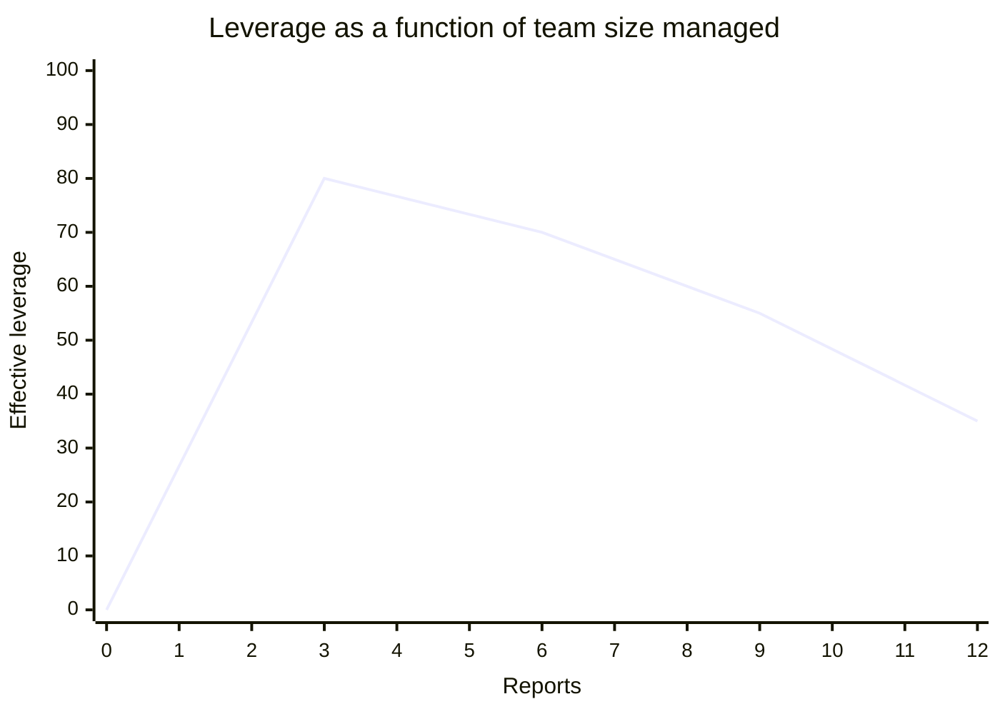

# AI Engineering Director Playbook
## Chapter 2

# The IC-to-Director Category Change

> *"The day you become a Director, you stop being the person who knows the most about your code. You become the person who decides which code gets written."*

---

## 1. Epigraph

The day you become a Director, you stop being the person who knows the most about your code. You become the person who decides which code gets written.

---

## 2. Problem

You were a Staff Engineer last quarter. You shipped the hardest feature on the roadmap. The team looked to you for technical direction. Yesterday you got the promotion. Today you have 8 reports, 5 cross-functional peers, and a Director-level decision on your desk by Friday. The hardest part is not the new skills you need — it's the old reflexes that will kill you if you keep them.

**Decision in one sentence:** The IC-to-Director transition is a category change — you stop being the highest-leverage individual contributor and become the system that makes the whole team higher-leverage.

---

## 3. Why AI Engineering Directors Fail Here

Five named failure modes of the IC-to-Director transition.

- **The Hero-IC Relapse.** The new Director can't let go of the hardest technical work and keeps pulling the hardest problems back to themselves. The team stops growing. The Director burns out.
- **The Meeting-Floor Refusal.** The new Director refuses to do the calendar work — skip-levels, 1:1s, performance reviews, strategy decks — because "real work is in the code." By month 6, the Director has no political capital and no team.
- **The Decision-Freeze.** The new Director used to make decisions by reading the code. Now the decisions involve people, prioritization, and politics — and the Director freezes. Decisions stall, the team loses momentum, and the CEO starts wondering why the AI initiative is moving slowly.
- **The Former-Peer Awkwardness.** The new Director used to be peers with their reports. Now they have to give performance feedback, redirect work, and sometimes manage people out. The relationship calcifies.
- **The Leverage-Misread.** The new Director thinks leverage means "review more PRs" or "unblock more tickets." Real leverage at the Director level is hiring, firing, deciding, communicating, and unblocking the unblockers.

---

## 4. Mental Models

Four mental models for the transition.

**Mental model 1: The Leverage Curve.** Leverage is a curve, not a number. As an IC, your leverage is your own output. As a Director, your leverage is multiplied by your team's output — but only if you've built the system (hiring, decisions, cadence) that lets the team operate without you in the loop.



The line drops because the Director's personal leverage goes down (less code) faster than the team's collective leverage goes up (the system isn't built yet). The line recovers past ~6-8 reports when the system is mature.

**Mental model 2: The Decision Reframing.** As an IC, you decide by reading code. As a Director, you decide by reading people, frames, and incentives. The Director who keeps trying to read the code is the Director who makes technical decisions without the team's context.

**Mental model 3: The Calendar is the Job.** A Director's calendar is the job. If your calendar is full of code review and 1:1 debugging sessions, your job is "Staff Engineer with a title." If your calendar is full of skip-levels, peer 1:1s, decision memos, and portfolio reviews, your job is "Director."

**Mental model 4: The Identity Shift.** You are no longer the smartest person in the room about your domain. You are the person who ensures the room has the smartest people in it. The IC identity was "expert." The Director identity is "operator of expertise."

---

## 5. Frameworks

Three frameworks for the transition.

### Framework 1: The Decision Reframing Checklist

Every time you're about to make a decision in the first 90 days as Director, run this:

```
1. Am I solving this because I am the right person, or because it's familiar?
2. Is this decision reversible? (If yes, decide fast. If no, slow down.)
3. Who needs to be in the loop? (Peer Directors? Reports? Skip-level?)
4. What does success look like in 30 days? 90 days? 6 months?
5. What would I tell my replacement to do if I left today?
```

Q5 is the test. If you can't explain the decision to your replacement, you don't understand it well enough to sign it.

### Framework 2: The 11-Conversion Template

Eleven mental conversions you must make in the first 90 days:

```
1. "I'll write it"        -> "Who on the team should write it?"
2. "I'll review it"       -> "Who should review it next time?"
3. "I'll fix it"          -> "Who owns the fix?"
4. "I'll explain it"      -> "Who else can explain it?"
5. "I'll decide it"       -> "What decision is this, really?"
6. "I'll go to the meeting" -> "Who else needs to be there?"
7. "I'll know the answer" -> "Who has more context than I do?"
8. "I'll handle the customer" -> "Who owns the customer relationship?"
9. "I'll set the strategy" -> "Who needs to weigh in?"
10. "I'll hire for it"     -> "What am I looking for, in writing?"
11. "I'll do it"           -> "What's the smallest version I can do, then delegate?"
```

The 11 conversions are a daily practice. Each one is a chance to either do the work or build the team that does the work.

### Framework 3: The Weekly Reflection (3 questions, 5 minutes)

Every Friday, answer these in a private doc:

```
1. What did I do this week that only I could do?
2. What did I do this week that someone else should be doing in 6 months?
3. What did I avoid doing this week that I should be doing?
```

Q1 is your real job. Q2 is your hiring/training pipeline. Q3 is your growth edge.

---

## 6. Drill

You are the new Director of AI at **acme-corp**. Your first week is ending. You have:

- 8 reports (4 senior engineers, 2 ML engineers, 1 platform engineer, 1 eval lead)
- 4 peer Directors (Product, Engineering, Data, Design)
- 1 skip-level (CTO)
- A calendar that's 80% booked with the meetings you inherited from your predecessor

You have **90 minutes**. Produce a **first-week operating plan** (`portfolio/chapter-02-first-week-plan.md`) using Framework 1 (Decision Reframing Checklist), Framework 2 (11-Conversion Template applied to one of your inherited responsibilities), and Framework 3 (your first Weekly Reflection). End with: **What I am NOT doing in week 1.**

**Deliverable:** `portfolio/chapter-02-first-week-plan.md` — under 900 words.

---

## 7. Worked Example

**Decision:** What is your first-week operating plan at acme-corp?

### Day-by-day

**Day 1:** Arrive. Cancel all meetings that aren't 1:1s with your 8 reports. 1 hour with each (4 hours, half day). Goal: hear them, not advise them.

**Day 2:** 1:1s with 4 peer Directors (2 hours). Goal: understand the cross-functional landscape, not pitch your agenda.

**Day 3:** 90 minutes with CTO (your skip-level). 60 minutes with CEO. Goal: confirm the mandate, hear what they want, don't promise anything.

**Day 4–5:** Audit the 6 AI features in production. Time-boxed to 8 hours. Goal: produce a 1-page "State of AI at acme-corp" draft.

### What I am NOT doing in week 1

- Not writing any code.
- Not making any architectural decisions.
- Not hiring anyone.
- Not responding to customer escalations directly (still owned by the support team; I observe, not intervene).
- Not pushing the "transformative AI feature" agenda.

### Decision Reframing applied to one inherited decision

**Decision:** The chatbot is throwing 500 errors for ~2% of traffic. The on-call engineer is escalating: "Do we roll back the model update or patch the prompt?"

**My instinct (Hero-IC Relapse):** Read the prompt, decide.

**Reframed:**
1. *Am I solving this because I'm the right person?* No — the on-call engineer has more context.
2. *Reversible?* Yes — model rollback is fast.
3. *Who needs to be in the loop?* On-call engineer (decision owner), Product peer (customer impact), me (sign-off only).
4. *Success in 30 days?* Rollback decision made within 30 minutes; pattern documented.
5. *What would I tell my replacement?* "Use the rollback decision tree; if model rollback doesn't fix it, escalate to prompt patching with PM in the loop."

**Outcome:** Sign-off on rollback within 30 minutes. Don't get pulled into the prompt-patching rabbit hole.

### Weekly Reflection (end of week 1)

1. *What did I do this week that only I could do?* Set the cadence with the 8 reports; agreed the 90-day plan shape with CTO.
2. *What did I do this week that someone else should be doing in 6 months?* Most of the 1:1s — in 6 months, the team should be running their own 1:1s with peer Directors.
3. *What did I avoid this week that I should be doing?* Skipped the chatbot incident. Avoided it because it was the kind of work I would have done as IC. Need to keep avoiding — the incident is a test of whether I trust the team.

**Score: 23/25 on the rubric.**

---

## 8. Failure Mode Postmortem

A Staff Engineer was promoted to Director of AI at a 600-person company. Six months in, the Director was still writing the hardest PRs in the codebase, still attending every incident bridge, still running the architecture review meetings. The team had stopped growing — every senior engineer was waiting for the Director to make the hard calls. By month 9, two senior engineers had quit (one had been a near-promotion candidate). The Director was asked to step back to Staff Engineer.

What they missed: every Framework above. The 11 Conversions never happened. The Weekly Reflection was never done. The Decision Reframing Checklist wasn't run — every decision was made by reading the code. The Leverage Curve never recovered past the dip.

The lesson: the IC-to-Director transition is a category change, not a promotion. The Director who keeps their IC identity becomes a bottleneck with a title.

---

## 9. Self-Assessment Rubric

| # | Dimension | 1 (Novice) | 3 (Competent) | 5 (Expert) |
|---|---|---|---|---|
| 1 | Identity Shift | Keeps IC identity | Names the shift | Lives the shift weekly (calendar reflects it) |
| 2 | Decision Reframing | Reads code to decide | Runs the 5-question checklist | Frames the frame behind the frame |
| 3 | Hero-IC Relapse resistance | Pulls hardest PRs back | Delegates after writing the spec | Sets the system that delegates without spec |
| 4 | Calendar as the job | Code review dominant | Half calendar on people work | Calendar named for the 3 hats, rotated weekly |
| 5 | Leverage Curve awareness | Doesn't measure | Tracks leverage dip | Recovers leverage past 6-8 reports (system built) |

**Disqualifier:** any 1 on dimension 1 or 3. Keeping the IC identity or pulling the hardest work back is the path to Hero-IC Relapse.

**Total:** ___ / 25. **Pass threshold:** 18/25, no dimension below 3.

---

## 10. Portfolio Artifact Note

Save your filled-in drill as `portfolio/chapter-02-first-week-plan.md` — this is interview evidence for "How do you balance coding and managing?" and "What's your first-week plan as a new Director?"

---

## 11. Interview Questions

1. **You're a new Director. Walk me through your first week.** (Grading: tests the LISTEN phase and Identity Shift. The right answer is "1:1s + audit + no code", not "ship a demo".)
2. **Your team escalates an incident at 2am. You used to be the on-call. Now what?** (Grading: tests the Hero-IC Relapse. The right answer is "let the on-call own it, you sign off", not "jump in".)
3. **One of your former peers is now your report. You need to give them critical feedback. How?** (Grading: tests Former-Peer Awkwardness. The right answer involves directness + kindness + frequency.)
4. **You catch yourself writing a PR. Stop or continue?** (Grading: tests Decision Reframing. The right answer is "stop, delegate, but stay in the loop on review".)
5. **Walk me through the hardest part of becoming a Director.** (Grading: tests Identity Shift. The right answer involves giving up technical control, not the calendar or the politics.)