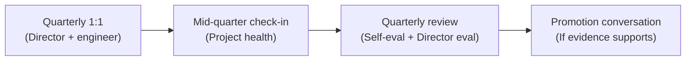

# AI Engineering Director Playbook
## Chapter 20

# Performance Management and Career Frames

> *"AI roles need a career ladder that's specific to AI. Without one, your engineers can't grow and your team can't scale."*

---

## 1. Epigraph

AI roles need a career ladder that's specific to AI. Without one, your engineers can't grow and your team can't scale.

---

## 2. Problem

Your best ML engineer has been at the company for 18 months. She's clearly operating at the next level — running cross-team projects, mentoring juniors, shipping features end-to-end — but her title is still "ML Engineer II." The promotion cycle is in 3 months. You don't have a defined AI career ladder. You're going to either invent one in 3 months (which feels arbitrary) or pass on promoting her (which loses her to the next opportunity). Both are bad outcomes.

This chapter is the operating manual for AI performance management: the discipline of evaluating AI engineers against a specific career ladder, growing them through stretch assignments, and retaining them via the growth dimension of the retention triangle (Ch 19). The Director's job is to design a system where AI engineers can grow without leaving.

**Decision in one sentence:** Define an AI-specific career ladder with 4 levels (IC1 Junior, IC2 Mid, IC3 Senior, IC4 Staff), each with explicit technical + leadership expectations; run performance reviews against the ladder quarterly; promote based on evidence, not tenure.

---

## 3. Why AI Engineering Directors Fail Here

Five named failure modes of AI performance management at the Director level.

- **The Generic-Software-Engineer Ladder.** The Director applies the standard software-engineer ladder to AI engineers. The ladder doesn't capture AI-specific skills (eval design, lifecycle, cost engineering). AI engineers can't articulate what "Senior" means. Promotions feel arbitrary.
- **The Manager-Track-Only Trap.** The Director offers AI engineers a manager track (people-management) as the only growth path. Many AI engineers don't want to manage. They leave. The Director has filtered out top IC talent.
- **The Tenure-Based Promotion.** The Director promotes based on tenure ("she's been here 18 months, time to promote"). The promotion criteria are not linked to evidence. Junior engineers see this and disengage. Senior engineers feel undervalued when a tenure-promoted peer is at their level.
- **The No-Feedback-Year.** The Director runs formal reviews once a year with no feedback in between. By the time the review happens, problems have compounded. The Director has waited too long to course-correct.
- **The Promised-Promotion-Never-Delivered.** The Director tells a high-performer "you're getting promoted next cycle" without specifying what would trigger it. The cycle comes. The promotion doesn't materialize (because no criteria). The high-performer feels deceived. They leave.

---

## 4. Mental Models

Four mental models that compress AI performance management into something you can defend.

**Mental model 1: The IC Ladder.** AI roles need 4 IC levels + a manager track.

```
IC1 (Junior AI Engineer):
  - Owns small AI features under mentorship
  - Ships prompt refreshes + eval updates
  - Reads the AI chapters (Ch 1-9)
  - Year 0-2

IC2 (AI Engineer):
  - Owns AI features end-to-end
  - Designs evals + drives eval-driven iteration
  - Mentors IC1s
  - Year 2-4

IC3 (Senior AI Engineer):
  - Owns AI feature portfolio
  - Designs lifecycle + cost + security for features
  - Cross-team collaboration (embedded in product team or hub)
  - Year 4-7

IC4 (Staff AI Engineer):
  - Owns AI platform capability
  - Sets cross-team standards
  - Influences AI strategy
  - Year 7+

Manager Track (separate from IC):
  - AI Engineering Manager (5-10 reports)
  - Director of AI (10-50 reports)
  - VP of AI (50+ reports)
```

**Mental model 2: The Evidence-Based Promotion.** Promotion requires evidence, not tenure.

```
Evidence per level (example for IC2 → IC3):

Technical evidence:
  - Shipped 3-5 AI features end-to-end (with measurable business impact)
  - Designed + maintained eval system for at least 1 feature
  - Reduced inference cost by X% on at least 1 feature
  - Identified + fixed a production AI incident

Leadership evidence:
  - Mentored 1-2 IC1s through their first 90 days
  - Led a cross-team project (eval standardization, security review)
  - Contributed to 1 written chapter / runbook / framework

Compensation + scope:
  - Above-market base comp
  - Increased scope (owning 3+ features vs. 1-2)
```

**Mental model 3: The Quarterly Feedback Loop.** Reviews aren't annual surprises.



A team that does 1:1s every 2 weeks + a quarterly review has a feedback loop that catches problems early and surfaces promotion readiness continuously.

**Mental model 4: The Compensation Curve.** Compensation should follow a defined curve tied to level, not to negotiation.

```
IC1:    $150K-$200K base + 0-10% bonus + 0.0-0.05% equity
IC2:    $200K-$280K base + 10-15% bonus + 0.05-0.10% equity
IC3:    $280K-$380K base + 15-25% bonus + 0.10-0.25% equity
IC4:    $380K-$500K base + 25-40% bonus + 0.25-0.50% equity
Manager:$320K-$450K base + 20-30% bonus + 0.20-0.40% equity
Director:$400K-$600K base + 30-50% bonus + 0.30-0.80% equity
```

A team with a defined comp curve can answer "what's my next comp?" without negotiation. A team without one is in constant comp conversations.

---

## 5. Frameworks

Three frameworks for the conversations you will have.

### Framework 1: The AI-Specific Career Ladder

For each IC level, define expectations:

```
IC1 (Junior AI Engineer):
  Technical:    Reads Ch 1-9, ships prompt refreshes + eval updates with mentorship
  Communication: Asks good questions, documents work in PRs
  Leadership:   None required
  Promotion:    18-24 months + evidence

IC2 (AI Engineer):
  Technical:    Ships AI features end-to-end; designs evals; debugs production
  Communication: Writes runbooks, presents at chapter meetings
  Leadership:   Mentors IC1s
  Promotion:    2-3 years + evidence

IC3 (Senior AI Engineer):
  Technical:    Owns feature portfolio; lifecycle + cost + security
  Communication: Writes RFCs; presents to product VPs
  Leadership:   Leads cross-team projects; influences platform roadmap
  Promotion:    3-4 years + evidence

IC4 (Staff AI Engineer):
  Technical:    Owns platform capability; sets cross-team standards
  Communication: Writes strategy memos; presents to exec team
  Leadership:   Influences AI strategy; mentors IC3s
  Promotion:    N/A (terminal level for IC track)
```

### Framework 2: The Quarterly Review Template

Every engineer submits a quarterly self-eval. The Director writes the Director-eval. Both discuss in the quarterly 1:1.

```
# Quarterly Review — [Engineer] — [Quarter]

## Self-Eval (5 sections, 1-2 paragraphs each)
1. What I shipped this quarter (with metrics)
2. What I learned this quarter
3. Where I struggled + how I got unblocked
4. What I want to focus on next quarter
5. Promotion-readiness self-assessment (per the ladder)

## Director-Eval (5 sections, 1-2 paragraphs each)
1. Strengths demonstrated this quarter
2. Growth areas for next quarter
3. Promotion-readiness assessment (per the ladder)
4. Comp + scope adjustments (if any)
5. Stretch assignment for next quarter

## Action Items
- ___ (engineer)
- ___ (Director)
```

### Framework 3: The Promotion Conversation

When an engineer is promotion-ready, the conversation is structured:

```
Director says:
  "Based on this quarter, you've demonstrated [evidence]. That meets the
   [next level] expectations on [specific dimensions]. I'd like to
   promote you to [next level] effective [date]."

Engineer responds:
  - Accept (most common)
  - Negotiate scope/title
  - Decline (rare)

After:
  - Comp adjustment (within curve)
  - Title change
  - Scope adjustment
  - New 1:1 cadence (if level warrants)
```

---

## 6. Drill

You are the Director of AI at **acme-corp**. You have 8 AI engineers. You're running quarterly reviews this week. 3 engineers are promotion-ready (ML-1, ML-4, Eval-1). 1 engineer (ML-3) is struggling.

You have **90 minutes**. Produce a **performance + promotion memo** (`portfolio/chapter-20-perf-promo.md`) using Framework 1 (Career Ladder) + Framework 2 (Quarterly Review Template) + Framework 3 (Promotion Conversation). Specify:

- The 3 promotion decisions (level, comp, scope).
- The 1 struggling-engineer intervention plan.
- The quarterly review template (use one engineer's review as an example).
- The comp curve for your team.
- The 1 system change you'll make for next quarter.

**Deliverable:** `portfolio/chapter-20-perf-promo.md` — under 900 words.

---

## 7. Worked Example

**Promotion decisions:**

```
ML-1 (Senior ML Engineer):
  Current: IC3 (Senior). 
  Evidence: Shipped 5 AI features in 18 months (2 with measurable revenue impact).
            Designed eval system for top 3 features. Mentored 2 IC1s.
  Decision: PROMOTE to IC4 (Staff). 
            Effective: next pay period.
            Comp: $380K → $450K (within IC4 curve).
            Scope: Own platform capability (Model Gateway) + cross-team standards.

ML-4 (ML Engineer):
  Current: IC2 (Mid).
  Evidence: Shipped 3 AI features in 24 months. Designed 2 eval systems.
            Reduced inference cost by 35% on Support Assistant.
            Led cross-team eval standardization project.
  Decision: PROMOTE to IC3 (Senior).
            Comp: $260K → $320K (within IC3 curve).
            Scope: Own feature portfolio (3 features).

Eval-1 (Eval Engineer):
  Current: IC2 (Mid).
  Evidence: Refreshed eval sets for 5 features. Shipped first online eval
            system. Reduced time-to-detect-regression from 23 days to 4 days.
  Decision: PROMOTE to IC3 (Senior).
            Comp: $250K → $310K.
            Scope: Own eval system across all features + lead cross-team eval guild.
```

**Struggling engineer (ML-3):**

```
Issue:        Below expectations for last 2 quarters.
Diagnosis:    Skill gap in lifecycle discipline; pattern of "ship and forget."
Intervention: 30-day plan:
              - Pair with ML-1 (mentor) on lifecycle for one feature
              - Re-do quarterly review with explicit "what good looks like"
              - Re-evaluate at 90 days; if no improvement, PIP.
```

**Quarterly review template (example for ML-2):**

```
Self-Eval (ML-2):
  Shipped: Refreshed prompts for Sales Email Drafting (5% reply-rate lift).
            Designed eval harness for new feature.
  Learned: Lifecycle discipline (the hard way).
  Struggled: Cost-engineering work; needed help from senior.
  Next Q:   Own inference-cost reduction project (35% target).
  Promotion-readiness: Not ready for IC3 (need 1-2 more quarters of scope).

Director-Eval (ML-2):
  Strengths: Strong prompt design + eval instinct.
  Growth:    Cost engineering + cross-team collaboration.
  Promotion: Not yet. Path to IC3 in 1-2 quarters.
  Comp:      No change (within IC2 curve).
  Stretch:   Lead cost reduction project.
```

**Comp curve (acme-corp, hypothetical):**

```
IC1:    $160-$200K base, 0.02-0.05% equity
IC2:    $220-$280K base, 10-15% bonus, 0.05-0.10% equity
IC3:    $300-$380K base, 15-25% bonus, 0.10-0.20% equity
IC4:    $400-$500K base, 25-40% bonus, 0.20-0.40% equity
```

**The 1 system change:** Add bi-weekly skip-level 1:1s with senior engineers (ML-1, ML-4) to surface concerns before quarterly reviews.

---

## 8. Failure Mode Postmortem

A Director of AI at a 1,800-person fintech promoted 4 ML engineers from IC2 to IC3 in the same cycle, all at the same time. The Director had inherited a team where no one had been promoted in 24 months and the team was at risk of mass attrition. The promotion was a "catch-up" — overdue by the Director's judgment.

Within 6 months, 2 of the 4 promoted engineers had quit. The Director's skip-level 1:1s surfaced that the other 2 promoted engineers felt "diluted" — their title no longer signaled "top tier." The Director had rewarded tenure and rescued retention, but had broken the title's signal value.

What they missed: the tenure-based promotion trap. The Director had not linked promotions to evidence at the level. The team interpreted the promotion as "you've been here long enough" rather than "you've demonstrated senior-level work." The signal value of "Senior" was destroyed.

The lesson: promotion signal value > promotion timing. A team that promotes on tenure teaches the team that tenure matters. A team that promotes on evidence teaches the team that evidence matters.

---

## 9. Self-Assessment Rubric

| # | Dimension | 1 (Novice) | 3 (Competent) | 5 (Expert) |
|---|---|---|---|---|
| 1 | AI-specific ladder | Uses generic SWE ladder | Has AI ladder with 3 levels | 4 IC + Manager levels with explicit expectations per level |
| 2 | Evidence-based promotion | Tenure-based | Some evidence criteria | All promotions linked to documented evidence |
| 3 | Quarterly review cadence | Annual reviews | Quarterly reviews | Quarterly reviews + bi-weekly 1:1s + skip-levels |
| 4 | Comp curve discipline | Comp by negotiation | Has range per level | Defined curve tied to level; no negotiation within curve |
| 5 | Promotion signal value | Many titles, no signal | Titles consistent with work | Signal value preserved; promotion = meaningful step |

**Disqualifier:** any 1 on dimension 2 or 5. Tenure-based promotions or destroying title signal value is the path to the Promised-Promotion-Never-Delivered or the Tenure-Based Promotion trap.

**Total:** ___ / 25. **Pass threshold:** 18/25, no dimension below 3.

---

## 10. Portfolio Artifact Note

Save your filled-in drill as `portfolio/chapter-20-perf-promo.md` — interview evidence for "How do you manage performance and grow AI engineers?" (see Portfolio Map in Chapter 27).

---

## 11. Interview Questions

1. **Walk me through your AI career ladder.**
2. **A senior engineer is ready for promotion but you don't have budget. What do you do?**
3. **An engineer is consistently below expectations. Walk me through your intervention.**
4. **How do you handle comp conversations for AI engineers?**
5. **A high-performer is about to leave. Walk me through your retention conversation.**