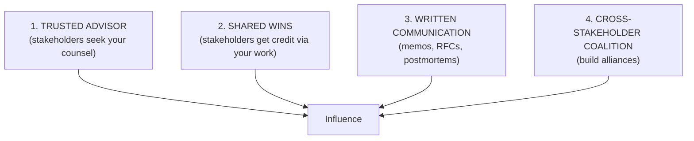
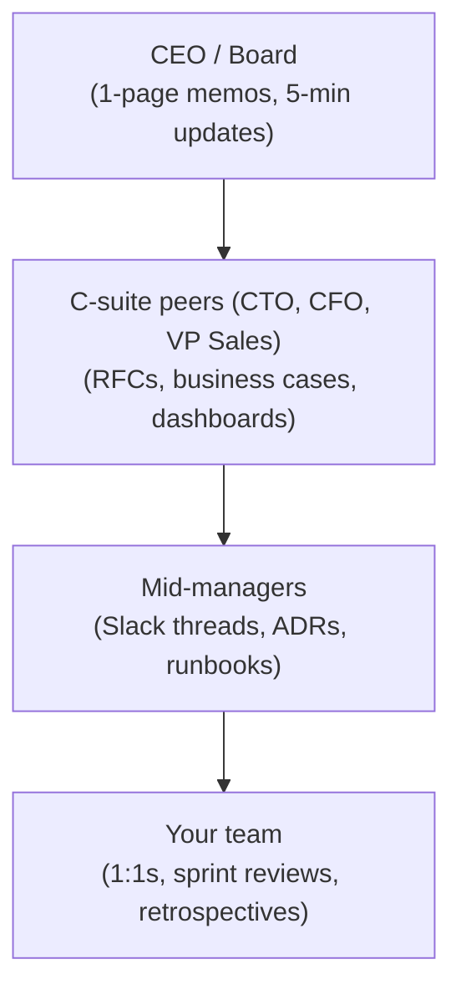

# AI Engineering Director Playbook
## Chapter 21

# Influencing Without Authority and Executive Communication

> *"Authority gets you a seat. Influence gets you a decision."*

---

## 1. Epigraph

Authority gets you a seat. Influence gets you a decision.

---

## 2. Problem

You're the Director of AI. You have 8 engineers. The CEO wants to ship a flagship AI feature in 90 days. The CFO wants to cut AI budget by 30%. The VP of Sales wants the AI team embedded in their team. The CTO wants the AI team to focus on the platform. Three of these stakeholders are pulling in different directions. You have 8 engineers, 4 stakeholders with competing priorities, and no direct authority over any of them.

This chapter is the operating manual for AI influence and executive communication: the discipline of getting decisions made, getting resources allocated, and getting alignment across stakeholders who don't report to you. The Director's job is not to have authority; it's to have *influence*.

**Decision in one sentence:** Build influence through 4 channels (Trusted Advisor, Shared Wins, Written Communication, Cross-Stakeholder Coalition) — and protect your team's focus by saying "no" to the requests that don't serve the strategy.

---

## 3. Why AI Engineering Directors Fail Here

Five named failure modes of influence at the Director level.

- **The Authority Trap.** The Director believes that authority comes from the title. They write memos that get ignored. They expect stakeholders to align because they're "the Director." Stakeholders have their own priorities. The Director has misunderstood how influence works.
- **The Yes-To-Everything Director.** The Director says "yes" to every stakeholder request. The team is overcommitted. 12 stakeholders, 12 features in flight, 8 engineers. Nothing ships well. The Director has confused responsiveness with effectiveness.
- **The Silent Director.** The Director works quietly, ships features, doesn't communicate. The CEO assumes nothing is happening. The CFO assumes the budget is wasted. The Director is surprised when the budget is cut. The Director has not been visible.
- **The Memo-Without-Audience Director.** The Director writes 30-page strategy memos and emails them to the CEO. The CEO doesn't read them. The Director is frustrated. The Director has written for themselves, not for the audience.
- **The Stakeholder-vs-Stakeholder Battle.** The Director picks a side between VP of Sales and CTO. They become "Sales's Director" or "CTO's Director." They lose the other stakeholder permanently. The Director has chosen sides instead of building coalition.

---

## 4. Mental Models

Four mental models that compress AI influence into something you can defend.

**Mental model 1: The Influence Channels.** Influence comes from 4 channels.



A Director who has 1 channel is fragile. A Director who has 3+ is durable.

**Mental model 2: The Audience Pyramid.** Different stakeholders consume different content.



A Director who writes 1 format for all 4 audiences is missing 3 of them.

**Mental model 3: The Trust Curve.** Trust is built slowly and lost quickly.

```
Trust = Consistency over time + Honesty under pressure + Competence delivered

- Consistency over time: do what you say, every time.
- Honesty under pressure: tell the truth when it's uncomfortable.
- Competence delivered: ship what you promise.

Trust lost:
- One broken promise = -20% trust.
- One dishonest update = -50% trust.
- A pattern of either = stakeholder moves to "won't work with you again."
```

**Mental model 4: The No-Decision Discipline.** Saying "no" is how Directors protect their team's focus.

```
Saying yes to:
  - 1 stakeholder request = +1 relationship, -X% team focus

Saying no to:
  - 1 stakeholder request = -1 relationship temporarily, +X% team focus preserved

The discipline: protect team focus at the cost of stakeholder relationship.
The cost: stakeholder relationship recovers when you deliver on the things you did say yes to.
```

---

## 5. Frameworks

Three frameworks for the conversations you will have.

### Framework 1: The Stakeholder Map

For every active stakeholder, complete this:

```
Stakeholder: ___
Their goals: ___
Their fears: ___
Their KPIs: ___
Their current relationship to AI: ___
What they want from me: ___
What I want from them: ___
Channel(s) for influence: ___
Last meaningful interaction: ___
Next planned interaction: ___
```

A stakeholder you haven't mapped is a stakeholder you don't have influence with.

### Framework 2: The Executive Communication Cadence

Different stakeholders, different cadences:

```
CEO / Board:
  - 1-page memo monthly (strategic state + decisions needed)
  - 5-min standing update at exec meeting (every 2 weeks)
  - 1-hour 1:1 quarterly

C-suite peers (CTO, CFO, VP Sales):
  - Slack async updates on key decisions
  - RFC review when AI affects their org
  - 30-min 1:1 monthly

Mid-managers (VPs of product teams):
  - Slack threads on shared features
  - ADRs for architectural decisions
  - Sprint demos for AI features in their product

Your team:
  - 1:1s every 2 weeks
  - Sprint review weekly
  - Quarterly retros
  - Annual strategy offsite
```

### Framework 3: The Decision Memo Template

For every significant decision, a 1-page memo:

```
# Decision Memo — [Topic]

## Recommendation (1 sentence)
[Recommendation in 1 sentence.]

## Context (3-5 sentences)
[Why this decision needs to be made now.]

## Options considered (1 paragraph each)
Option A: [Pros, cons, cost, risk]
Option B: [Pros, cons, cost, risk]
Option C: [Pros, cons, cost, risk]

## Recommendation rationale
[Why Option X. Cost-benefit. Risk mitigation.]

## Risks
[What could go wrong. How we'd catch it.]

## Decision needed by [date]
[What we need from the decision-maker.]
```

---

## 6. Drill

You are the Director of AI at **acme-corp**. The CEO wants a flagship AI demo for the next board meeting (60 days out). The CFO wants budget clarity (in 30 days). The CTO wants the AI team to focus on the platform. The VP of Sales wants the AI team embedded in their team. The CTO and VP of Sales have competing requests for your team's time.

You have **90 minutes**. Produce an **executive alignment memo** (`portfolio/chapter-21-exec-alignment.md`) using Framework 1 (Stakeholder Map) + Framework 2 (Executive Communication Cadence) + Framework 3 (Decision Memo Template). Specify:

- Stakeholder map for the 4 stakeholders (CEO, CFO, CTO, VP Sales).
- Communication cadence for the next 60 days.
- The 1 decision memo for the CEO (flagship demo decision).
- The 1 decision memo for the CFO (budget decision).
- The 1 decision memo for the CTO vs VP Sales (team allocation).
- The 1 thing you'll explicitly say "no" to.

**Deliverable:** `portfolio/chapter-21-exec-alignment.md` — under 900 words.

---

## 7. Worked Example

**Stakeholder map:**

```
CEO:
  Goals: Ship flagship AI demo for board. Show AI ROI.
  Fears: Embarrassment at board meeting. Wasted investment.
  KPIs: AI features shipped, AI revenue contribution.
  Channel: 1-page memos + 5-min updates.
  Last interaction: 1-page memo 2 weeks ago.
  Next: 5-min update tomorrow.

CFO:
  Goals: AI cost clarity. Predictable spend.
  Fears: Runaway AI cost.
  KPIs: AI cost as % of revenue.
  Channel: Business cases + dashboards.
  Last: Compiled cost report last week.
  Next: 30-min 1:1 in 2 weeks.

CTO:
  Goals: AI platform adopted. AI reliability.
  Fears: AI features built without platform foundation.
  KPIs: % features on platform.
  Channel: RFCs + sprint reviews.
  Last: RFC review last week.
  Next: Sprint demo Friday.

VP Sales:
  Goals: Sales acceleration. AI features for sales workflow.
  Fears: Slow AI delivery. AI not useful to sales.
  KPIs: Sales velocity, AI adoption in sales flow.
  Channel: Slack + 1:1s.
  Last: 1:1 last week.
  Next: Slack update tomorrow.
```

**Decision memo for CEO (flagship demo):**

```
Recommendation: Ship "Live Sales Email Drafting" as the flagship demo.

Context: Board meeting in 60 days. CEO wants flagship AI demo.
        Currently shipping 14 AI features; need 1 to be demo-worthy.

Options:
  A. Sales Email Drafting (live demo, customer-ready)
     Pros: High business value, working today. 
     Cons: Less impressive visually.
  B. Custom-built demo (custom chatbot for board)
     Pros: Visually impressive. 
     Cons: Built for board only, not real product.
  C. Demo a vendor's flagship product (e.g., new OpenAI feature)
     Pros: Cutting-edge. 
     Cons: Doesn't show OUR capability.

Recommendation rationale: Option A is what real customers use.
Board wants to see ROI, not novelty. Sales Email Drafting has 
measurable impact (5% reply-rate lift, $200K+ pipeline generated).

Risks: Demo might fail live. Mitigation: pre-record backup + 
       have a working version on demo laptop.

Decision needed by: Tomorrow (need 2 weeks prep + 1 week polish + 
                     1 week buffer).
```

**Decision memo for CFO (budget):**

```
Recommendation: Hold AI budget flat at $X/quarter. Reallocate 
                $50K from "AI research" to "AI eval/observability."

Context: CFO wants budget clarity. Run rate is $X/quarter. 
        Eval/observability is underfunded.

Options:
  A. Hold budget, reallocate within.    (recommended)
  B. Increase budget 20%.               (CFO unlikely to approve)
  C. Decrease budget 20%.               (kills roadmap)

Recommendation rationale: Option A. CFO cares about predictability.
Reallocating $50K from low-priority research to high-priority eval
demonstrates fiscal discipline.

Decision needed by: 30 days.
```

**Decision memo for CTO vs VP Sales (team allocation):**

```
Recommendation: Keep AI team primarily in hub-and-spoke model.
                Add 1 dedicated embedded engineer to VP Sales's 
                team for 90 days.

Context: CTO wants platform focus. VP Sales wants embedded engineers.
        Competing requests.

Options:
  A. Status quo (hub-and-spoke, no dedicated embedded).
  B. Move 2 engineers embedded in VP Sales's team.
     (CTO will block; platform work stalls.)
  C. Hybrid: 1 embedded for 90 days + maintain hub-and-spoke.
     (recommended)

Recommendation rationale: Option C is a 90-day experiment. If 
VP Sales's metrics improve meaningfully, we can re-discuss.
If not, we return to hub-and-spoke.

Decision needed by: This week.
```

**The 1 thing I'll say "no" to:** VP Sales's request to take ownership of the eval system. Eval system stays platform-owned. Director's job: protect the eval standard from being product-owned.

---

## 8. Failure Mode Postmortem

A Director of AI at a 1,400-person B2B SaaS company said "yes" to every stakeholder request. 6 product VPs each wanted AI features for their product. The Director committed to 12 features. With 6 AI engineers, that's 2 engineers per feature. None of the features shipped well. Quality was below bar across the board. Each VP was disappointed.

The CEO asked: "Why is AI so underwhelming?" The Director had no answer that didn't sound like blame. The Director was asked to resign within 9 months.

What they missed: Framework 1 (Stakeholder Map) and the No-Decision Discipline. The Director had not mapped which stakeholders were most important. The Director had not said "no" to anything. The team was overcommitted.

The lesson: a Director's job is to protect the team's focus. Saying "yes" to everything is a slow-motion layoff.

---

## 9. Self-Assessment Rubric

| # | Dimension | 1 (Novice) | 3 (Competent) | 5 (Expert) |
|---|---|---|---|---|
| 1 | Influence channels | Has 1 channel | Has 2-3 channels | Has all 4 (Trusted Advisor, Shared Wins, Written, Coalition) |
| 2 | Audience-tailored communication | One format for all | Formats vary by audience | 4 distinct formats for 4 audiences |
| 3 | Trust curve discipline | Breaks promises | Tells truth under pressure | Consistency + honesty + competence, all 3 |
| 4 | No-decision discipline | Says yes to everything | Says no occasionally | Says no strategically, protects team focus |
| 5 | Cross-stakeholder coalition | Picks a side | Maintains neutral position | Builds coalition across stakeholders |

**Disqualifier:** any 1 on dimension 4 or 5. Yes-to-everything or picking a side is the path to the Yes-To-Everything Director or the Stakeholder-vs-Stakeholder Battle.

**Total:** ___ / 25. **Pass threshold:** 18/25, no dimension below 3.

---

## 10. Portfolio Artifact Note

Save your filled-in drill as `portfolio/chapter-21-exec-alignment.md` — interview evidence for "How do you influence without authority?" (see Portfolio Map in Chapter 27).

---

## 11. Interview Questions

1. **Walk me through how you influence without authority.**
2. **The CEO and CTO disagree on AI priorities. How do you navigate?**
3. **A stakeholder asks for a feature you know is wrong. What do you say?**
4. **Walk me through a decision memo you've written.**
5. **Your team is overcommitted. How do you say "no"?**