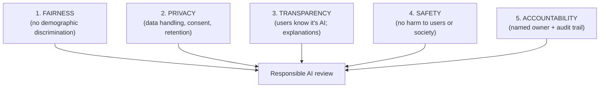
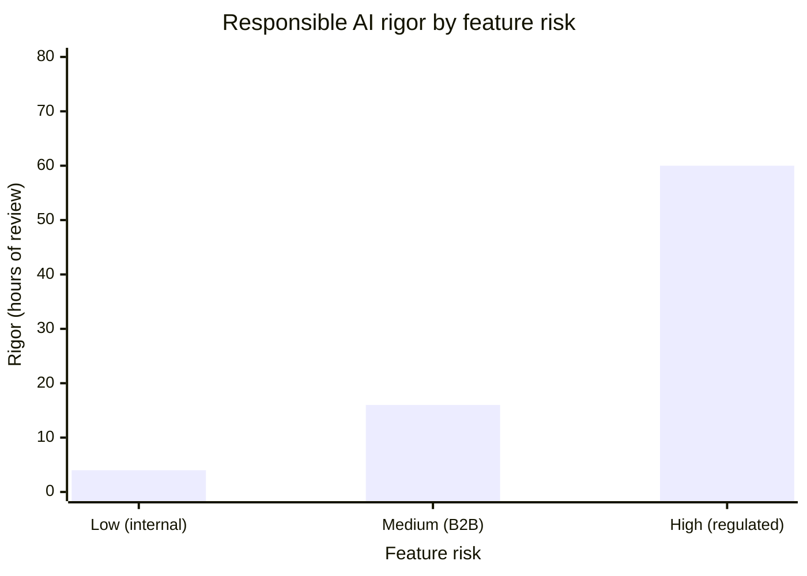
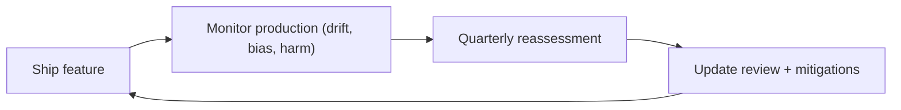

# AI Engineering Director Playbook
## Chapter 22

# Responsible AI Frameworks and Practice

> *"Responsible AI is not a feature. It's the foundation that every feature is built on."*

---

## 1. Epigraph

Responsible AI is not a feature. It's the foundation that every feature is built on.

---

## 2. Problem

Your team has shipped 14 AI features. None of them has a documented responsible-AI review. A journalist has just asked your CEO: "How do you ensure your AI features don't discriminate, leak data, or hallucinate in ways that harm customers?" The CEO has asked you to answer the journalist in 24 hours. You have no framework, no documentation, no review process. You're going to look unprepared.

This chapter is the operating manual for Responsible AI: the discipline of building AI features that are *fair, accountable, transparent, and safe* by design — not as an afterthought. The Director's job is to embed Responsible AI into the lifecycle (Ch 10), the platform (Ch 11), and the team norms (Ch 18, 20) so that every feature ships with responsible-AI considerations.

**Decision in one sentence:** Adopt one of 3 Responsible AI frameworks (NIST AI RMF, OECD Principles, internal bespoke) — implement the 5-dimension review (Fairness, Privacy, Transparency, Safety, Accountability) as a Deploy gate; name a Responsible AI owner per feature; document the review for every shipped feature.

---

## 3. Why AI Engineering Directors Fail Here

Five named failure modes of Responsible AI at the Director level.

- **The "AI Ethics" Theater.** The Director writes a 5-page "AI Ethics Principles" document and posts it on the company website. No team reads it. No feature ships differently because of it. The Director has produced decoration, not discipline.
- **The Post-Launch Review.** The Director commits to "Responsible AI reviews" but schedules them after the feature ships. By then, the model is trained, the data is committed, the customer-facing behavior is locked. The review cannot change anything.
- **The Bias-Testing-Only Trap.** The Director runs bias tests on the model output but doesn't change the underlying data, training process, or system prompt. Bias tests pass; the feature still discriminates in production. The Director has tested the symptom, not the cause.
- **The No-Owner Vacuum.** The Director names "responsible AI" as a team value but no specific person owns it. When a Responsible AI question arises, no one is accountable. The Director has diffused responsibility.
- **The Compliance-Only Reduction.** The Director treats Responsible AI as "what the regulator requires" rather than "what makes our AI features trustworthy." The result: minimum compliance, no proactive practices, surprised customers when something goes wrong.

---

## 4. Mental Models

Four mental models that compress Responsible AI into something you can defend.

**Mental model 1: The 5-Dimension Review.** Every AI feature is reviewed on 5 dimensions.



A feature that passes 4 of 5 dimensions and fails 1 is a feature that needs work. The Director's gate: ALL 5 must pass before deploy.

**Mental model 2: The Lifecycle Embedding.** Responsible AI is embedded into the lifecycle (Ch 10).

```
Discover stage:    Identify responsible-AI risks (per dimension).
Build stage:       Apply mitigations in design (e.g., debiasing, consent).
Eval stage:        Add responsible-AI evals (bias tests, safety tests, transparency).
Deploy stage:      Responsible-AI review sign-off (5 dimensions).
Operate stage:     Monitor for responsible-AI regressions in production.
Decommission:      Archive audit trail + delete data per retention policy.
```

**Mental model 3: The Risk-Tier Matrix.** Different features need different levels of responsible-AI rigor.



A low-risk internal tool needs ~4 hours of review. A medium-risk B2B feature needs ~16 hours. A high-risk regulated feature (healthcare, finance, children's data) needs ~60+ hours.

**Mental model 4: The Continuous-Reassessment Loop.** Responsible AI is not a one-time review.



A feature that passes review at deploy but is never reassessed becomes a liability. Production drift can introduce bias, privacy leaks, or safety issues that weren't present at launch.

---

## 5. Frameworks

Three frameworks for the conversations you will have.

### Framework 1: The Responsible AI Review Template

Every AI feature passes through this review before Deploy.

```
# Responsible AI Review — [Feature Name]

### Dimension 1. Fairness
- Demographic groups affected: ___
- Bias testing results: ___
- Mitigation if needed: ___

### Dimension 2. Privacy
- Data used: ___
- PII tier (per Ch 13): ___
- Consent mechanism: ___
- Retention policy: ___

### Dimension 3. Transparency
- Users know it's AI? (Y/N) ___
- Explanation mechanism: ___
- Output attribution: ___

### Dimension 4. Safety
- Worst-case harm scenario: ___
- Mitigation (filters, refusal categories): ___
- Incident response runbook: ___

### Dimension 5. Accountability
- Named owner: ___
- Audit trail (data, prompts, responses): ___
- Reversibility class (per Ch 1): ___

## Sign-off
- Director: ___ Date: ___
- Legal (if Tier 3+ data): ___ Date: ___
- Compliance (if regulated): ___ Date: ___
```

### Framework 2: The Responsible AI Owner Role

Every AI feature has a single named Responsible AI owner. The owner's responsibilities:

```
1. Complete the Responsible AI Review before Deploy.
2. Maintain the responsible-AI evals (bias, safety, transparency).
3. Respond to responsible-AI incidents (per Ch 24).
4. Quarterly reassessment (per mental model 4).
5. Document the audit trail.

The owner is named in the lifecycle gate artifacts (Ch 10).
```

### Framework 3: The External Disclosure Decision

Some features warrant external disclosure (e.g., model card, customer-facing transparency):

```
Disclose publicly when:
  - Feature affects customers' rights (credit, employment, healthcare)
  - Feature has been the subject of customer concern
  - Regulator requires (per Ch 23)

Disclose internally when:
  - Feature is internal tooling
  - No customer rights are affected
  - No regulator mandate

Disclose to specific users when:
  - User is interacting with AI (transparency principle)
  - User requests explanation
```

---

## 6. Drill

You are the Director of AI at **acme-corp**. You have 14 AI features in production. None has a documented Responsible AI review. A journalist has asked your CEO: "How do you ensure your AI features don't discriminate, leak data, or hallucinate in ways that harm customers?"

You have **90 minutes**. Produce a **Responsible AI response plan** (`portfolio/chapter-22-rai-plan.md`) using Framework 1 (Review Template) + Framework 2 (Owner Role) + Framework 3 (External Disclosure Decision). Specify:

- The 14 features' risk-tier classification (Low / Medium / High).
- The 3 features that need the most urgent Responsible AI review.
- The named Responsible AI owner for each feature.
- The 1-page external statement you'd publish in response to the journalist.
- The 1 process change to prevent this gap in the future.

**Deliverable:** `portfolio/chapter-22-rai-plan.md` — under 900 words.

---

## 7. Worked Example

**Risk-tier classification (14 features):**

| Feature | Risk Tier | Reasoning |
|---|---|---|
| Support Assistant | Medium | Customer-facing, PII access |
| Code Suggestion | Low | Internal, no customer rights |
| Email Draft | Medium | Customer-facing, sales content |
| Doc Summarizer | Medium | Customer-facing, internal docs |
| Lead Scoring | High | Affects customer outcomes (win/loss) |
| AI Chatbot (general) | Medium | Customer-facing |
| Image Tagging | Low | Internal catalog |
| Translation | Low | Customer-facing but low-stakes |
| Sentiment Analysis | Medium | Affects CS prioritization |
| Content Generation | Medium | Customer-facing, brand voice |
| Search / Discovery | Medium | Customer-facing |
| Auto-summarization (calls) | High | Sales calls contain sensitive info |
| Expense Categorization | Low | Internal finance |
| Vendor Contract Analysis | High | Legal-sensitive |

**3 features needing urgent Responsible AI review:**
1. **Lead Scoring** — affects which customers get sales attention. Bias could create disparate impact.
2. **Auto-summarization (calls)** — sensitive sales call content. Privacy + retention concerns.
3. **Vendor Contract Analysis** — legal-sensitive content. Tier 3/4 PII possible.

**Named Responsible AI owners (1 per feature):**

```
Low risk:        ML engineer on the team (1 hour review)
Medium risk:     Senior ML engineer + Legal sign-off (4 hours review)
High risk:       Senior ML engineer + Legal + Director + Compliance
                 (16-60 hours review + ongoing monitoring)
```

**External statement (1-page):**

```
"At acme-corp, we hold ourselves to the following responsible-AI
standards:

1. We disclose when users are interacting with AI.
2. We test for demographic bias in customer-affecting features.
3. We document data handling + retention per privacy regulations.
4. We have a named owner + audit trail for every AI feature.
5. We have an incident response process for AI failures.

We publish our AI feature inventory, our responsible-AI review
process, and our incident response runbook at [URL].

For questions: ai-responsible@acme-corp.com
Director of AI: [Name]"
```

**The 1 process change:** Make Responsible AI Review (Framework 1) a Deploy gate. A feature cannot ship without sign-off on all 5 dimensions. This would have prevented the gap that the journalist surfaced.

---

## 8. Failure Mode Postmortem

A Director of AI at a 2,000-person fintech shipped an AI credit-decision feature to 800K customers. No Responsible AI review. The model was trained on historical lending data — which encoded historical discrimination. The model perpetuated the discrimination. A regulator opened an investigation 14 months post-launch. The feature was shut down. The Director was asked to resign.

What they missed: every Framework 1 dimension. The Fairness review would have surfaced the historical-data bias. The Accountability review would have named an owner who would have caught it. The Lifecycle Embedding (mental model 2) would have made the review a Deploy gate.

The Director had treated Responsible AI as "ethics theater" (a published principles doc) rather than as a discipline. The principles doc had been on the website for 2 years; no team had read it; no feature had been reviewed against it.

The lesson: Responsible AI is a discipline, not a document. The discipline is the review at Deploy + the monitoring in Operate + the audit trail for every shipped feature.

---

## 9. Self-Assessment Rubric

| # | Dimension | 1 (Novice) | 3 (Competent) | 5 (Expert) |
|---|---|---|---|---|
| 1 | 5-dimension review coverage | Has 1-2 dimensions | Has 3-4 of 5 | All 5 dimensions + Deploy gate |
| 2 | Lifecycle embedding | "Add ethics review" | Review at Deploy | Embedded in all 6 lifecycle stages |
| 3 | Risk-tier differentiation | Same review for all | Tier 1 vs Tier 3 differentiated | Tiered rigor with named hours + reviewers |
| 4 | Named owners | Diffused responsibility | 1 owner per feature | 1 owner + 1 reviewer + escalation path |
| 5 | Continuous reassessment | One-time review | Annual review | Quarterly reassessment + drift triggers |

**Disqualifier:** any 1 on dimension 1 or 4. Skipping dimensions or diffusing ownership is the path to the No-Owner Vacuum or the Compliance-Only Reduction.

**Total:** ___ / 25. **Pass threshold:** 18/25, no dimension below 3.

---

## 10. Portfolio Artifact Note

Save your filled-in drill as `portfolio/chapter-22-rai-plan.md` — interview evidence for "How do you operationalize Responsible AI?" (see Portfolio Map in Chapter 27).

---

## 11. Interview Questions

1. **Walk me through how you operationalize Responsible AI.**
2. **A journalist asks how you ensure AI fairness. What do you say?**
3. **Your team wants to skip the Responsible AI review to ship faster. What do you do?**
4. **A high-risk feature has passed review at deploy but production data is drifting. What do you do?**
5. **Walk me through the 5-dimension review for a high-risk feature.**