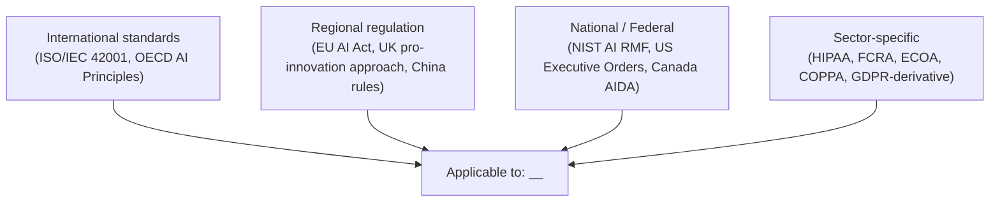
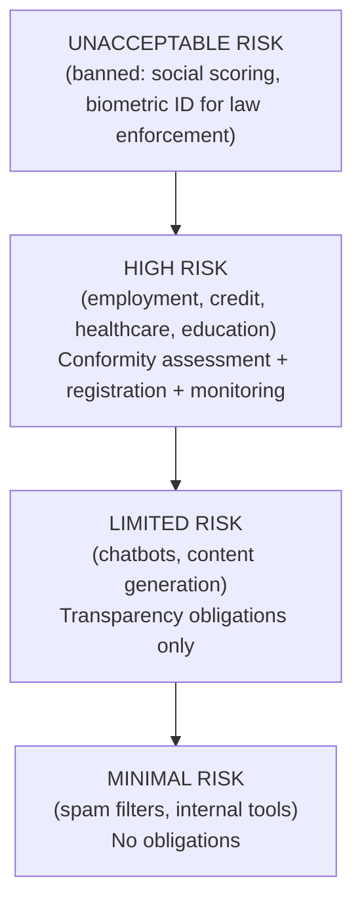

# AI Engineering Director Playbook
## Chapter 23

# The Regulatory Landscape (EU AI Act, NIST, Sector Rules)

> *"Regulation isn't the enemy of AI features. The absence of regulation is."*

---

## 1. Epigraph

Regulation isn't the enemy of AI features. The absence of regulation is.

---

## 2. Problem

Your team is shipping AI features to customers in the EU, US, and UK. The EU AI Act is now in force. NIST has published the AI Risk Management Framework. California has SB-1047. Sector-specific rules (HIPAA, FCRA, ECOA, GDPR-derivative) apply to your regulated industries. A regulator has just asked: "Show me your compliance posture for AI features serving EU customers." You have no documented compliance posture.

This chapter is the operating manual for AI regulatory navigation: the discipline of understanding which regulations apply to which AI features, building compliance into the lifecycle (Ch 10), and treating the regulator as a stakeholder (Ch 21) rather than an adversary.

**Decision in one sentence:** Map each AI feature to its regulatory obligations (data residency, model card, audit trail, human oversight, transparency) before deploy; treat compliance as a Deploy gate, not a legal review that happens after launch.

---

## 3. Why AI Engineering Directors Fail Here

Five named failure modes of AI regulatory navigation at the Director level.

- **The "Legal Will Tell Us" Deferral.** The Director defers all regulatory questions to Legal. Legal is not AI-literate; Legal doesn't know the difference between RAG and fine-tuning. The Director has outsourced a competency they need to own.
- **The After-Launch Compliance Discovery.** The Director ships AI features without checking regulatory obligations. Six months post-launch, a regulator opens an investigation. The Director discovers that the feature requires a model card, a DPIA, and an audit trail — none of which exists.
- **The One-Region Assumption.** The Director designs compliance for US only. EU customers buy the product. GDPR + EU AI Act now apply. The Director rebuilds the compliance posture from scratch.
- **The Risk-Tier Underestimation.** The Director classifies the AI feature as "low risk" under the EU AI Act when it actually qualifies as "limited risk" or "high risk." The Director has saved effort now and faces enforcement later.
- **The Audit-Trail Vacuum.** The Director cannot answer "show me the audit trail for this AI feature's training data, prompts, and responses." The data was logged briefly and then deleted. The Director has no evidence of compliance.

---

## 4. Mental Models

Four mental models that compress AI regulation into something you can defend.

**Mental model 1: The 4-Regulation Stack.** AI regulation comes from 4 sources.



A Director who only tracks one source misses the other three. Most AI features are governed by at least 2 sources simultaneously.

**Mental model 2: The EU AI Act Risk Tiers.** The EU AI Act categorizes AI systems into 4 risk tiers.



High-risk features need a conformity assessment, technical documentation, post-market monitoring, and human oversight. Limited-risk features need transparency (users know it's AI). A feature mis-categorized as Minimal when it's actually High is a regulatory violation.

**Mental model 3: The Compliance Lifecycle Embedding.** Regulatory compliance is embedded into the lifecycle (Ch 10).

```
Discover:  Identify applicable regulations per feature.
Build:     Design for compliance (data residency, transparency, oversight).
Eval:      Test compliance (e.g., transparency disclosure, audit trail).
Deploy:    Compliance sign-off (Legal + Compliance + Director).
Operate:   Monitor for compliance drift.
Decommission: Archive audit trail per retention policy.
```

**Mental model 4: The Regulator as Stakeholder.** The regulator is a stakeholder, not an adversary.

```
Stakeholder: Regulator
Goals: Compliance with applicable regulation
Fears: Non-compliance → fines, investigation, public enforcement
KPIs: Number of compliant features / total AI features
Channel: Formal documentation, audit trail, periodic reporting
Communication: Direct, factual, evidence-based (no marketing claims)
```

A Director who treats the regulator as a stakeholder has a defensible compliance posture. A Director who treats the regulator as an adversary has a crisis waiting to happen.

---

## 5. Frameworks

Three frameworks for the conversations you will have.

### Framework 1: The Per-Feature Regulation Map

For every AI feature, complete this:

```
Feature:                  ___
Applicable regulations:   ___
EU AI Act risk tier:      [Unacceptable / High / Limited / Minimal]
NIST AI RMF function:     [Govern / Map / Measure / Manage]
Sector rules:             ___
Data residency required:  [Y/N, regions]
Model card required:      [Y/N]
Audit trail required:     [Y/N, retention period]
Human oversight required: [Y/N]
Transparency disclosure:  [Y/N, format]
Conformity assessment:    [Y/N, scope]
Sign-off:                 Legal: ___ Compliance: ___ Director: ___
```

### Framework 2: The EU AI Act Compliance Checklist

For features in the EU AI Act scope:

```
High-Risk features (employment, credit, healthcare, education, biometric ID,
                    critical infrastructure):
  [ ] Risk management system documented (Art. 9)
  [ ] Data governance (training data quality, relevance, representativeness) (Art. 10)
  [ ] Technical documentation (Annex IV) (Art. 11)
  [ ] Record-keeping (logs, audit trail) (Art. 12)
  [ ] Transparency + instructions for use (Art. 13)
  [ ] Human oversight (Art. 14)
  [ ] Accuracy, robustness, cybersecurity (Art. 15)
  [ ] Conformity assessment + registration (Art. 43-49)

Limited-Risk features (chatbots, content generation, deepfake):
  [ ] Users informed they're interacting with AI (Art. 50)
  [ ] Synthetic content labeled as AI-generated (Art. 50)

General-Purpose AI Models (foundation models):
  [ ] Technical documentation + provider info (Art. 53)
  [ ] Systemic risk evaluation if >10^25 FLOPs training (Art. 55)
```

### Framework 3: The Regulator Engagement Plan

A Director's relationship with regulators is built over time:

```
Pre-engagement:
  - Identify applicable regulators per jurisdiction.
  - Build internal compliance documentation.
  - Run a mock audit annually.

Active engagement:
  - Respond to inquiries within required timelines (typically 30 days).
  - Provide factual, evidence-based responses.
  - Document every interaction.

Post-incident:
  - Mandatory notification within 72 hours (per GDPR for personal data).
  - Root cause analysis + remediation.
  - Update compliance posture.
```

---

## 6. Drill

You are the Director of AI at **acme-corp**. You have 14 AI features. A regulator has just asked for your compliance posture for AI features serving EU customers. You have 30 days to respond.

You have **90 minutes**. Produce a **regulatory compliance response** (`portfolio/chapter-23-compliance-response.md`) using Framework 1 (Per-Feature Regulation Map) + Framework 2 (EU AI Act Compliance Checklist). Specify:

- The 14 features' EU AI Act risk tier classification.
- The 3 features that need immediate conformity assessment.
- The compliance gaps per feature.
- The 30-day remediation plan.
- The 1 process change to prevent this gap in the future.

**Deliverable:** `portfolio/chapter-23-compliance-response.md` — under 900 words.

---

## 7. Worked Example

**EU AI Act risk-tier classification (14 features):**

| Feature | Tier | Reasoning |
|---|---|---|
| Support Assistant | Limited | Customer chatbot, transparency disclosure required |
| Code Suggestion | Minimal | Internal tool |
| Email Draft | Limited | Content generation, labeling required |
| Doc Summarizer | Limited | Content generation |
| Lead Scoring | High | Affects sales / customer outcomes (employment-adjacent) |
| AI Chatbot (general) | Limited | Customer chatbot |
| Image Tagging | Minimal | Internal catalog |
| Translation | Minimal | Low-stakes content |
| Sentiment Analysis | Limited | Affects prioritization |
| Content Generation | Limited | Content generation, labeling required |
| Search / Discovery | Minimal | Customer-facing, low-stakes |
| Auto-summarization (calls) | Limited | Sales call content; transparency required |
| Expense Categorization | Minimal | Internal finance |
| Vendor Contract Analysis | Limited | B2B content; legal-sensitive |

**3 features needing immediate conformity assessment:**

1. **Lead Scoring** — High-risk. Requires conformity assessment + technical documentation + human oversight + ongoing monitoring.
2. **Support Assistant** — Limited-risk. Requires transparency disclosure.
3. **Auto-summarization (calls)** — Limited-risk. Sensitive content; requires labeling + audit trail.

**Compliance gaps per feature:**

```
Lead Scoring:
  [ ] No risk management system documented
  [ ] No data governance documentation
  [ ] No technical documentation (Annex IV)
  [ ] No human oversight defined
  [ ] No conformity assessment performed
  [ ] No registration in EU database

Support Assistant:
  [ ] No transparency disclosure in UI
  [ ] No audit trail

Auto-summarization (calls):
  [ ] No consent mechanism for call recording
  [ ] No transparency disclosure
  [ ] No data retention policy
```

**30-day remediation plan:**

```
Week 1: Complete Framework 1 (per-feature regulation map) for all 14 features.
        Identify compliance gaps.

Week 2: Sign-off on risk-tier classifications (Legal + Director + Compliance).
        Begin technical documentation for High-risk features.

Week 3: Build transparency disclosure UI for Limited-risk features.
        Build audit trail for Limited-risk features.

Week 4: Conformity assessment for High-risk features (Lead Scoring).
        Final compliance posture document.
        Respond to regulator.
```

**The 1 process change:** Make Framework 1 (per-feature regulation map) a Deploy gate. A feature cannot ship without compliance map sign-off. This would have prevented 11 of the 14 features from launching without compliance documentation.

---

## 8. Failure Mode Postmortem

A Director of AI at a 2,200-person fintech shipped an AI credit-decision feature to 800K customers in the EU. The feature had no conformity assessment, no technical documentation, no human oversight. The Director had treated Legal as "they'll tell us if there's a problem" and Legal had not flagged it (Legal didn't know about EU AI Act obligations for AI credit decisions).

A regulator opened an investigation 6 months post-launch. The investigation found 14 distinct compliance failures. The Director was asked to resign. The feature was shut down. Total cost: $40M+ in fines, customer refunds, and reputational damage.

What they missed: Framework 1 (per-feature regulation map). The Lead Scoring feature was High-risk under the EU AI Act; the Director had classified it as Minimal. The Director had not built the muscle to identify AI Act obligations.

The lesson: regulation is a discipline, not a deferral. The Director's job is to know which regulations apply to which features, not to wait for Legal to tell them.

---

## 9. Self-Assessment Rubric

| # | Dimension | 1 (Novice) | 3 (Competent) | 5 (Expert) |
|---|---|---|---|---|
| 1 | Regulation map coverage | 1 source | 2 of 4 sources | All 4 sources mapped per feature |
| 2 | EU AI Act risk-tier classification | Skips or guesses | Has classification for top features | Classification for all features + signed off |
| 3 | Compliance lifecycle embedding | Compliance at Deploy only | Compliance at 2-3 stages | Compliance embedded at all 6 stages |
| 4 | Regulator engagement | Avoids regulator | Reactive only | Active engagement + mock audits annually |
| 5 | Audit trail completeness | Partial | Per-feature audit trail | Cross-feature audit trail + retention policy |

**Disqualifier:** any 1 on dimension 2 or 5. Mis-classifying risk tier or lacking audit trail is the path to the After-Launch Compliance Discovery.

**Total:** ___ / 25. **Pass threshold:** 18/25, no dimension below 3.

---

## 10. Portfolio Artifact Note

Save your filled-in drill as `portfolio/chapter-23-compliance-response.md` — interview evidence for "How do you handle AI regulation?" (see Portfolio Map in Chapter 27).

---

## 11. Interview Questions

1. **Walk me through how you'd classify your AI features under the EU AI Act.**
2. **A regulator asks for your compliance posture. What do you show them?**
3. **Your team wants to ship an AI feature to EU customers next week. What do you do?**
4. **A new sector-specific rule is published. How do you adapt?**
5. **Walk me through how you'd run a mock audit.**