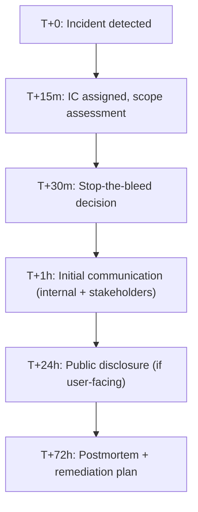
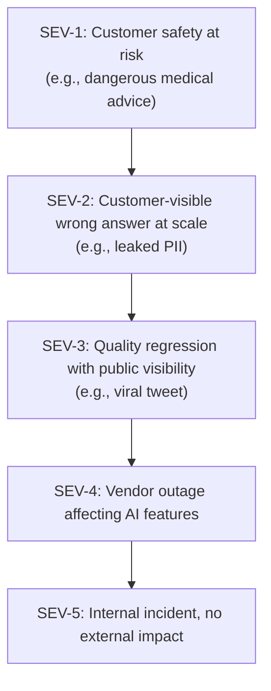

# AI Engineering Director Playbook
## Chapter 24

# Crisis Response for AI Failures

> *"The crisis is not the AI failure. The crisis is the response to the AI failure."*

---

## 1. Epigraph

The crisis is not the AI failure. The crisis is the response to the AI failure.

---

## 2. Problem

At 2:47am, a customer tweets: "Your AI just told me to take a dangerous action." By 3:15am, the tweet has 47K impressions. By 4am, the press is calling. Your CEO is awake. Your legal team is awake. You're awake. You have 30 minutes to decide: do you take the feature offline, communicate publicly, or both?

This chapter is the operating manual for AI crisis response: the discipline of responding to AI failures with speed, transparency, and discipline — before the crisis escalates. The Director's job is not to prevent AI failures (some are inevitable); it's to have a *crisis response system* that catches the failure before it becomes a crisis.

**Decision in one sentence:** Define a 5-level AI incident severity ladder with named IC per level, a 30-minute decision clock, a 24-hour disclosure playbook, and quarterly crisis drills — so that when the AI failure happens, the response is rehearsed, not improvised.

---

## 3. Why AI Engineering Directors Fail Here

Five named failure modes of AI crisis response at the Director level.

- **The Slow-Disclosure Disaster.** The Director waits 48 hours to disclose the AI failure because "we don't know the cause yet." The press learns about it first. The narrative becomes "acme-corp covered up the AI failure." The Director has turned an incident into a scandal.
- **The Denial Reflex.** The Director publicly denies the AI failure because the data is "inconclusive." Customers produce their own evidence. The Director is contradicted by customers on social media. Trust is destroyed.
- **The No-IC Vacuum.** The Director doesn't name an Incident Commander. Multiple people are responding, contradicting each other publicly. The Director has diffused accountability.
- **The Blame-The-Model Response.** The Director publicly blames the model ("our AI made a mistake"). Customers read this as "your AI, your problem." The Director has accepted liability in the worst possible way.
- **The No-Prepared-Statement Trap.** The Director waits to write a public statement until 30 minutes after the crisis begins. The statement is reactive, defensive, and gets torn apart on social media. The Director has lost the narrative.

---

## 4. Mental Models

Four mental models that compress AI crisis response into something you can defend.

**Mental model 1: The Crisis Clock.** AI crises have a clock.



Each milestone has a named owner and a defined output. The clock keeps the response disciplined.

**Mental model 2: The Severity Ladder.** AI crises have 5 severity levels.



SEV-1 and SEV-2 require immediate disclosure. SEV-3 requires investigation before disclosure. SEV-4 and SEV-5 are internal.

**Mental model 3: The Stop-the-Bleed Decision Tree.** The first 30 minutes have 4 options.

```
Option A: KEEP RUNNING + MONITOR
  When: Failure is contained, no customer safety risk, no leak
  Risk: Failure may escalate
  Action: Increase monitoring, prepare rollback

Option B: REDUCE TRAFFIC
  When: Failure is uncontained but not safety-critical
  Risk: Some customers still affected
  Action: Reduce traffic to <10%, investigate

Option C: DISABLE FEATURE
  When: Customer safety, PII leak, or regulator notification
  Risk: Revenue + customer trust impact
  Action: Disable feature, communicate to affected customers

Option D: ROLLBACK
  When: Recent model update caused the regression
  Risk: Some new features lost
  Action: Rollback to last-known-good model
```

**Mental model 4: The Prepared-Statement Library.** Have statements ready before you need them.

```
Library (3 templates, customized per incident):

1. "We're investigating a potential issue with [Feature]. Here's what we know..."
2. "We've identified [issue]. Here's what we're doing..."
3. "We've resolved [issue]. Here's what we learned and what we're changing..."
```

A Director who has these templates drafted can respond within minutes. A Director who has to write from scratch is delayed.

---

## 5. Frameworks

Three frameworks for the conversations you will have.

### Framework 1: The Crisis Response Runbook

Every AI feature has a crisis runbook that names:

```
Feature: ___
IC (Incident Commander): ___
Backup IC: ___
Slack channel: #incident-<feature>
Doc: ___

Stop-the-bleed options:
  - KEEP RUNNING: ___
  - REDUCE TRAFFIC: ___
  - DISABLE: ___
  - ROLLBACK: ___

Communication owners:
  - Internal (CEO, exec team): ___
  - Customer support: ___
  - Customers (public statement): ___
  - Press: ___
  - Regulators: ___

Customer impact assessment:
  - Number of customers affected: ___
  - Severity of impact: ___
  - Reversibility: ___
```

### Framework 2: The First-30-Minutes Checklist

When the IC is assigned, run this checklist:

```
T+0:   IC assigned. Slack channel created. Doc opened.
T+5m:  Initial assessment: what happened, when, scope.
T+10m: Affected user count (estimate). Severity level assigned.
T+15m: Stop-the-bleed decision (A/B/C/D).
T+20m: Internal communication to CEO + exec team.
T+25m: Customer support briefed (FAQ + talking points).
T+30m: Initial public statement (if SEV-1 or SEV-2).
```

### Framework 3: The Quarterly Crisis Drill

A drill fires every quarter. The drill:

```
Step 1 (T-7 days): Pick a scenario from a library of 12.
Step 2 (T-0): Trigger the scenario in a "drill" Slack channel.
Step 3 (T+30m): Team assembles, IC assigned, scope assessed.
Step 4 (T+60m): Stop-the-bleed decision made.
Step 5 (T+24h): Mock public statement written.
Step 6 (T+1 week): Debrief: what worked, what didn't, what to fix.

Drill scenarios (sample):
  - AI chatbot gives dangerous medical advice
  - PII leaked in cross-tenant response
  - AI feature hallucinates and gets viral on Twitter
  - Vendor outage + AI quality degradation
  - Drift detected, eval missed it
```

---

## 6. Drill

You are the Director of AI at **acme-corp**. At 2:47am on a Sunday, you receive a Slack notification: "Support Assistant just told a customer to take a dangerous medication interaction." The customer posted the response on Twitter. It has 8K impressions in 20 minutes.

You have **90 minutes** (simulating the first 24 hours compressed). Produce a **crisis response plan** (`portfolio/chapter-24-crisis-response.md`) using Framework 1 (Runbook) + Framework 2 (First-30-Minutes Checklist) + Framework 3 (Crisis Drill). Specify:

- The IC, backup IC, and comms owners.
- The stop-the-bleed decision (A/B/C/D) with rationale.
- The first-30-minutes checklist execution.
- The 24-hour public statement (drafted).
- The 1 process change to prevent this in the future.

**Deliverable:** `portfolio/chapter-24-crisis-response.md` — under 900 words.

---

## 7. Worked Example

**Crisis response plan:**

```
IC:             Director of AI (you)
Backup IC:      Senior ML Engineer on-call
Slack:          #incident-support-assistant
Doc:            [incident doc URL]

Stop-the-bleed decision: Option C (DISABLE feature)

Rationale: Customer safety risk + PII exposure. SEV-1 (Tier 1).
           Even low probability of recurrence is unacceptable.
```

**First-30-minutes checklist execution:**

```
T+0:   (3:07am) IC assigned (Director). Slack channel created.
T+5m:  (3:12am) Initial assessment: Support Assistant response included
       medication interaction warning. Customer has chronic condition.
       Severity: SEV-1.
T+10m: (3:17am) Affected user count: 1 confirmed. ~50K users daily;
       could be widespread.
T+15m: (3:22am) DECISION: DISABLE feature. All support traffic routes
       to human agents.
T+20m: (3:27am) CEO + exec team notified. Legal on standby.
T+25m: (3:32am) Customer support briefed: "AI disabled; route to human.
       FAQ updated."
T+30m: (3:37am) Public statement drafted. Posted on Twitter, status page.
```

**24-hour public statement:**

```
"At 2:47am PT on [date], our customer support AI assistant provided
advice to a customer that included a medication interaction we
should have caught. We've taken the AI assistant offline and routed
all support to our human team while we investigate.

We take this seriously. We'll publish a full postmortem within 72 hours
with what we found, what we're changing, and how we'll prevent this
in the future.

If you have an urgent medical question, please contact your healthcare
provider directly.

— Director of AI, acme-corp"
```

**Postmortem (T+72h):**

```
Root cause: Eval set did not include medication-interaction category.
            Model fine-tuned 2 weeks ago without updating eval set.

Detection: Customer tweet (not internal monitoring).

Time-to-detect: 23 minutes (faster than our 24h SLA — customer's tweet
                was our canary).

Damage: 1 confirmed customer affected. Twitter impressions: ~500K by
        T+72h. Customer trust impact: medium.

Remediation:
  - Add medication-interaction category to eval set (immediate).
  - Add 500 medical-domain examples to eval set (this week).
  - Add online eval sampling for medical queries (2-week project).
  - Implement Quality SLO alert on medication queries (1-week project).
  - Quarterly crisis drill for medical-domain queries (ongoing).
```

**The 1 process change:** Quality SLO (Ch 12) on medication queries is now a Deploy gate. A model update cannot ship without a refreshed medical-domain eval set.

---

## 8. Failure Mode Postmortem

A Director of AI at a 1,800-person social media company had an AI content-moderation feature flag a user's post as harmful when it was actually benign. The user posted about it. The post went viral. By the time the Director responded (8 hours later), the narrative was "acme-corp's AI is censoring free speech."

The Director's response: "We're investigating." (Slow, defensive.)

The press picked it up. Within 48 hours, the company was on the front page of a major tech publication. The Director had to publicly apologize. The feature was disabled for 6 weeks pending review.

What they missed: Framework 1 (Crisis Runbook). The Director had no pre-written statements. The Director had no named IC. The Director had no crisis drill. The response was improvised and slow.

The lesson: the crisis is the response. A rehearsed response takes minutes; an improvised response takes hours. The difference is the narrative.

---

## 9. Self-Assessment Rubric

| # | Dimension | 1 (Novice) | 3 (Competent) | 5 (Expert) |
|---|---|---|---|---|
| 1 | Crisis clock discipline | Reactive | Has the clock | Runs drills against the clock |
| 2 | Severity ladder | One-size-fits-all | Has 3 of 5 levels | Has all 5 + escalation paths |
| 3 | Stop-the-bleed decision tree | Disables everything | Has options A-D | Has options A-D + decision criteria + IC authority |
| 4 | Prepared-statement library | Writes under pressure | Has 1-2 templates | Has 3+ templates + pre-cleared with Legal |
| 5 | Quarterly crisis drills | No drills | Annual drill | Quarterly drill + post-drill improvements |

**Disqualifier:** any 1 on dimension 3 or 5. Disabling everything or skipping drills is the path to the Slow-Disclosure Disaster or the No-IC Vacuum.

**Total:** ___ / 25. **Pass threshold:** 18/25, no dimension below 3.

---

## 10. Portfolio Artifact Note

Save your filled-in drill as `portfolio/chapter-24-crisis-response.md` — interview evidence for "How do you respond to an AI crisis?" (see Portfolio Map in Chapter 27).

---

## 11. Interview Questions

1. **Walk me through how you'd respond to a SEV-1 AI incident.**
2. **Your AI feature just gave a customer dangerous advice. What do you do in the next 30 minutes?**
3. **How do you decide between rollback, disable, and keep-running?**
4. **Walk me through a crisis drill you've run or would run.**
5. **The press is calling about an AI incident. What do you say?**