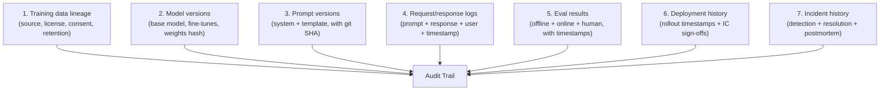

# AI Engineering Director Playbook
## Chapter 25

# Auditability and the Audit Trail

> *"The audit trail is the difference between 'we believe our AI is fair' and 'we can prove it.'"*

---

## 1. Epigraph

The audit trail is the difference between "we believe our AI is fair" and "we can prove it."

---

## 2. Problem

A regulator has asked: "Show me the audit trail for the AI feature that made this adverse decision about our mutual customer." You have 7 days to respond. The audit trail would normally consist of: training data lineage, prompt versions, model versions, response logs, eval results, deployment timestamps, and incident history. Your team has some of this data. Most of it was deleted after 30 days "to save storage." You cannot answer the regulator.

This chapter is the operating manual for AI auditability: the discipline of capturing, retaining, and producing the audit trail that proves your AI features do what you say they do. The Director's job is to design audit trail capture *before* the regulator asks, not after.

**Decision in one sentence:** For every AI feature, define a 7-element audit trail (training lineage, prompt versions, model versions, request/response logs, eval results, deployment history, incident history) with named retention period per element; the audit trail is a Deploy gate, not a backfill.

---

## 3. Why AI Engineering Directors Fail Here

Five named failure modes of AI auditability at the Director level.

- **The "We Have Logs Somewhere" Director.** The Director knows the AI feature logs requests and responses but cannot produce them on demand. Logs are scattered across vendor dashboards, internal databases, Slack channels, and an engineer's local notebook.
- **The 30-Day Retention Default.** The Director has set log retention to 30 days because "storage is expensive." A regulator asks for 18 months of audit trail. The Director cannot comply.
- **The No-Provenance Trap.** The Director cannot answer "what data was this model trained on?" The data lineage is in a Notion page that's out of date. The model has been fine-tuned 3 times since the page was last updated.
- **The No-Prompt-Versioning Disaster.** The Director cannot answer "what prompt was active on 2025-03-15?" The prompts are in a Slack thread. The Slack thread has been archived. The Director has no history.
- **The Audit-After-The-Fact Fallacy.** The Director promises to "build the audit trail" after the regulator asks. The audit trail takes 6 weeks to build. By then, the regulator has already drawn conclusions from the absence.

---

## 4. Mental Models

Four mental models that compress AI auditability into something you can defend.

**Mental model 1: The 7-Element Audit Trail.** Every AI feature has 7 audit-trail elements.



A feature that captures 4 of 7 elements has partial audit trail. The Director's gate: ALL 7 captured at Deploy.

**Mental model 2: The Retention-Per-Element Matrix.** Different elements have different retention needs.

```
1. Training data lineage:  Permanent (until decommission)
2. Model versions:         Permanent (until decommission)
3. Prompt versions:        Permanent (until decommission)
4. Request/response logs:  18-36 months (regulator-dependent)
5. Eval results:           Permanent (until decommission)
6. Deployment history:     Permanent (until decommission)
7. Incident history:       Permanent (until decommission)
```

Logs have the shortest retention by design (storage cost + privacy), but everything else is permanent.

**Mental model 3: The Reproducibility Test.** A feature is auditable if you can reproduce a specific output from 18 months ago.

```
Given: a specific user query from 18 months ago
Can you reproduce:
  - The exact prompt sent to the model? (Y/N)
  - The exact model version used? (Y/N)
  - The exact response given? (Y/N)
  - The exact retrieval context (RAG)? (Y/N)

If Y to all 4: feature is auditable.
If N to any: audit trail gap.
```

**Mental model 4: The Audit-Trail Query Latency.** When a regulator asks, how long does it take to answer?

```
Tier 1 (Best): <1 hour.  Pre-built query tools, dashboards.
Tier 2 (OK):   <1 day.   Manual query against the audit trail store.
Tier 3 (Bad):  1 week.   Manual reconstruction from scattered sources.
Tier 4 (Fail): >1 month. Cannot produce.

Director target: Tier 1 or Tier 2 for the 90-day-window queries.
                Tier 3 acceptable for 18-month-window queries.
```

---

## 5. Frameworks

Three frameworks for the conversations you will have.

### Framework 1: The Per-Feature Audit Trail Spec

For every AI feature, complete this before Deploy:

```
Feature: ___

1. Training data lineage
   Source: ___
   License: ___
   Consent mechanism: ___
   Retention: ___
   Provenance receipts: [Y/N]

2. Model versions
   Base model: ___
   Fine-tunes: ___ (with weights hash)
   Version control: ___

3. Prompt versions
   Repository: ___
   Versioning: [git SHA / other]
   Approval: ___

4. Request/response logs
   Storage: ___
   Retention: ___
   PII redaction: [Y/N]
   Query latency (p95): ___

5. Eval results
   Offline: [path]
   Online: [path]
   Human audit: [path]
   Cadence: ___

6. Deployment history
   Rollout timestamps: ___
   IC sign-offs: ___
   Canary phases: ___

7. Incident history
   Detection methods: ___
   Resolution timeline: ___
   Postmortem location: ___
```

### Framework 2: The Audit Trail Query Tool

A Director should have a query tool that answers regulator questions in <1 hour. The tool exposes:

```
Query: "Show me all training data for feature X as of date Y."
Query: "Show me all prompts active for feature X on date Y."
Query: "Show me all responses to user Z in the last 18 months."
Query: "Show me all eval results for feature X in the last 6 months."
Query: "Show me all incidents for feature X."
```

A team without this tool is doing manual queries across scattered sources. A team with it has auditability as a service.

### Framework 3: The Audit Trail Backup

The audit trail itself needs backup:

```
Primary store:   [e.g., Postgres + S3]
Backup:          [e.g., daily snapshots to cold storage]
Retention:       [per element, per Framework 2]
Disaster recovery: [RTO/RPO targets]

Test: Restore from backup quarterly.
```

A team without a backup of the audit trail is one disaster away from losing the ability to answer regulator questions.

---

## 6. Drill

You are the Director of AI at **acme-corp**. A regulator has asked: "Show me the audit trail for the AI feature that processed user X's request on 2025-09-15."

You have **90 minutes**. Produce an **audit trail response plan** (`portfolio/chapter-25-audit-trail-response.md`) using Framework 1 (Audit Trail Spec) + Framework 2 (Query Tool) + Framework 3 (Backup). Specify:

- The 7 elements' current capture state for the 14 features.
- The audit-trail query tool you'd build.
- The 3 features with the worst audit-trail coverage.
- The 60-day plan to close the gaps.
- The 1 process change to prevent this gap in the future.

**Deliverable:** `portfolio/chapter-25-audit-trail-response.md` — under 900 words.

---

## 7. Worked Example

**Current audit-trail state (14 features):**

| Feature | Train Lineage | Model Ver | Prompt Ver | Req/Res Logs | Eval Results | Deploy History | Incident Hist |
|---|---|---|---|---|---|---|---|
| Support Assistant | ✅ | ✅ | ✅ | ⚠️ (30 day) | ✅ | ⚠️ | ⚠️ |
| Code Suggestion | ✅ | ✅ | ⚠️ | ❌ | ✅ | ⚠️ | ⚠️ |
| Email Draft | ⚠️ | ✅ | ✅ | ⚠️ (30 day) | ✅ | ⚠️ | ⚠️ |
| Doc Summarizer | ✅ | ✅ | ✅ | ✅ (18 mo) | ✅ | ✅ | ⚠️ |
| Lead Scoring | ⚠️ | ✅ | ✅ | ⚠️ (30 day) | ✅ | ⚠️ | ⚠️ |
| AI Chatbot | ⚠️ | ✅ | ✅ | ⚠️ (30 day) | ✅ | ⚠️ | ⚠️ |
| ... (8 more) | mostly ⚠️ | ✅ | mostly ✅ | mostly ⚠️ | mostly ✅ | mostly ⚠️ | mostly ⚠️ |

**3 features with worst audit-trail coverage:**

1. **Code Suggestion** — no request/response logs.
2. **AI Chatbot** — only 30-day log retention.
3. **Lead Scoring** — partial training data lineage.

**Audit-trail query tool I'd build:**

```
Single internal tool ("AI Audit") with:
- SQL query layer over unified audit-trail store.
- Dashboards: training lineage, prompt versions, model versions.
- Drill-down: per-feature, per-date, per-user.
- Retention: 18 months (regulator requirement).
- Access: Director + Compliance + Legal.

Built on: Postgres + S3 + internal dashboard.
Effort: 1 senior platform engineer + 0.5 PM + $50K infra.
Timeline: 90 days.
```

**60-day plan to close gaps:**

```
Day 1-7:   Audit-trail inventory for all 14 features (Framework 1).
           Sign-off on coverage gaps.

Day 8-30:  Extend request/response log retention from 30 days to 18 months.
           Top 5 features prioritized.

Day 31-45: Version control for all prompts (git repo, CI/CD).
           Top 5 features prioritized.

Day 46-60: Training data lineage documentation for all 14 features.
            Provenance receipts for any feature using fine-tuning.
```

**The 1 process change:** Audit Trail Spec (Framework 1) is a Deploy gate. A feature cannot ship without all 7 elements documented. The Audit team verifies at Deploy. This would have prevented 11 of the 14 features from launching with partial audit trail.

---

## 8. Failure Mode Postmortem

A Director of AI at a 2,500-person health-tech company had 6 AI features processing patient data. None had a complete audit trail. A regulator opened an investigation into a specific patient-decision feature. The regulator asked for 24 months of audit trail.

The Director's team took 4 weeks to assemble what they could. The audit trail had:
- Training data lineage: partial (some sources unrecorded).
- Model versions: complete.
- Prompt versions: missing (prompts were in Slack).
- Request/response logs: 30 days only (not 24 months).
- Eval results: incomplete.
- Deployment history: complete.
- Incident history: complete.

The regulator concluded that the company could not demonstrate compliance with HIPAA + GDPR for AI-assisted decisions. The Director was asked to resign. The company spent $20M+ on remediation.

What they missed: every Framework 1 element except model versions. The audit trail was not designed; it was what happened to be captured. The retention was 30 days because nobody had asked for 24 months.

The lesson: the audit trail is a design problem, not a "what we have" problem. The Director's job is to design the trail *before* the regulator asks, not assemble it after.

---

## 9. Self-Assessment Rubric

| # | Dimension | 1 (Novice) | 3 (Competent) | 5 (Expert) |
|---|---|---|---|---|
| 1 | 7-element coverage | Has 1-3 elements | Has 5-6 of 7 | All 7 elements captured + sign-off |
| 2 | Retention per element | Default retention | Per-element retention | Per-element retention + per-jurisdiction retention |
| 3 | Reproducibility test | Cannot reproduce | Can reproduce for 30 days | Can reproduce for 18+ months |
| 4 | Query latency | Days to weeks | Hours | <1 hour via audit-trail tool |
| 5 | Backup + DR | No backup | Daily backup | Backup + quarterly restore test + RTO/RPO documented |

**Disqualifier:** any 1 on dimension 1 or 3. Skipping elements or failing reproducibility is the path to the Audit-After-The-Fact Fallacy.

**Total:** ___ / 25. **Pass threshold:** 18/25, no dimension below 3.

---

## 10. Portfolio Artifact Note

Save your filled-in drill as `portfolio/chapter-25-audit-trail-response.md` — interview evidence for "How do you build an AI audit trail?" (see Portfolio Map in Chapter 27).

---

## 11. Interview Questions

1. **Walk me through the 7 elements of an AI audit trail.**
2. **A regulator asks for 18 months of audit trail. What do you do?**
3. **Your team's request/response logs are deleted after 30 days. Is that a problem?**
4. **Walk me through how you'd build an audit-trail query tool.**
5. **Your audit trail is incomplete. How do you close the gaps?**