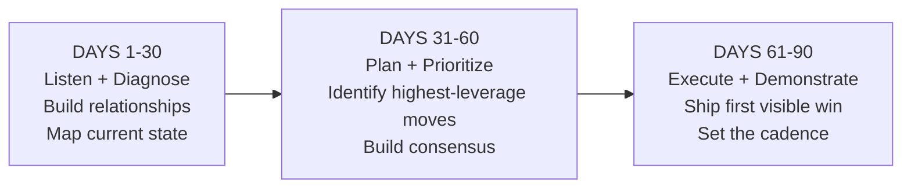
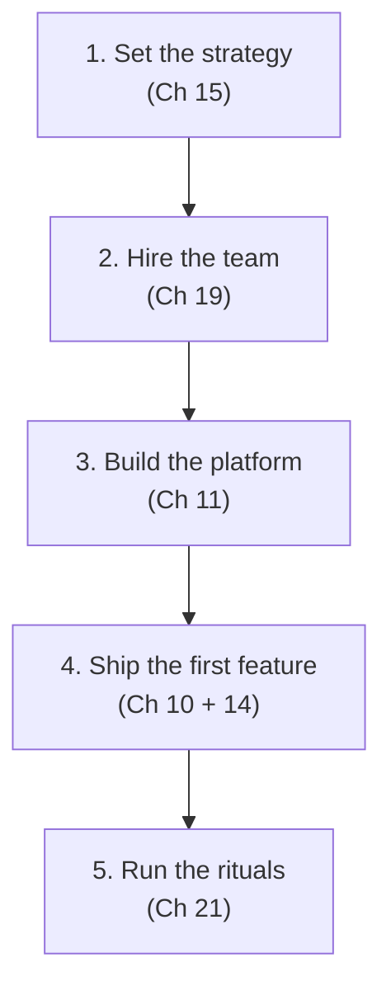

# AI Engineering Director Playbook
## Chapter 26

# 30/60/90 Simulation

> *"A 30/60/90 plan is a contract with yourself. The integration is the proof that you can do the job."*

---

## 1. Epigraph

A 30/60/90 plan is a contract with yourself. The integration is the proof that you can do the job.

---

## 2. Problem

You're 30 days from joining a 1,200-person company as the new Director of AI. You've accepted the offer. The CEO has asked: "Walk me through your 30/60/90 plan in 30 minutes." You have one shot. The 30/60/90 is your first integration test — it tells the company (and you) whether you understand the role.

This chapter is the capstone: it integrates every framework from Ch 1–25 into a single 90-day plan that proves you can do the job. The 30/60/90 is not a memo; it is a *simulation* of how you will lead.

**Decision in one sentence:** Build your 30/60/90 by working backwards from the 12-month outcome, identifying the 3-5 highest-leverage moves per 30-day window, and naming a single success metric for each window — the metric you would defend in front of the CEO at the end of each window.

---

## 3. Why AI Engineering Directors Fail Here

Five named failure modes of 30/60/90 plans at the Director level.

- **The Activity-List Plan.** The Director produces a 30/60/90 that's a list of meetings ("meet with each team," "review each feature"). Activity ≠ outcome. The CEO reads the plan and sees no delivery.
- **The 12-Month-Mistake Plan.** The Director puts 12-month goals in the first 30 days ("ship 5 features," "build the platform"). The first 30 days should be diagnosis, not delivery. The CEO realizes the Director doesn't know how to ramp.
- **The No-Metric Plan.** The Director produces a 30/60/90 with no metrics. How does the Director know if they succeeded? How does the CEO know? The Director has produced a wishlist.
- **The Plan-That-Ignores-Reality Plan.** The Director produces a 30/60/90 that doesn't account for the current state of the org, the platform, or the politics. The plan fails in week 2 because the Director didn't diagnose first.
- **The Single-Document Plan.** The Director produces one 30/60/90 doc and never updates it. By day 60, the plan is stale. The Director has confused a memo for an operating system.

---

## 4. Mental Models

Four mental models that compress 30/60/90 planning into something you can defend.

**Mental model 1: The 30/60/90 Window Strategy.** Each window has a different focus.



The discipline: each window has a *single primary activity*. Trying to do all 3 simultaneously in week 1 produces noise.

**Mental model 2: The Leverage Stack.** A Director has limited time. Use it on highest-leverage moves.



Days 1–30: focus on L1–L2 (strategy + team). Days 31–60: L3 (platform). Days 61–90: L4–L5 (feature + rituals).

**Mental model 3: The Stakeholder Calendar.** The first 90 days have ~50 stakeholder meetings. Plan them.

```
Week 1-2:   CEO, CTO, CFO, key VPs (8 meetings)
Week 3-4:   Team members, peer directors, key PMs (12 meetings)
Week 5-6:   Customer interviews (5-10)
Week 7-8:   Top customers, top employees (5-8)
Week 9-10:  Recurring 1:1s established (10+ meetings/month)
Week 11-12: Strategy review with CEO + exec team
```

A Director who doesn't plan the stakeholder calendar wastes weeks on calendar Tetris.

**Mental model 4: The Visible-Win Cadence.** Every Director needs a visible win in the first 90 days.

```
Day 30 win:  "I've met every stakeholder and produced a 1-page current-state assessment."
Day 60 win:  "I've shipped the 30-day plan and have buy-in on the 90-day plan."
Day 90 win:  "I've shipped [first visible deliverable] and established the operating cadence."

The visible win is what the CEO points to when asked: "How is [Director] doing?"
```

---

## 5. Frameworks

Three frameworks for the conversations you will have.

### Framework 1: The 30/60/90 Template

```
# 30/60/90 Plan — Director of AI

## 12-month outcome
[1 sentence: what success looks like at 12 months.]

## Day 1-30: Listen + Diagnose

Primary activity: Meet stakeholders. Map current state.
Activities:
  - ___ stakeholder meetings (calendar-driven)
  - Current-state assessment (1-page memo)
  - Read all existing AI chapter docs / RFCs / runbooks
  - Identify top 3 quick wins + top 3 risks

Success metric:
  - "By day 30, every key stakeholder has been met, and a 1-page
    current-state assessment has been presented to the CEO."

## Day 31-60: Plan + Prioritize

Primary activity: Build the strategy + roadmap. Build consensus.
Activities:
  - 1-page strategy memo (Ch 15)
  - Roadmap prioritization (Ch 14)
  - Top 3 quick wins scoped + resourced
  - First platform investment scoped (Ch 11)
  - Stakeholder alignment on the 90-day plan

Success metric:
  - "By day 60, the strategy memo + 90-day plan have been signed off
    by the CEO + CTO."

## Day 61-90: Execute + Demonstrate

Primary activity: Ship the first visible win. Set the operating cadence.
Activities:
  - Ship first quick win (Ch 14)
  - Run first lifecycle audit (Ch 10)
  - Run first quality SLO dashboard (Ch 12)
  - Establish weekly cadence (1:1s, chapter meetings, exec updates)
  - Hire or backfill 1-2 key roles (Ch 19)

Success metric:
  - "By day 90, [first quick win] is in production, the team is
    operating on the new cadence, and a 6-month roadmap has been
    signed off."
```

### Framework 2: The Current-State Assessment (Day 30 Deliverable)

```
# Current-State Assessment — AI at acme-corp

## What's working
- ___ (3-5 bullets)

## What's broken
- ___ (3-5 bullets)

## What's missing
- ___ (3-5 bullets)

## Top 3 quick wins (≤30 days)
- ___ (each: cost, effort, impact)

## Top 3 risks
- ___ (each: severity, mitigation)

## 90-day proposal
- ___ (high-level: ship, build, hire)
```

### Framework 3: The 90-Day Plan Review

```
At day 90, present to CEO + exec team:

1. What I planned vs. what I shipped.
2. What surprised me (assumptions that were wrong).
3. What I'm proposing for the next 90 days.
4. What resources I need (hires, budget, scope changes).
5. What I'll deprioritize (and why).
```

---

## 6. Drill

You are about to start as Director of AI at **acme-corp**. The CEO has asked: "Walk me through your 30/60/90 plan in 30 minutes."

You have **90 minutes**. Produce a **30/60/90 plan** (`portfolio/chapter-26-30-60-90-plan.md`) using Framework 1 (Template) + Framework 2 (Current-State Assessment) + Framework 3 (Plan Review). Specify:

- The 12-month outcome (1 sentence).
- The day 1-30 plan (with success metric).
- The day 31-60 plan (with success metric).
- The day 61-90 plan (with success metric).
- The current-state assessment assumptions.
- The first 90-day review agenda.

**Deliverable:** `portfolio/chapter-26-30-60-90-plan.md` — under 900 words.

---

## 7. Worked Example

**12-month outcome:**
By day 365, acme-corp's AI function is the default AI layer for mid-market customer-support teams — measured by 3 shipped AI features in production, a self-service AI platform adopted by 80% of internal teams, and a named AI talent density (1 AI engineer per 25 product engineers).

**Day 1-30: Listen + Diagnose**

```
Activities:
  - 12 stakeholder meetings (CEO, CTO, CFO, VP Sales, VP Customer Success, 
    3 product VPs, 2 senior engineers, 1 customer success rep, 1 customer).
  - Current-state assessment (Ch 10 framework applied to all 14 features).
  - Read all existing AI runbooks, RFCs, postmortems.
  - Audit-trail review (Ch 25).
  - Cost-baseline establishment (cost_estimator.py for all 14 features).

Success metric:
  "By day 30, every key stakeholder met + 1-page current-state 
  assessment signed off by CEO + CFO."
```

**Day 31-60: Plan + Prioritize**

```
Activities:
  - 1-page AI strategy memo (Ch 15 framework).
  - Roadmap prioritization from current 23 ideas to 5-bet portfolio 
    (Ch 14 framework).
  - Lifecycle audit on top 5 features (Ch 10).
  - Top 3 quick wins scoped + resourced.
  - Platform investment proposal (Ch 11 framework).
  - Stakeholder alignment on the 90-day plan.

Success metric:
  "By day 60, strategy memo + 90-day plan signed off by CEO + CTO + CFO."
```

**Day 61-90: Execute + Demonstrate**

```
Activities:
  - Ship 1 of the top 3 quick wins (likely: refresh eval system for 
    Support Assistant + add Quality SLO dashboard).
  - Run first lifecycle audit (Ch 10) on top 3 features.
  - Establish weekly cadence:
    - 1:1s with each direct report (8/week).
    - AI chapter meeting (1/week).
    - Exec update (1/2 weeks).
  - Start hiring 1 senior platform engineer (Ch 19).
  - Quarterly crisis drill (Ch 24).

Success metric:
  "By day 90, [first quick win] is in production, the team is operating
  on the new cadence, and a 6-month roadmap has been signed off."
```

**Current-state assessment assumptions (to verify in days 1-30):**

```
What's working:
  - 14 AI features shipped.
  - Strong engineering talent.
  - Reasonable vendor relationships (OpenAI, Anthropic).

What's broken:
  - No lifecycle discipline (per Ch 10 audit).
  - No quality SLOs (per Ch 12 audit).
  - Inconsistent eval coverage.

What's missing:
  - AI platform.
  - Eval system refresh cadence.
  - Responsible AI review process.

Top 3 quick wins:
  - Eval system refresh for top 3 features (4 weeks, 1 engineer).
  - Quality SLO dashboard for top 3 features (2 weeks, 0.5 engineer).
  - 1-page strategy memo + roadmap (1 week, Director).

Top 3 risks:
  - Regulatory exposure for Lead Scoring (per Ch 23).
  - Cross-tenant data leak risk (per Ch 13).
  - Talent retention risk (no defined ladder per Ch 20).
```

**First 90-day review agenda:**

```
1. What I planned vs. what I shipped.
2. What surprised me (assumptions that were wrong).
3. What I'm proposing for the next 90 days.
4. Resources I need (hires, budget).
5. What I'll deprioritize (and why).
```

---

## 8. Failure Mode Postmortem

A Director of AI at a 1,500-person fintech joined with a 30/60/90 that focused entirely on shipping features in the first 30 days ("ship 3 features by day 30"). The Director had not met enough stakeholders to know which features to ship. The features the Director chose didn't match the actual customer needs. The Director burned credibility on shipped-but-unwanted features.

By day 60, the Director had missed the consensus-building phase. The Director was surprised by stakeholder pushback on the 90-day plan. By day 90, the Director was asked to revise the plan or leave.

What they missed: the Window Strategy (mental model 1). The first 30 days should be listen + diagnose, not ship. The Director had front-loaded delivery at the cost of diagnosis.

The lesson: a 30/60/90 is a *ramp*, not a delivery schedule. The first 30 days are about understanding the system. Delivery comes after diagnosis.

---

## 9. Self-Assessment Rubric

| # | Dimension | 1 (Novice) | 3 (Competent) | 5 (Expert) |
|---|---|---|---|---|
| 1 | Window strategy | All 3 windows mixed | Each window has primary activity | Window 1 diagnose, Window 2 plan, Window 3 execute |
| 2 | Leverage stack alignment | Activities scattered | Hits 2-3 leverage moves | Hits all 5 leverage moves in correct order |
| 3 | Stakeholder calendar | No calendar | Has weeks 1-4 calendar | Has weeks 1-12 calendar with named outcomes |
| 4 | Visible-win cadence | No win named | 1 win per window | Win per window + metric defended at end |
| 5 | Plan-review discipline | One-time memo | Quarterly review | Day 90 review + day 180 review + day 365 review |

**Disqualifier:** any 1 on dimension 1 or 4. Mixing windows or no visible win is the path to the Activity-List Plan or the 12-Month-Mistake Plan.

**Total:** ___ / 25. **Pass threshold:** 18/25, no dimension below 3.

---

## 10. Portfolio Artifact Note

Save your filled-in drill as `portfolio/chapter-26-30-60-90-plan.md` — interview evidence for "Walk me through your 30/60/90 plan." (see Portfolio Map in Chapter 27).

---

## 11. Interview Questions

1. **Walk me through your 30/60/90 plan.**
2. **Your first 30 days should focus on what?**
3. **What visible win would you commit to in 90 days?**
4. **Walk me through how you'd diagnose a new org in your first 30 days.**
5. **A Director's plan is always wrong by day 30. What do you do?**