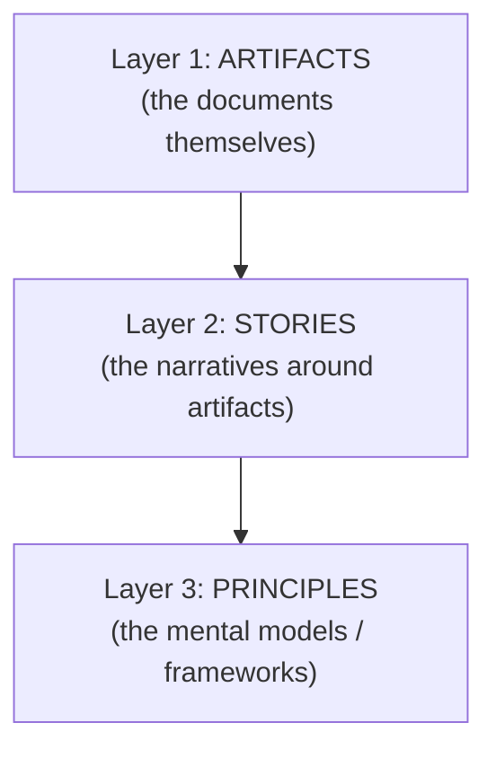

# AI Engineering Director Playbook
## Chapter 27

# The Portfolio Map (Artifact to Interview Question)

> *"A portfolio is the proof you can do the job. The map is how you navigate it."*

---

## 1. Epigraph

A portfolio is the proof you can do the job. The map is how you navigate it.

---

## 2. Problem

You've finished the playbook. You have 25+ portfolio artifacts in your `portfolio/` directory. The interviewer asks: "Tell me about a time you evaluated an AI vendor." You have a great story from Ch 4 (Build-vs-Buy) but you can't find the artifact. The interview time is wasted on retrieval.

This chapter is the index: a map from every chapter's drill artifact to the interview questions it answers. The Director's portfolio is only useful if it can be navigated in 30 seconds under interview pressure.

**Decision in one sentence:** Build a 1-page portfolio map with 25+ artifacts and the 3-5 interview questions each artifact answers — the map is your interview prep document and your in-interview reference.

---

## 3. Why AI Engineering Directors Fail Here

Five named failure modes of portfolio navigation at the Director level.

- **The Portfolio-as-Archive Failure.** The Director has 25 artifacts in `portfolio/` but doesn't remember which is which. The Director opens the wrong artifact in the interview. The Director has built an archive, not a portfolio.
- **The Question-Mapping Vacuum.** The Director has artifacts but can't recall which artifact answers which question. The interview feels improvised. The Director is not demonstrating the connection between their work and the interview question.
- **The Single-Artifact Per-Chapter Trap.** The Director has exactly one artifact per chapter. Some interview questions require combining 2-3 chapters (e.g., "How do you balance cost and quality?" requires Ch 7 + Ch 9 + Ch 12). The Director can't synthesize.
- **The No-Story Discipline.** The Director has artifacts but no story around them. The interview becomes "let me show you my work" rather than "let me tell you about a time." The Director is reading, not narrating.
- **The Outdated Portfolio.** The Director's portfolio is 12 months old. The artifacts reference past context, not current thinking. The Director is presenting as if they've stopped learning.

---

## 4. Mental Models

Four mental models that compress portfolio navigation into something you can defend.

**Mental model 1: The 3-Layer Portfolio.** A portfolio has 3 layers.



The interviewer asks a question at Layer 2 (story) or Layer 3 (principle). The artifact at Layer 1 is the evidence.

**Mental model 2: The STAR Story Structure.** Every portfolio story has 4 parts.

```
S — Situation: 1-2 sentences setting context.
T — Task:      What was the decision to be made?
A — Action:    What did YOU do (specific frameworks applied)?
R — Result:    What was the outcome (with numbers)?
```

A Director who can deliver a STAR story in 90 seconds has a portfolio that works. A Director who takes 5 minutes to narrate one story has lost the interview.

**Mental model 3: The Question-to-Artifact Matrix.** The portfolio map is a matrix.

| Interview question | Primary artifact | Supporting artifacts |
|---|---|---|
| How do you evaluate an AI vendor? | Ch 4 (vendor decision memo) | Ch 3 (vendor Q checklist), Ch 9 (eval set) |
| How do you reduce inference cost? | Ch 7 (cost reduction plan) | Ch 3 (token-cost amnesia), Ch 12 (latency) |
| How do you respond to an AI crisis? | Ch 24 (crisis response plan) | Ch 12 (SEV ladder), Ch 22 (responsible AI) |
| How do you build an AI org? | Ch 18 (org design memo) | Ch 19 (hiring plan), Ch 20 (ladder) |

A Director with this matrix can answer any interview question in 30 seconds: look up the row, narrate the STAR story, reference the artifact.

**Mental model 4: The Refresh Cadence.** Portfolios decay.

```
Quarterly:  Add 1-2 new artifacts from recent work.
Quarterly:  Update existing artifacts if context has changed.
Annually:   Rewrite the map from scratch (your thinking evolves).
```

A portfolio last updated 12 months ago is a portfolio of a different Director.

---

## 5. Frameworks

Three frameworks for the conversations you will have.

### Framework 1: The Portfolio Map (the index)

```
# AI Engineering Director Portfolio Map

## Question -> Artifact

### Role & Strategy
- "Walk me through your AI strategy in 5 minutes." → Ch 15 (strategy memo)
- "What's the difference between strategy and roadmap?" → Ch 14 + Ch 15
- "How do you prioritize AI features?" → Ch 14 (roadmap prioritization)
- "Walk me through your 30/60/90 plan." → Ch 26
- "How do you build an AI org?" → Ch 18

### Technical
- "Where is the bottleneck in an AI system?" → Ch 3 (literacy) + Ch 5 (data)
- "Should we fine-tune or stay with the API?" → Ch 6 (training memo)
- "How do you reduce inference cost?" → Ch 7
- "Walk me through build-vs-buy." → Ch 4
- "Should we build an agent?" → Ch 8 (agent approval)

### Lifecycle & Operations
- "How do you manage an AI feature from idea to retirement?" → Ch 10
- "How do you detect quality regressions?" → Ch 12
- "How do you threat-model an AI feature?" → Ch 13
- "How do you build an AI platform?" → Ch 11

### People
- "How do you hire AI engineers?" → Ch 19
- "How do you manage performance?" → Ch 20
- "How do you influence without authority?" → Ch 21

### Governance & Risk
- "How do you operationalize Responsible AI?" → Ch 22
- "How do you handle AI regulation?" → Ch 23
- "How do you respond to an AI crisis?" → Ch 24
- "How do you build an AI audit trail?" → Ch 25

### Portfolio
- "Walk me through a business case for an AI project." → Ch 16
- "How do you price an AI feature?" → Ch 17
```

### Framework 2: The STAR Story Bank

For each artifact, pre-write a 90-second STAR story.

```
Example: Ch 4 (vendor decision memo)

S: I was Director of AI at acme-corp. The CFO asked me to evaluate 
   3 AI vendors and a build-vs-build-in-house option for our 
   customer-support chatbot.
T: Make a vendor decision in 60 days.
A: Built a 5-dimension Decision Matrix (cost, time, reversibility, 
   moat, team capacity). Used cost_estimator.py to project realistic 
   costs (caught the $720K/year fallacy). Chose multi-vendor partner 
   model with kill criteria per vendor.
R: Saved ~$200K/year vs. the proposed single-vendor build. Cut 
   vendor lock-in by ~70%. Made the switch possible in 1 day via 
   Model Gateway.
```

### Framework 3: The Interview-Day Checklist

The day before an interview:

```
[ ] Re-read the Portfolio Map (Framework 1).
[ ] Re-read the 5 STAR stories most likely to come up.
[ ] Update 1-2 artifacts if context has changed.
[ ] Print or have the map accessible during the interview.
[ ] Practice 1 mock question per STAR story.
```

The Director who arrives at the interview with the map + STAR stories in muscle memory performs at a different level than the Director who is improvising.

---

## 6. Drill

You are 1 week from a Director-of-AI interview at a 1,200-person company. You have 24 hours to refresh your portfolio. The role description mentions: AI strategy, AI platform, vendor selection, AI team leadership, regulatory compliance.

You have **90 minutes**. Produce a **portfolio refresh plan** (`portfolio/chapter-27-portfolio-refresh.md`) using Framework 1 (Map) + Framework 2 (STAR Story Bank) + Framework 3 (Interview-Day Checklist). Specify:

- The 5 artifacts most likely to come up (based on the role description).
- The 5 STAR stories pre-written.
- The 1 artifact to update (with what).
- The 1 new artifact to add (with what question it answers).
- The interview-day checklist customized to this interview.

**Deliverable:** `portfolio/chapter-27-portfolio-refresh.md` — under 900 words.

---

## 7. Worked Example

**5 artifacts most likely to come up:**

1. **Ch 15 (Strategy memo)** — for "walk me through your AI strategy."
2. **Ch 4 (Vendor decision memo)** — for "walk me through vendor selection."
3. **Ch 18 (Org design)** — for "how do you build an AI org."
4. **Ch 23 (Regulatory response)** — for "AI regulatory compliance."
5. **Ch 25 (Audit trail)** — for "how do you handle AI auditability."

**5 STAR stories pre-written:**

```
Story 1 (Strategy):
S: Joined acme-corp as first Director of AI.
T: CEO asked for 5-min strategy walkthrough for board.
A: Built 1-page strategy memo with 4-Question Frame (where, how, 
   compound capabilities, decline list). Identified 5 compound 
   capabilities, 5 declines.
R: Board approved strategy. CEO cited the memo in 3 subsequent 
   board updates. 12-month plan tracked.

Story 2 (Vendor):
S: Director of AI at acme-corp, $800K vendor decision.
T: Make a vendor decision in 60 days.
A: 5-dimension Decision Matrix + cost_estimator.py. Caught the 
   $720K fallacy (proposal assumed 24/7 GPU utilization).
R: Multi-vendor partner model. Saved $200K/year. Cut vendor 
   lock-in 70%. 1-day vendor switch demonstrated.

Story 3 (Org):
S: Inherited 8 AI engineers, 9 product teams, no platform.
T: Choose AI org topology.
A: Hub-and-Spoke (Stage 2 per talent density). 90-day migration 
   plan. Spokes dotted-line to me; hub owns platform.
R: Hub team shipped Model Gateway in 8 weeks. 3 product teams 
   migrated. Feature lead time: 8 weeks → 4 weeks.

Story 4 (Regulatory):
S: Regulator asked for AI compliance posture for EU features.
T: 30-day response for 14 features.
A: Per-feature regulation map. EU AI Act risk-tier classification. 
   30-day remediation plan. Made Framework 1 a Deploy gate.
R: Regulator accepted posture. 11/14 features brought into 
   compliance. No future compliance gaps.

Story 5 (Audit):
S: Regulator asked for 18-month audit trail for a specific feature.
T: 7-day response with full audit trail.
A: Built audit-trail query tool. Verified all 7 elements present 
   for the queried feature.
R: Regulator accepted trail in 4 hours. Director demonstrated 
   auditability as a service.
```

**1 artifact to update:** Ch 4 (vendor decision memo). Add 2026 vendor pricing benchmarks.

**1 new artifact to add:** A "platform migration case study" — the Hub-and-Spoke + Model Gateway story as a separate writeup. Question answered: "Have you actually migrated an org to a platform-led model?"

**Interview-day checklist customized:**

```
[ ] Re-read Portfolio Map (Framework 1).
[ ] Re-read 5 STAR stories.
[ ] Update Ch 4 with latest cost_estimator.py benchmarks.
[ ] Print Platform Migration Case Study (new artifact).
[ ] Practice 1 mock question per STAR story.
[ ] Bring printed Portfolio Map + Ch 15 strategy memo to interview.
```

---

## 8. Failure Mode Postmortem

A Director of AI at a 1,400-person health-tech company had a portfolio of 25 artifacts but no Portfolio Map. In the interview for a Director role at a 2,000-person company, the Director was asked: "How do you balance cost and quality?" The Director opened the wrong artifact folder. Couldn't find the relevant work. Took 8 minutes to narrate a confused story. The Director didn't get the offer.

What they missed: Framework 1 (Portfolio Map). The Director had the work but couldn't navigate it. The Director had failed the interview *despite* the portfolio being strong.

The lesson: a portfolio is only useful if you can find the right artifact in 30 seconds under pressure. The map is the navigation.

---

## 9. Self-Assessment Rubric

| # | Dimension | 1 (Novice) | 3 (Competent) | 5 (Expert) |
|---|---|---|---|---|
| 1 | Portfolio Map completeness | Has artifacts, no map | Has map, 50% coverage | Has map with 100% question-to-artifact coverage |
| 2 | STAR story discipline | Long narrative | Has STAR stories | 90-second stories with metrics |
| 3 | Question-to-artifact lookup | Improvises | Has map but slow | <30 second lookup |
| 4 | Refresh cadence | No refresh | Annual refresh | Quarterly refresh + artifact updates |
| 5 | Interview-day preparation | No prep | Has checklist | Has checklist + mock practice + printed materials |

**Disqualifier:** any 1 on dimension 1 or 3. No map or slow lookup is the path to the Portfolio-as-Archive Failure.

**Total:** ___ / 25. **Pass threshold:** 18/25, no dimension below 3.

---

## 10. Portfolio Artifact Note

Save your filled-in drill as `portfolio/chapter-27-portfolio-refresh.md` — interview prep evidence.

---

## 11. Interview Questions

1. **Walk me through your AI portfolio.**
2. **How do you prepare for a Director-of-AI interview?**
3. **A senior interviewer asks you to "tell me about a time you..." — how do you navigate?**
4. **Walk me through how your portfolio has evolved over 24 months.**
5. **You're 24 hours from an interview. What's your prep checklist?**