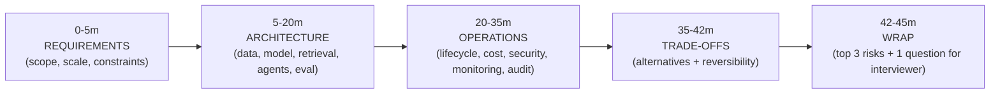

# AI Engineering Director Playbook
## Chapter 28

# System Design Appendix for AI Directors

> *"System design at the Director level is not 'design a system.' It's 'design the system + the team + the lifecycle + the cost + the security + the audit.' All in 45 minutes."*

---

## 1. Epigraph

System design at the Director level is not "design a system." It's "design the system + the team + the lifecycle + the cost + the security + the audit." All in 45 minutes.

---

## 2. Problem

You're in the system-design round of a Director-of-AI interview. The interviewer says: "Design an AI-powered customer-support chatbot for a 5,000-person SaaS company. 45 minutes. Go."

You have 45 minutes. You have to cover: data, model choice, retrieval, agents, eval, deployment, monitoring, cost, security, audit, team, lifecycle. Most candidates design for 20 minutes, then sit silent. The Director-level candidate designs the system + the team + the lifecycle + the cost + the security + the audit — all in the same 45 minutes.

This chapter is the cheat sheet: a structured 45-minute framework for AI-flavored system design at the Director level. The framework integrates Ch 1–27 into a single interview playbook.

**Decision in one sentence:** Allocate the 45 minutes in fixed buckets (5/15/15/5/5 for Requirements, Architecture, Operations, Trade-offs, Wrap) — and cover the same 8 dimensions in every interview (data, model, eval, deployment, cost, security, lifecycle, team) regardless of the prompt.

---

## 3. Why AI Engineering Directors Fail Here

Five named failure modes of AI system design at the Director level.

- **The IC-Design Failure.** The Director designs an IC-level system (data flow, model choice, retrieval). They don't cover team, lifecycle, cost, security, audit. The interviewer concludes the candidate can't lead.
- **The Time-Management Failure.** The Director spends 30 minutes on architecture. They have 15 minutes for everything else. The interviewer concludes the candidate can't prioritize.
- **The Missing-Cost Failure.** The Director designs a system without naming the cost. The interviewer asks "what does this cost at 100K requests/day?" and the Director can't answer.
- **The Missing-Security Failure.** The Director designs a system without threat-modeling. The interviewer asks "what if a user submits a prompt injection?" and the Director can't answer.
- **The Missing-Team Failure.** The Director designs a system without naming who builds it. The interviewer asks "who's on the team?" and the Director can't answer.

---

## 4. Mental Models

Four mental models that compress AI system design at the Director level into something you can defend.

**Mental model 1: The 45-Minute Time Budget.** Allocate minutes explicitly.



**Mental model 2: The 8-Dimension Coverage.** Cover these 8 dimensions in every interview.

```
1. Data:        What data do we use? Provenance? Consent? Retention?
2. Model:       Which model? Vendor? Self-host? Fine-tune? Why?
3. Retrieval:   RAG? What corpus? Per-tenant isolation?
4. Agents:      Single prompt or multi-step? Reversibility stack?
5. Eval:        Offline + online + human. Cadence. Quality SLO.
6. Deployment:  Canary. Rollback. Quality gate.
7. Operations:  Drift monitoring. Incident response. Audit trail.
8. Team:        Who builds this? Org topology. Lifecycle owner.
```

**Mental model 3: The Director-vs-IC Cutoff.** The Director covers what an IC wouldn't.

```
IC covers:           Director covers:
- Data flow          - Cost (TCO + per-feature)
- Model choice       - Team (who, org topology)
- Retrieval          - Lifecycle (ownership, gates)
- Eval              - Security (threat model)
- Monitoring         - Audit trail (7 elements)
- Performance        - Vendor lock-in (reversibility)
                     - Compliance (EU AI Act, sector)
```

**Mental model 4: The Number Discipline.** Every system design includes 3-5 named numbers.

```
Example numbers:
- Request volume: 28K req/day, growing 25%/q
- Cost: $66K/year (GPT-4o) or $12K/year (DeepSeek-V3)
- Latency: p95 < 2s
- Eval pass rate: 90%+
- Quality SLO: drift < 0.10
```

The Director who names numbers demonstrates engineering judgment. The Director who doesn't names architecture.

---

## 5. Frameworks

Three frameworks for the conversations you will have.

### Framework 1: The 45-Minute Template

```
# 0-5m: REQUIREMENTS

Functional:
- User story: ___
- Scope: ___
- Out of scope: ___

Non-functional:
- Scale: ___ req/day, ___ users
- Latency: p95 < ___ ms
- Cost: budget $___/year
- Quality: eval pass rate > ___%

Constraints:
- Compliance: ___
- Data residency: ___
- Vendor: ___

# 5-20m: ARCHITECTURE

[Draw the architecture diagram. Cover:]
- Data layer: sources, RAG corpus, consent
- Model layer: vendor / self-host / fine-tune
- Retrieval: vector + BM25, reranking
- Agents: reversibility stack (Ch 8)
- Eval: offline + online + human
- Serving: vendor / Bedrock / self-host

[For each layer: cost + reversibility + threat model]

# 20-35m: OPERATIONS

Lifecycle:
- Owner: ___
- Stage gates: Discover → Build → Eval → Deploy → Operate → Decom

Cost:
- Per-request cost (cost_estimator.py)
- 3-year TCO (5 layers)
- Cost optimization plan (Ch 7)

Security:
- Threat model (4 vectors)
- Per-tenant isolation
- PII tier classification
- Audit trail (7 elements)

Monitoring:
- 3 SLOs (availability + latency + quality)
- Drift monitoring
- Incident response runbook

# 35-42m: TRADE-OFFS

Alternatives considered:
- Option A (recommended): ___
- Option B: ___
- Option C: ___

Reversibility:
- Lock-in class (Ch 1) for each vendor decision

# 42-45m: WRAP

Top 3 risks:
- ___ (severity + mitigation)

1 question for the interviewer:
- ___
```

### Framework 2: The Cost-First Design Pattern

When the interviewer cares about cost, lead with cost:

```
1. State the cost constraint: $X/year budget.
2. Compute the per-request cost using cost_estimator.py.
3. State the cost at the projected volume.
4. State the cost at 1.5x and 2x volume.
5. State the optimization path (caching, fine-tune, etc).
```

### Framework 3: The Trade-off Tree

When comparing options, draw a tree:

```
Option A (recommended):
  + Pros
  - Cons
  Cost: $X/year
  Reversibility: Type 1 (reversible)

Option B:
  + Pros
  - Cons
  Cost: $Y/year
  Reversibility: Type 3 (hard-to-reverse)

Decision: A. Lower cost + lower lock-in. B is acceptable only if X is impossible.
```

---

## 6. Drill

You are in a Director-of-AI interview. The interviewer says: "Design an AI-powered contract-review tool for a 1,000-person legal-tech company. 500K contracts/year. Strict regulatory requirements. 45 minutes."

You have **90 minutes** (simulating the 45-minute interview plus 45 minutes of prep). Produce a **system design** (`portfolio/chapter-28-system-design.md`) using Framework 1 (45-Minute Template) + Framework 2 (Cost-First) + Framework 3 (Trade-off Tree). Specify:

- Requirements (functional + non-functional).
- Architecture diagram (in text).
- Operations (lifecycle, cost, security, monitoring).
- Trade-offs (3 alternatives).
- Wrap (top 3 risks + 1 question).
- The cost projection (using cost_estimator.py assumptions).

**Deliverable:** `portfolio/chapter-28-system-design.md` — under 1200 words (longer than other drills because system design is detail-heavy).

---

## 7. Worked Example

**0-5m: REQUIREMENTS**

```
Functional:
- User story: Legal associates upload contracts; AI flags risks + suggests edits.
- Scope: NDA, MSA, SOW, DPA (4 contract types).
- Out of scope: Litigation, IP licensing (later).

Non-functional:
- Scale: 1,000 contracts/day at peak, growing 30%/year.
- Latency: p95 < 30s (associate is waiting, but not real-time).
- Cost: budget $400K/year.
- Quality: recall >95% on critical risk categories; precision >85%.
- Reversibility: contracts are sensitive — must be reversible within 24h.

Constraints:
- Compliance: SOC 2 Type II, GDPR, attorney-client privilege.
- Data residency: US + EU.
- Vendor: __ (open per Ch 4 framework)
```

**5-20m: ARCHITECTURE**

```
[Diagram]

Input: Contract PDF (upload)
   ↓
Document processing: extract clauses, classify type, segment
   ↓
Per-tenant vector namespace (per Ch 8 context isolation)
   ↓
RAG over:
   - Customer's prior contracts (proprietary corpus)
   - Public legal references (with license check)
   ↓
Model: Multi-vendor gateway (per Ch 11)
   - Primary: Claude (high quality on legal text)
   - Fallback: OpenAI
   - Self-hosted embeddings
   ↓
Output: Risk flags + suggested edits + citations
   ↓
Audit trail: 7 elements captured (per Ch 25)
```

**Cost projection:**

```
Per-contract cost (rough):
- Input: 8000 tokens (contract + retrieved context)
- Output: 1500 tokens (risk flags + edits + citations)
- Model: Claude Sonnet
- Cost per contract: ~$0.06
- 1000 contracts/day = $60/day = $22K/year
- With growth (30%/year): ~$36K/year by year 3

Plus:
- Vector storage: ~$5K/year
- Eval infrastructure: ~$30K/year
- Operations (0.5 FTE): ~$150K/year

Total 3-year TCO: ~$220K/year (~$660K over 3 years)
Budget: $400K/year — within budget.

Cost optimization:
- Caching for similar contracts (30% savings → ~$25K/year saved)
- Smaller model for non-critical categories (50% savings on subset)
```

**20-35m: OPERATIONS**

```
Lifecycle:
- Owner: Legal-AI Engineering team (3 FTE + 1 product)
- Stage gates: Discover → Build → Eval → Deploy → Operate → Decom
- Audit trail per Ch 25 spec (18-month retention)

Security:
- Threat model: 4 vectors (Ch 13)
- Per-tenant isolation (Ch 8 context isolation)
- PII tier 3 (legal documents)
- Attorney-client privilege: no training on customer contracts
- Audit trail: 7 elements (Ch 25)

Monitoring:
- 3 SLOs: availability 99.5%, latency p95 < 30s, quality SLO 95% recall.
- Drift monitoring on legal-language distribution (quarterly).
- Quarterly bias audit on flagged vs unflagged contracts.

Compliance:
- EU AI Act: high-risk (legal assistance) — needs conformity assessment.
- GDPR: DPIA required.
- SOC 2: in place.
```

**35-42m: TRADE-OFFS**

```
Option A: Multi-vendor API (Claude primary, OpenAI fallback)
  + High quality, fast to ship (3 months)
  + Reversibility Type 1 (vendor switch via Gateway)
  - Higher per-request cost
  - Compliance requires multi-vendor SOC 2 review

Option B: Self-hosted foundation model (fine-tuned Llama 3.1 70B)
  + Lower per-request cost at scale (~$0.005/contract vs $0.06)
  + Better compliance posture (no vendor data sharing)
  - Higher build cost (~$500K + 6 months)
  - Slower to ship
  - Reversibility Type 4 (lock-in to infra)

Option C: Hybrid: API for first 12 months, evaluate self-host for year 2
  + Ship fast with API, learn what self-host needs to beat
  - Migration cost in year 2

Recommendation: Option C (hybrid). Ship with Claude primary + OpenAI fallback
in 3 months. Use year 1 to gather usage patterns. Decide self-host in year 2
based on volume + cost data.
```

**42-45m: WRAP**

```
Top 3 risks:
1. Compliance gap with EU AI Act high-risk classification.
   Mitigation: Conformity assessment at deploy gate.
2. Vendor lock-in if migration to self-host doesn't pencil out.
   Mitigation: Multi-vendor Gateway + 1-day vendor switch drill.
3. Quality regression on novel contract types.
   Mitigation: Quarterly eval refresh + human-in-the-loop on critical flags.

1 question for interviewer:
"What is the company's posture on EU AI Act high-risk conformity assessment?
Have you done this for any prior AI feature?"
```

---

## 8. Failure Mode Postmortem

A Director of AI at a 2,200-person fintech was in a final-round interview for a Director role at a 1,800-person health-tech company. The system-design prompt was: "Design an AI triage system for an emergency department." The Director designed the architecture (model choice, retrieval, eval) for 30 minutes. The interviewer asked: "What's the cost? What's the security model? Who's on the team? What's the lifecycle?" The Director had no answers. The Director was not offered the role.

What they missed: The 8-Dimension Coverage (mental model 2). The Director had covered 3 of 8 dimensions. The interviewer concluded the candidate couldn't lead.

The lesson: Director-level system design is about coverage, not depth. Cover all 8 dimensions in 45 minutes; depth comes from the follow-up.

---

## 9. Self-Assessment Rubric

| # | Dimension | 1 (Novice) | 3 (Competent) | 5 (Expert) |
|---|---|---|---|---|
| 1 | Time budget discipline | Runs over | Hits the 5 buckets | Names time spent per bucket |
| 2 | 8-dimension coverage | Covers 3-4 of 8 | Covers 6-7 of 8 | Covers all 8 with specifics |
| 3 | Cost discipline | Skips cost | Names 1 cost number | Names TCO + per-request + growth scenarios |
| 4 | Security + audit discipline | Skips | Names 1-2 threats | Threat model + audit trail + reversibility |
| 5 | Team + lifecycle discipline | Skips | Names team + 1 stage gate | Org topology + full lifecycle ownership |

**Disqualifier:** any 1 on dimension 1 or 2. Running over or missing dimensions is the path to the IC-Design Failure.

**Total:** ___ / 25. **Pass threshold:** 18/25, no dimension below 3.

---

## 10. Portfolio Artifact Note

Save your filled-in drill as `portfolio/chapter-28-system-design.md` — interview prep evidence for AI system design rounds.

---

## 11. Interview Questions

1. **Walk me through how you'd structure a 45-minute Director-level system design interview.**
2. **What dimensions does a Director cover that an IC doesn't?**
3. **A system design prompt comes up. How do you allocate time?**
4. **You have 15 minutes left and 5 dimensions uncovered. What do you do?**
5. **Walk me through a system design you've led at the Director level.**