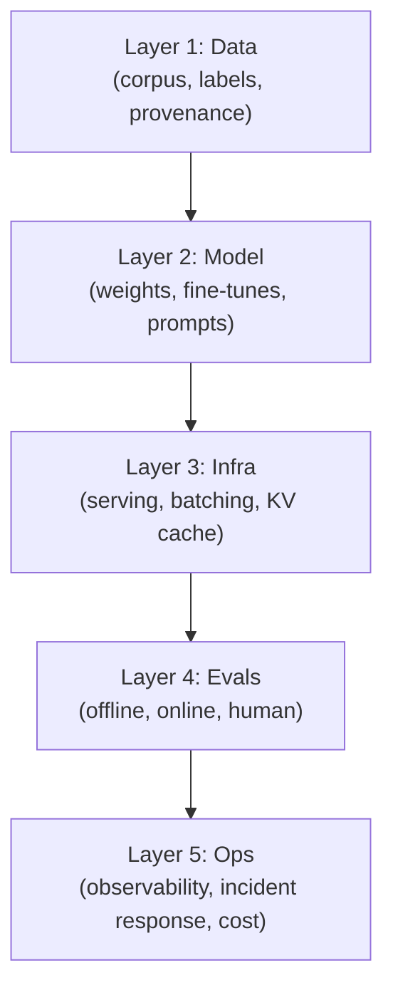
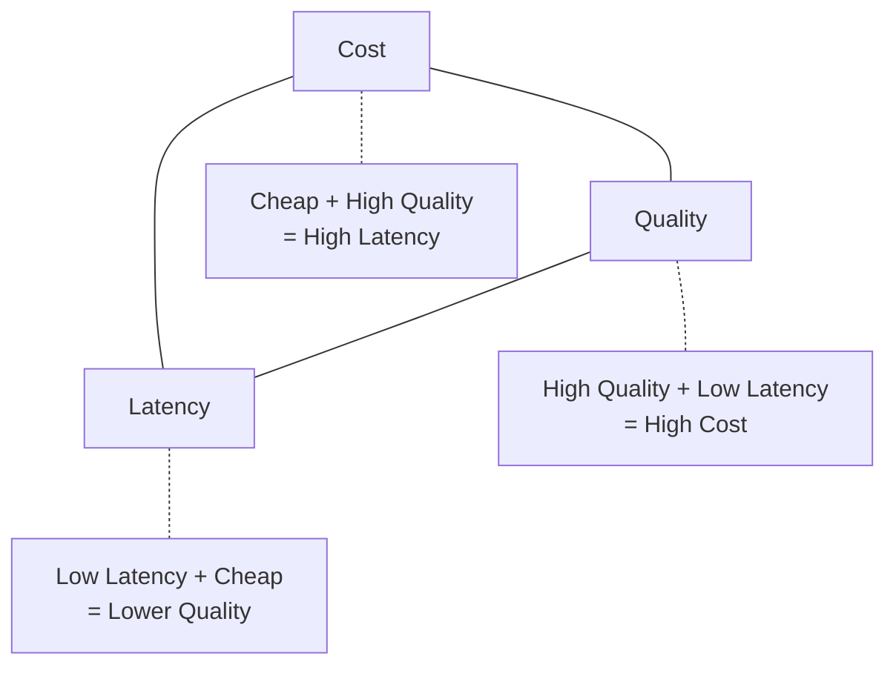
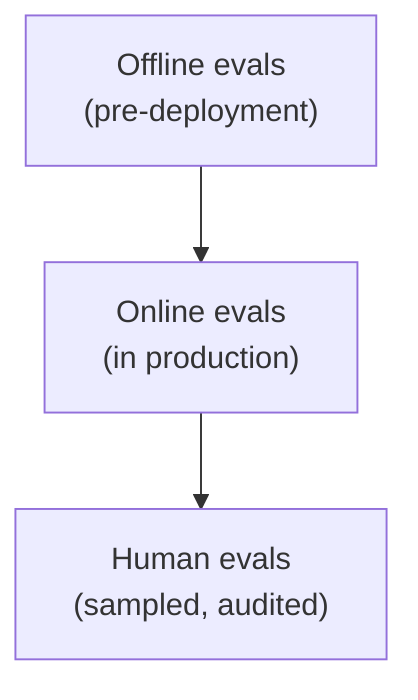

# AI Engineering Director Playbook
## Chapter 3

# AI Systems Literacy

> *"You don't have to be the smartest person in the room about AI. You have to be the person who knows which question to ask the smartest person in the room."*

---

## 1. Epigraph

You don't have to be the smartest person in the room about AI. You have to be the person who knows which question to ask the smartest person in the room.

---

## 2. Problem

Your staff ML engineer proposes: "We should fine-tune a 70B model on our customer data, deploy it on Bedrock, and replace our GPT-4o dependency. Saves $400K/year." You have 30 seconds to decide whether this is worth a 6-week conversation. If you say "yes, go" without understanding the cost-quality-latency tradeoff, the $400K becomes $1.2M and the latency budget blows. If you say "no" reflexively, you miss a legitimate moat argument. The literacy you need is not "be an ML researcher" — it is "know which layer of the AI stack is the bottleneck."

**Decision in one sentence:** AI literacy at the Director level is the ability to identify which of the 5 layers of an AI system (data, model, infra, evals, ops) is the bottleneck for a given product decision, and to ask the right questions of the right person at each layer.

---

## 3. Why AI Engineering Directors Fail Here

Five named failure modes of AI literacy at the Director level.

- **The Demo-Ware Illusion.** The Director approves a vendor based on the demo and doesn't ask "what's your eval harness?" Six months later, the production quality regresses and the team can't measure by how much. The Demo-Ware Illusion is what happens when "it works in the demo" substitutes for "we can measure it in production."
- **The Token-Cost Amnesia.** The Director focuses on per-token cost and forgets that *tokens per request* matters more. A "cheap" model with verbose prompts can be more expensive per request than a "premium" model with terse prompts. The Token-Cost Amnesia is the gap between $/token and $/request.
- **The Evals-Are-For-Researchers Fallacy.** The Director treats evaluation as an ML research activity, not a production engineering discipline. The team has a holdout set from 8 months ago and no online evals. Production drift goes undetected for months.
- **The Single-Model Tunnel Vision.** The Director standardizes on one model (one vendor, one architecture) and misses the multi-vendor reality. Different tasks have different cost-quality profiles; a Director who routes everything through one model is leaving performance and cost on the table.
- **The Capability-Ceiling Blindness.** The Director approves a fine-tune to teach the model something it categorically cannot do (counting letters, multi-hop reasoning over novel facts). The fine-tune ships, the production quality regresses, the Director is confused.

---

## 4. Mental Models

Four mental models for AI literacy.

**Mental model 1: The 5-Layer AI Stack.** Every AI system is a stack. Most production problems live in layers 1–4, not layer 5 (the model).



A Director who hears "the model is bad" should translate to "the stack has a quality issue at one of these 5 layers, almost never at layer 5 of the model." The fix is usually upstream.

**Mental model 2: The Cost-Quality-Latency Triangle.** You can only optimize two of three.



A Director who demands all three corners is asking for a vendor to lie to them. The right question is "which two corners does this workload need?"

**Mental model 3: The Eval Triad.** Three kinds of eval, all required.



Offline catches regressions before shipping. Online catches what offline missed. Human catches what neither of the above can. A "we have evals" claim without specifying all three is decoration.

**Mental model 4: The Bottleneck Finder.** Before approving any AI intervention, identify which layer is the bottleneck. The first question is always "where is quality actually failing?"

```
Layer 1 (Data):  Eval pass rate is high, production traffic is failing
                 → Likely data drift or label quality issue
Layer 2 (Model): Eval pass rate matches production failure pattern
                 → Likely model choice or fine-tune issue
Layer 3 (Infra): Eval passes, production latency/cost is the issue
                 → Likely serving architecture issue
Layer 4 (Evals): Production failures detected late or not at all
                 → Likely eval coverage issue (you don't know where to look)
Layer 5 (Ops):   Production failures detected, no response protocol
                 → Likely ops/observability issue
```

A Director who skips this diagnosis and jumps to "fine-tune" or "switch vendors" is treating symptoms.

---

## 5. Frameworks

Three frameworks for the conversations you will have.

### Framework 1: The Bottleneck Finder Checklist

Before approving any AI intervention, complete this 5-question diagnosis:

```
1. Where is the failure concentrated? (By user segment? Query type? Time window?)
2. Is the eval pass rate aligned with production failure rate?
   - High eval + high production failure = data drift (Layer 1)
   - Low eval + high production failure = model capability gap (Layer 2)
   - High eval + low production quality = eval coverage gap (Layer 4)
3. Is the failure mode about quality, latency, or cost?
4. Has the eval set been refreshed in the last 90 days?
5. What changed in production in the last 30 days that could have caused this?
```

The diagnosis takes 1 hour and saves weeks of misdirected work.

### Framework 2: The Vendor Question Checklist

For any AI vendor proposal, walk through this before approving:

```
1. What is the eval harness you used to produce your benchmark numbers?
2. What is the inter-annotator agreement on your eval set?
3. What is your eval refresh cadence?
4. How do you measure production drift?
5. What is your p50/p95/p99 latency at our expected traffic?
6. What is the cost model at our expected traffic?
7. What is your data-handling story? (Privacy, training opt-out, etc.)
8. What is the reversibility cost if we need to switch off you in 6 months?
```

A vendor that can't answer 1–3 is selling demo-ware.

### Framework 3: The Cost Projection Worksheet

For any AI feature, complete this before shipping:

```
1. Per-request cost (input + output tokens × token price)
2. Per-day cost (× requests per day)
3. Per-year cost at current volume
4. Per-year cost at 1.5× current volume (1 year out)
5. Per-year cost at 2× current volume (2 years out)
6. Revenue per request (or per resolved user task)
7. Gross margin per request
8. Cost of the worst-case incident (one bad month of production)
```

Run all numbers through `_shared/tools/cost_estimator.py`. Paste output verbatim.

---

## 6. Drill

You are the Director of AI at **acme-corp**. The CEO has just asked: "I read that 70B fine-tunes are now affordable. Can we replace our OpenAI dependency and save $400K/year?"

Your staff engineer's proposal: fine-tune Llama 3.1 70B on 100K labeled customer-support tickets, self-host on Bedrock, replace OpenAI GPT-4o for the customer-support chatbot.

You have **45 minutes**. Produce a **decision memo** (`portfolio/chapter-03-vendor-decision-memo.md`) using Framework 1 (Bottleneck Finder) and Framework 2 (Vendor Question Checklist, applied to the staff engineer's proposal). Use `_shared/tools/cost_estimator.py` to project the cost comparison.

**Deliverable:** `portfolio/chapter-03-vendor-decision-memo.md` — under 800 words.

---

## 7. Worked Example

**Decision:** Approve the Llama 3.1 70B fine-tune?

**Bottleneck Finder applied:**

```
1. Where is the failure concentrated? Chatbot accuracy is 78% on eval
   set; production traffic accuracy is ~72% (last audit, 4 months ago).
   Quality is uniformly distributed across query types — not a segment
   issue.

2. Eval pass rate vs. production failure rate:
   - Eval pass rate = 78%
   - Production failure rate = ~28% (estimated; no online evals running)
   - Gap = ~6 points
   - Likely data drift (Layer 1) + eval coverage gap (Layer 4). NOT a
     model capability issue (Layer 2).

3. Failure mode: Quality (not latency, not cost).
4. Eval set last refreshed: 4 months ago.
5. Production changes in last 30 days: traffic volume up 15%, query mix
   shifted toward refund-related queries.
```

Diagnosis: **The bottleneck is data drift + eval coverage, not model capability.** Fine-tuning a 70B model will not fix this — it will produce an overfit model that fails on the same drift that broke the original.

**Vendor Question Checklist applied to the staff engineer's proposal:**

```
1. Eval harness for benchmark numbers? "We don't have one for our data."
2. IAA on the eval set? "Unknown."
3. Eval refresh cadence? "Quarterly."
4. Production drift measurement? "We don't do this today."
5. Latency at our traffic (28K rpd)? "~1.2s p50, ~3.5s p95."
6. Cost at our traffic? (cost_estimator.py)
7. Data-handling story? "Bedrock, no training opt-out by default."
8. Reversibility cost if we switch off? "Low — fine-tuned weights are
   ours, model is open-source."
```

**Cost projection (Framework 3):**

```
$ python3 _shared/tools/cost_estimator.py \
    --input 1500 --output 500 --model gpt-4o --rpd 28000 --growth 0.25

Per request:       $0.0088
Per day:           $245.00
Per month:         $7,350.00
Per year (flat):   $89,250.00
Per year (growth): $128,994.69
```

```
$ python3 _shared/tools/cost_estimator.py \
    --input 1500 --output 500 --model llama-3.1-70b-self --rpd 28000 --growth 0.25

Per request:       $0.0016
Per day:           $44.80
Per month:         $1,344.00
Per year (flat):   $16,352.00
Per year (growth): $23,632.02
```

GPT-4o: ~$89K/year flat, ~$129K/year with growth.
Llama 3.1 70B self-hosted: ~$16K/year flat, ~$24K/year with growth.
**Gross savings: ~$73K–$105K/year, not $400K.** The $400K figure assumed a much larger volume and ignored infrastructure costs (~$30K/month GPU reservations = $360K/year — which would flip the math entirely).

**Decision: CONDITIONAL.**

1. **First** build the eval system (Ch 9 framework). Without it, neither GPT-4o nor a fine-tune is measurable. Approve eval build immediately; budget $200K + 1 FTE.
2. **Then** approve a *pilot*: fine-tune Llama 3.1 8B (not 70B) on 5K examples, measure against GPT-4o on the refreshed eval set. Budget $50K + 0.5 FTE. Time-boxed to 90 days.
3. **Decision gates for the pilot:**
   - Pilot model hits ≥90% of GPT-4o's eval pass rate → APPROVE full migration.
   - Pilot model hits 75–89% → APPROVE for non-customer-facing workflows only.
   - Pilot model hits <75% → KILL; stick with GPT-4o.
4. **The 70B fine-tune is premature.** 8B is the right size for a pilot; 70B requires infrastructure that may not pencil out for our volume.

**Why not approve the $400K claim:** The staff engineer inflated the savings by assuming our current spend is $400K and the new system is $0. The current spend is ~$89K; the new system is ~$16K + $360K infra = $376K. **The proposal would cost us $287K/year, not save $400K.** This is the Token-Cost Amnesia + Vendor Question Checklist gap.

---

## 8. Failure Mode Postmortem

A Director of AI at a 2,000-person fintech approved a 70B fine-tune migration based on a vendor's benchmark numbers and the team's enthusiasm. The migration took 6 months, cost $1.8M (engineering time + GPU reservations + vendor services), and shipped 3 months behind schedule.

In production, the fine-tuned model performed 8 points worse than GPT-4o on the team's *actual* traffic distribution. The vendor benchmarks had been on a different distribution (legal documents, not customer chat). The Director had not run Framework 2 (Vendor Question Checklist) — the vendor's eval set had IAA of 62% and the team never re-validated it. The team had not built an online eval system (Layer 4 gap), so production quality was estimated, not measured.

What they missed: Bottleneck Finder (Framework 1). The failure was in the data distribution and eval coverage, not in model capability. A 70B fine-tune on misaligned data produced a worse model than the GPT-4o baseline.

The lesson: AI literacy at the Director level is the ability to identify which layer is the bottleneck. A Director who jumps to "fine-tune" without diagnosing the bottleneck is approving a $1.8M guess.

---

## 9. Self-Assessment Rubric

| # | Dimension | 1 (Novice) | 3 (Competent) | 5 (Expert) |
|---|---|---|---|---|
| 1 | 5-Layer Stack diagnosis | "The model is bad" | Names 1-2 layers with evidence | Maps all 5 layers and ranks by likely impact |
| 2 | Cost-Quality-Latency trade-off | "We need all three" | Names 2 of 3 corners | Names the 2 corners per workload |
| 3 | Eval Triad coverage | Offline only | Names 2 of 3 eval types | All 3 active with cadence matched to role |
| 4 | Bottleneck Finder | Skips diagnosis | Runs the 5-question check | Identifies layer + intervention in <1 hour |
| 5 | Vendor Question Checklist | Trusts the demo | Asks 3-5 questions | Asks all 8 + tracks answers over time |

**Disqualifier:** any 1 on dimension 1 or 4. Skipping the diagnosis or jumping to model changes is the path to the Demo-Ware Illusion.

**Total:** ___ / 25. **Pass threshold:** 18/25, no dimension below 3.

---

## 10. Portfolio Artifact Note

Save your filled-in drill as `portfolio/chapter-03-vendor-decision-memo.md` — this is interview evidence for "How do you evaluate an AI vendor proposal?" and "Where is the bottleneck in an AI system?" (see Portfolio Map in Chapter 27).

---

## 11. Interview Questions

1. **Your team says "the model is bad, let's fine-tune." What's your first move?** (Grading: tests the Bottleneck Finder. The right answer is "diagnose which layer is the bottleneck" before "approve the fine-tune.")
2. **A vendor's benchmark numbers are 20 points higher than your internal eval. What do you do?** (Grading: tests Vendor Question Checklist. The right answer engages with distribution mismatch + eval IAA.)
3. **You want a chatbot that's cheap, high-quality, and low-latency. Pick two.** (Grading: tests Cost-Quality-Latency Triangle. The right answer names the two corners and explains the tradeoff.)
4. **Walk me through the layers of an AI system and where production problems usually live.** (Grading: tests the 5-Layer Stack. The right answer names all 5 layers and ranks by failure frequency.)
5. **Your CEO asks "can we save $400K/year by switching to open-source?" How do you respond in 60 seconds?** (Grading: tests the integration of Bottleneck Finder + cost_estimator + Vendor Question Checklist.)