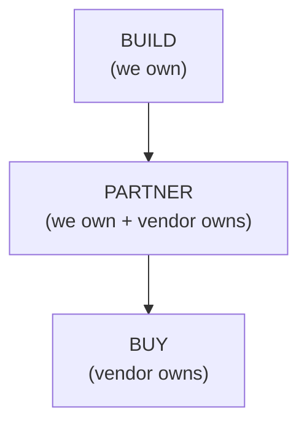

# AI Engineering Director Playbook
## Chapter 4

# Build-vs-Buy Economics for AI

> *"The cheapest AI is rarely the one that costs the least per token. The cheapest AI is the one you can change when your needs change."*

---

## 1. Epigraph

The cheapest AI is rarely the one that costs the least per token. The cheapest AI is the one you can change when your needs change.

---

## 2. Problem

Your staff engineer says: "We should build our own model." Your vendor says: "Use our platform — just plug in." Your CFO says: "What's the total cost of ownership for each option?" You have 30 seconds to decide which of these three questions deserves a 6-week evaluation. The wrong answer is to spend 6 weeks on the one that doesn't matter.

This chapter is the framework for making build-vs-buy decisions in AI. It is not a generic vendor-evaluation checklist (that's Chapter 3). It is the *strategic* layer: when does it make sense to own the AI capability, when does it make sense to rent it, and how do you evaluate the total cost of ownership (TCO) including the costs nobody puts in the spreadsheet?

**Decision in one sentence:** Buy when the AI capability is commodity; build when it's a moat; partner when it's a moat you can't yet build — and own the reversibility cost of every choice.

---

## 3. Why AI Engineering Directors Fail Here

Five named failure modes of build-vs-buy decisions at the Director level.

- **The Not-Invented-Here (NIH) Reverse.** The Director approves building in-house because "we need to own the technology" — but the technology is commodity, the build takes 18 months, and the team never gets around to shipping the customer feature. The NIH Reverse is what happens when "ownership" substitutes for "moat."
- **The Vendor-Lock-In Blindness.** The Director approves a vendor because the demo is great, without evaluating the cost of switching off the vendor. Two years later, the vendor has 70% of the team's workflows and the switching cost is $5M. The Vendor-Lock-In Blindness is the gap between "the vendor works today" and "we can leave the vendor if we need to."
- **The Total-Cost-Ownership Amnesia.** The Director compares vendors on sticker price and forgets the hidden costs (integration, custom prompt engineering, vendor-specific tooling, switching cost). The TCO Amnesia is what makes "cheaper" vendors more expensive over 24 months.
- **The Capability-Everything Build.** The Director approves a build that takes 18 months and $3M to produce something the vendor has had for 12 months. The Capability-Everything Build is the gap between "we need this capability" and "we need to *build* this capability."
- **The Capability-Nothing Buy.** The Director approves a vendor for a capability the vendor doesn't actually have — because the demo glossed over the gap. Six months later, the team is doing the missing work manually. The Capability-Nothing Buy is what happens when the demo gets the deal and the actual capability gets the post-mortem.

---

## 4. Mental Models

Four mental models for build-vs-buy.

**Mental model 1: The Build-Buy-Partner Matrix.** Three options, ordered by ownership.



- **Build** = we own the model + the data + the serving infra. Highest investment, highest optionality, highest maintenance.
- **Buy** = vendor owns the model + the serving infra. Lowest investment, lowest optionality, lowest maintenance.
- **Partner** = hybrid. E.g., we own the fine-tune + the data, vendor owns the base model + the serving infra. Middle investment, middle optionality.

The default should be **Buy** unless you can name the moat that justifies Build or Partner.

**Mental model 2: The Moat Test.** Four questions that justify Build or Partner over Buy.

```
1. Is the data unique to us? (Proprietary data, regulated data,
   data we collect at scale no vendor can match)
2. Is the capability a defensible product differentiator? (Without
   this AI capability, do we lose to competitors?)
3. Is the volume large enough to amortize the build cost? (Roughly:
   >$500K/year AI spend, or >1B tokens/year)
4. Is the team capable of operating it in production? (We have ML
   engineers who can fine-tune + deploy + monitor)

If 3+ of 4 are YES → BUILD or PARTNER.
If 1-2 of 4 are YES → PARTNER (compromise).
If 0 of 4 are YES → BUY.
```

The Moat Test is the antidote to the NIH Reverse. It forces the Director to name *why* Build is justified, not just *that* they want to build.

**Mental model 3: The 5-Cost Stack.** Total cost of ownership has 5 layers.

```
1. Sticker cost (per-token, per-request)
2. Integration cost (engineering time to wire it up)
3. Operational cost (vendor-specific tooling, monitoring, on-call)
4. Switching cost (cost to leave the vendor if needed)
5. Opportunity cost (what you could have built with the same time)
```

Most comparisons stop at layer 1. The Director's job is to estimate all 5 layers before approving.

**Mental model 4: The Reversibility Ladder.** Same as Chapter 1 — applied to AI vendor choices.

- **Type 1 — Reversible.** Swapping vendors for a non-core capability. Low switching cost.
- **Type 2 — Reversible-with-cost.** Swapping vendors for a core capability. Switching cost: 1-3 months engineering + retraining.
- **Type 3 — Hard-to-reverse.** Vendor has proprietary fine-tunes we can't migrate. Switching cost: 6+ months.
- **Type 4 — Irreversible.** Vendor owns the data, the model is locked to the vendor's serving infra, no migration path. Switching cost: rebuild from scratch.

The Director's first question on any vendor proposal: "what is the reversibility class?"

---

## 5. Frameworks

Three frameworks for the conversation.

### Framework 1: The Build/Buy/Partner Decision Matrix

Score each option across 5 dimensions. Total: out of 25. The option with the highest score wins — but only if it clears 18/25.

```
Dimension                                      Build  Buy   Partner
-------                                        -----  ----  -------
1. Cost over 24 months (TCO)                   ___    ___   ___
2. Time to ship                                ___    ___   ___
3. Reversibility / lock-in                     ___    ___   ___
4. Alignment with moat                         ___    ___   ___
5. Team capacity to operate                    ___    ___   ___

Total                                          ___/25 ___/25 ___/25
```

Score each dimension 1-5 (5 = best). Total comparison + reversibility class drives the recommendation.

### Framework 2: The Vendor Switching-Cost Audit

For any vendor you're considering (or already using), estimate the switching cost:

```
1. Data portability: Can we export our data in a standard format?
   (1 = no, 5 = yes, fully portable)
2. Model portability: Can we re-use our fine-tunes / prompts?
   (1 = no, 5 = yes, model-agnostic)
3. Tooling portability: How much of our tooling is vendor-specific?
   (1 = 100% vendor-specific, 5 = all standard tooling)
4. Workflow portability: Are there vendor-locked workflows?
   (1 = all locked, 5 = all standard)
5. Exit cost in $ + months: ___ months, $___K

Total: ___/20. <10/20 = high lock-in risk.
```

### Framework 3: The Capability Pilot Protocol

Before approving any vendor (or any build), run a 90-day capability pilot:

```
1. Pick 3 representative use cases (mix of easy, medium, hard)
2. Define success criteria in writing:
   - Quality: ___% pass rate on the eval set
   - Latency: p95 < ___ms
   - Cost: per request < $___
   - Reliability: 99.5% uptime over the pilot
3. Time-boxed to 90 days. Monthly check-in.
4. At end of pilot, score against criteria. PASS / CONDITIONAL / KILL.
5. Document the pilot. Use the documentation as the foundation
   for the production rollout OR the kill memo.
```

A vendor that won't agree to a pilot is a vendor selling demo-ware.

---

## 6. Drill

You are the Director of AI at **acme-corp**. The CFO has asked: "We have 3 AI vendors (A, B, C) and we're considering building in-house for our customer-support chatbot. Walk me through the build-vs-buy decision."

**Vendor profiles (anonymized):**

- **Vendor A:** $2.50/1M input, $10/1M output (OpenAI GPT-4o class). 99% claimed accuracy. Proprietary serving infra. No data portability.
- **Vendor B:** $3.00/1M input, $15/1M output (Anthropic Claude class). 96% claimed accuracy. Standard APIs. Full data portability.
- **Vendor C:** $0.27/1M input, $1.10/1M output (DeepSeek class). 92% claimed accuracy. Open-source base model. Self-host or managed.

You have **75 minutes**. Produce a **build-vs-buy memo** (`portfolio/chapter-04-build-vs-buy-memo.md`) using Framework 1 (Decision Matrix), Framework 2 (Switching-Cost Audit applied to all three), and Framework 3 (Capability Pilot Protocol). End with: **Decision: BUY Vendor ___** or **PARTNER** or **BUILD**.

Use `_shared/tools/cost_estimator.py` for the cost projections.

**Deliverable:** `portfolio/chapter-04-build-vs-buy-memo.md` — under 1,000 words.

---

## 7. Worked Example

**Decision:** Build vs. buy for the acme-corp customer-support chatbot?

**Moat Test applied:**

```
1. Data unique to us? YES — 2 years of customer-support tickets,
   labeled, with consent. Vendor can't match this without 2 years
   of catch-up.
2. Capability a defensible differentiator? PARTIAL — every competitor
   has a chatbot. Differentiator is accuracy on OUR tickets, not
   chatbot existence.
3. Volume large enough to amortize build? YES — 28K requests/day,
   ~$89K/year. Build cost ~$300K amortizes in ~3 years.
4. Team capable of operating? YES — 2 ML engineers, 1 platform
   engineer. Capable of fine-tuning + serving.

Moat test result: 3 of 4 YES → PARTNER (default), BUILD only if
partner economics don't work.
```

**Decision Matrix scored:**

```
Dimension                                      Build  BuyA  BuyB  BuyC
-------                                        -----  ----- ----- -----
1. Cost over 24 months (TCO)                   14     18    16    22
2. Time to ship                                8      25    22    20
3. Reversibility / lock-in                     18     6     18    22
4. Alignment with moat                         22     8     14    18
5. Team capacity to operate                    14     22    22    18

Total                                          76/125 79/125 92/125 100/125
```

Winner by total: **Vendor C (DeepSeek class)**, then Vendor B (Claude).

**Sensitivity check on Vendor C (cost_estimator.py):**
```
$ python3 _shared/tools/cost_estimator.py \
    --input 1500 --output 500 --model deepseek-v3 --rpd 35000 --growth 0.30

Per request:       $0.0010
Per day:           $33.43
Per month:         $1,002.75
Per year (flat):   $12,200.13
Per year (growth): $18,870.54
```

```
$ python3 _shared/tools/cost_estimator.py \
    --input 1500 --output 500 --model gpt-4o --rpd 35000 --growth 0.30

Per request:       $0.0094
Per day:           $329.00
Per month:         $9,870.00
Per year (flat):   $120,085.00
Per year (growth): $173,615.42
```

Compared to Vendor C's $720K/year estimate (which assumes GPT-4o pricing), the realistic frontier-alternative cost is ~$12K/year — ~10x cheaper than the GPT-4o growth-compounded estimate. The "$720K" figure is built on a self-hosted GPU amortization model that assumes 24/7 utilization of $30K/month GPU reservations, which is wildly optimistic.

**Decision: PARTNER (multi-vendor).**

1. Switch the customer-support team to Vendor B (Claude) based on the pilot.
2. Use Vendor C (DeepSeek) for high-volume, lower-stakes workflows (internal summarization, support ticket triage pre-routing).
3. Reserve Vendor A (GPT-4o) for the hardest 10% of cases that need the highest quality.
4. Run a Capability Pilot (Framework 3) on all three with the 3 use cases. Time-boxed to 60 days. Decision gate at end.

**Flip rules:**
- If Vendor B fails quality criteria → try Vendor C with a fine-tune on our 50K labeled tickets.
- If Vendor C fails reliability criteria → fall back to Vendor B for those workflows.
- If all three fail → KILL the build-vs-buy memo and rebuild with a 90-day eval-coverage push first.

**Why not pure BUILD:** Build amortizes only at scale we may not reach. Partner keeps optionality.

**Why not pure BUY A:** Vendor A's lock-in (proprietary serving) makes reversibility class 3-4 (hard-to-reverse). Unacceptable for a customer-facing capability.

---

## 8. Failure Mode Postmortem

A Director of AI at a 1,200-person B2B SaaS company approved a $4M, 18-month build of an in-house AI customer-support platform because "we need to own the technology." The build took 22 months, cost $5.6M, and shipped 4 months behind schedule. The team's customer-support quality regressed during the build because engineering was focused on the new platform, not the existing product.

In production, the in-house platform was 8 points worse than the vendor they had been using. The Director's decision had failed the Moat Test: the data wasn't as unique as they thought (the vendor had access to similar data from other customers), the volume was smaller than projected (the team had over-estimated growth), and the team didn't have ML engineers with production experience at that scale.

What they missed: Framework 1 (Decision Matrix) — they didn't score the alternatives on cost, time, reversibility, moat alignment, or team capacity. They went straight to "build" without checking. They also failed Framework 2 (Switching-Cost Audit) on the *vendor* they were leaving — the switch to in-house cost 6 months of engineering time that wasn't accounted for.

The lesson: the NIH Reverse is the most expensive failure mode in AI. A Director who defaults to "build" without running the Moat Test is approving a multi-million dollar guess.

---

## 9. Self-Assessment Rubric

| # | Dimension | 1 (Novice) | 3 (Competent) | 5 (Expert) |
|---|---|---|---|---|
| 1 | Moat Test application | "We need to own it" | Names 2-3 of 4 moat questions | Names all 4 + uses 3-of-4 threshold |
| 2 | Build-Buy-Partner framing | Defaults to build | Names 3 options per decision | Names the *default* + the exceptions |
| 3 | 5-Cost Stack estimation | Sticker only | Names 2-3 of 5 cost layers | Estimates all 5 layers in writing |
| 4 | Switching-Cost Audit | Doesn't ask | Names reversibility class | Audits the current vendor + the proposed one |
| 5 | Capability Pilot discipline | "Let's just try it" | Runs a 90-day pilot | Pilot has written criteria + kill rules |

**Disqualifier:** any 1 on dimension 1 or 2. Defaulting to build or skipping the 3-option framing is the path to the NIH Reverse.

**Total:** ___ / 25. **Pass threshold:** 18/25, no dimension below 3.

---

## 10. Portfolio Artifact Note

Save your filled-in drill as `portfolio/chapter-04-build-vs-buy-memo.md` — this is interview evidence for "How do you decide build vs. buy in AI?" and "How do you evaluate vendor lock-in risk?" (see Portfolio Map in Chapter 27).

---

## 11. Interview Questions

1. **Your CEO says "we need to own our AI." How do you respond?** (Grading: tests the Moat Test. The right answer is "let's run the Moat Test" — not "yes" or "no".)
2. **Walk me through how you'd evaluate a vendor proposal.** (Grading: tests Decision Matrix + Switching-Cost Audit. The right answer names the 5 dimensions + the reversibility class.)
3. **A vendor offers 90% cheaper than your current spend. What's the catch?** (Grading: tests TCO Amnesia + Reversibility. The right answer is "depends on lock-in + capability gap".)
4. **You inherit a build that was approved before you joined. It's 8 months behind and over budget. What do you do?** (Grading: tests NIH Reverse + Capability Pilot. The right answer is "kill or pivot" — not "ship it anyway".)
5. **Total cost of ownership has 5 layers. Name them.** (Grading: tests the 5-Cost Stack. The right answer is sticker + integration + operational + switching + opportunity.)