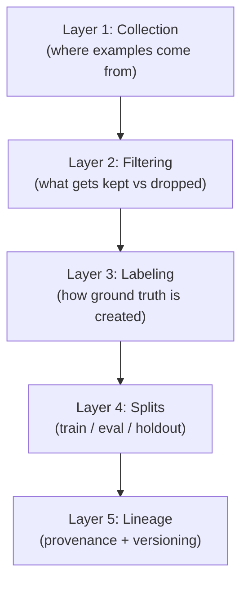
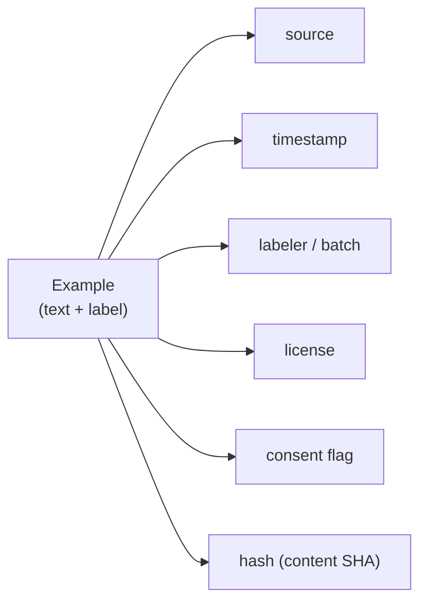

# AI Engineering Director Playbook
## Chapter 5

# Data Foundations

> *"Your model is only as good as the data you can hold it accountable to."*

---

## 1. Epigraph

Your model is only as good as the data you can hold it accountable to.

---

## 2. Problem

Your staff ML engineer walks in and says: "We need $400K for a data labeling contract. Three vendors are bidding. The CTO wants this signed by Friday." The right answer is not in the vendor proposals — it is in understanding what *data* your system actually needs, where it lives, who labels it, and how its quality degrades over time. Most Directors under-invest in this question and over-invest in the vendor choice. The vendor choice matters; the data architecture underneath the vendor matters more.

This chapter is the data layer of the AI stack (Chapter 3, Layer 1) made operational. It is not a data-engineering survey. It is the literacy you need to evaluate a labeling vendor, audit a training corpus, and defend a data-quality decision in front of a board that has just seen a model fail.

**Decision in one sentence:** Treat data as the most consequential production asset in any AI system — with versioning, quality gates, ownership, and a refresh cadence — before you spend a dollar on a model.

---

## 3. Why AI Engineering Directors Fail Here

Five named failure modes of AI data at the Director level.

- **The Vendor-Default Trap.** The Director picks a labeling vendor based on the slickest demo and the largest logo list. Six months later, label quality varies by 12 percentage points across vendor batches, and the model has learned subtle biases the Director didn't know were in the labels.
- **The Frozen-Eval Set.** The Director inherits or builds an eval set and never refreshes it. The model improves on the eval, but production traffic drifts. By the time anyone notices, the eval score and the production score have diverged by 20+ points.
- **The Labeler-as-Oracle Fallacy.** The Director treats the labeled output as ground truth. In reality, labelers disagree, labelers drift, and labelers encode the bias of the labeler pool. A 92% inter-annotator agreement sounds high; it means 8% of your "ground truth" is random noise the model is trying to learn.
- **The Provenance Vacuum.** The Director cannot answer "what data was this model trained on?" with anything better than "we think it's the production traffic from Q2." No SHA, no version tag, no lineage from a customer ticket to the example that informed a model response. When the regulator asks, the answer is "we'll get back to you."
- **The Synthetic-Data Mirage.** The Director approves using synthetic data to fill training-set gaps because "the model needs more examples." The model improves on internal benchmarks. The model regresses on production traffic because the synthetic data was generated by a model that shared the original model's biases.

---

## 4. Mental Models

Four mental models that compress AI data into something you can navigate.

**Mental model 1: The Data Stack.** Like the AI stack (Ch 3), data is a 5-layer system, and each layer has its own quality bar.



A Director who hears "the model is bad" should translate to "the data stack has a quality issue at one of these 5 layers, almost never at the model itself." The fix is almost always upstream.

**Mental model 2: The Label-Quality Triangle.** Three quality attributes, and you can only optimize two at once.

- **Accuracy** — labels match a true gold standard.
- **Coverage** — labels exist for the full distribution of inputs you'll see in production.
- **Speed** — labels are produced fast enough to keep the training set fresh.

A vendor that delivers 99% accuracy on 1% of your distribution in 1 week is worse than a vendor that delivers 92% accuracy on 80% of your distribution in 4 weeks. The first is overfit; the second is shippable.

**Mental model 3: The Eval Cadence Ladder.** Eval sets need refresh cadences matched to their role.

- **Pre-train eval** — refreshed every model iteration, days-to-weeks.
- **Pre-deploy eval** — refreshed every release, weeks-to-months.
- **Production eval** — sampled continuously, refreshed monthly.
- **Drift eval** — sampled quarterly, refreshed when distribution shifts.

A Director who says "we have an eval set" without specifying *which kind* and *what cadence* doesn't have an eval system. They have a measurement artifact.

**Mental model 4: The Provenance Receipt.** Every example in your training set should carry a small metadata record: source, timestamp, labeler (or labeler batch ID), license, and any consent flags.



The Provenance Receipt doesn't need to be a heavy system on day 1 — even a CSV column per example is enough. The point is that the receipt *exists*, can be regenerated for any example, and survives the model deployment.

---

## 5. Frameworks

Three frameworks for the conversations you will have.

### Framework 1: The Label-Vendor Decision Matrix

For each labeling vendor, score on 5 dimensions (1 = poor, 5 = strong):

```
Dimension                                          Score (1-5)
-------                                            ------
1. Inter-annotator agreement (their internal QA)   ___
2. Domain familiarity                              ___
3. Throughput at your quality bar                  ___
4. Cost per example at quality bar                 ___
5. Audit trail + labeling guideline transparency  ___

Total: ___/25
```

A vendor below 15/25 should not be your primary. A vendor below 20/25 should be paired with an internal QA pass.

### Framework 2: The Eval-Set Audit Checklist

For every eval set your team uses, complete this audit quarterly:

```
1. Last refresh date: ___
2. Source distribution match to production traffic
3. Label quality: IAA ≥ 85% on a 50-sample re-label?
4. Any labels older than 6 months?
5. Score gap between eval and production: ___ points
6. Can we regenerate every example's source + labeler? Hash-stable?
```

Three or more unchecked items is a system about to fail an audit.

### Framework 3: The Data-Refresh Decision Memo

When a dataset needs refresh (new domain, drift detected, labeler turnover), answer these 7 questions before approving the spend:

```
1. What changed in production that this refresh addresses?
2. What's the cost of NOT refreshing?
3. How many new examples do we need?
4. Where do those examples come from?
5. Who labels them and how is quality verified?
6. How does this refresh the eval set, not just the training set?
7. What is the rollback plan if the new data makes the model worse?
```

The Data-Refresh Decision Memo is what the Director signs instead of "Vendor X proposal attached, please approve." It is the difference between "we are spending $400K" and "we are spending $400K on *this specific* problem, with *this specific* measure of success."

---

## 6. Drill

You are the Director of AI at **acme-corp**. Three labeling vendors have bid on a $400K contract to label 200,000 customer-support tickets for an AI training corpus:

- **Vendor A:** $1.80/example, 99.2% claimed accuracy, no domain history in customer support.
- **Vendor B:** $2.50/example, 94% claimed accuracy, has labeled 3 prior customer-support corpora for Fortune 500 companies, publishes inter-annotator agreement.
- **Vendor C:** $1.20/example, 96% claimed accuracy, large scale, no per-domain track record, recent news article about high labeler turnover.

You have **60 minutes**. Produce a **vendor selection memo** (`portfolio/chapter-05-vendor-memo.md`) using Framework 1 (Vendor Decision Matrix), a partial application of Framework 3 (Data-Refresh Decision Memo), and at least 3 questions from Framework 2 (Eval-Set Audit). End with: **Decision: Vendor ___** with conditions and flip rules.

**Deliverable:** `portfolio/chapter-05-vendor-memo.md` — under 800 words.

---

## 7. Worked Example

**Vendor Decision Matrix scores:**

| Dimension | Vendor A | Vendor B | Vendor C |
|---|---|---|---|
| 1. Inter-annotator agreement | 2 (claim, no proof) | 5 (published) | 2 (claim) |
| 2. Domain familiarity | 1 (no history) | 5 (3 prior corpora) | 2 (general) |
| 3. Throughput at quality bar | 3 | 4 | 5 |
| 4. Cost per example at quality bar | 5 ($1.80) | 3 ($2.50) | 5 ($1.20) |
| 5. Audit trail + guidelines | 2 | 4 | 2 |
| **Total** | **13/25** | **21/25** | **16/25** |

Vendor A fails on dimensions 1 and 2. Vendor C's $1.20 price is appealing but the recent labeler-turnover news is a leading indicator of quality drift. Vendor B is the most expensive but has the only verifiable IAA and domain track record.

**Eval-Set Audit (partial):**

1. Last refresh date: 8 months ago. **Red flag.**
2. IAA last measured at 78% on a 50-sample re-label. **Below 85% threshold.**
3. 12% of examples cannot be regenerated to source + labeler. **Provenance gap.**

**Data-Refresh Decision Memo (partial):**

- Q1 (what changed): Drift detected — eval and production have diverged by 14 points over 6 months.
- Q2 (cost of NOT refreshing): ~$300K/year in deflection miss.
- Q3 (how many): ~150K examples stratified across 8 ticket categories.
- Q7 (rollback): New labels versioned + hashable; new model revertible in <1 hour.

**Decision: Vendor B** — conditional on:

1. Sign at $2.50 × 150K = $375K (under budget).
2. **Before** any new labels accepted: 200-sample pilot with double-labeling (Vendor B + internal staff). **Kill criterion:** IAA < 85% → switch to hybrid Vendor A + internal-team approach.
3. **Bundle the deal:** Vendor B's contract must include 5,000 expert-reviewed eval-set examples with provenance receipts for every example. This is the eval-set repair.
4. Flip to Vendor A if Vendor B's pilot IAA < 70%.

**Why not Vendor C despite the price:** Recent labeler-turnover news is a leading indicator of quality drift. The $1.30/example savings × 150K = $195K, but a 5% label-quality miss = 7,500 mislabeled examples the model will try to learn. The expected cost of those mislabels is several times the savings.

---

## 8. Failure Mode Postmortem

A Director of AI at a 2,000-person fintech signed a $1.2M labeling contract with a top-3 vendor based on their demo and brand. The vendor delivered 600,000 labeled examples over 6 months at claimed 98% accuracy. The model trained on these labels launched in production and performed 9 points worse than the previous model on internal evals.

The audit, two months later, found: 14% of labels were wrong on a 1,000-sample re-label by an independent team. The vendor's IAA had collapsed from 91% to 73% mid-contract due to labeler turnover the vendor had not disclosed. The Provenance Receipts the Director had requested were sparse — many examples were missing labeler IDs entirely.

What they missed: every Framework 2 audit question. The vendor's accuracy claim was never independently verified. IAA was never measured during the contract. Provenance was incomplete. The Eval-Set Audit had not been run.

The lesson: a labeling contract without ongoing quality measurement is a bet that the vendor's demo was honest.

---

## 9. Self-Assessment Rubric

| # | Dimension | 1 (Novice) | 3 (Competent) | 5 (Expert) |
|---|---|---|---|---|
| 1 | Data-stack bottleneck layer | "The labels are wrong" | Names 1-2 of 5 layers with evidence | Maps all 5 layers and ranks by likely impact |
| 2 | Label-quality tradeoffs | Trusts vendor claims | Names accuracy/coverage/speed trade-off | Specifies minimum IAA + coverage thresholds before contracting |
| 3 | Eval cadence by role | "We have an eval set" | Names 2 cadences (pre-train, pre-deploy) | Names all 4 cadences + drift triggers |
| 4 | Provenance discipline | "We track this in our system" | Asks for labeler + timestamp per example | Requires Provenance Receipts in contracts, with audit trail |
| 5 | Data spend with conditions | Signs vendor proposal | Names a quality threshold | Pre-commits kill criteria + flip rules + bundled eval repair |

**Disqualifier:** any 1 on dimension 2 or 4. Trusting vendor claims or skipping provenance is the path to the Frozen-Eval Set + Vendor-Default Trap.

**Total:** ___ / 25. **Pass threshold:** 18/25, no dimension below 3.

---

## 10. Portfolio Artifact Note

Save your filled-in drill as `portfolio/chapter-05-vendor-memo.md` — interview evidence for "How do you evaluate an AI labeling vendor?" and "How do you avoid the demo-ware trap in data?" (see Portfolio Map in Chapter 27).

---

## 11. Interview Questions

1. **A vendor offers 99% accuracy at half the price of the incumbent. What do you do?**
2. **You discover your eval set is 8 months stale and 12% of labels can't be traced back to a labeler. What now?**
3. **Your CTO says "use synthetic data to fill the gap." Push back how?**
4. **A regulator asks "what data was this model trained on?" You have 24 hours. Are you ready?**
5. **Walk me through the most expensive data mistake you've seen, and what guardrail would have prevented it.**