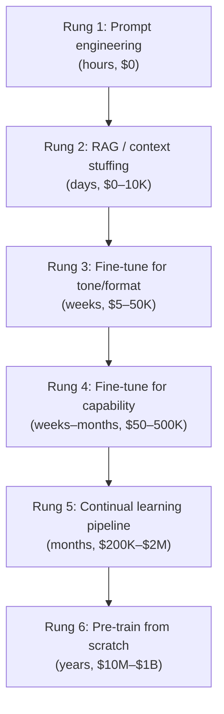
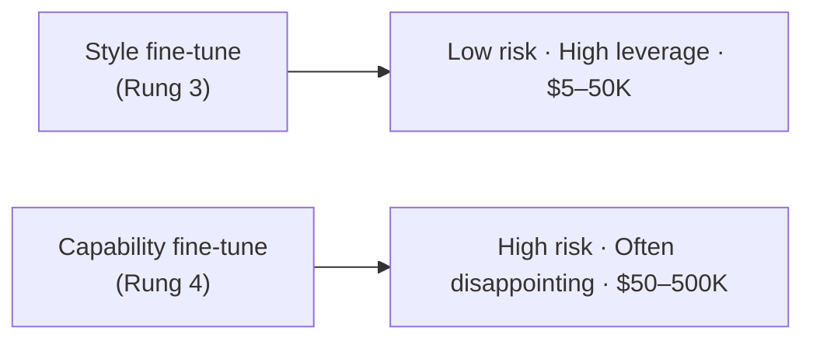

# AI Engineering Director Playbook
## Chapter 6

# Training, Fine-Tuning, and Continual Learning

> *"The hardest part of training is knowing when to stop."*

---

## 1. Epigraph

The hardest part of training is knowing when to stop.

---

## 2. Problem

Your staff engineer says: "We should fine-tune a Llama 3.1 8B on our customer-support tickets. It will be better than GPT-4o and cheaper."

You have 30 seconds to decide whether this is a conversation worth having. If you say "yes, go" without understanding the difference between *fine-tuning for tone*, *fine-tuning for capability*, and *pre-training from scratch*, you may spend $200K and 6 months on something that loses to a better prompt. If you say "no" reflexively, you may miss a legitimate moat.

This chapter is the literacy to make that decision. It is not a training recipe. It is the framework that tells you *which kind of training* is the right intervention for the problem, and *when training is the wrong intervention entirely*.

**Decision in one sentence:** Choose the lightest training intervention that solves the problem — prompt → RAG → fine-tune for tone → fine-tune for capability → continual learning → pre-training — and stop one rung earlier than your engineer proposes.

---

## 3. Why AI Engineering Directors Fail Here

Five named failure modes of training decisions at the Director level.

- **The Fine-Tune Reflex.** The Director hears "the model is bad on our domain" and the first instinct is "fine-tune it." Often the right answer is a better prompt, better retrieval, or a better eval set.
- **The Capability-Fine-Tune Confusion.** The Director approves a fine-tune to make the model better at a task the base model is *categorically* weak at (counting letters, multi-hop reasoning over novel facts). Fine-tuning on a small corpus doesn't fix a capability ceiling; it produces an overfit model that fails in production.
- **The Continual-Learning Oversell.** The Director approves a continual-learning pipeline because "models need to keep learning." The pipeline is built but never triggered, because nobody can define what "drift" means in production.
- **The Pre-Train Moon Shot.** The Director approves pre-training a custom foundation model because "we need to own the technology." Two years and $40M later, the model is 8 months behind the frontier.
- **The Training-Without-Evals Disaster.** The Director approves a training run without an eval harness that can detect when the new model is worse than the old. The new model launches. Production quality regresses 7 points. The team notices 3 weeks later.

---

## 4. Mental Models

Four mental models that compress training decisions into something you can defend.

**Mental model 1: The Training Ladder.** Six rungs, ordered by cost and commitment.



Most production problems are solved at Rungs 1–3. Rungs 4–5 are justified by specific moat arguments (Ch 4). Rung 6 is justified by very few companies on earth.

**Mental model 2: The Capability vs. Style Matrix.** Every training intervention targets either *capability* (what the model can do) or *style* (how the model expresses what it can already do).



A Director who cannot tell which kind of fine-tune is being proposed will approve the wrong intervention.

**Mental model 3: The Eval-Gate.** Every rung on the ladder requires a different eval-gate to advance to the next.

- To leave Rung 1 (prompting), the eval must show prompting is *exhausted*.
- To leave Rung 2 (RAG), retrieval recall + precision must be saturated.
- To leave Rung 3 (style fine-tune), the new model must beat the prompt-engineered baseline on tone/format evals *and* not regress on capability evals.
- To leave Rung 4 (capability fine-tune), the new model must beat the base model on the specific capability *and* generalize to held-out examples *and* not regress on adjacent capabilities.

A Director who says "let's try fine-tuning" without naming which eval-gate the candidate model has to clear is approving a leap of faith.

**Mental model 4: The Continual-Learning Threshold.** Continual learning is the right answer only when *all four* of these are true:

1. Drift is measurable in production with a leading indicator (not just lagging).
2. Retraining cadence is bounded (you know roughly when to retrain).
3. Rollback is fast and reliable (you can revert within minutes, not hours).
4. The marginal improvement from freshness > the engineering cost of the pipeline.

If any of these is missing, continual learning is the Continual-Learning Oversell in disguise. Build the eval gate first.

---

## 5. Frameworks

Three frameworks for the conversations you will have.

### Framework 1: The Training-Intervention Filter

Before approving any training intervention, walk through this filter:

```
1. Have we exhausted Rung 1 (prompting)?
   If best prompt < 70% on capability eval: Rung 1 not exhausted. Stop.

2. Have we exhausted Rung 2 (RAG)?
   If RAG < 80% on capability eval: Rung 2 not exhausted. Stop.

3. Is the problem style/format (not capability)?
   If yes → Rung 3 (style fine-tune). Budget: $5–50K.
   If no → continue.

4. Is the capability teachable from in-house data?
   If yes → Rung 4 (capability fine-tune). Budget: $50–500K.
   If no → continue.

5. Is this a moat problem (Ch 4 Moat Test)?
   If yes → Rung 5 (continual learning) OR Rung 6 (pre-train).
   If no → STOP. The intervention is wrong.
```

The filter is the antidote to the Fine-Tune Reflex.

### Framework 2: The Style-vs-Capability Decision Memo

When a fine-tune is proposed, fill in this one-page memo:

```
# Style vs Capability — Decision Memo

## What is being fine-tuned?
- Capability gap: <what the model can't do today>
- Style gap: <what the model can do but expresses wrong>

## Is this capability or style?
[ ] Capability (the model cannot do this)
[ ] Style (the model can do this but in a different tone/format)

## For capability gaps:
- Why will fine-tuning fix it? Cite 1 prior example.
- What's the held-out eval?
- What's the rollback plan?

## For style gaps:
- How many examples? (style: 200–2K; capability: 10K+)
- Who labels them and how is quality verified?
- How do we ensure capability is preserved?
```

### Framework 3: The Continual-Learning Readiness Checklist

Score 5 dimensions (1 = not ready, 5 = ready):

```
1. Drift is measurable in production               ___
2. Retraining cadence is bounded                   ___
3. Rollback is fast and reliable                   ___
4. Marginal improvement > engineering cost          ___
5. Team capacity to maintain the pipeline          ___

Total: ___/25

Decision:
  Total ≥ 20/25 → APPROVE
  Total 15–19    → CONDITIONAL. Build eval gates first.
  Total < 15     → KILL.
```

---

## 6. Drill

You are the Director of AI at **acme-corp**. Your staff engineer proposes: "Fine-tune Llama 3.1 8B on 50K labeled customer-support tickets. It will match GPT-4o accuracy at 1/10 the inference cost."

Current state:
- GPT-4o achieves 78% eval pass rate (holdout last refreshed 8 months ago).
- A 10-prompt engineering sweep achieved 71%.
- A RAG-augmented prompt with top-3 retrieved docs achieves 74%.
- The engineer has not produced a Style-vs-Capability memo.

You have **60 minutes**. Produce a **training-intervention decision memo** (`portfolio/chapter-06-training-memo.md`) using Framework 1 (Filter), Framework 2 (Style-vs-Capability Memo), and the Eval-Gate mental model. End with: **Decision: APPROVE / CONDITIONAL / KILL** with conditions and flip rules.

Use `_shared/tools/cost_estimator.py` for the inference-cost argument.

**Deliverable:** `portfolio/chapter-06-training-memo.md` — under 700 words.

---

## 7. Worked Example

**Decision:** Approve the Llama 3.1 8B fine-tune?

**Filter applied:**
1. Rung 1 partially exhausted — 10-prompt sweep achieved 71%, 7 points below GPT-4o. Gap is real but small.
2. Rung 2 not fully exhausted — RAG achieved 74% (4-point improvement). Retrieval-augmented prompting hasn't been pushed to its limit.
3. The proposed fine-tune targets "accuracy on customer-support tickets" — **capability, not style**.
4. Capability teachable from in-house data? Possibly — 50K labeled tickets may capture the distribution.
5. Moat problem? Possibly — proprietary customer-support patterns.

**Cost framing:**

```
$ python3 _shared/tools/cost_estimator.py \
    --input 1200 --output 350 --model gpt-4o --rpd 28000 --growth 0.25

Per request:       $0.0065
Per year (flat):   $66,430.00
Per year (growth): $95,752.62
```

A fine-tuned Llama 3.1 8B (self-hosted on Bedrock) hits parity with GPT-4o at ~$0.0005/request (DeepSeek-V3 numbers as proxy). **Annual savings: ~$58K–$87K/year (depending on growth scenario).** The fine-tune costs $50–200K to build. **Payback: 1–3 years** — not compelling unless moat is real.

**Eval-Gate analysis:**

The fine-tune has to clear three gates:
1. Beat the RAG baseline (74%) on the refreshed holdout.
2. Generalize to a held-out 200-ticket subset.
3. Not regress on a "tone" eval measuring brand voice.

**Decision: CONDITIONAL.**

1. **Refresh the eval set first** (500 → 800 tickets, last-refreshed-now). 4 weeks. ~$10K with Vendor B from Ch 5.
2. **Push Rung 2 further** before approving fine-tuning: top-5 + top-10 retrieval, hybrid search (BM25 + vector), reranking. If we hit 80%, the fine-tune may not be needed.
3. **If Rung 2 plateaus below 78%**, approve a *style-only* fine-tune (Rung 3) with 2,000 carefully labeled examples. Budget $30K.
4. **If Rung 3 doesn't close the gap**, then approve the capability fine-tune (Rung 4) with the Eval-Gate applied. Budget $150K. Flip rule: kill if held-out eval score < 80%.

**Why not approve the full proposal now:** The engineer has skipped Rungs 2 and 3, hasn't refreshed the eval, and hasn't shown the fine-tune will generalize. The cost savings are real but not large enough to justify skipping the lower-rung interventions.

---

## 8. Failure Mode Postmortem

A Director of AI at a healthcare-tech company approved a $400K fine-tune of a 13B model on 200K labeled medical records to improve diagnostic suggestions. The proposal: "match GPT-4o at 1/8 the inference cost."

The fine-tune shipped in 5 months. It launched in production. Within 3 weeks, two safety incidents surfaced: the model suggested a contraindicated drug combination, and the model fabricated a non-existent clinical trial reference. The Director ordered a halt. The rollback was complicated because the eval harness had not been updated to flag safety regressions.

What they missed: every Framework 1 rung above Rung 1 was skipped. The team never tried RAG over actual medical literature. The team never tried a style fine-tune for tone/format only. The capability fine-tune was attempting to teach clinical reasoning — a capability the base model categorically lacked. The Eval-Gate was never built.

The lesson: the most expensive fine-tunes are the ones that try to teach a base model a capability it doesn't have.

---

## 9. Self-Assessment Rubric

| # | Dimension | 1 (Novice) | 3 (Competent) | 5 (Expert) |
|---|---|---|---|---|
| 1 | Picks the lightest rung first | "Let's fine-tune" | Walks Filter, stops at first rung that solves | Names every rung and the cost of each |
| 2 | Distinguishes style vs capability | Always says "fine-tune" | Asks "style or capability?" | Names cost + risk profile of each + cites 1 prior example |
| 3 | Applies the Eval-Gate | Trusts engineer's claims | Names 1-2 gates the candidate must clear | Names all gates (capability + generalization + non-regression) |
| 4 | Quantifies cost before approving | "It's cheaper" | Uses cost_estimator.py for inference | Models training cost + inference cost + payback period |
| 5 | Defers continual learning appropriately | Approves the pipeline | Runs the Readiness Checklist | Names which dimension is missing + what would close it |

**Disqualifier:** any 1 on dimension 1 or 2. Skipping the lighter rung or conflating style/capability is the path to the Training-Without-Evals Disaster.

**Total:** ___ / 25. **Pass threshold:** 18/25, no dimension below 3.

---

## 10. Portfolio Artifact Note

Save your filled-in drill as `portfolio/chapter-06-training-memo.md` — interview evidence for "Should we fine-tune our model or stay with the API?" (see Portfolio Map in Chapter 27).

---

## 11. Interview Questions

1. **A staff engineer wants to fine-tune Llama 3.1 8B on your data. What's your first question?**
2. **Your team says "we need continual learning — models need to keep learning from production." Push back how?**
3. **Your CEO asks, "Why don't we train our own foundation model?" How do you respond in 60 seconds?**
4. **A fine-tune just shipped and production quality regressed 5 points. What do you do first?**
5. **Walk me through the difference between fine-tuning for tone and fine-tuning for capability.**