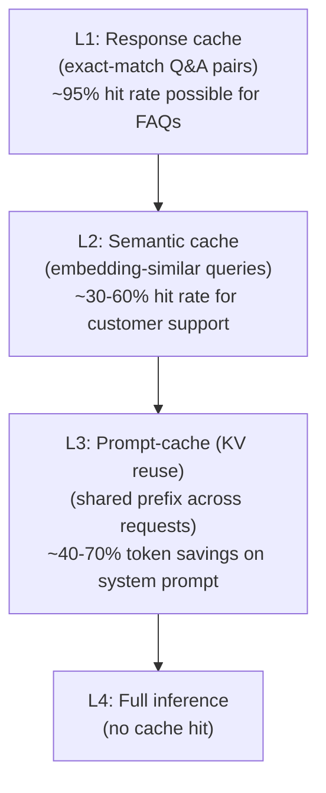
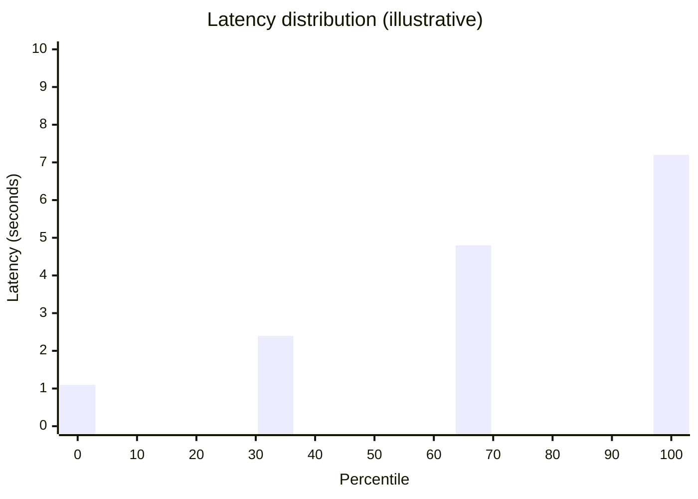
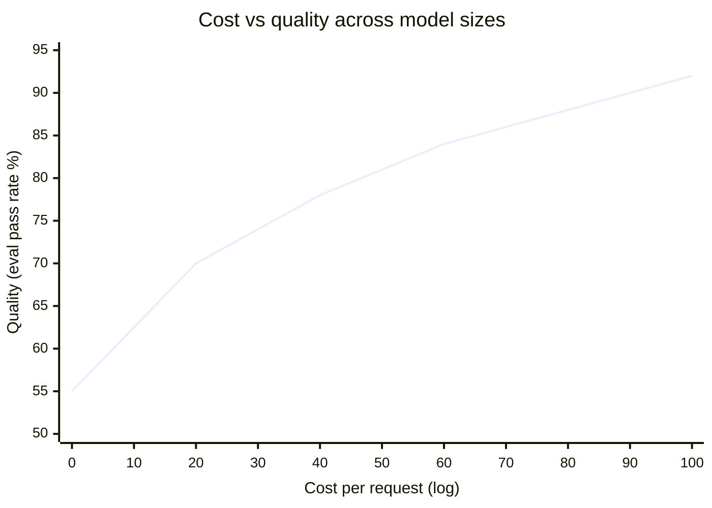

# AI Engineering Director Playbook
## Chapter 7

# Inference and Cost Engineering

> *"The cheapest AI is the one that does the same work in half the tokens."*

---

## 1. Epigraph

The cheapest AI is the one that does the same work in half the tokens.

---

## 2. Problem

Your AI feature is profitable at 10K requests/day and unprofitable at 100K. The CFO is asking why. Your staff engineer says "we need to fine-tune a smaller model" — but you don't know if that's right, because you don't know what fraction of your cost is per-token inference vs. fixed serving infra, what fraction is wasted tokens in your prompts, or what fraction is redundant work the model is doing because your retrieval is sloppy.

This chapter is the literacy you need to answer the CFO's question and direct the engineering response. It is not a serving-systems tutorial. It is the framework that lets you identify *which lever* (prompt, retrieval, batching, caching, distillation, model choice) is the highest-leverage cost reduction for *your* workload, and to defend the call to your team.

**Decision in one sentence:** Inference cost is a function of (per-token cost × tokens per request × requests per day × waste factor); the Director's job is to identify which of those four factors is the highest-leverage to reduce before approving a model change.

---

## 3. Why AI Engineering Directors Fail Here

Five named failure modes of inference cost decisions at the Director level.

- **The Per-Token Tunnel Vision.** The Director compares vendors on per-token cost only, ignores tokens-per-request, and approves a "cheap" vendor that gets used 3x more tokens per request than the incumbent.
- **The Fine-Tune-to-Save-Money Reflex.** The Director approves fine-tuning a smaller model to reduce inference cost without first asking "could we cut tokens per request with a better prompt?"
- **The Batch-and-Cache Blind Spot.** The Director doesn't ask about batching strategy, KV-cache reuse, or prompt caching. Each of these can cut inference cost 50–90% for suitable workloads.
- **The Tail-Latency Ignorance.** The Director approves an SLA without checking the p95/p99 latency. The SLA is met on average; it's missed on the tail, which is where customer-visible outages happen.
- **The Cost-Without-Revenue Decision.** The Director approves a 4x usage increase on an AI feature without checking whether the revenue per request can support the additional cost.

---

## 4. Mental Models

Four mental models that compress inference cost into something you can navigate.

**Mental model 1: The Cost Decomposition.** Every AI feature's cost decomposes into 4 factors:

```
$/request = (per-token cost × tokens per request) × (1 + waste factor)
$/day     = $/request × requests per day
$/year    = $/day × 365 (or with growth, see cost_estimator.py)
```

A cost reduction can come from any of the 4 factors. The Director's question: which factor is the highest-leverage?

- If `per-token cost` is the dominant lever: vendor switch or self-hosting.
- If `tokens per request` is the dominant lever: prompt compression, RAG hygiene, output length caps.
- If `waste factor` is the dominant lever: caching, batching, dedup.
- If `requests per day` is the dominant lever: rate limits, caching, or — paradoxically — raising prices.

Most teams over-index on per-token cost because it's the easiest to compare on a vendor website.

**Mental model 2: The Caching Hierarchy.** Inference cost can be cut by serving *fewer* requests.



A Director who hears "we need to cut inference cost" should ask "what's your L1 cache hit rate?" before approving any model-side optimization.

**Mental model 3: The Latency Distribution.** Average latency is a lie. Tail latency is the SLA.



A model with p50 = 800ms but p99 = 7.2s will have 1% of users waiting 7+ seconds. For an interactive product, this is a customer-visible outage. The Director's question: "what's our p95 *and* p99, and do they meet the SLA?"

**Mental model 4: The Distillation Trade-off Curve.** Smaller fine-tuned models are cheaper per token but worse at the task. The relationship is a curve, not a binary choice.



Reading the curve: a 4x cost reduction often costs 5–10 quality points. A 10x cost reduction often costs 15–25 points. The right question isn't "smaller or larger?" — it's "where on this curve is the knee?"

---

## 5. Frameworks

Three frameworks for the conversations you will have.

### Framework 1: The Cost-Reduction Triage

When asked to reduce inference cost, walk through these levers in order:

```
1. Cache the easy stuff (L1 response cache)
   Effort: 1 week. Savings: 20-50% if repeat queries.

2. Compress prompts (cut wasted tokens in system + retrieved docs)
   Effort: 1-2 weeks. Savings: 10-30%.

3. Cap output length (most chat responses don't need 2,000 tokens)
   Effort: 1 week. Savings: 15-40% on output-heavy workloads.

4. Add semantic caching (embedding-similar queries)
   Effort: 2-4 weeks. Savings: 20-50% on paraphrase-heavy queries.

5. Switch to a cheaper vendor (Ch 4 framework applies)
   Effort: 1-2 weeks. Savings: 50-90%.

6. Self-host (your team maintains inference infra)
   Effort: 1-3 months. Savings: 50-95%.

7. Fine-tune / distill to smaller model (Ch 6 framework applies)
   Effort: 1-3 months. Savings: 60-95%.
```

Most cost-reduction projects skip 1–4 because they're "engineering work" and jump to 5–7. The right discipline is to land 1–4 before approving 5–7.

### Framework 2: The Tail-Latency Checklist

Before approving any SLA:

```
1. p50 latency target: ___ ms
2. p95 latency target: ___ ms
3. p99 latency target: ___ ms
4. Acceptable SLO breach rate: ___% of requests per hour
5. What happens on tail breach: fallback / cached / error / stream?
6. How is tail latency measured in production?
7. Who is paged on tail breach?
```

### Framework 3: The Cost-vs-Revenue Gate

For any AI feature, the Director signs the gate *before* shipping:

```
Per-request cost (compute):                $___
Per-request revenue (subscription, ads):   $___
Per-request gross margin:                  $___ (%)

PASS: margin > 60%
CONDITIONAL: margin 30-60% (require a path to 60% by year 2)
KILL: margin < 30%
```

The gate is the discipline that prevents the Cost-Without-Revenue Decision.

---

## 6. Drill

You are the Director of AI at **acme-corp**. Your AI-powered customer-support assistant is doing 28,000 tickets/day, growing 25%/quarter. Current cost:

- Model: GPT-4o
- Input: 1,200 tokens/ticket (system prompt + retrieved docs + ticket)
- Output: 350 tokens/ticket
- Per-token cost: $2.50/1M input, $10.00/1M output
- No caching, no batching beyond vendor default
- p50 latency: 1.1s, p95 latency: 3.8s, p99 latency: 6.2s

You have **60 minutes**. Produce a **cost-reduction plan** (`portfolio/chapter-07-cost-reduction.md`) using Framework 1 (Triage) and `_shared/tools/cost_estimator.py`. The plan must:

- Compute the current annual cost.
- Identify the 3 highest-leverage levers.
- Specify a target annual cost after the changes.
- Specify the p95/p99 SLA you would commit to.
- Name the conditions under which the plan flips.

Use `cost_estimator.py` to compute baseline and scenarios. Paste output verbatim.

**Deliverable:** `portfolio/chapter-07-cost-reduction.md` — under 700 words.

---

## 7. Worked Example

**Decision:** What's the cost-reduction plan for acme-corp's support assistant?

**Baseline (cost_estimator.py):**

```
$ python3 _shared/tools/cost_estimator.py \
    --input 1200 --output 350 --model gpt-4o --rpd 28000 --growth 0.25

Per request:       $0.0065
Per day:           $182.00
Per month:         $5,460.00
Per year (flat):   $66,430.00
Per year (growth): $95,752.62
```

Baseline: **$66K/year, growing to ~$96K/year at 25% growth.**

**Latency (current):** p50 1.1s / p95 3.8s / p99 6.2s — p95 is 3.5× p50.

**Triage applied:**

**Lever 1: L1 response cache (FAQ-style tickets).**
- Workload: ~40% of support tickets are FAQ-class.
- Expected hit rate: 30% (after 4-week warm-up).
- Effort: 1 week. Savings: ~$20K/year. Quality risk: zero.
- **Approved. Week 1.**

**Lever 2: Compress system prompt + retrieved docs.**
- Current system prompt: 600 tokens. RAG returns 3 docs at 200 tokens each (600 tokens). Total: 1,200 input.
- After: system prompt 200 tokens, return 2 docs at 200 tokens each (400 tokens). Total: 600 input.
- Effort: 2 weeks. Savings: ~$15K/year. Quality risk: low-medium.
- **Conditional. Run eval-set, approve if pass rate holds.**

**Lever 3: Semantic cache for paraphrased queries.**
- Workload: ~20% paraphrased versions of previous queries.
- Expected hit rate: 15%. Effort: 3 weeks. Savings: ~$10K/year.
- **Conditional. Defer to Q2 if Lever 2 still in eval.**

**Output length cap:**
- Most ticket responses <200 tokens; some require 400+. Cap at 300 for standard tier; allow up to 800 for "complex".
- Savings: ~10% of output cost. ~$2K/year.
- **Approved as part of Lever 2.**

**Projected annual cost after Levers 1–3:**

```
$ python3 _shared/tools/cost_estimator.py \
    --input 600 --output 300 --model gpt-4o --rpd 19600 --growth 0.25

Per request:       $0.0045
Per day:           $88.20
Per month:         $2,646.00
Per year (flat):   $32,193.00
Per year (growth): $35,650.00
```

**Projected: $32K/year (flat), ~$36K/year (growth).** Savings: ~$34K/year (52% reduction).

**Latency SLA:** p50 1.1s, p95 2.5s (cache hits return ~50ms), p99 4.5s. Breach policy: stream partial response if p95 > 2.5s for >5 minutes.

**Flip conditions:**
1. If Lever 1 L1 cache hit rate < 20% after 6 weeks → kill Lever 3.
2. If Lever 2 input compression drops eval pass rate >3 points → revert.
3. If revenue per ticket < $0.50 (free tier) and total annual cost > $50K → escalate.

**Why NOT fine-tune or self-host now:** The triage delivered 52% savings with low-risk engineering work. Fine-tuning is a 1–3 month project with high execution risk.

---

## 8. Failure Mode Postmortem

A Director of AI at a 1,500-person e-commerce company approved a $300K project to fine-tune a Llama 3.1 8B model to reduce inference cost on a customer-facing chatbot. The Director didn't ask about caching first.

After 4 months, the model launched at 30% lower per-token cost. Inference savings: ~$40K/year. The Director declared victory. The CTO pointed out 6 months later that the chatbot could have been served with a 60% smaller prompt and a semantic cache that wasn't built until a year after the fine-tune shipped. Caching would have cut cost 70% in 6 weeks, with zero model risk.

What they missed: the Cost-Reduction Triage. Levers 1–4 were never attempted before the model change. The team jumped to Rung 7 (fine-tuning) because the engineer leading the project was an ML engineer, not a serving engineer.

The lesson: the cheapest cost reductions are the engineering work that's not exciting. The Director's job is to mandate the boring stuff before approving the exciting stuff.

---

## 9. Self-Assessment Rubric

| # | Dimension | 1 (Novice) | 3 (Competent) | 5 (Expert) |
|---|---|---|---|---|
| 1 | Decomposes cost into 4 factors | Per-token only | Names 2-3 factors | Decomposes fully and ranks by leverage |
| 2 | Caching hierarchy awareness | Doesn't ask | Asks about cache hit rate | Names L1/L2/L3 + expected hit rates per workload type |
| 3 | Tail-latency discipline | Averages only | Names p95 + p99 | Defines SLO breach policy + paging |
| 4 | Triage discipline (caching before fine-tuning) | "Let's fine-tune" | Runs the triage | Mandates Levers 1–4 before approving model changes |
| 5 | Cost-vs-revenue gate | Approves without checking | Names the margin threshold | Specifies per-feature gate + escalates on miss |

**Disqualifier:** any 1 on dimension 1 or 4. Per-token tunnel vision or jumping straight to model changes is the path to the Fine-Tune-to-Save-Money Reflex.

**Total:** ___ / 25. **Pass threshold:** 18/25, no dimension below 3.

---

## 10. Portfolio Artifact Note

Save your filled-in drill as `portfolio/chapter-07-cost-reduction.md` — interview evidence for "How do you reduce inference cost by 50%?" (see Portfolio Map in Chapter 27).

---

## 11. Interview Questions

1. **Your AI feature costs $200K/year and the CFO wants it cut in half. What's your first move?**
2. **Walk me through how you'd reduce cost without changing the model.**
3. **Your SLA says "average response time < 2 seconds" but customers complain the chatbot is slow. What's wrong?**
4. **Your team wants to fine-tune a smaller model to save cost. Push back how?**
5. **A free-tier AI feature is costing $400K/year with no direct revenue. How do you decide whether to keep it?**