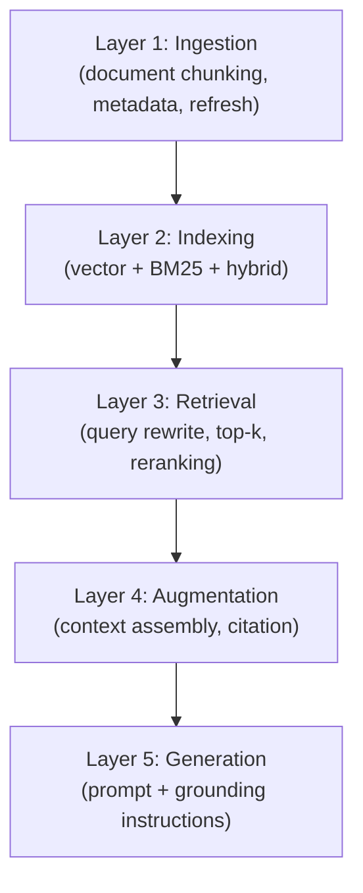
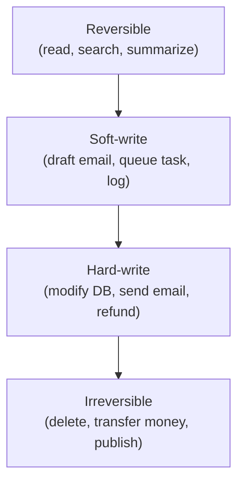

# AI Engineering Director Playbook
## Chapter 8

# Retrieval, Agents, and Tooling

> *"Retrieval is what you know. Tool-use is what you can do. Agents are the difference between a chatbot and a colleague."*

---

## 1. Epigraph

Retrieval is what you know. Tool-use is what you can do. Agents are the difference between a chatbot and a colleague.

---

## 2. Problem

Your staff engineer proposes: "We should build an AI agent that can query our customer database, draft a refund, and send an email — all autonomously." The board loves it. The CTO is excited. The engineer estimates 6 weeks.

You have 30 seconds to decide whether this is a conversation worth having. If you say "yes" without naming the failure modes, the agent ships, sends 47 inappropriate refund emails, and you are asked to leave. If you say "no" reflexively, you miss the legitimate use cases that *do* work and that your competitors will ship.

This chapter is the literacy to make that call. It is the Rung-2 / Rung-4 / Rung-5 of the Training Ladder (Ch 6), the Layer 3 of the AI Stack (Ch 3), and the most operationally risky category of AI feature.

**Decision in one sentence:** Retrieval-augmented generation (RAG) is the default for any knowledge-grounded AI feature; tool-use is justified only when the action is reversible and bounded; agents are justified only when the workflow has well-defined checkpoints, rollbacks, and human-in-the-loop gates at each irreversible action.

---

## 3. Why AI Engineering Directors Fail Here

Five named failure modes of retrieval, agents, and tooling at the Director level.

- **The Vector-Database-as-Silver-Bullet.** The Director approves a vector DB + embedding pipeline for every RAG use case, ignoring that vector search alone often loses to hybrid search (BM25 + vector) for keyword-heavy corpora (legal, code, technical docs).
- **The Agent-Everything Reflex.** The Director approves agent architectures for problems that don't need them — FAQ bots, content generation, simple classification.
- **The Irreversible-Action Trap.** The Director approves an agent that calls refund APIs, sends emails, or modifies production databases without human-in-the-loop gates. The agent makes a mistake at 3am. The mistake is irreversible. The Director is asked to resign.
- **The Tool-Soup Architecture.** The Director approves a 47-tool agent because "users might want to do anything." The agent's prompt bloats, tool-selection accuracy drops, and the model hallucinates tool calls.
- **The Context-Stuffing Anti-Pattern.** The Director approves stuffing 20 documents into the model's context window to "be thorough." Token cost explodes, the model loses focus, and answer quality drops.

---

## 4. Mental Models

Four mental models that compress retrieval, agents, and tooling into something you can navigate.

**Mental model 1: The RAG Stack.** Retrieval is its own 5-layer stack.



A RAG system that fails on accuracy usually fails at L1 (chunking) or L3 (retrieval quality), not at L5 (the model). The Director's first question: "what's our retrieval recall@10?"

**Mental model 2: The Reversibility Stack.** Every tool an agent calls has a reversibility profile.



A tool in category R or S can be safely called by an autonomous agent. A tool in category H requires a human-in-the-loop gate (the agent drafts, a human approves). A tool in category I should not be called by an agent without explicit human approval per action.

**Mental model 3: The Agent Checkpoint.** A safe agent architecture has checkpoints at every irreversible action.

```
Step 1: Read user request + state (reversible)
Step 2: Plan steps (reversible)
Step 3: Tool call 1 (depends on tool)
Step 4: [CHECKPOINT] if any tool was hard-write, pause for human approval
Step 5: Tool call 2
Step 6: [CHECKPOINT] same logic
Step 7: Compose response (reversible)
Step 8: Return to user
```

**Mental model 4: The Context-Window Trade-off.** More context is not always better.

- *Token cost* — every retrieved doc is a token.
- *Attention dilution* — the model's focus on the most relevant doc drops as context grows.
- *Latency* — long contexts take longer to process.

The right context size is the smallest set of documents that hits your retrieval-precision target.

---

## 5. Frameworks

Three frameworks for the conversations you will have.

### Framework 1: The Retrieval Quality Audit

For any RAG system, complete this audit before approving changes:

```
1. Chunking strategy: size documented (200-500 tokens)? Overlap (10-20%)?
   Metadata preserved (title, section, date)?
2. Indexing: vector index? BM25 / keyword? Hybrid search configured?
3. Retrieval: top-k (3-10)? Reranker? Query rewriting?
4. Augmentation: citation in response? "Not found" handling? Token budget?
5. Generation: grounding instructions? Failure mode ("I don't know")?
   Eval set with retrieved-context accuracy?
```

### Framework 2: The Agent Approval Gate

For any proposed agent architecture, walk through this gate:

```
1. Does this problem need an agent? (multi-step, tool-use, state)
   If no → single prompt or RAG. STOP.

2. Are all tool calls reversible or soft-write?
   If no → add human-in-the-loop checkpoint for each hard-write.

3. Are there irreversible tools in scope?
   If yes → require explicit per-action human approval. STOP without it.

4. What's the worst-case failure cost?
   [ ] Customer-visible (e.g. wrong refund)
   [ ] Data-integrity (e.g. wrong DB write)
   [ ] Compliance (e.g. wrong disclosure)

5. What's the rollback plan?
   Time to disable the agent: ___
   Time to undo the worst-case action: ___

6. What's the eval set?
   [ ] Multi-step task completion accuracy
   [ ] Tool-selection accuracy
   [ ] Hard-write approval accuracy (false-positive rate)
```

### Framework 3: The Tool Audit

Every 6 months, audit the agent's tool list:

```
Tool         | Last used in production? | Failure rate | Reversibility | Keep / Remove
-------------|--------------------------|--------------|---------------|---------------
send_email   | Yes                      | 2%           | H             | Keep + human gate
```

Tools that aren't used are attack surface and prompt bloat. Tools that fail at >5% should be redesigned or human-gated. Irreversible tools should be removed unless business-critical.

---

## 6. Drill

You are the Director of AI at **acme-corp**. Your staff engineer proposes: "Build an AI agent that can look up customer orders, draft refund emails, and process refunds up to $200 autonomously. Approval required for refunds > $200."

You have **60 minutes**. Produce an **agent approval gate memo** (`portfolio/chapter-08-agent-memo.md`) using Framework 2 (Agent Approval Gate). For each of the 6 questions, write a 1-paragraph answer grounded in acme-corp's context. End with: **Decision: APPROVE / CONDITIONAL / KILL**.

**Deliverable:** `portfolio/chapter-08-agent-memo.md` — under 900 words.

---

## 7. Worked Example

**Decision:** Approve the AI agent at acme-corp?

**Gate applied:**

- **Q1 (does it need an agent?).** Refund processing involves multi-step work: look up order, validate return window, check prior refund history, draft email, queue refund. **Yes — agent-shaped.**
- **Q2 (reversibility?).** `lookup_order` (read), `validate_return_window` (read), `check_prior_refunds` (read), `draft_email` (soft-write), `process_refund` (**hard-write, NOT reversible without human**). **Human-in-the-loop gate required for every refund.**
- **Q3 (irreversible tools?).** `process_refund` is hard-write but reversible within 24 hours (refund-reversal flow exists). **Not fully irreversible; human gate is sufficient.**
- **Q4 (worst-case failure cost?).** Customer-visible wrong refund ($200 max — bounded), wrong email tone (recoverable), data-integrity risk on order record (mitigated by human gate). **Customer-visible but bounded.**
- **Q5 (rollback plan?).** Disable agent: <5 minutes. Reverse a wrong refund: <24 hours. Reverse a wrong email: <1 hour. **Acceptable.**
- **Q6 (eval set?).** Multi-step task completion accuracy ≥95%; tool-selection accuracy ≥98%; refund-amount accuracy 100%; human-approval trigger accuracy 100% on >$200 refunds.

**Retrieval Quality Audit (partial):** Current RAG over refund-policy docs: recall@10 = 72%. **Below the 80% target.**

**Decision: CONDITIONAL.**

1. Hit retrieval recall@10 ≥ 85% on the refund-policy corpus before agent launch.
2. Build the eval set (Q6) and run a 200-scenario dry-run with the engineering team acting as the human-in-the-loop.
3. Ship with the human-in-the-loop gate **enabled by default** — never ship "autonomous mode" without a 30-day observation period.
4. Audit the tool list every 30 days for the first 6 months; remove unused tools.

**Flip rules:**
- Refund-amount accuracy < 100% in dry-run → kill.
- Multi-step task completion < 90% → extend dry-run by 4 weeks.
- Tool-selection accuracy < 95% → simplify the tool list.

**Why not kill:** The reversible profile is acceptable; the human-in-the-loop gate neutralizes the irreversible-action risk; rollback plan is fast; eval set will catch the worst failure modes before launch.

---

## 8. Failure Mode Postmortem

A Director of AI at a 1,000-person fintech approved a customer-service agent that could issue refunds up to $500 autonomously. The proposal was approved in a 30-minute skip-level based on a demo. The agent launched 4 weeks later.

Within 3 weeks, the agent issued 47 inappropriate refunds — including 12 to customers who had previously been flagged as fraudulent. Total: $18,400 in chargebacks, $4,200 in support costs to recover relationships, and one customer escalated the issue to the regulator. The Director was asked to leave within 6 months.

What they missed: every Agent Approval Gate question. Q1 was answered with "yes, agents are powerful" rather than "yes, this is agent-shaped." Q2 was skipped. Q3 was skipped — the agent had access to `delete_account` (irreversible tool) never used in testing. Q4 was answered with "we'll see." Q5 had no plan. Q6 had no eval set.

The lesson: the Agent Approval Gate is what catches the Irreversible-Action Trap.

---

## 9. Self-Assessment Rubric

| # | Dimension | 1 (Novice) | 3 (Competent) | 5 (Expert) |
|---|---|---|---|---|
| 1 | Locates RAG stack bottleneck layer | "The model is bad" | Names 1-2 of 5 RAG layers | Maps all 5 layers and ranks by likely impact |
| 2 | Distinguishes agent from non-agent problems | "Agents for everything" | Asks "does this need tool-use?" | Names the 3 conditions that justify an agent |
| 3 | Applies the Reversibility Stack | Treats all tools as equivalent | Asks "is this reversible?" | Maps every tool to R/S/H/I and specifies human gate |
| 4 | Builds Agent Checkpoints | No checkpoints | 1 checkpoint per workflow | Checkpoints at every hard-write tool call |
| 5 | Audits the tool list | Never audits | Yearly audit | Quarterly + post-incident |

**Disqualifier:** any 1 on dimension 2 or 3. Approving agents for non-agent problems or skipping reversibility analysis is the path to the Irreversible-Action Trap.

**Total:** ___ / 25. **Pass threshold:** 18/25, no dimension below 3.

---

## 10. Portfolio Artifact Note

Save your filled-in drill as `portfolio/chapter-08-agent-memo.md` — interview evidence for "How do you decide whether to build an AI agent?" (see Portfolio Map in Chapter 27).

---

## 11. Interview Questions

1. **Your team wants to build a customer-facing AI agent that can issue refunds. Walk me through your decision.**
2. **Your RAG system returns wrong answers 20% of the time. What's the first thing you check?**
3. **An engineer says "we need 30 tools in our agent because users want flexibility." Push back how?**
4. **Your agent is slow. The engineer says we should add more context. What do you say?**
5. **Walk me through the most dangerous AI agent you've seen ship.**