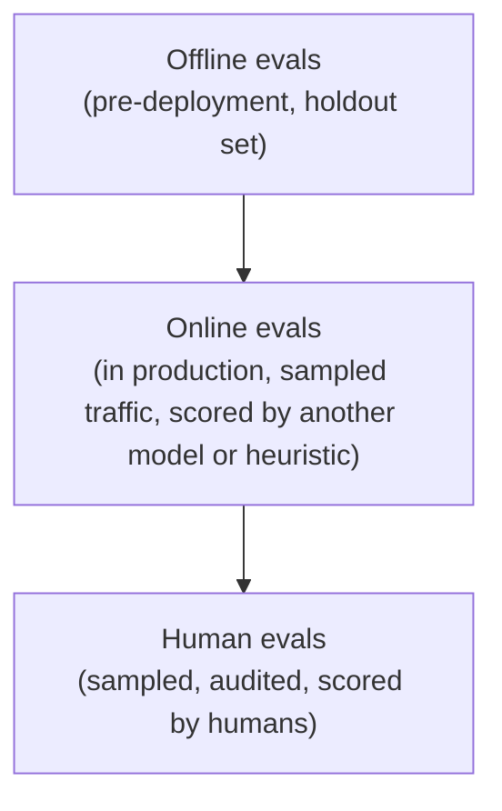
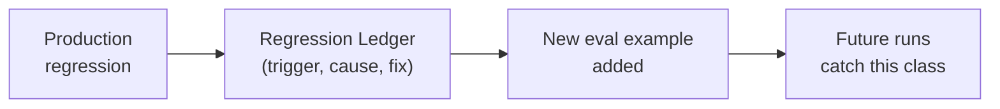

# AI Engineering Director Playbook
## Chapter 9

# Evaluation as a First-Class Discipline

> *"An AI system without an eval harness is a Demo with a Runway."*

---

## 1. Epigraph

An AI system without an eval harness is a Demo with a Runway.

---

## 2. Problem

Your team has shipped 12 AI features in the last 18 months. None of them has an eval harness that runs in production. Every regression is caught by a customer complaint, escalated to a Slack thread, and resolved by a panicked Friday-night deploy. The CTO has just asked: "How do we know our AI features are working?"

If you answer with "we have a holdout set," you've answered the wrong question. The right question is "do we have *eval coverage across the 3 eval types* (offline / online / human), with *cadence matched to the role of the eval*, and a *clear ownership chain* from a passing eval to a shippable feature?"

This is the closing chapter of Part II. It pulls together the Eval Triad (Ch 3 Mental Model 3), the eval cadences (Ch 5 Mental Model 3), and the Eval-Gate (Ch 6 Mental Model 3) into a single operational discipline.

**Decision in one sentence:** Evaluation is a first-class engineering discipline with its own team, its own cadence, and its own budget — measured by *time-to-detect-regression*, not by "we have a holdout set."

---

## 3. Why AI Engineering Directors Fail Here

Five named failure modes of evaluation at the Director level.

- **The Holdout-Set-as-Eval-System Fallacy.** The Director treats a frozen holdout set as "our evals." The holdout is 8 months old. Production traffic has drifted. The holdout score and the production score have diverged by 15 points.
- **The LLM-as-Judge Overconfidence.** The Director approves an LLM-as-judge eval without validating the judge's accuracy on the task. The judge's scores diverge from human scores by 25 points on the same examples.
- **The No-Production-Eval Trap.** The Director treats eval as a pre-deployment activity. Production traffic has no eval sampling. Drift goes undetected for months.
- **The Eval-Ownership Vacuum.** The Director cannot answer "who owns the eval harness?" Every team assumes someone else does. The harness rots.
- **The Single-Metric Tunnel Vision.** The Director optimizes for one metric (accuracy, or pass-rate, or human-preference) and misses the others (latency, cost, safety, refusal rate).

---

## 4. Mental Models

Four mental models that compress AI evaluation into something you can defend.

**Mental model 1: The Eval Triad.** Every AI system needs three kinds of eval, and missing any one produces a different kind of failure.



- **Offline evals** catch regressions before shipping.
- **Online evals** catch what offline missed (distribution shift, novel inputs).
- **Human evals** catch what neither of the above can (subtle bias, technically-correct-but-tone-deaf responses).

**Mental model 2: The Time-to-Detect Metric.** The single most useful eval-system metric is *how long between a regression shipping and the eval system detecting it*.

- Best in class: <24 hours.
- Average: 1–2 weeks.
- Worst in class: detected only by customer complaint (often 1–3 months after shipping).

The Time-to-Detect metric is what the Director reports to the CEO and the board.

**Mental model 3: The LLM-as-Judge Validation.** An LLM-as-judge is fast, cheap, and *only as accurate as the validation against human scores*. The validation is non-optional.

```
For every LLM-as-judge in your system:
1. Sample 200 examples the judge has scored.
2. Have 2 humans re-score the same examples (blind to judge scores).
3. Compute judge-vs-human agreement (target: ≥85% pairwise).
4. If agreement < 85%, the judge is not safe to use as a primary eval.
5. Re-validate quarterly; judges drift.
```

**Mental model 4: The Regression Ledger.** Every regression detected in production should be logged with: trigger (what eval caught it or what customer report), root cause, fix, and *a new example added to the eval set*.



---

## 5. Frameworks

Three frameworks for the conversations you will have.

### Framework 1: The Eval-System Audit Checklist

For every AI feature in production, complete this audit quarterly:

```
1. Offline evals:
   [ ] Holdout set exists?
   [ ] Last refresh date: ___
   [ ] Holdout distribution matches production traffic?
   [ ] Pass rate tracked over time?

2. Online evals:
   [ ] Production traffic sampled for eval? (target: ≥1%)
   [ ] Sampled examples scored (by judge or heuristic)?
   [ ] Pass rate tracked over time?
   [ ] Alerts configured on pass-rate drop?

3. Human evals:
   [ ] Audit cadence (target: monthly or quarterly)?
   [ ] Audit sample size (target: ≥100 examples)?
   [ ] Inter-annotator agreement (target: ≥85%)?
   [ ] Findings fed back to the team?

4. Coverage: all 3 eval types active? Owner per type?

5. Time-to-detect: last 5 regressions' detection times?
   Average? Worst case in last quarter?
```

Three or more unchecked items on a customer-facing feature is a system about to fail an audit.

### Framework 2: The LLM-as-Judge Approval Gate

Before deploying an LLM-as-judge, complete this gate:

```
1. The judge has a clear, narrow scoring rubric (1-5 per dimension).
2. Validated against 200 human-scored examples.
3. Judge-vs-human agreement ≥ 85%.
4. Re-validated quarterly (drift check).
5. Monitored in production for score drift.
6. If judge agreement drops below 80%, fall back to human eval temporarily.
```

### Framework 3: The Regression Response Protocol

When a regression is detected (any eval), run this protocol:

```
Step 1: CONFIRM (15 min) — Is the regression real? What's the user impact?
Step 2: STOP THE BLEEDING (1 hour) — Rollback? Disable? Reduce traffic?
Step 3: ROOT CAUSE (1-3 days) — What changed? Why didn't eval catch it?
Step 4: FIX + ADD TO EVAL SET (1-2 weeks) — Fix model + add 5-10 new examples.
Step 5: POSTMORTEM (1 week) — 1-page: trigger, root cause, fix, prevention.
```

---

## 6. Drill

You are the Director of AI at **acme-corp**. Your team has 12 AI features in production. A recent audit found:

- 8 features have an offline holdout set, but only 2 were refreshed in the last 6 months.
- 3 features have online evals; the rest have nothing in production.
- 1 feature has a monthly human audit; the others have never been human-audited.
- No feature has a single named eval owner.
- Average time-to-detect for the last 8 regressions: 23 days (range: 6–71 days).

You have **75 minutes**. Produce an **eval-system upgrade plan** (`portfolio/chapter-09-eval-plan.md`) using Framework 1 (Eval-System Audit Checklist), Framework 3 (Regression Response Protocol), and the Time-to-Detect metric. Specify:

- Target state per eval type for each of the 12 features.
- Order in which you upgrade the 12 features.
- Team / budget required.
- Time-to-Detect target with timeline.
- Flip conditions.

**Deliverable:** `portfolio/chapter-09-eval-plan.md` — under 900 words.

---

## 7. Worked Example

**Current state:**

| Eval type | Coverage | Last refresh | Owner |
|---|---|---|---|
| Offline | 8 / 12 features | 2 / 8 in last 6 months | None named |
| Online | 3 / 12 features | n/a | None named |
| Human | 1 / 12 features | Last audit 4 months ago | None named |

**Time-to-detect:** 23 days average; 71 days worst case. Both unacceptable for customer-facing features.

**Target state (12 months out):**

| Eval type | Coverage | Cadence | Owner |
|---|---|---|---|
| Offline | 12 / 12 features | Refreshed quarterly | Per-feature eval owner (named) |
| Online | 12 / 12 features | Sampled ≥1% of production traffic, scored continuously | Platform team (centralized) |
| Human | 12 / 12 features | Monthly audit ≥100 examples | QA rotation across product teams |

**Time-to-detect target:** <24 hours for customer-facing regression; <7 days for internal-tool regressions.

**Upgrade order (highest blast-radius first):**

1. **Customer-facing support assistant.** High traffic, customer-visible. Build offline + online + human in 4 weeks.
2. **Customer-facing search / discovery.** Same profile. 4 weeks.
3. **Customer-facing content generation (2 features).** 6 weeks.
4. **Internal tools (8 features).** Lower priority. 12 weeks, batched.

**Budget:** 1 senior eval/platform engineer (FT, 6 months minimum) + 0.5 FTE QA rotation across teams + 0.25 FTE ML engineer for LLM-as-judge validation.

**Regression Response Protocol adoption:** Every feature team adopts the 5-step protocol. The Regression Ledger is a shared doc maintained by the platform team.

**Flip conditions:**

1. After 90 days, time-to-detect has not dropped below 7 days for the top-4 features → escalate; consider an eval-SRE hire.
2. LLM-as-judge agreement drops below 80% in any quarterly re-validation → fall back to human eval.
3. A feature ships without eval coverage after 6 months → block the ship.

**Why not do this all at once:** Building eval for 12 features in parallel dilutes focus. Top-4 features cover ~80% of user impact — biggest time-to-detect improvement at lowest risk.

**Why not skip human eval:** Human eval is the only mechanism that catches subtle bias and tone-deafness. LLM-as-judge alone has failed this team before.

---

## 8. Failure Mode Postmortem

A Director of AI at an 1,800-person ed-tech company shipped a student-facing AI tutor with only an offline holdout set. The holdout was 1,200 math problems, last refreshed 14 months ago. The team tested every model update against the holdout; the holdout pass rate improved from 71% to 84% over 12 months.

In production, students were getting wrong answers with confidence. The team didn't know because they had no online evals and no human audit. The issue was caught when a parent posted a viral tweet showing the tutor confidently solving 7×8 as 54.

What they missed: every Eval Triad dimension except offline. The offline eval had drifted from production by 12+ points. There was no online eval to detect drift in real time. There was no human audit to catch the confidence-mismatch pattern. The Time-to-Detect was ~9 months.

The lesson: the Eval Triad is non-optional. Offline-only is not "we have evals" — it's "we have a measurement artifact that's actively misleading us."

---

## 9. Self-Assessment Rubric

| # | Dimension | 1 (Novice) | 3 (Competent) | 5 (Expert) |
|---|---|---|---|---|
| 1 | Eval Triad coverage | Offline only | Names 2 of 3 eval types | All 3 active with cadence matched to role |
| 2 | Time-to-Detect measurement | Doesn't measure | Tracks quarterly average | Tracks per-regression + alerts on regression |
| 3 | LLM-as-Judge validation | Trusts the judge | Runs quarterly agreement check | Validates against 200 human-scored + re-validates quarterly |
| 4 | Regression Ledger | Doesn't track | Logs after-the-fact | Logs in <48h + new eval example added |
| 5 | Eval ownership | "Team's job" | Per-feature owner named | Per-eval-type owner + escalation path |

**Disqualifier:** any 1 on dimension 1 or 2. Offline-only evals or unmeasured time-to-detect is the path to the Holdout-Set-as-Eval-System Fallacy.

**Total:** ___ / 25. **Pass threshold:** 18/25, no dimension below 3.

---

## 10. Portfolio Artifact Note

Save your filled-in drill as `portfolio/chapter-09-eval-plan.md` — interview evidence for "How do you build an eval system for AI features?" (see Portfolio Map in Chapter 27).

---

## 11. Interview Questions

1. **Your team says "we have evals." What 3 questions do you ask before believing them?**
2. **Walk me through how you'd measure the health of an AI eval system.**
3. **Your team wants to use an LLM-as-judge to score production traffic. Push back how?**
4. **A regression shipped to production 6 weeks ago. You only just found out. What now?**
5. **What's the most embarrassing AI eval failure you've seen, and what guardrail would have prevented it?**