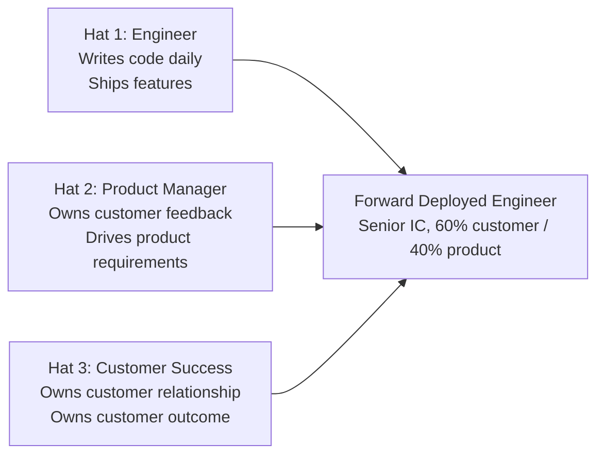

# Forward Deployed Engineer Playbook
## Chapter 1

# What a Forward Deployed Engineer Actually Does

> *"The FDE is not a customer success engineer. The FDE is not a professional services consultant. The FDE is not a sales engineer. The FDE is a senior IC who embeds with strategic customers, owns the end-to-end deployment, and turns customer feedback into product requirements."*

---

## 1. Epigraph

_The FDE is not a customer success engineer. The FDE is not a professional services consultant. The FDE is not a sales engineer. The FDE is a senior IC who embeds with strategic customers, owns the end-to-end deployment, and turns customer feedback into product requirements._

---

## 2. Problem

You are 30 days into your first FDE role at acme-corp, a 200-person B2B AI company. The CSO has just told you: "We have 5 strategic customers. 2 of them are at risk of churning because the deployment isn't working. The CEO wants a status update in 60 days. You have 5 customer deployments to manage, a PM who needs customer feedback, an EM who needs technical context, and a Director who needs the customer story. The first decision you make will set the tone for the next 12 months."

You have 30 days to design the FDE role, build the customer relationship, and own the first deployment. This chapter tells you what the FDE role actually is, who the FDE partners with, and what the FDE owns.

**Decision in one sentence:** _The FDE role is a senior IC hybrid — engineering + product + customer success — that owns the customer outcome end-to-end, ships a working solution in 6-12 weeks (not 6-12 months), and drives the product feedback loop; the FDE's job is to be the connective tissue between the company and the customer._

---

## 3. Why FDEs Fail Here

Five named failure modes of FDEs whose first 30 days produced zero results.

- **The Customer-Success-Engineer Trap.** The FDE acts like a CSM, focusing on relationship management and not writing code. The deployment doesn't ship. The customer churns. _An FDE who is not writing code daily is a CSM, not an FDE._
- **The IC-Who-Talks-To-Customers Trap.** The FDE acts like a regular SWE who occasionally checks in with the customer. The deployment is a 6-month project. _An SWE who talks to customers is not an FDE._
- **The Professional-Services-Consultant Trap.** The FDE acts like a PS consultant, deploying the company's product to the customer without owning the feedback loop. _A PS consultant deploys the product. An FDE deploys the product AND drives the feedback loop._
- **The Hero-FDE Failure.** The FDE is the only person who knows the customer. The customer is blocked when the FDE is on vacation, sick, or leaves. _The FDE's job is to build a relationship between the company and the customer, not a relationship between the customer and themselves._
- **The Feature-Without-Feedback Failure.** The FDE ships features without driving the product feedback loop. The product team doesn't know what the customer needs. The next deployment has the same gaps. _The FDE's job is to ship AND tell the product team what the customer needs._

---

## 4. Mental Models

Four mental models that compress the FDE role.

**Mental model 1: The FDE's 3 Hats.** The FDE wears 3 hats simultaneously.



**The 3 hats:**
- **Hat 1: Engineer.** Writes code daily. Ships features. Owns technical decisions.
- **Hat 2: Product Manager.** Owns customer feedback. Drives product requirements. Speaks for the customer in product decisions.
- **Hat 3: Customer Success.** Owns customer relationship. Owns customer outcome. Manages customer expectations.

**Mental model 2: The 4 Stakeholders the FDE Partners With.** The FDE has 4 stakeholders, not 1.

```mermaid
%% Figure 1.2 — The FDE's 4 stakeholders
flowchart TB
    FDE[FDE]
    PM[PM<br/>(product feedback partner)]
    EM[EM<br/>(technical context partner)]
    DIR[Director<br/>(customer story partner)]
    CX[Customer<br/>(the customer the FDE embeds with)]
    FDE --> PM
    FDE --> EM
    FDE --> DIR
    FDE --> CX
```

**The 4 stakeholders:**
- **PM (Product Manager).** The FDE's primary partner for product feedback. The FDE surfaces customer needs; the PM turns them into roadmap items.
- **EM (Engineering Manager).** The FDE's partner for technical context. The FDE surfaces deployment patterns; the EM owns the underlying platform.
- **Director.** The FDE's partner for the customer story. The FDE owns the customer narrative; the Director owns the customer portfolio.
- **Customer.** The FDE's primary stakeholder. The FDE embeds with the customer; the customer owns the deployment success.

**Mental model 3: The 60/40 Time Split.** The FDE's time is split 60/40.

```
60% Customer time:
- Embedding with the customer (on-site or virtual)
- Building the deployment
- Owning the customer relationship
- Managing customer expectations

40% Product time:
- Driving the feedback loop
- Writing product requirements
- Presenting at product reviews
- Coordinating with the PM, EM, Director

The split is the discipline. The FDE who spends 90% on
customer time has no product feedback. The FDE who
spends 90% on product time has no customer. The 60/40
is the rule.
```

**Mental model 4: The FDE's 5 Deliverables (per Quarter).** Every quarter, the FDE ships 5 deliverables.

```
1. 1 working customer deployment (in production)
2. 1 product feedback synthesis (5+ themes, prioritized)
3. 1 product requirement doc (1-page PRFA, written with PM)
4. 1 cross-functional review (with PM + EM + Director)
5. 1 retrospective (with the customer + internal team)

The 5 deliverables are the FDE's output. The FDE who
ships 1 working deployment per quarter (not 3) has the
time to do the other 4. The FDE who ships 3 deployments
has 0 product feedback.
```

---

## 5. Frameworks

Three frameworks for the FDE role.

### Framework 1: The FDE Charter (1 page)

```
# FDE Charter — [Date]

## My mission
[1 sentence on what the FDE owns.]

## My customers (this quarter)
1. [Customer 1] — [Tier: Strategic / Growth / Maintain] — [Status]
2. [Customer 2] — [Tier] — [Status]
3. [Customer 3] — [Tier] — [Status]

## My 60/40 time split
- 60% customer time: 3-5 deployments
- 40% product time: feedback loop + 1-page PRFAs

## My 5 quarterly deliverables
1. [Delivery 1] — [Owner] — [Date]
2. [Delivery 2] — [Owner] — [Date]
3. [Delivery 3] — [Owner] — [Date]
4. [Delivery 4] — [Owner] — [Date]
5. [Delivery 5] — [Owner] — [Date]

## My stakeholders
- PM: [Name] — weekly 1:1
- EM: [Name] — weekly 1:1
- Director: [Name] — biweekly 1:1
- Customers: [Names]

## My 1 thing I'll push back on
[1 sentence on what the FDE will NOT do this quarter.]
```

### Framework 2: The 1-Page Product Feedback Synthesis

```
# Product Feedback Synthesis — Q[N] [YEAR] — [FDE Name]

## The 5 themes
1. [Theme 1] — [Frequency: 3/5 customers] — [Severity: HIGH]
2. [Theme 2] — [Frequency] — [Severity]
3. [Theme 3]
4. [Theme 4]
5. [Theme 5]

## The top 3 prioritized items
1. [Item 1] — [Why now] — [Customer impact: $XM or N customers]
2. [Item 2] — [Why now]
3. [Item 3] — [Why now]

## The 2-3 items deferred to next quarter
1. [Item 1] — [Why deferred]
2. [Item 2]

## The 1 thing the product team should NOT do
[1 sentence on the worst thing the product team could do based on the feedback.]
```

### Framework 3: The FDE Weekly Cadence

```
# FDE Weekly Cadence — [Date]

## Monday: Customer sync (1 hour, with customer team)
- Status: [progress this week]
- Blockers: [what's blocking the customer]
- Decisions: [what's needed from the customer]

## Tuesday: PM sync (30 min)
- Feedback themes this week
- Top 3 prioritized items
- 1-page PRFA progress

## Wednesday: EM sync (30 min)
- Technical context for the deployment
- Platform changes needed
- Cross-team coordination

## Thursday: Director sync (biweekly, 60 min)
- Customer story this quarter
- Strategic alignment
- 90-day forward look

## Friday: Customer retrospective (biweekly, 60 min)
- What shipped this sprint
- What's blocked
- Next sprint plan
```

---

## 6. Drill

You are 30 days into your first FDE role at **acme-corp**. The CSO has given you 30 days to design the FDE role and own the first deployment. The inputs:

```
- 5 strategic customers (2 at risk of churning)
- CEO wants status update in 60 days
- 1 PM, 1 EM, 1 Director
- acme-corp has 200 employees, $50M ARR, 8 strategic customers
- Your first deployment is a 6-12 week project
```

You have **90 minutes**. Produce the **FDE charter + first 90 days plan** (`portfolio/chapter-01-fde-charter.md`) using Framework 1 (FDE Charter) + Framework 2 (Product Feedback Synthesis) + Framework 3 (Weekly Cadence). Specify:

- The 1-page FDE charter (mission, customers, time split, deliverables, stakeholders, pushback).
- The 1-page product feedback synthesis (5 themes, top 3 prioritized, deferred, the 1 thing to NOT do).
- The FDE weekly cadence (5 days, all stakeholders).
- The first 90 days plan (Week 1-12, what you ship when).
- The 1 thing you'll say to the CSO in the first 30 days.
- The 3 things you'll do to avoid the 5 failure modes.

**Deliverable:** `portfolio/chapter-01-fde-charter.md` — under 1500 words.

---

## 7. Worked Example

**The 1-page FDE charter:**

```
# FDE Charter — 2026-09-01

## My mission
Embed with 3-5 strategic customers, ship working
deployments in 6-12 weeks, and drive the product feedback
loop back to the PM and product team.

## My customers (this quarter)
1. Customer A — Strategic — At risk (deployment 60% complete)
2. Customer B — Strategic — Healthy (deployment 100% complete)
3. Customer C — Growth — Healthy (deployment 40% complete)
4. Customer D — Maintain — N/A (no active deployment)
5. Customer E — Strategic — At risk (deployment 20% complete)

## My 60/40 time split
- 60% customer time: 2-3 active deployments
- 40% product time: feedback loop + 1-page PRFAs

## My 5 quarterly deliverables
1. Customer A deployment to production (Q4 2026) — FDE
2. Customer E deployment to pilot (Q4 2026) — FDE
3. Product feedback synthesis (5 themes, Q3 2026) — FDE + PM
4. 1-page PRFA for top 1 feedback (Q3 2026) — FDE + PM
5. Customer A retrospective (Q4 2026) — FDE + Customer + Internal

## My stakeholders
- PM: Sarah Chen — weekly Tuesday 30 min
- EM: Alex Kim — weekly Wednesday 30 min
- Director: David Park — biweekly Thursday 60 min
- Customers: A, B, C, D, E

## The 1 thing I'll push back on
I will NOT ship 3 deployments in Q4. I'll ship 2 (Customer A
+ E). The 3rd would sacrifice product feedback quality. The
PM and Director can re-prioritize if they disagree.
```

**The 1-page product feedback synthesis:**

```
# Product Feedback Synthesis — Q3 2026 — FDE Name

## The 5 themes
1. Auth integration is the #1 blocker — 4/5 customers —
   HIGH (impacts all strategic customers)
2. Custom data connectors take 3+ weeks — 3/5 customers —
   HIGH (impacts time-to-deployment)
3. Observability is opaque (no customer-facing logs) —
   2/5 customers — MED
4. Mobile UI needs improvement (crash on Android) —
   2/5 customers — MED
5. Pricing model is unclear (per-customer vs. usage) —
   3/5 customers — MED (impacts renewal)

## The top 3 prioritized items
1. Auth integration simplification — Why now: 4/5 customers,
   $XM ARR impact. PRFA in progress.
2. Custom data connector framework — Why now: 3/5 customers,
   3-week reduction in time-to-deployment. PRFA next.
3. Customer-facing observability — Why now: 2/5 customers,
   retention risk. PRFA Q4 2026.

## The 2-3 items deferred to next quarter
1. Mobile UI redesign — Why deferred: not strategic
2. Pricing model clarification — Why deferred: ownership
   unclear (sales + product)

## The 1 thing the product team should NOT do
Build a custom LLM serving platform before the auth
integration is simplified. The auth blocker impacts more
customers than the LLM platform.
```

**The FDE weekly cadence (5 days, all stakeholders):**

```
# FDE Weekly Cadence — 2026-09-01

## Monday: Customer sync (1 hour, with customer team)
- Status: progress this week
- Blockers: what's blocking the customer
- Decisions: what's needed from the customer

## Tuesday: PM sync (Sarah Chen, 30 min)
- Feedback themes this week
- Top 3 prioritized items
- 1-page PRFA progress (auth integration)

## Wednesday: EM sync (Alex Kim, 30 min)
- Technical context for Customer A deployment
- Auth team capacity (1 SE left)
- Cross-team coordination with auth team

## Thursday: Director sync (David Park, biweekly, 60 min)
- Customer story this quarter
- Strategic alignment (auth blocker is #1 priority)
- 90-day forward look (Q4 2026)

## Friday: Customer retrospective (biweekly, 60 min)
- What shipped this sprint
- What's blocked
- Next sprint plan
```

**The first 90 days plan:**

```
# First 90 Days — FDE at acme-corp — 2026-09-01 to 2026-11-30

## Week 1-2 (Sept 1-14): Assess
- 5 customer calls (60 min each, 1 per customer)
- 1-page customer portfolio memo
- Top 3 risks identified (auth, data connectors, observability)
- FDE charter signed by CSO + PM + Director

## Week 3-6 (Sept 15 - Oct 12): Plan + First Pilot
- 1-page PRFA for auth integration simplification
- Customer A: design review for the auth integration
- Customer E: kickoff the 6-12 week deployment
- 1-page product feedback synthesis (Q3 2026)

## Week 7-12 (Oct 13 - Nov 30): Execute
- Customer A: deployment to production
- Customer E: deployment to pilot
- Auth integration simplification: PRFA in review with PM
- 1 customer retrospective (Customer A)
- Q4 2026 plan + charter renewal

## The 1 thing the FDE will NOT do in 90 days
Ship 3 customer deployments. The FDE will ship 2 (Customer A
+ E) and 1 product feedback synthesis. The 3rd deployment
sacrifices the feedback loop.
```

**The 1 thing I'll say to the CSO in the first 30 days:**

```
"Here's the FDE plan:

  Mission: embed with 3-5 strategic customers, ship working
  deployments in 6-12 weeks, drive the product feedback loop

  Customers: 5 total (2 at risk, 3 healthy)
  Time split: 60% customer / 40% product
  Deliverables: 5 per quarter (deployments, feedback,
  PRFAs, retros)

  Top 3 priorities this quarter:
  1. Customer A deployment to production (Q4 2026)
  2. Customer E deployment to pilot (Q4 2026)
  3. Auth integration simplification PRFA (Q3 2026)

  The 1 thing I'll push back on: shipping 3 deployments.
  I'll ship 2. The 3rd sacrifices the feedback loop.

  The first 90 days: assess (W1-2), plan (W3-6), execute
  (W7-12). By day 90, Customer A is in production, the
  auth PRFA is in review, and the Q4 2026 plan is signed."
```

**The 3 things I'll do to avoid the 5 failure modes:**

```
1. Write code daily. (Avoids the CSM Trap and PS Trap.)
   - 2-3 hours of coding per day
   - PRs merged to the customer deployment repo
   - Code review from EM or peer
   - No "all meetings, no code" weeks

2. Drive the feedback loop weekly. (Avoids the Feature-
   Without-Feedback Failure.)
   - 5 themes tracked
   - Weekly PM sync
   - 1-page PRFA per top-1 feedback
   - 1-page synthesis per quarter

3. Build a relationship between the company and the customer.
   (Avoids the Hero-FDE Failure.)
   - 2-3 internal stakeholders per customer
   - Document the customer in 1-page (not just in my head)
   - Hand off 1 customer to a peer FDE in 6 months
   - The customer is the company's, not the FDE's
```

---

## 8. Failure Mode Postmortem

A new FDE at a 200-person B2B AI company inherited 5 strategic customers. The FDE's first 30 days: 5 customer calls, 5 customer retrospective memos, 5 customer success plans. The FDE did not write code. The FDE did not drive the product feedback loop.

Within 6 months: 0 customer deployments shipped. 0 product feedback themes synthesized. The customers were confused ("the FDE is a CSM, not an engineer"). The PM had no customer feedback. The Director was in the middle. The FDE was asked to leave.

The replacement FDE did 3 things:
1. Wrote code daily (2-3 hours per day, customer deployment repo).
2. Drove the feedback loop weekly (5 themes tracked, weekly PM sync, 1-page PRFAs).
3. Built a relationship between the company and the customer (2-3 internal stakeholders per customer, 1-page customer doc, hand-off plan).

Within 6 months: 2 customer deployments shipped, 3 product feedback PRFAs in review, 0 customer churn. The PM had a clear product feedback story. The Director was unblocked.

What the first FDE missed: the FDE role is a senior IC hybrid. The first FDE acted like a CSM. The second FDE acted like a senior IC who embeds with customers. The senior IC is the leverage.

The lesson: the FDE who writes code daily and drives the feedback loop has a working FDE role. The FDE who only manages relationships has a CSM role.

---

## 9. Self-Assessment Rubric

| # | Dimension | 1 (Novice) | 3 (Competent) | 5 (Expert) |
|---|---|---|---|---|
| 1 | **3 hats** | 1 hat (engineer or CSM) | 2 hats | 3 hats balanced, 60/40 split |
| 2 | **4 stakeholders** | 1 stakeholder (customer) | 2-3 stakeholders | 4 stakeholders, weekly cadence each |
| 3 | **Code daily** | No code or weekly code | 2-3 hours/day | 2-3 hours/day, PRs merged |
| 4 | **Feedback loop** | No feedback loop | Feedback exists, partial | 5 themes tracked, weekly PM sync, PRFAs |
| 5 | **Customer relationship** | FDE-only relationship | 2 stakeholders per customer | 3+ stakeholders per customer, 1-page customer doc |

**Disqualifier:** any 1 on dimension 3 or 4. An FDE who doesn't write code daily or doesn't drive the feedback loop is in the CSM Trap or the Feature-Without-Feedback Failure.

**Total:** ___ / 25. **Pass threshold:** 18/25, no dimension below 3.

---

## 10. Portfolio Artifact Note

Save your filled-in drill as `portfolio/chapter-01-fde-charter.md` — interview evidence for "Walk me through your FDE role" (see Portfolio Map in Chapter 27).

---

## 11. Interview Questions

1. **Walk me through your FDE role.**
2. **The customer wants a feature the product team won't build. What do you do?**
3. **You have 5 customers and only 60% of your time is customer time. How do you prioritize?**
4. **The PM ignores your feedback. What do you do?**
5. **Walk me through a customer deployment you've shipped.**