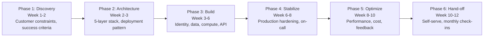
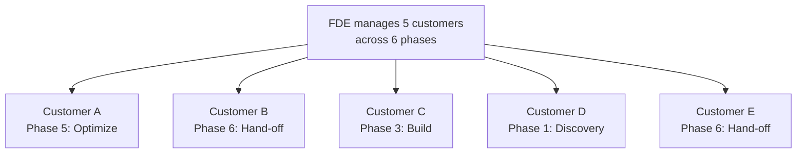

# Forward Deployed Engineer Playbook
## Chapter 10

# The 6-Phase Customer Deployment Methodology

> *"The FDE ships customer deployments in 6-12 weeks. The 6-phase methodology (Discovery, Architecture, Build, Stabilize, Optimize, Hand-off) is the FDE's reference for any deployment, any customer, any constraint."*

---

## 1. Epigraph

_The FDE ships customer deployments in 6-12 weeks. The 6-phase methodology (Discovery, Architecture, Build, Stabilize, Optimize, Hand-off) is the FDE's reference for any deployment, any customer, any constraint._

---

## 2. Problem

You are an FDE at acme-corp. The CSO has given you 5 strategic customers and 90 days. Customer A is at risk. Customer B is healthy. Customer C is mid-deployment. Customer D just signed. Customer E is in hand-off. The Director asks: "What's the deployment plan for each customer?" The PM asks: "How do we know when each customer is ready for hand-off?" You have 30 days to design the deployment plan.

This chapter tells you the 6-phase methodology, the 6 transitions, and how to apply it to 5 customers simultaneously.

**Decision in one sentence:** _The FDE customer deployment methodology is a 6-phase system (Discovery → Architecture → Build → Stabilize → Optimize → Hand-off) with 6 explicit transition criteria; the FDE's job is to apply the methodology to every customer, hit the 6-12 week target, and own the customer until hand-off._

---

## 3. Why FDEs Fail Here

Five named failure modes of FDEs whose deployment methodology produced zero results.

- **The 1-Phase Failure.** The FDE treats every customer the same (just "build"). _Customers in different phases need different cadences._
- **The No-Transition-Criteria Failure.** The FDE moves customers between phases without clear criteria. _Customers are stuck in Build forever._
- **The No-Stabilize-Phase Failure.** The FDE moves to Optimize before the deployment is stable. _The customer experiences incidents during optimization._
- **The No-Hand-off Failure.** The FDE keeps customers in Optimize indefinitely. _The FDE becomes a bottleneck._
- **The No-Portfolio-View Failure.** The FDE manages customers one-by-one, not as a portfolio. _The FDE is overloaded with 5 customers in Build._

---

## 4. Mental Models

Four mental models that compress the 6-phase methodology.

**Mental model 1: The 6-Phase Methodology.** Every deployment goes through 6 phases.



**The 6 phases:**
- **Phase 1: Discovery (Week 1-2).** Customer constraints, success criteria, stakeholders mapped.
- **Phase 2: Architecture (Week 2-3).** 5-layer stack, deployment pattern, customer sign-off.
- **Phase 3: Build (Week 3-6).** Identity, data, compute, API integration, integration tests.
- **Phase 4: Stabilize (Week 6-8).** Production hardening, on-call rotation, observability.
- **Phase 5: Optimize (Week 8-10).** Performance, cost, feedback loops, scaling.
- **Phase 6: Hand-off (Week 10-12).** Customer self-serve, monthly check-ins, FDE moves to next customer.

**Mental model 2: The 6 Transition Criteria.** Each phase has a clear exit criterion.

```
P1 → P2: Customer constraints documented + signed
P2 → P3: Architecture decision signed by customer + Director
P3 → P4: Integration tests pass + 10 end users in staging
P4 → P5: 30 days in production with no P0/P1 incidents
P5 → P6: Performance + cost within SLA + feedback loops active
P6 → Done: Customer self-serve + 1-page hand-off memo signed
```

**Mental model 3: The Customer Portfolio View.** FDE manages customers as a portfolio.



**The portfolio principle:** an FDE manages 3-5 customers across different phases. The portfolio mix prevents the FDE from being overloaded with 5 customers in Build (or 5 customers in Hand-off). The mix is the discipline.

**Mental model 4: The 4-2-1 Cadence.** 4 phases in Build, 2 in Stabilize, 1 in Optimize.

```
4 weeks in Build (P3)
2 weeks in Stabilize (P4)
1 week in Optimize (P5, light-touch)

Total: 7 weeks for Build-Stabilize-Optimize.
Discovery + Architecture: 3 weeks.
Hand-off: 2 weeks.
Total deployment: 12 weeks max, 6 weeks min.

The 4-2-1 cadence is the rule. The FDE who spends 8
weeks in Build has a 14-week deployment. The FDE who
spends 4 weeks in Build has a 9-week deployment.
```

---

## 5. Frameworks

Three frameworks for the 6-phase methodology.

### Framework 1: The 1-Page Customer Deployment Plan

```
# Customer Deployment Plan — [Customer] — [Date]

## Current phase
[Discovery / Architecture / Build / Stabilize / Optimize / Hand-off]

## Phase timeline
- Phase 1: [Start - End]
- Phase 2: [Start - End]
- Phase 3: [Start - End]
- Phase 4: [Start - End]
- Phase 5: [Start - End]
- Phase 6: [Start - End]

## Current phase deliverables
- [Deliverable 1] — [Owner] — [Date]
- [Deliverable 2] — [Owner] — [Date]
- [Deliverable 3] — [Owner] — [Date]

## Next phase transition criteria
- [Criterion 1] — [Status]
- [Criterion 2] — [Status]
- [Criterion 3] — [Status]

## The 1 thing the FDE will push back on
[1 sentence.]
```

### Framework 2: The Portfolio Status Dashboard

```
# Portfolio Status — [Quarter] — [Date]

## The 5 customers (by phase)
| Customer | Phase | Week | Next transition | Health |
|----------|-------|------|-----------------|--------|
| [Customer A] | [P5] | [W9] | [Date] | 🟢 / 🟡 / 🔴 |
| [Customer B] | [P6] | [W11] | [Date] | 🟢 / 🟡 / 🔴 |
| [Customer C] | [P3] | [W5] | [Date] | 🟢 / 🟡 / 🔴 |
| [Customer D] | [P1] | [W1] | [Date] | 🟢 / 🟡 / 🔴 |
| [Customer E] | [P6] | [W12] | [Done] | 🟢 / 🟡 / 🔴 |

## Phase distribution
- Discovery: 1
- Build: 1
- Optimize: 1
- Hand-off: 2

## Top 3 risks (across portfolio)
1. [Risk 1] — [Customer] — [Mitigation]
2. [Risk 2]
3. [Risk 3]
```

### Framework 3: The Phase Transition Checklist

```
# Phase Transition — [Customer] — [From P?] to [P?] — [Date]

## Exit criteria (from P?)
- [ ] [Criterion 1] — verified
- [ ] [Criterion 2] — verified
- [ ] [Criterion 3] — verified

## Entry criteria (for P?)
- [ ] [Criterion 1] — prepared
- [ ] [Criterion 2] — prepared
- [ ] [Criterion 3] — prepared

## Stakeholder sign-off
- [ ] Customer: [Name] — [Date]
- [ ] Director: [Name] — [Date]
- [ ] PM: [Name] — [Date]

## The 1 thing the FDE will focus on in the new phase
[1 sentence.]
```

---

## 6. Drill

You are an FDE at **acme-corp**. The CSO has given you 5 customers.

```
Customer A: Optimize phase, week 9, healthy
Customer B: Hand-off phase, week 11, healthy
Customer C: Build phase, week 5, healthy
Customer D: Discovery phase, week 1, just signed
Customer E: Hand-off phase, week 12, ready to close
```

You have **90 minutes**. Produce the **portfolio deployment plan** (`portfolio/chapter-10-deployment-methodology.md`) using Framework 1 (Deployment Plan) + Framework 2 (Portfolio Dashboard) + Framework 3 (Transition Checklist). Specify:

- The 1-page deployment plan for each of 5 customers (current phase, timeline, deliverables, transition criteria, the 1 pushback).
- The portfolio status dashboard (5 customers, phase distribution, top 3 risks).
- 2 phase transition checklists (e.g., Customer A from Optimize to Hand-off, Customer D from Discovery to Architecture).
- The 12-week portfolio timeline.
- The 1 thing you'll say to the CSO in the first quarterly review.
- The 3 things you'll do to avoid the 5 failure modes.

**Deliverable:** `portfolio/chapter-10-deployment-methodology.md` — under 1500 words.

---

## 7. Worked Example

**The 1-page deployment plan (sample for Customer A):**

```
# Customer Deployment Plan — Customer A — 2026-09-01

## Current phase
Optimize (week 9 of 12)

## Phase timeline
- Phase 1 (Discovery): Week 1-2 (DONE)
- Phase 2 (Architecture): Week 2-3 (DONE)
- Phase 3 (Build): Week 3-6 (DONE)
- Phase 4 (Stabilize): Week 6-8 (DONE)
- Phase 5 (Optimize): Week 8-10 (CURRENT, ends W10)
- Phase 6 (Hand-off): Week 10-12 (planned)

## Current phase deliverables (Optimize, W9)
- [x] Performance SLA met (latency p99 <500ms, was 800ms)
- [x] Cost within budget ($14K vs. $15K revised)
- [ ] Customer-facing dashboards (5/5 DONE)
- [ ] Feedback loops active (implicit: ✅, explicit: ✅)

## Next phase transition criteria (Optimize → Hand-off)
- [x] Performance within SLA
- [x] Cost within budget
- [x] Feedback loops active
- [x] Customer ops team trained

## The 1 thing the FDE will push back on
Extend Optimize by 2 weeks. Customer A's feedback loops
are active but not yet showing measurable improvement
in user satisfaction. 2 more weeks of Optimize will
solidify the feedback loop before hand-off.
```

**The portfolio status dashboard:**

```
# Portfolio Status — Q3 2026 — 2026-09-30

## The 5 customers (by phase)
| Customer | Phase | Week | Next transition | Health |
|----------|-------|------|-----------------|--------|
| Customer A | P5 Optimize | W9 | W10 | 🟢 |
| Customer B | P6 Hand-off | W11 | W12 | 🟢 |
| Customer C | P3 Build | W5 | W6 | 🟢 |
| Customer D | P1 Discovery | W1 | W2 | 🟡 |
| Customer E | P6 Hand-off | W12 | Done (W12) | 🟢 |

## Phase distribution
- Discovery: 1 (Customer D)
- Build: 1 (Customer C)
- Optimize: 1 (Customer A)
- Hand-off: 2 (Customer B, Customer E)

## Top 3 risks (across portfolio)
1. Customer D's Discovery is delayed (champion unresponsive)
   — Mitigation: escalate to Director, schedule 2nd call
2. Customer C's Build may slip (Snowflake connector takes
   3 weeks, was estimated 2) — Mitigation: parallelize
   auth + data tracks
3. Customer B's Hand-off may extend (customer ops team
   understaffed) — Mitigation: train customer's ops team
   in W11
```

**2 phase transition checklists:**

```
# Phase Transition — Customer A — P5 to P6 — 2026-09-15

## Exit criteria (P5 Optimize)
- [x] Performance within SLA (latency p99 <500ms)
- [x] Cost within budget ($14K vs. $15K revised)
- [x] Feedback loops active (implicit + explicit)
- [x] Customer ops team trained

## Entry criteria (P6 Hand-off)
- [x] Self-serve dashboards available
- [x] Customer runbook documented
- [x] Monthly check-in cadence agreed

## Stakeholder sign-off
- [x] Customer: Sarah Lee (CTO) — 2026-09-15
- [x] Director: David Park — 2026-09-15
- [x] PM: Sarah Chen — 2026-09-15

## The 1 thing the FDE will focus on in Hand-off
Monthly customer health check-ins (signal-based, not
status-based). Move from "is the deployment working" to
"is the customer getting value."
```

```
# Phase Transition — Customer D — P1 to P2 — 2026-09-15

## Exit criteria (P1 Discovery)
- [x] Customer constraints documented (Snowflake, Okta, AWS)
- [x] Success criteria agreed (3 use cases, $200K ARR impact)
- [x] Stakeholders mapped (5 stakeholders: CTO, VP Eng, etc.)

## Entry criteria (P2 Architecture)
- [x] Constraint matrix scored (3 axes)
- [x] Architecture patterns shortlisted (4 patterns)
- [x] Architecture decision drafted

## Stakeholder sign-off
- [x] Customer: Mike Chen (CTO) — 2026-09-15
- [ ] Director: David Park — pending
- [ ] PM: Sarah Chen — pending

## The 1 thing the FDE will focus on in Architecture
Get the constraint matrix + architecture decision signed
by EOW. The customer is excited but the Director is on
PTO. Schedule sign-off meeting for Friday.
```

**The 12-week portfolio timeline:**

```
# Portfolio Timeline — Q3-Q4 2026

## Week 1-2 (Sept 1-14): Customer D Discovery
## Week 2-3 (Sept 8-21): Customer D Architecture, Customer A Optimize continues
## Week 3-6 (Sept 15 - Oct 12): Customer C Build
## Week 6-8 (Oct 13-26): Customer C Stabilize
## Week 8-10 (Oct 27 - Nov 9): Customer A Optimize continues, Customer C Optimize
## Week 10-12 (Nov 10-23): Customer A Hand-off, Customer B Hand-off complete, Customer E done

## Customer D timeline
- W1-2: Discovery
- W2-3: Architecture
- W3-6: Build
- W6-8: Stabilize
- W8-10: Optimize
- W10-12: Hand-off
```

**The 1 thing I'll say to the CSO in the first quarterly review:**

```
"Here's the portfolio status for Q3 2026:

  5 customers across 4 phases:
  - Discovery: 1 (Customer D)
  - Build: 1 (Customer C)
  - Optimize: 1 (Customer A)
  - Hand-off: 2 (Customer B, Customer E)

  Phase distribution is healthy (1 per phase + 2 in hand-off).
  Customer health: 4/5 green, 1/5 yellow (Customer D's
  Discovery is delayed due to champion unresponsive).

  Top 3 risks:
  1. Customer D's Discovery — escalate to Director
  2. Customer C's Build (Snowflake connector) — parallelize tracks
  3. Customer B's Hand-off (customer ops team understaffed) —
     train in W11

  Top 3 wins:
  1. Customer A's Optimize hit SLA (latency 800ms → 450ms)
  2. Customer E ready for hand-off close (W12)
  3. 2 customers moving to Hand-off in Q4

  The 4-2-1 cadence is on track. The portfolio mix is
  healthy. The deployment methodology is the discipline."
```

**The 3 things I'll do to avoid the 5 failure modes:**

```
1. Apply the 6-phase methodology to every customer.
   (Avoids the 1-Phase Failure.)
   - Every customer has a current phase + next transition
   - No customer stays in Build forever
   - Hand-off is explicit, not implicit

2. Use transition criteria for phase changes.
   (Avoids the No-Transition-Criteria Failure.)
   - 6 transition criteria (1 per phase boundary)
   - Stakeholder sign-off required for each transition
   - Phase transition checklist used

3. Manage customers as a portfolio.
   (Avoids the No-Portfolio-View Failure.)
   - 5 customers across 4 phases
   - Phase distribution balanced (1 per phase + 2 in hand-off)
   - Top 3 risks tracked across portfolio
```

---

## 8. Failure Mode Postmortem

An FDE at a 200-person B2B AI company managed 5 customers. The FDE treated every customer as "just build." Within 6 months: 5 customers in Build, 0 in Hand-off, FDE overloaded, 2 customer churns. The CSO said: "I want the FDE to manage customers as a portfolio, not a queue."

The replacement FDE did 3 things:
1. Applied the 6-phase methodology to every customer (each customer has a phase + next transition).
2. Used transition criteria (6 transition criteria, stakeholder sign-off for each).
3. Managed customers as a portfolio (5 across 4 phases, balanced distribution).

Within 6 months: 5 customers across 4 phases, 2 hand-offs, 0 churn. The portfolio mix was healthy.

What the first FDE missed: the deployment methodology is a system. The first FDE treated customers as a queue. The second FDE treated customers as a portfolio. The portfolio is the leverage.

The lesson: the FDE who has the 6-phase methodology + transition criteria + portfolio view has a healthy portfolio. The FDE who has 5 customers in Build has a queue.

---

## 9. Self-Assessment Rubric

| # | Dimension | 1 (Novice) | 3 (Competent) | 5 (Expert) |
|---|---|---|---|---|
| 1 | **6-phase methodology** | 1-2 phases used | 3-4 phases | 6 phases, applied to every customer |
| 2 | **6 transition criteria** | 0-1 criteria | 3-4 criteria | 6 criteria, stakeholder sign-off |
| 3 | **Portfolio view** | Customers managed one-by-one | 2-3 customers in portfolio | 5+ customers, balanced phase distribution |
| 4 | **4-2-1 cadence** | No cadence | 1 phase per customer | 4-2-1 cadence (4 Build, 2 Stabilize, 1 Optimize) |
| 5 | **Phase transition checklist** | No checklist | Checklist exists | Checklist + exit/entry criteria + sign-off |

**Disqualifier:** any 1 on dimension 1 or 3. An FDE who uses 1-2 phases or who manages customers one-by-one is in the 1-Phase or No-Portfolio-View failure mode.

**Total:** ___ / 25. **Pass threshold:** 18/25, no dimension below 3.

---

## 10. Portfolio Artifact Note

Save your filled-in drill as `portfolio/chapter-10-deployment-methodology.md` — interview evidence for "How do you manage customer deployments?" (see Portfolio Map in Chapter 27).

---

## 11. Interview Questions

1. **Walk me through your deployment methodology.**
2. **You have 5 customers in Build. What do you do?**
3. **A customer is stuck in Build for 8 weeks. What do you do?**
4. **A customer wants to skip Stabilize and go to Optimize. What do you do?**
5. **Walk me through a portfolio of customers you've managed.**
