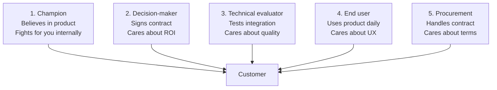
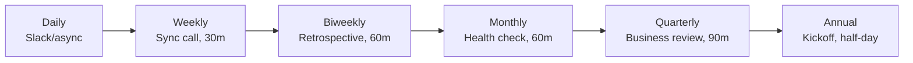

# Forward Deployed Engineer Playbook
## Chapter 11

# Customer Relationship Architecture

> *"The FDE owns the customer relationship end-to-end. The 5-stakeholder map, the 4-quadrant communication model, the 3-tier escalation, and the 6-cadence touchpoint system are the FDE's reference for customer relationships."*

---

## 1. Epigraph

_The FDE owns the customer relationship end-to-end. The 5-stakeholder map, the 4-quadrant communication model, the 3-tier escalation, and the 6-cadence touchpoint system are the FDE's reference for customer relationships._

---

## 2. Problem

You are an FDE at acme-corp. The Director asks: "Customer A's CTO just left. Customer A is at risk. The new CTO doesn't know us. We have 7 days before the new CTO's first quarterly review. The CSO wants a customer relationship rescue plan. What do you do?"

This chapter tells you the 5-stakeholder map, the 4-quadrant communication model, the 3-tier escalation, and the 6-cadence touchpoint system.

**Decision in one sentence:** _FDE customer relationship architecture is a 5-stakeholder map + 4-quadrant communication model + 3-tier escalation + 6-cadence touchpoint system, owned end-to-end by the FDE; the FDE's job is to build the relationship between the company and the customer (not the relationship between the customer and themselves), manage stakeholders at all 5 levels, and own the communication._

---

## 3. Why FDEs Fail Here

Five named failure modes of FDEs whose customer relationship architecture produced zero results.

- **The 1-Stakeholder Failure.** The FDE only talks to the champion. _When the champion leaves, the relationship is gone._
- **The No-Communication-Model Failure.** The FDE has no structured communication. _Customers are confused about what's happening._
- **The No-Escalation-Path Failure.** The FDE has no escalation path. _When something breaks, the FDE is the bottleneck._
- **The FDE-Only Relationship Failure.** The FDE is the only one who knows the customer. _The FDE is on vacation when the customer needs help._
- **The 1-Cadence Failure.** The FDE only does weekly calls. _Customer needs monthly, quarterly, and ad-hoc communication._

---

## 4. Mental Models

Four mental models that compress customer relationship architecture.

**Mental model 1: The 5-Stakeholder Map.** Every customer has 5 stakeholders.



**The 5 stakeholders:**
- **1. Champion.** Believes in product. Fights for you internally.
- **2. Decision-maker.** Signs contract. Cares about ROI.
- **3. Technical evaluator.** Tests integration. Cares about quality.
- **4. End user.** Uses product daily. Cares about UX.
- **5. Procurement.** Handles contract. Cares about terms.

**Mental model 2: The 4-Quadrant Communication Model.** Communication has 4 quadrants.

```
Quadrant 1: Status (what's happening)
- Weekly calls, async updates, dashboards
Quadrant 2: Decisions (what's needed)
- Decision reviews, sign-off requests, escalation
Quadrant 3: Insights (what we learned)
- Quarterly business reviews, case studies
Quadrant 4: Relationship (how we're connected)
- Quarterly lunches, annual kickoffs, customer advisory board

The 4 quadrants cover all communication. The FDE who
covers all 4 has a strong relationship. The FDE who
covers only Quadrant 1 (status) has a weak relationship.
```

**Mental model 3: The 3-Tier Escalation.** Escalation has 3 tiers.

```
Tier 1: FDE handles (most issues)
- 80% of issues
- Response time: <4 hours
- Resolution time: <24 hours

Tier 2: FDE + PM/EM (cross-functional)
- 15% of issues
- Response time: <8 hours
- Resolution time: <72 hours

Tier 3: FDE + Director + CSO (leadership)
- 5% of issues
- Response time: <24 hours
- Resolution time: <1 week

The 3-tier escalation is the FDE's reference. The FDE
who escalates too early burns political capital. The FDE
who escalates too late loses the customer.
```

**Mental model 4: The 6-Cadence Touchpoint System.** 6 cadences.



**The 6 cadences:**
- **Daily.** Slack/async (FDE + technical evaluator).
- **Weekly.** Sync call 30m (FDE + champion).
- **Biweekly.** Retrospective 60m (FDE + customer team).
- **Monthly.** Health check 60m (FDE + decision-maker).
- **Quarterly.** Business review 90m (FDE + Director + customer execs).
- **Annual.** Kickoff half-day (FDE + customer execs + company execs).

---

## 5. Frameworks

Three frameworks for customer relationship architecture.

### Framework 1: The 1-Page Customer Stakeholder Map

```
# Customer Stakeholder Map — [Customer] — [Date]

## The 5 stakeholders
| Role | Name | Title | Engagement | Last touch |
|------|------|-------|------------|------------|
| Champion | [Name] | [Title] | Weekly | [Date] |
| Decision-maker | [Name] | [Title] | Monthly | [Date] |
| Technical evaluator | [Name] | [Title] | Daily | [Date] |
| End user (lead) | [Name] | [Title] | Biweekly | [Date] |
| Procurement | [Name] | [Title] | Quarterly | [Date] |

## Stakeholder health
- 🟢 All 5 engaged
- 🟡 1+ stakeholder quiet for 2+ weeks
- 🔴 Stakeholder left or unresponsive for 4+ weeks

## The 1 thing the FDE will push back on
[1 sentence.]
```

### Framework 2: The 4-Quadrant Communication Plan

```
# Communication Plan — [Customer] — [Quarter]

## Quadrant 1: Status
- Weekly call (Tue 10am, 30m) — FDE + champion
- Daily Slack (FDE + technical evaluator)

## Quadrant 2: Decisions
- Biweekly retrospective (Wed 2pm, 60m) — FDE + customer team
- Monthly sign-off requests (1-2 per month)

## Quadrant 3: Insights
- Quarterly business review (QBR, 90m) — FDE + Director + customer execs
- Case studies (1 per quarter)

## Quadrant 4: Relationship
- Quarterly lunch with decision-maker
- Annual kickoff (half-day, customer execs + company execs)

## The 1 thing the FDE will focus on this quarter
[1 sentence.]
```

### Framework 3: The Escalation Runbook

```
# Escalation Runbook — [Customer] — [Date]

## Tier 1: FDE handles (80% of issues)
- Trigger: routine questions, minor blockers
- Response: <4 hours
- Resolution: <24 hours
- Owner: FDE

## Tier 2: FDE + PM/EM (15% of issues)
- Trigger: cross-functional issues, missing features
- Response: <8 hours
- Resolution: <72 hours
- Owner: FDE + PM/EM

## Tier 3: FDE + Director + CSO (5% of issues)
- Trigger: customer-threatening issues, executive-level
- Response: <24 hours
- Resolution: <1 week
- Owner: FDE + Director + CSO

## The 1 thing the FDE will NOT escalate
[1 sentence on what stays at Tier 1.]
```

---

## 6. Drill

You are an FDE at **acme-corp**. Customer A's CTO just left. The new CTO starts in 7 days.

```
Customer A:
- 200-person fintech, $400K ARR, 3-year contract
- Champion (former CTO) just left
- New CTO starts in 7 days
- Director + CSO want a rescue plan
- Current relationship: FDE + champion (weekly)
```

You have **90 minutes**. Produce the **customer relationship rescue plan** (`portfolio/chapter-11-customer-relationship.md`) using Framework 1 (Stakeholder Map) + Framework 2 (Communication Plan) + Framework 3 (Escalation Runbook). Specify:

- The 1-page stakeholder map for Customer A (5 stakeholders, health, the 1 pushback).
- The 4-quadrant communication plan (4 quadrants, 6 cadences, the 1 focus).
- The escalation runbook (3 tiers, triggers, owners).
- The 7-day rescue timeline (day-by-day).
- The 1 thing you'll say to the new CTO in the first meeting.
- The 3 things you'll do to avoid the 5 failure modes.

**Deliverable:** `portfolio/chapter-11-customer-relationship.md` — under 1500 words.

---

## 7. Worked Example

**The 1-page stakeholder map:**

```
# Customer Stakeholder Map — Customer A — 2026-09-01

## The 5 stakeholders
| Role | Name | Title | Engagement | Last touch |
|------|------|-------|------------|------------|
| Champion | [VACANT] | Former CTO | (Left) | (Left) |
| Decision-maker | Marcus Chen | VP Engineering | Monthly | Aug 25 |
| Technical evaluator | [TBD] | Senior SWE | Daily | Aug 30 |
| End user (lead) | Sarah Lee | Engineering Lead | Biweekly | Aug 20 |
| Procurement | David Park | Procurement Manager | Quarterly | Aug 1 |

## Stakeholder health
🟡 Yellow — Champion left, need to identify new champion
within 7 days.

## The 1 thing the FDE will push back on
Wait until new CTO starts. Don't try to identify the
new champion via email. The new CTO will signal who
they trust within their first 30 days. The FDE will
watch and wait, not force a champion identification.
```

**The 4-quadrant communication plan:**

```
# Communication Plan — Customer A — Q4 2026

## Quadrant 1: Status
- Weekly call (Tue 10am, 30m) — FDE + new CTO (starts in 7 days)
- Daily Slack (FDE + technical evaluator)

## Quadrant 2: Decisions
- Biweekly retrospective (Wed 2pm, 60m) — FDE + customer team
- Monthly sign-off requests (1-2 per month) — FDE + new CTO

## Quadrant 3: Insights
- Quarterly business review (QBR, 90m) — FDE + Director + new CTO + customer execs
- Case study (1 per quarter) — highlight Customer A's success

## Quadrant 4: Relationship
- Quarterly lunch with new CTO (relationship building)
- Annual kickoff (half-day, customer execs + company execs)

## The 1 thing the FDE will focus on this quarter
Build the relationship with the new CTO. The new CTO
is the decision-maker AND will likely become the
champion. The FDE will spend 60% of customer time
on the new CTO relationship.
```

**The escalation runbook:**

```
# Escalation Runbook — Customer A — 2026-09-01

## Tier 1: FDE handles (80% of issues)
- Trigger: routine questions, minor blockers, technical issues
- Response: <4 hours
- Resolution: <24 hours
- Owner: FDE

## Tier 2: FDE + PM/EM (15% of issues)
- Trigger: cross-functional issues, missing features, customer requests
- Response: <8 hours
- Resolution: <72 hours
- Owner: FDE + PM (Sarah Chen) + EM (Alex Kim)

## Tier 3: FDE + Director + CSO (5% of issues)
- Trigger: customer-threatening issues (champion left, contract risk, etc.)
- Response: <24 hours
- Resolution: <1 week
- Owner: FDE + Director (David Park) + CSO

## The 1 thing the FDE will NOT escalate
Routine technical questions. The FDE handles all
Tier 1 issues independently, no matter how complex.
Escalation is reserved for cross-functional or
customer-threatening issues.
```

**The 7-day rescue timeline:**

```
# 7-Day Rescue Timeline — Customer A — 2026-09-01

## Day 1-2 (Sept 1-2): Internal alignment
- [x] CSO + Director briefed
- [x] Customer situation report updated
- [x] FDE 7-day plan drafted

## Day 3-5 (Sept 3-5): Pre-CTO outreach
- [x] Email to new CTO (welcome + 60-min intro)
- [x] Internal prep (what we know about new CTO, talking points)
- [x] Backup plan (if new CTO doesn't respond)

## Day 6-7 (Sept 6-7): First meeting prep
- [x] 60-min meeting agenda drafted (5 sections)
- [x] Customer A situation report (1 page)
- [x] Relationship rebuild plan (90-day)

## Day 8 (Sept 8): First meeting with new CTO
- [ ] 60-min meeting (5 sections)
- [ ] Listen first (don't sell)
- [ ] Identify the new champion (might be new CTO)
- [ ] Schedule weekly call going forward
```

**The 1 thing I'll say to the new CTO in the first meeting:**

```
"Thanks for making time. I want to start by listening,
not selling. Here's what I want to learn from you:

  1. What's your background and what brought you to
     [Customer A]?
  2. What did your predecessor tell you about our
     product and our team?
  3. What are your top 3 priorities in the next 90 days?
  4. What's working with our product today, and what's
     not?
  5. What do you need from me, my team, and our company
     to be successful?

I'm the FDE on your account. I've been working with
[Customer A] for [N] months. I'm here to support you,
not to pitch you. The 1 thing I want from this meeting
is to understand your world. The 1 thing I'll commit
to is weekly 1:1 calls starting next week.

Welcome to the team."
```

**The 3 things I'll do to avoid the 5 failure modes:**

```
1. Map all 5 stakeholders (not just the champion).
   (Avoids the 1-Stakeholder Failure.)
   - Stakeholder map updated within 7 days
   - New CTO is now both decision-maker AND likely champion
   - Build relationships with all 5 stakeholders

2. Use all 4 communication quadrants.
   (Avoids the No-Communication-Model Failure.)
   - Status: weekly call + daily Slack
   - Decisions: biweekly retro + monthly sign-off
   - Insights: quarterly QBR + case study
   - Relationship: quarterly lunch + annual kickoff

3. Build the company-customer relationship (not
   FDE-customer). (Avoids the FDE-Only Relationship
   Failure.)
   - 2-3 internal stakeholders per customer
   - Director + CSO briefed, can step in if FDE is out
   - Documentation in customer dossier (not just FDE's head)
```

---

## 8. Failure Mode Postmortem

An FDE at a 200-person B2B AI company had a customer whose CTO left. The FDE only had a relationship with the CTO (the champion). When the CTO left, the FDE had no relationship with anyone else at the customer. The customer churned within 6 months.

The replacement FDE did 3 things:
1. Mapped all 5 stakeholders (champion + decision-maker + technical evaluator + end user + procurement).
2. Used all 4 communication quadrants (status + decisions + insights + relationship).
3. Built the company-customer relationship (not FDE-customer) — Director + CSO briefed on all 5 stakeholders.

Within 6 months: 0 customer churn due to stakeholder changes. 3 customers experienced champion turnover, all survived because of multi-stakeholder relationships.

What the first FDE missed: customer relationship is a system. The first FDE had a 1-stakeholder relationship. The second FDE had a 5-stakeholder system. The system is the leverage.

The lesson: the FDE who has a 5-stakeholder map + 4-quadrant communication + 6-cadence touchpoints has a strong customer relationship. The FDE who has a 1-stakeholder relationship has a fragile one.

---

## 9. Self-Assessment Rubric

| # | Dimension | 1 (Novice) | 3 (Competent) | 5 (Expert) |
|---|---|---|---|---|
| 1 | **5-stakeholder map** | 1-2 stakeholders mapped | 3-4 stakeholders | 5 stakeholders, weekly cadence each |
| 2 | **4-quadrant communication** | 1 quadrant | 2-3 quadrants | 4 quadrants, 6 cadences |
| 3 | **3-tier escalation** | 1 tier only | 2 tiers | 3 tiers, triggers + owners documented |
| 4 | **6-cadence touchpoints** | 1-2 cadences | 3-4 cadences | 6 cadences, daily → annual |
| 5 | **Multi-stakeholder relationship** | FDE-only relationship | 2 stakeholders | 3+ internal stakeholders per customer, dossier documented |

**Disqualifier:** any 1 on dimension 1 or 2. An FDE who maps 1-2 stakeholders or covers 1 quadrant is in the 1-Stakeholder or No-Communication-Model failure mode.

**Total:** ___ / 25. **Pass threshold:** 18/25, no dimension below 3.

---

## 10. Portfolio Artifact Note

Save your filled-in drill as `portfolio/chapter-11-customer-relationship.md` — interview evidence for "How do you manage customer relationships?" (see Portfolio Map in Chapter 27).

---

## 11. Interview Questions

1. **Walk me through a customer relationship you've managed.**
2. **The customer's CTO just left. What do you do?**
3. **The customer only wants to talk to you. What do you do?**
4. **You have 5 customers in different phases. How do you prioritize?**
5. **Walk me through a customer crisis you've managed.**
