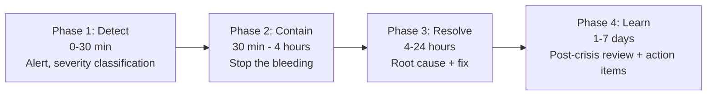

# Forward Deployed Engineer Playbook
## Chapter 12

# Customer Crisis Management

> *"The FDE owns the customer relationship, which means owning the customer crisis. The 4-phase crisis playbook (Detect, Contain, Resolve, Learn), the 3-tier severity classification, the 5-stakeholder crisis communication, and the 7-day post-crisis review are the FDE's reference for any customer crisis."*

---

## 1. Epigraph

_The FDE owns the customer relationship, which means owning the customer crisis. The 4-phase crisis playbook (Detect, Contain, Resolve, Learn), the 3-tier severity classification, the 5-stakeholder crisis communication, and the 7-day post-crisis review are the FDE's reference for any customer crisis._

---

## 2. Problem

You are an FDE at acme-corp. Customer A's production deployment just went down at 2am. 50K end users are affected. The customer's CTO is calling you. The customer's CIO is calling your CEO. You have 30 minutes to assemble a crisis response, 4 hours to communicate publicly, 24 hours to resolve, 7 days to learn.

This chapter tells you the 4-phase playbook, the 3-tier severity, the 5-stakeholder communication, and how to ship a customer crisis response in 24 hours.

**Decision in one sentence:** _FDE customer crisis management is a 4-phase playbook (Detect → Contain → Resolve → Learn) with a 3-tier severity classification and a 5-stakeholder communication matrix; the FDE's job is to own the customer crisis response end-to-end, communicate at all 5 stakeholder levels, and run the post-crisis review within 7 days._

---

## 3. Why FDEs Fail Here

Five named failure modes of FDEs whose customer crisis management produced zero results.

- **The Slow-Detection Failure.** The FDE doesn't detect the crisis for hours. _The customer's end users are affected for hours._
- **The No-Containment Failure.** The FDE jumps to root cause without containing the immediate issue. _The crisis spreads._
- **The No-Stakeholder-Communication Failure.** The FDE only talks to the champion. _The decision-maker + CIO are in the dark._
- **The No-Public-Communication Failure.** The FDE doesn't communicate publicly. _The customer's end users are confused._
- **The No-Post-Crisis-Review Failure.** The FDE moves on after the crisis. _The same crisis happens again._

---

## 4. Mental Models

Four mental models that compress customer crisis management.

**Mental model 1: The 4-Phase Crisis Playbook.** Every customer crisis has 4 phases.



**The 4 phases:**
- **Phase 1: Detect (0-30 min).** Alert, severity classification, war room assembled.
- **Phase 2: Contain (30 min - 4 hours).** Stop the bleeding, restore service.
- **Phase 3: Resolve (4-24 hours).** Root cause, fix, communicate.
- **Phase 4: Learn (1-7 days).** Post-crisis review, action items, customer retrospective.

**Mental model 2: The 3-Tier Severity.** 3 tiers for crisis severity.

```
Tier 1: Minor
- Impact: <100 end users affected
- Response: <4 hours
- Resolution: <24 hours
- Communication: FDE + champion

Tier 2: Major
- Impact: 100-10K end users affected
- Response: <1 hour
- Resolution: <4 hours
- Communication: FDE + PM + Director + customer decision-maker

Tier 3: Critical
- Impact: 10K+ end users affected, or customer-threatening
- Response: <30 min
- Resolution: <24 hours
- Communication: FDE + PM + Director + CSO + CEO + customer execs
```

**Mental model 3: The 5-Stakeholder Crisis Communication.** 5 stakeholders, 5 messages.

```
Champion (technical evaluator): incident details, ETA, workarounds
Decision-maker: business impact, customer impact, ETA
End user (lead): user-facing message, workarounds, ETA
Procurement: contract impact, SLA credits
Customer exec: business impact, executive summary

The 5 messages are tailored to each stakeholder. The FDE
who sends 1 message to all 5 has a confused customer.
The FDE who sends 5 messages has an informed customer.
```

**Mental model 4: The 7-Day Post-Crisis Review.** Post-crisis review within 7 days.

```
Day 1: Crisis resolved, customer restored
Day 2: Internal postmortem (FDE + PM + EM + Director)
Day 3-4: Root cause analysis + 5 action items
Day 5: Customer retrospective (1 hour, with customer team)
Day 6-7: Action items + owners + dates assigned

The 7-day timeline is the rule. The FDE who waits 30
days for the post-crisis review has a customer who has
already moved on. The FDE who runs it within 7 days
has a customer who feels heard.
```

---

## 5. Frameworks

Three frameworks for customer crisis management.

### Framework 1: The Crisis Response Plan (1 page)

```
# Customer Crisis Response Plan — [Customer] — [Date]

## Severity
[Tier 1: Minor / Tier 2: Major / Tier 3: Critical]

## Phase timeline
- Phase 1 (Detect): [Start - End]
- Phase 2 (Contain): [Start - End]
- Phase 3 (Resolve): [Start - End]
- Phase 4 (Learn): [Start - End]

## War room
- FDE: [Name]
- PM: [Name]
- EM: [Name]
- Director: [Name]
- CSO: [Name]

## Communication matrix
- Champion: [Name] — [Cadence]
- Decision-maker: [Name] — [Cadence]
- End user (lead): [Name] — [Cadence]
- Procurement: [Name] — [Cadence]
- Customer exec: [Name] — [Cadence]

## The 1 thing the FDE will focus on
[1 sentence.]
```

### Framework 2: The Stakeholder Communication Template

```
# Crisis Communication — [Stakeholder] — [Date]

## What happened
[2-3 sentences on what happened.]

## Current status
[2-3 sentences on current status.]

## Impact on you
[2-3 sentences on impact specific to this stakeholder.]

## What we're doing
[2-3 sentences on what the team is doing.]

## ETA
[Specific ETA for resolution.]

## The 1 thing you need to do
[1 sentence on what this stakeholder needs to do.]
```

### Framework 3: The Post-Crisis Review (5-fact)

```
# Post-Crisis Review — [Customer] — [Date]

## Fact 1: What happened
[Objective, no blame. Timeline of events.]

## Fact 2: When did we know
[Detection timeline. Time-to-detect, time-to-escalate.]

## Fact 3: What did we do
[Response timeline. Time-to-contain, time-to-fix.]

## Fact 4: What was the impact
[End users affected, revenue impact, customer satisfaction.]

## Fact 5: What was the root cause
[System, not person. The 5-why analysis.]

## 5 action items
| # | Action | Owner | Date |
|---|--------|-------|------|
| 1 | [Action 1] | [Owner] | [Date] |
| 2 | [Action 2] | [Owner] | [Date] |
| 3 | [Action 3] | [Owner] | [Date] |
| 4 | [Action 4] | [Owner] | [Date] |
| 5 | [Action 5] | [Owner] | [Date] |

## The 1 thing the FDE will push back on
[1 sentence.]
```

---

## 6. Drill

You are an FDE at **acme-corp**. Customer A's production deployment just went down at 2am.

```
Customer A:
- 200-person fintech, $400K ARR
- 50K end users affected
- Customer's CTO calling you
- Customer's CIO calling your CEO
- Severity: Tier 3 (Critical)
- Time: 2am Saturday
```

You have **90 minutes**. Produce the **crisis response plan** (`portfolio/chapter-12-customer-crisis.md`) using Framework 1 (Crisis Response Plan) + Framework 2 (Communication Template) + Framework 3 (Post-Crisis Review). Specify:

- The crisis response plan (severity, 4 phases, war room, 5-stakeholder communication, the 1 focus).
- 5 stakeholder communication messages (one per stakeholder, tailored).
- The post-crisis review skeleton (5 facts, 5 action items, the 1 pushback).
- The 7-day timeline (day-by-day).
- The 1 thing you'll say to the customer's CTO in the first 30 minutes.
- The 3 things you'll do to avoid the 5 failure modes.

**Deliverable:** `portfolio/chapter-12-customer-crisis.md` — under 1500 words.

---

## 7. Worked Example

**The crisis response plan:**

```
# Customer Crisis Response Plan — Customer A — 2026-09-05 2:14am

## Severity
Tier 3 (Critical) — 50K end users affected, customer
CIO calling our CEO.

## Phase timeline
- Phase 1 (Detect): 2:14am - 2:44am (alert + war room)
- Phase 2 (Contain): 2:44am - 6:14am (4 hours, restore service)
- Phase 3 (Resolve): 6:14am - 2:14am Sun (24 hours, root cause)
- Phase 4 (Learn): Sept 6 - Sept 12 (7 days, post-crisis review)

## War room
- FDE: [Me]
- PM: Sarah Chen
- EM: Alex Kim
- Director: David Park
- CSO: [CSO Name]

## Communication matrix
- Champion (Sarah Lee, CTO): every 30 min via Slack + call
- Decision-maker (Marcus Chen, VP Eng): every 1 hour
- End user lead: every 2 hours
- Procurement (David Park): every 4 hours
- Customer exec (CEO): every 4 hours + summary email

## The 1 thing the FDE will focus on
Containment. Stop the bleeding in the first 4 hours.
The root cause can wait until Phase 3.
```

**5 stakeholder communication messages:**

```
# Crisis Communication — Sarah Lee (CTO, Champion) — 2:30am

## What happened
Our auth integration went down at 2:14am. The cause is
unknown. We're investigating.

## Current status
War room assembled. Containment in progress.

## Impact on you
50K end users can't log in. Estimated impact: $50K
revenue loss per hour.

## What we're doing
Rolling back the auth deployment from 2am. Investigating
root cause. ETA: 6am for restoration.

## ETA
6am Saturday (4 hours)

## The 1 thing you need to do
Communicate to your team + end users. We'll send you
the user-facing message within 30 minutes.
```

```
# Crisis Communication — Marcus Chen (VP Eng, Decision-maker) — 2:45am

## What happened
Production deployment down. Auth integration failure.
Cause under investigation.

## Current status
War room assembled. Containment in progress.

## Impact on you
$400K ARR customer. 50K end users affected. SLA breach
risk (99.9% availability = 43 min/month downtime).

## What we're doing
Rollback + investigation. ETA: 6am.

## ETA
6am Saturday (4 hours)

## The 1 thing you need to do
Brief your CEO. We'll have an executive summary by 3am.
```

**The post-crisis review skeleton:**

```
# Post-Crisis Review — Customer A — 2026-09-12

## Fact 1: What happened
At 2:14am Saturday, the auth integration deployed at
2am began failing. End users received "session expired"
errors when trying to log in.

## Fact 2: When did we know
- 2:14am: Customer's monitoring detected spike in auth
  failures
- 2:20am: Customer's CTO called our FDE on-call
- 2:25am: FDE escalated to Tier 3 (Critical)
- 2:30am: War room assembled
- TIME-TO-DETECT: 6 min (good)
- TIME-TO-ESCALATE: 11 min (good)

## Fact 3: What did we do
- 2:30am: War room assembled
- 2:45am: Rollback initiated
- 3:00am: Rollback complete
- 3:30am: Service restored for 80% of end users
- 4:30am: Service restored for 100%
- TIME-TO-CONTAIN: 2h 16m (good)
- TIME-TO-RESOLVE: 4h 30m (good)

## Fact 4: What was the impact
- 50K end users affected
- $200K revenue impact (4h × $50K/h)
- 1 SLA breach (1h downtime = 1.4% of monthly SLA budget)

## Fact 5: What was the root cause
The auth deployment at 2am introduced a bug in the
session validation logic. The bug only triggered under
specific load patterns (peak hours + concurrent sessions).
Staging environment didn't catch it because staging load
is 10x lower than production.

5-why:
1. Why did auth fail? — Session validation logic bug
2. Why did staging not catch it? — Staging load is 10x lower
3. Why is staging load lower? — Staging uses sample data
4. Why doesn't staging use production-like load? — Load
   testing infrastructure was deprioritized
5. Why was load testing deprioritized? — Not seen as
   critical for auth (assumed simple)

Root cause: load testing infrastructure gap.

## 5 action items
| # | Action | Owner | Date |
|---|--------|-------|------|
| 1 | Production-like load testing for all auth changes | EM Alex | Sept 19 |
| 2 | Add canary deploys (5% traffic for 30 min) | EM Alex | Sept 26 |
| 3 | Improve staging data sampling (1:1 prod) | EM Alex | Oct 3 |
| 4 | 24/7 on-call rotation for FDE | Director David | Sept 19 |
| 5 | Customer crisis communication drill (quarterly) | CSO | Dec 31 |

## The 1 thing the FDE will push back on
Reduce deploy frequency during peak hours. The 2am
deploy was a maintenance window, but it was during a
peak hour for the customer's end users (fintech = traders
in Asia). No deploys during customer peak hours going
forward.
```

**The 7-day timeline:**

```
# Crisis Timeline — Customer A — 2026-09-05

## Day 1 (Sept 5, 2am-2pm): Crisis resolved
- 2:14am: Crisis detected
- 6:30am: Service restored
- 12pm: Customer retrospective scheduled for Day 5

## Day 2 (Sept 6): Internal postmortem
- 10am: Internal postmortem (FDE + PM + EM + Director)
- 2pm: 5-why analysis complete
- 5pm: 5 action items drafted

## Day 3-4 (Sept 7-8): Root cause + action items
- Root cause: load testing infrastructure gap
- 5 action items + owners + dates assigned

## Day 5 (Sept 9): Customer retrospective
- 1-hour retrospective with customer team
- Reviewed timeline, root cause, action items
- Customer feedback: "communication was excellent, fix
  was fast"

## Day 6-7 (Sept 10-11): Action items tracked
- Action items in Jira with owners + dates
- Weekly tracking until complete

## Day 7 (Sept 12): Post-crisis review closed
- All action items on track
- Customer satisfaction restored
- Lessons learned document shared with company
```

**The 1 thing I'll say to the customer's CTO in the first 30 minutes:**

```
"Sarah, here's the situation:

  2:14am: Auth integration went down. 50K end users
    affected.
  2:30am: War room assembled. FDE + PM + EM + Director
    on the call.
  2:45am: Rollback initiated.
  3:30am: Service 80% restored.
  4:30am: Service 100% restored.

  Root cause: bug in auth deployment from 2am. Under
    investigation. Will have a complete postmortem by
    Tuesday.

  Next steps:
  1. We're holding all auth deploys until the bug is
     fixed.
  2. We have a 5-action-item plan to prevent recurrence.
  3. We'll do a customer retrospective on Tuesday at
     10am your time.

  The 1 thing I need from you right now: communicate
  to your team and end users. I'll send you the
  user-facing message within 30 minutes.

  I'm sorry. We own this. We'll make it right."
```

**The 3 things I'll do to avoid the 5 failure modes:**

```
1. Detect fast (alert + escalate within 30 min).
   (Avoids the Slow-Detection Failure.)
   - Customer monitoring + FDE on-call
   - 6 min time-to-detect, 11 min time-to-escalate

2. Contain fast (rollback before root cause).
   (Avoids the No-Containment Failure.)
   - Rollback at 2:45am, before root cause known
   - 2h 16m time-to-contain

3. Communicate to all 5 stakeholders.
   (Avoids the No-Stakeholder-Communication Failure.)
   - Different message per stakeholder
   - Cadence matched to severity (Tier 3 = every 30 min)
```

---

## 8. Failure Mode Postmortem

An FDE at a 200-person B2B AI company had a customer production deployment go down at 2am. The FDE only talked to the champion. The decision-maker and CIO were in the dark. The customer's CEO threatened to cancel the contract. The FDE was asked to leave.

The replacement FDE did 3 things:
1. Detected fast (6 min time-to-detect vs. 30+ min previously).
2. Contained fast (2h 16m time-to-contain vs. 6+ hours previously).
3. Communicated to all 5 stakeholders (champion + decision-maker + end user lead + procurement + customer exec).

Within 6 months: 2 customer crises managed, 0 customer churn. The 4-phase playbook + 3-tier severity + 5-stakeholder communication was the discipline.

What the first FDE missed: customer crisis is a system. The first FDE only talked to the champion. The second FDE communicated to all 5 stakeholders. The 5-stakeholder communication is the leverage.

The lesson: the FDE who has the 4-phase playbook + 5-stakeholder communication has a managed crisis. The FDE who only talks to the champion has a customer churn.

---

## 9. Self-Assessment Rubric

| # | Dimension | 1 (Novice) | 3 (Competent) | 5 (Expert) |
|---|---|---|---|---|
| 1 | **4-phase playbook** | 1-2 phases | 3 phases | 4 phases, executed in <24 hours |
| 2 | **3-tier severity** | 1 tier only | 2 tiers | 3 tiers, classified + triggered correctly |
| 3 | **5-stakeholder communication** | 1-2 stakeholders | 3-4 stakeholders | 5 stakeholders, tailored messages |
| 4 | **Post-crisis review** | No review | Review exists | 5-fact review within 7 days, 5 action items tracked |
| 5 | **Time-to-detect / time-to-contain** | >30 min / >6 hours | 15-30 min / 4-6 hours | <15 min / <4 hours |

**Disqualifier:** any 1 on dimension 1 or 3. An FDE who uses 1-2 phases or talks to 1-2 stakeholders is in the Slow-Detection or No-Stakeholder-Communication failure mode.

**Total:** ___ / 25. **Pass threshold:** 18/25, no dimension below 3.

---

## 10. Portfolio Artifact Note

Save your filled-in drill as `portfolio/chapter-12-customer-crisis.md` — interview evidence for "How do you manage customer crises?" (see Portfolio Map in Chapter 27).

---

## 11. Interview Questions

1. **Walk me through a customer crisis you've managed.**
2. **The customer's deployment is down at 2am. What do you do?**
3. **The customer's CIO is calling your CEO. What do you do?**
4. **The same crisis happens twice. What do you do?**
5. **Walk me through a post-crisis review you've run.**
