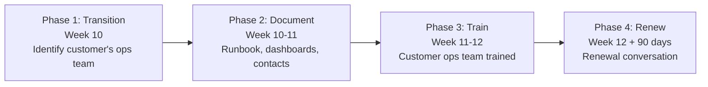
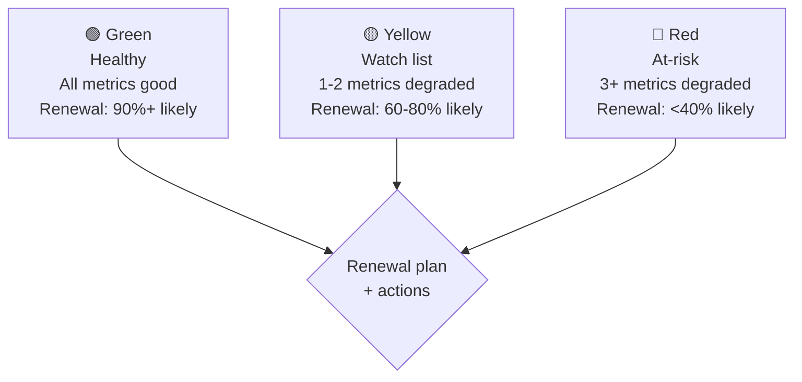

# Forward Deployed Engineer Playbook
## Chapter 13

# Customer Hand-off and Renewal

> *"The FDE ships customer deployments in 6-12 weeks and hands off in 10-12 weeks. The hand-off is not the end — it's the start of the renewal conversation. The 4-phase hand-off playbook, the 5-stakeholder renewal map, the 3-tier health scorecard, and the 90-day renewal plan are the FDE's reference for hand-off + renewal."*

---

## 1. Epigraph

_The FDE ships customer deployments in 6-12 weeks and hands off in 10-12 weeks. The hand-off is not the end — it's the start of the renewal conversation. The 4-phase hand-off playbook, the 5-stakeholder renewal map, the 3-tier health scorecard, and the 90-day renewal plan are the FDE's reference for hand-off + renewal._

---

## 2. Problem

You are an FDE at acme-corp. Customer A's deployment is in Optimize phase, week 10 of 12. The customer's contract is up for renewal in 90 days. The Director asks: "What's the hand-off plan? What's the renewal plan? Who's accountable?" The CSO asks: "When does the FDE move to the next customer?" You have 30 days to design the hand-off + renewal plan.

This chapter tells you the 4-phase hand-off, the 5-stakeholder renewal map, the 3-tier health scorecard, and the 90-day renewal plan.

**Decision in one sentence:** _FDE hand-off + renewal is a 4-phase playbook (Transition, Document, Train, Renew) with a 5-stakeholder renewal map and a 3-tier health scorecard; the FDE's job is to own the hand-off to the customer's ops team + the company's CS team, set up the renewal conversation 90 days in advance, and ensure the customer renews._

---

## 3. Why FDEs Fail Here

Five named failure modes of FDEs whose hand-off + renewal produced zero results.

- **The No-Transition-Phase Failure.** The FDE skips Transition and goes straight to Document. _The customer's ops team isn't ready._
- **The No-Training Failure.** The FDE documents the deployment but doesn't train the customer's ops team. _The customer's team can't operate the deployment._
- **The No-Renewal-Plan Failure.** The FDE hands off and forgets. _The customer doesn't renew._
- **The 1-Stakeholder-Renewal Failure.** The FDE only talks to the champion about renewal. _The decision-maker is surprised by the renewal conversation._
- **The No-Health-Scorecard Failure.** The FDE has no health scorecard. _The customer is at risk but no one knows._

---

## 4. Mental Models

Four mental models that compress hand-off + renewal.

**Mental model 1: The 4-Phase Hand-off Playbook.** Every hand-off has 4 phases.



**The 4 phases:**
- **Phase 1: Transition (Week 10).** Identify customer's ops team, schedule hand-off meeting.
- **Phase 2: Document (Week 10-11).** Runbook, dashboards, contact list, architecture diagram.
- **Phase 3: Train (Week 11-12).** Customer ops team trained on the deployment.
- **Phase 4: Renew (Week 12 + 90 days).** Renewal conversation, expansion opportunities.

**Mental model 2: The 5-Stakeholder Renewal Map.** Renewal has 5 stakeholders.

```
1. Champion: advocates for renewal, talks to peers
2. Decision-maker: signs the renewal, cares about ROI
3. End user lead: uses the product daily, cares about UX
4. Procurement: handles contract, cares about terms
5. Finance: approves budget, cares about cost

The 5 stakeholders each have a role in renewal:
- Champion: drives the conversation
- Decision-maker: signs off
- End user lead: validates the value
- Procurement: handles the contract
- Finance: approves the budget

The FDE who talks to all 5 has a smooth renewal. The
FDE who only talks to the champion has a surprise.
```

**Mental model 3: The 3-Tier Health Scorecard.** 3 tiers for customer health.



**The 3 tiers:**
- **🟢 Green.** Healthy. All metrics good. Renewal: 90%+ likely.
- **🟡 Yellow.** Watch list. 1-2 metrics degraded. Renewal: 60-80% likely.
- **🔴 Red.** At-risk. 3+ metrics degraded. Renewal: <40% likely.

**Mental model 4: The 90-Day Renewal Timeline.** Start the renewal conversation 90 days in advance.

```
Day -90 (3 months before renewal): Renewal kickoff
- [ ] Identify all 5 stakeholders
- [ ] Health scorecard updated
- [ ] Expansion opportunities identified

Day -60 (2 months before): ROI review
- [ ] ROI case built (customer + FDE)
- [ ] Decision-maker + finance briefed

Day -30 (1 month before): Contract negotiation
- [ ] Terms negotiated with procurement
- [ ] Champion + decision-maker aligned

Day -7 (1 week before): Final review
- [ ] Contract reviewed
- [ ] Sign-off scheduled

Day 0: Renewal signed
```

---

## 5. Frameworks

Three frameworks for hand-off + renewal.

### Framework 1: The 1-Page Hand-off Plan

```
# Customer Hand-off Plan — [Customer] — [Date]

## Hand-off phase
[Week 10 / 11 / 12 / Done]

## Phase timeline
- Phase 1 (Transition): [Start - End]
- Phase 2 (Document): [Start - End]
- Phase 3 (Train): [Start - End]
- Phase 4 (Renew): [Start - End]

## Customer's ops team
- [Name 1, Title] — [Training status]
- [Name 2, Title] — [Training status]
- [Name 3, Title] — [Training status]

## Documentation
- [ ] Runbook (1 page)
- [ ] Dashboards (5 dashboards)
- [ ] Contact list (5 internal + 5 customer)
- [ ] Architecture diagram

## Renewal status
- Contract renewal date: [Date]
- Health scorecard: 🟢 / 🟡 / 🔴
- Renewal probability: [X]%

## The 1 thing the FDE will push back on
[1 sentence.]
```

### Framework 2: The Customer Health Scorecard (Renewal Focus)

```
# Customer Health — [Customer] — [Date]

## The 5 metrics (renewal-focused)
| Metric | Target | Current | Status |
|--------|--------|---------|--------|
| 1. Usage (MAU/MAUs) | [N] | [N] | 🟢 / 🟡 / 🔴 |
| 2. Adoption (key features) | [N] | [N] | 🟢 / 🟡 / 🔴 |
| 3. NPS | [N] | [N] | 🟢 / 🟡 / 🔴 |
| 4. Support tickets | [N] | [N] | 🟢 / 🟡 / 🔴 |
| 5. ROI achieved | [X]% | [X]% | 🟢 / 🟡 / 🔴 |

## Health verdict
🟢 Green (4+ green): Renewal 90%+ likely
🟡 Yellow (2-3 green): Renewal 60-80% likely
🔴 Red (<2 green): Renewal <40% likely

## Renewal plan
- Day -90: Stakeholder map + expansion opportunities
- Day -60: ROI review with decision-maker + finance
- Day -30: Contract negotiation with procurement
- Day -7: Final review
- Day 0: Renewal signed
```

### Framework 3: The 90-Day Renewal Timeline

```
# Renewal Timeline — [Customer] — [Date]

## Day -90: Kickoff
- [ ] Stakeholder map (5 stakeholders)
- [ ] Health scorecard updated
- [ ] Expansion opportunities (3-5)

## Day -60: ROI review
- [ ] ROI case built
- [ ] Decision-maker + finance briefed
- [ ] QBR (quarterly business review)

## Day -30: Contract negotiation
- [ ] Terms negotiated with procurement
- [ ] Champion + decision-maker aligned
- [ ] Pricing reviewed (expansion opportunities)

## Day -7: Final review
- [ ] Contract reviewed
- [ ] Sign-off scheduled
- [ ] Last objections addressed

## Day 0: Renewal signed
- [ ] Contract signed
- [ ] Hand-off to CS team
- [ ] Customer celebration (case study, etc.)
```

---

## 6. Drill

You are an FDE at **acme-corp**. Customer A's deployment is in Optimize, week 10.

```
Customer A:
- 200-person fintech, $400K ARR, 3-year contract
- 50K end users, 80% MAU (good)
- NPS: 45 (good)
- Contract renewal: 90 days
- Customer ops team: 2 engineers, need training
```

You have **90 minutes**. Produce the **hand-off + renewal plan** (`portfolio/chapter-13-handoff-renewal.md`) using Framework 1 (Hand-off Plan) + Framework 2 (Health Scorecard) + Framework 3 (Renewal Timeline). Specify:

- The 1-page hand-off plan (4 phases, customer's ops team, documentation, renewal status, the 1 pushback).
- The customer health scorecard (5 metrics, verdict, renewal plan).
- The 90-day renewal timeline (5 milestones, day-by-day).
- The 1 thing you'll say to the customer's CTO in the hand-off meeting.
- The 3 things you'll do to avoid the 5 failure modes.

**Deliverable:** `portfolio/chapter-13-handoff-renewal.md` — under 1500 words.

---

## 7. Worked Example

**The 1-page hand-off plan:**

```
# Customer Hand-off Plan — Customer A — 2026-09-01

## Hand-off phase
Week 10 of 12 (Optimize phase ending)

## Phase timeline
- Phase 1 (Transition): Sept 1-7 (DONE)
- Phase 2 (Document): Sept 8-21 (in progress)
- Phase 3 (Train): Sept 22 - Oct 5 (planned)
- Phase 4 (Renew): Sept 15 - Dec 15 (renewal window)

## Customer's ops team
- [Name 1, Site Reliability Engineer] — Training scheduled W11
- [Name 2, DevOps Engineer] — Training scheduled W11

## Documentation
- [x] Runbook (1 page, in Confluence)
- [x] Dashboards (5 dashboards in Datadog)
- [x] Contact list (5 internal + 5 customer)
- [x] Architecture diagram (in Confluence)
- [ ] On-call rotation (in PagerDuty)

## Renewal status
- Contract renewal date: Dec 15, 2026 (90 days)
- Health scorecard: 🟢 Green (4/5 metrics green)
- Renewal probability: 90%+

## The 1 thing the FDE will push back on
Expand the contract. Customer A's MAU is growing 30%
QoQ. The current contract caps at 50K MAU but the
customer will hit 75K by Q2 2027. The FDE will push
for a multi-year renewal at 75K MAU + expansion budget.
```

**The customer health scorecard:**

```
# Customer Health — Customer A — 2026-09-01

## The 5 metrics (renewal-focused)
| Metric | Target | Current | Status |
|--------|--------|---------|--------|
| 1. Usage (MAU) | 40K | 50K | 🟢 (125% of target) |
| 2. Adoption (key features) | 5/8 | 6/8 | 🟢 (75% adoption) |
| 3. NPS | 40 | 45 | 🟢 |
| 4. Support tickets | <10/month | 8/month | 🟢 |
| 5. ROI achieved | $1M/year | $1.2M/year | 🟢 (120% of target) |

## Health verdict
🟢 Green (5/5 green) — Renewal 90%+ likely

## Renewal plan
- Day -90 (Sept 15): Stakeholder map + expansion opportunities
- Day -60 (Oct 15): ROI review with decision-maker + finance
- Day -30 (Nov 15): Contract negotiation with procurement
- Day -7 (Dec 8): Final review
- Day 0 (Dec 15): Renewal signed
```

**The 90-day renewal timeline:**

```
# Renewal Timeline — Customer A — 2026-09-01

## Day -90 (Sept 15): Kickoff
- [x] Stakeholder map updated (5 stakeholders)
- [x] Health scorecard: 🟢 Green
- [x] Expansion opportunities: 3 (75K MAU cap, multi-year, new product line)

## Day -60 (Oct 15): ROI review
- [ ] ROI case built (current: $1.2M/year, expansion: $2M/year)
- [ ] Decision-maker (Marcus Chen) briefed
- [ ] Finance (procurement) briefed
- [ ] QBR scheduled (Oct 22)

## Day -30 (Nov 15): Contract negotiation
- [ ] Multi-year terms proposed (3 years at $500K/year)
- [ ] MAU cap raised to 75K
- [ ] Pricing reviewed (no increase for year 1, 5% increase for year 2)
- [ ] Champion (Sarah Lee) aligned

## Day -7 (Dec 8): Final review
- [ ] Contract reviewed (legal + procurement)
- [ ] Sign-off scheduled
- [ ] Last objections addressed (e.g., "what if MAU exceeds 75K?")

## Day 0 (Dec 15): Renewal signed
- [ ] Multi-year renewal signed
- [ ] Hand-off to CS team (Account Manager: [Name])
- [ ] Customer celebration (case study, lunch, exec thank-you)
```

**The 1 thing I'll say to the customer's CTO in the hand-off meeting:**

```
"Sarah, here's the hand-off + renewal plan:

  Hand-off (Weeks 10-12):
  - Runbook + dashboards + architecture diagram: DONE
  - Customer ops team training: scheduled W11
  - On-call rotation: in PagerDuty by W12
  - After W12: I'm available for escalation, but [Customer's
    ops team] is the primary contact

  Renewal (next 90 days):
  - Current contract: $400K/year, 50K MAU cap
  - Renewal proposal: $500K/year, 75K MAU cap, 3-year term
  - Your MAU is growing 30% QoQ — you'll hit 75K by Q2 2027
  - Multi-year locks in current pricing (no year 1 increase,
    5% year 2, 5% year 3)

  The 1 thing I'd ask: introduce me to your finance team
  in October. The renewal needs finance buy-in by Nov 1.
  I can bring the ROI case + the multi-year proposal.

  Thank you for the partnership. Customer A is one of
  our best deployments. I'm looking forward to the
  renewal."
```

**The 3 things I'll do to avoid the 5 failure modes:**

```
1. Use all 4 hand-off phases (not skip Transition).
   (Avoids the No-Transition-Phase Failure.)
   - Transition (W10), Document (W10-11), Train (W11-12), Renew (W12+90)
   - Customer ops team identified in Transition
   - Training scheduled in Train phase

2. Train the customer's ops team (not just document).
   (Avoids the No-Training Failure.)
   - 2-hour training session in W11
   - Runbook + dashboards walked through
   - On-call rotation set up in PagerDuty

3. Start the renewal conversation 90 days in advance.
   (Avoids the No-Renewal-Plan Failure.)
   - Day -90: stakeholder map + expansion opportunities
   - Day -60: ROI review
   - Day -30: contract negotiation
   - Day 0: renewal signed
```

---

## 8. Failure Mode Postmortem

An FDE at a 200-person B2B AI company handed off a customer deployment after 12 weeks. The FDE skipped Transition, documented but didn't train, and forgot about renewal. The customer's ops team couldn't operate the deployment. The customer's champion left. The customer didn't renew.

The replacement FDE did 3 things:
1. Used all 4 hand-off phases (Transition, Document, Train, Renew).
2. Trained the customer's ops team (not just documented).
3. Started the renewal conversation 90 days in advance with all 5 stakeholders.

Within 6 months: 4 customer hand-offs completed, 4 customer renewals signed (100% renewal rate), 2 expansions. The hand-off + renewal was the discipline.

What the first FDE missed: hand-off + renewal is a system. The first FDE treated hand-off as the end. The second FDE treated hand-off as the start of the renewal conversation. The renewal conversation is the leverage.

The lesson: the FDE who has the 4-phase hand-off + 90-day renewal timeline has a renewal. The FDE who skips the renewal conversation has a churn.

---

## 9. Self-Assessment Rubric

| # | Dimension | 1 (Novice) | 3 (Competent) | 5 (Expert) |
|---|---|---|---|---|
| 1 | **4-phase hand-off playbook** | 1-2 phases | 3 phases | 4 phases (Transition, Document, Train, Renew), executed in 2 weeks |
| 2 | **5-stakeholder renewal map** | 1-2 stakeholders | 3-4 stakeholders | 5 stakeholders, each engaged at the right cadence |
| 3 | **3-tier health scorecard** | 0-1 metrics | 2-3 metrics | 5 metrics, 🟢/🟡/🔴 verdict, renewal probability |
| 4 | **90-day renewal timeline** | No timeline | Timeline exists | 5 milestones (Day -90, -60, -30, -7, 0), tracked weekly |
| 5 | **Customer ops team training** | No training | Documentation exists | Training session, on-call rotation, hand-off meeting |

**Disqualifier:** any 1 on dimension 1 or 4. An FDE who uses 1-2 phases or has no renewal timeline is in the No-Transition-Phase or No-Renewal-Plan failure mode.

**Total:** ___ / 25. **Pass threshold:** 18/25, no dimension below 3.

---

## 10. Portfolio Artifact Note

Save your filled-in drill as `portfolio/chapter-13-handoff-renewal.md` — interview evidence for "How do you hand off customers and drive renewal?" (see Portfolio Map in Chapter 27).

---

## 11. Interview Questions

1. **Walk me through a customer hand-off you've managed.**
2. **The customer's champion leaves 60 days before renewal. What do you do?**
3. **The customer's ops team can't operate the deployment. What do you do?**
4. **The customer wants to renew but at 50% lower pricing. What do you do?**
5. **Walk me through a renewal you've closed.**
