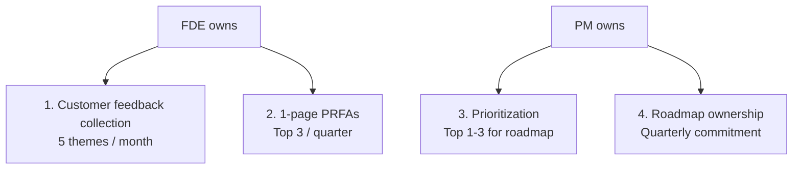
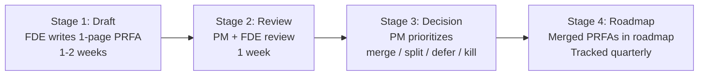

# Forward Deployed Engineer Playbook
## Chapter 14

# FDE-PM Partnership

> *"The FDE drives the customer feedback loop. The PM owns the product roadmap. The FDE-PM partnership is the most leveraged relationship in the FDE role — without it, the feedback dies in Slack and the roadmap drifts."*

---

## 1. Epigraph

_The FDE drives the customer feedback loop. The PM owns the product roadmap. The FDE-PM partnership is the most leveraged relationship in the FDE role — without it, the feedback dies in Slack and the roadmap drifts._

---

## 2. Problem

You are an FDE at acme-corp. The PM has 5 themes from your customer interviews but hasn't prioritized them. The PM's roadmap is locked for Q4 2026. The customer is asking for an auth integration simplification that the PM won't build. The CEO wants the auth integration in Q1 2027. You have 30 days to drive the FDE-PM partnership, prioritize the 5 themes, and get the auth integration into the Q1 2027 roadmap.

This chapter tells you what the FDE-PM partnership is, the 4 ownership boundaries, the 3 feedback cadence patterns, and how to ship a 1-page PRFA that lands in the roadmap.

**Decision in one sentence:** _The FDE-PM partnership is a 4-boundary ownership model (FDE owns customer feedback + 1-page PRFAs; PM owns prioritization + roadmap) backed by a weekly sync + 3-cadence communication; the FDE's job is to provide high-quality 1-page PRFAs, the PM's job is to prioritize, and the partnership works when both own their part._

---

## 3. Why FDEs Fail Here

Five named failure modes of FDEs whose FDE-PM partnership produced zero results.

- **The Slack-Channel Failure.** The FDE drops feedback in Slack. _The PM gets overwhelmed. The feedback dies._
- **The No-1-Page-PRFA Failure.** The FDE gives verbal feedback only. _The PM can't prioritize without a 1-pager._
- **The PM-Tells-Me-What-To-Build Failure.** The FDE defers to the PM on customer priorities. _The customer's needs are lost._
- **The FDE-Tells-PM-What-To-Build Failure.** The FDE demands the PM build specific features. _The PM loses ownership of the roadmap._
- **The No-Cadence Failure.** The FDE and PM only talk in crisis. _The partnership is reactive, not proactive._

---

## 4. Mental Models

Four mental models that compress the FDE-PM partnership.

**Mental model 1: The 4 Ownership Boundaries.** 4 things, 2 owners.



**The 4 boundaries:**
- **FDE owns: 1. Customer feedback collection.** 5 themes per month.
- **FDE owns: 2. 1-page PRFAs.** Top 3 per quarter.
- **PM owns: 3. Prioritization.** Top 1-3 for roadmap.
- **PM owns: 4. Roadmap ownership.** Quarterly commitment.

**Mental model 2: The 3 Feedback Cadence Patterns.** 3 ways to sync.

```
1. Weekly sync (30 min, Tuesday)
   - 5 themes this week
   - Top 3 PRFAs in progress/review
   - 1-3 decisions needed

2. Biweekly retrospective (60 min)
   - Customer highlights (wins + risks)
   - Feedback themes trends
   - Roadmap impact

3. Quarterly roadmap review (90 min)
   - PRFA outcomes (which merged, which deferred, which killed)
   - Next quarter themes
   - Roadmap changes
```

**Mental model 3: The 1-Page PRFA Land-or-Die Test.** A 1-page PRFA either lands or dies.

```
A 1-page PRFA lands if:
- Customer impact is quantified ($XM or N customers)
- Workaround is documented
- Proposed solution is 1 paragraph
- Alternatives are 2-3
- Recommendation is clear
- Effort is estimated

A 1-page PRFA dies if:
- Customer impact is vague ("some customers want this")
- Workaround is undocumented
- Proposed solution is multi-page
- Alternatives are missing
- Recommendation is unclear
- Effort is unestimated

The FDE who writes landing PRFAs has a partnership.
The FDE who writes dying PRFAs has a Slack channel.
```

**Mental model 4: The 4 Stages of PRFA Lifecycle.** Every PRFA goes through 4 stages.



**The 4 stages:**
- **Stage 1: Draft.** FDE writes 1-page PRFA. 1-2 weeks.
- **Stage 2: Review.** PM + FDE review. 1 week.
- **Stage 3: Decision.** PM prioritizes: merge / split / defer / kill.
- **Stage 4: Roadmap.** Merged PRFAs in roadmap. Tracked quarterly.

---

## 5. Frameworks

Three frameworks for the FDE-PM partnership.

### Framework 1: The 1-Page FDE-PM Charter

```
# FDE-PM Charter — [Date]

## Ownership boundaries
- FDE owns: Customer feedback + 1-page PRFAs
- PM owns: Prioritization + roadmap

## Cadence
- Weekly sync: Tuesday 10am, 30 min
- Biweekly retro: every other Wed 2pm, 60 min
- Quarterly roadmap review: Q[N], 90 min

## Top 3 PRFAs this quarter
1. [PRFA 1] — Status: in review
2. [PRFA 2] — Status: in progress
3. [PRFA 3] — Status: merged

## Top 3 deferred PRFAs
1. [Deferred 1] — Why deferred: [reason]
2. [Deferred 2]
3. [Deferred 3]

## The 1 thing the FDE will push back on
[1 sentence.]
```

### Framework 2: The Weekly Sync Agenda

```
# Weekly FDE-PM Sync — [Date]

## 5 min: Customer highlights
- Win: [Customer win this week]
- Risk: [Customer at risk this week]

## 15 min: Feedback themes
- New themes: [N]
- Updated themes: [priority changes, customer count]
- Top 3 PRFAs (status)

## 10 min: 1-page PRFA progress
- In review: [PRFA name]
- In progress: [PRFA name]
- Merged: [PRFA name]
- Deferred: [PRFA name]

## 5 min: Open questions
- Q1: [Question 1]
- Q2: [Question 2]

## 5 min: Decisions needed
- D1: [Decision 1]
- D2: [Decision 2]
```

### Framework 3: The PRFA Decision Tracker

```
# PRFA Decision Tracker — [Quarter] — [Date]

| PRFA | Status | Decision | Date | Owner |
|------|--------|----------|------|-------|
| [PRFA 1] | Merged | [Quarter + sprint] | [Date] | [PM] |
| [PRFA 2] | Split | [PRFA 2a, PRFA 2b] | [Date] | [PM] |
| [PRFA 3] | Deferred | [Q[N+1]] | [Date] | [PM] |
| [PRFA 4] | Killed | [Reason] | [Date] | [PM] |

## This quarter's PRFA outcomes
- Merged: [N]
- Split: [N]
- Deferred: [N]
- Killed: [N]

## The 1 thing the PM will do next quarter
[1 sentence.]
```

---

## 6. Drill

You are an FDE at **acme-corp**. The PM has 5 themes from your customer interviews but hasn't prioritized them.

```
5 themes from your customer interviews:
1. Auth integration simplification (5/5 customers, $1.5M ARR)
2. Custom data connector framework (3/5 customers, 3-week reduction)
3. API rate limits (4/5 customers, deployment blocker)
4. Customer-facing observability (2/5 customers, retention risk)
5. SAML migration guide (3/5 customers, $800K ARR)

PM's roadmap is locked for Q4 2026.
CEO wants auth integration in Q1 2027.
You have 30 days.
```

You have **90 minutes**. Produce the **FDE-PM partnership plan** (`portfolio/chapter-14-fde-pm-partnership.md`) using Framework 1 (Charter) + Framework 2 (Weekly Sync Agenda) + Framework 3 (PRFA Decision Tracker). Specify:

- The 1-page FDE-PM charter (ownership boundaries, cadence, top 3 PRFAs, deferred, the 1 pushback).
- The weekly sync agenda (5 sections, 30 min).
- The PRFA decision tracker (5 PRFAs, status, decision, date).
- The 30-day plan (week-by-week, what gets done when).
- The 1 thing you'll say to the PM in the first weekly sync.
- The 3 things you'll do to avoid the 5 failure modes.

**Deliverable:** `portfolio/chapter-14-fde-pm-partnership.md` — under 1500 words.

---

## 7. Worked Example

**The 1-page FDE-PM charter:**

```
# FDE-PM Charter — 2026-09-01

## Ownership boundaries
- FDE owns: Customer feedback (5 themes/month) + 1-page PRFAs (top 3/quarter)
- PM owns: Prioritization (top 1-3 for roadmap) + roadmap ownership (quarterly commitment)

## Cadence
- Weekly sync: Tuesday 10am, 30 min
- Biweekly retro: every other Wed 2pm, 60 min
- Quarterly roadmap review: Q[N], 90 min

## Top 3 PRFAs this quarter
1. Auth integration simplification — in review
2. Custom data connector framework — in progress
3. SAML migration guide — merged

## Top 3 deferred PRFAs
1. Customer-facing observability — Q1 2027
2. API rate limits — Q1 2027 (need infra capacity)
3. Pricing model clarification — Q2 2027 (sales + product)

## The 1 thing the FDE will push back on
Splitting the auth integration PRFA. The PM wants to
split it into "SAML migration guide" (already merged)
and "SAML 2.0 integration" (Q1 2027). The FDE wants
it as one PRFA: "Auth integration simplification" =
SAML migration guide + SAML 2.0 integration. One
PRFA, one roadmap item, simpler tracking.
```

**The weekly sync agenda:**

```
# Weekly FDE-PM Sync — 2026-09-08

## 5 min: Customer highlights
- Win: Customer B's data connector framework is 80% done
- Risk: Customer A's auth integration still blocked

## 15 min: Feedback themes
- New themes: 1 (mobile UI crashes, 2 customers)
- Updated themes: auth integration (5/5 customers, up from 4/5)
- Top 3 PRFAs:
  - Auth integration simplification: in review
  - Custom data connector framework: in progress
  - SAML migration guide: merged

## 10 min: 1-page PRFA progress
- In review: Auth integration simplification (PM reviewing today)
- In progress: Custom data connector framework (FDE writing 1-page)
- Merged: SAML migration guide (shipped last week)
- Deferred: Customer-facing observability (Q1 2027)

## 5 min: Open questions
- Q1: Does the auth integration PRFA need security review before merge?
- Q2: Can we share the SAML migration guide publicly?

## 5 min: Decisions needed
- D1: Auth integration PRFA → schedule security review for this week
- D2: SAML migration guide → share publicly (vs. customer-only)
```

**The PRFA decision tracker:**

```
# PRFA Decision Tracker — Q3 2026

| PRFA | Status | Decision | Date | Owner |
|------|--------|----------|------|-------|
| Auth integration simplification | In review | Q1 2027 (pending security review) | Sept 8 | Sarah Chen (PM) |
| Custom data connector framework | In progress | Q1 2027 (parallel to auth integration) | Sept 15 | Sarah Chen (PM) |
| SAML migration guide | Merged | Q3 2026 (shipped Aug 30) | Aug 30 | Sarah Chen (PM) |
| API rate limits | Deferred | Q1 2027 (need infra capacity review) | Sept 10 | Sarah Chen (PM) |
| Customer-facing observability | Deferred | Q1 2027 (need observability investment) | Sept 10 | Sarah Chen (PM) |
| Mobile UI crashes | Killed | [Reason: not strategic, defer to Q2 2027] | Sept 8 | Sarah Chen (PM) |

## This quarter's PRFA outcomes
- Merged: 1 (SAML migration guide)
- Split: 0
- Deferred: 3
- Killed: 1

## The 1 thing the PM will do next quarter
Review the Q1 2027 roadmap with auth integration + custom
data connectors as the top 2 items. Both are FDE-driven
PRFAs that landed cleanly this quarter.
```

**The 30-day plan:**

```
# 30-Day FDE-PM Partnership Plan — 2026-09-01

## Week 1 (Sept 1-7): Charter + Cadence
- [x] FDE-PM charter signed
- [x] Weekly sync established (Tuesday 10am)
- [x] Top 3 PRFAs identified

## Week 2 (Sept 8-14): First PRFA in review
- [x] Auth integration simplification: in review
- [x] Custom data connector framework: in progress
- [ ] SAML migration guide: shared publicly

## Week 3 (Sept 15-21): Roadmap decision
- [ ] Q1 2027 roadmap decision (auth + connectors in)
- [ ] PRFA tracker updated

## Week 4 (Sept 22-30): Quarterly review prep
- [ ] Q3 2026 PRFA outcomes documented
- [ ] Q4 2026 themes drafted
```

**The 1 thing I'll say to the PM in the first weekly sync:**

```
"Sarah, here's the FDE-PM partnership plan:

  Ownership: FDE owns feedback + 1-page PRFAs. PM owns
  prioritization + roadmap.

  Cadence: Weekly Tuesday 30 min + biweekly retro + quarterly
  roadmap review.

  Top 3 PRFAs this quarter:
  1. Auth integration simplification — in review (Q1 2027
     candidate)
  2. Custom data connector framework — in progress (Q1 2027
     candidate)
  3. SAML migration guide — merged (shipped last week)

  Top 3 deferred: customer-facing observability, API rate
  limits, pricing model.

  The 1 thing I want to push back on: splitting the auth
  integration PRFA. I want it as one PRFA, not two. One
  PRFA = one roadmap item = simpler tracking.

  The partnership works when I write landing PRFAs (1-page,
  quantified, with recommendation) and you prioritize. Let's
  see if we can land 2 PRFAs in the Q1 2027 roadmap."
```

**The 3 things I'll do to avoid the 5 failure modes:**

```
1. Write 1-page PRFAs (not Slack messages).
   (Avoids the Slack-Channel Failure.)
   - Every prioritized item gets a 1-page PRFA
   - 7 sections: problem, impact, workaround, solution,
     alternatives, recommendation, effort

2. Use the weekly sync (not crisis conversations).
   (Avoids the No-Cadence Failure.)
   - Tuesday 10am, 30 min, every week
   - 5 sections: highlights, themes, PRFAs, questions, decisions

3. Respect ownership boundaries (FDE = feedback, PM = roadmap).
   (Avoids the FDE-Tells-PM-What-To-Build Failure.)
   - FDE provides 1-page PRFAs
   - PM decides merge / split / defer / kill
   - FDE accepts the PM's decision (and writes the next PRFA)
```

---

## 8. Failure Mode Postmortem

An FDE at a 200-person B2B AI company dropped feedback in Slack. The PM was overwhelmed. 8 themes dumped in 1 week, 0 PRFAs. The roadmap drifted. The customer churned because the auth integration didn't ship.

The replacement FDE did 3 things:
1. Wrote 1-page PRFAs (not Slack messages) for every prioritized theme.
2. Established a weekly sync (Tuesday 30 min) with the PM.
3. Respected ownership boundaries (FDE = feedback, PM = roadmap).

Within 6 months: 5 PRFAs in review with PM, 2 merged into Q1 2027 roadmap, 0 customer churn due to missing features.

What the first FDE missed: the FDE-PM partnership is a system. The first FDE used Slack. The second FDE used 1-page PRFAs + weekly sync. The system is the leverage.

The lesson: the FDE who has 1-page PRFAs + weekly sync has a partnership. The FDE who uses Slack has a feedback dump.

---

## 9. Self-Assessment Rubric

| # | Dimension | 1 (Novice) | 3 (Competent) | 5 (Expert) |
|---|---|---|---|---|
| 1 | **4 ownership boundaries** | 0-1 boundaries | 2-3 boundaries | 4 boundaries, FDE = feedback + PRFAs, PM = prioritization + roadmap |
| 2 | **3 feedback cadences** | 1 cadence | 2 cadences | 3 cadences (weekly + biweekly + quarterly) |
| 3 | **1-page PRFA quality** | No PRFAs or multi-page | 1-page PRFAs exist, partial | 1-page PRFAs, 7 sections, 80%+ landing rate |
| 4 | **Weekly sync** | No sync or monthly | Weekly sync, partial | Weekly sync, 30 min, 5 sections, decisions documented |
| 5 | **PRFA decision tracking** | No tracking | Tracker exists | Tracker with status + decision + date, quarterly outcomes |

**Disqualifier:** any 1 on dimension 1 or 3. An FDE who has 0-1 boundaries or no 1-page PRFAs is in the Slack-Channel or No-1-Page-PRFA failure mode.

**Total:** ___ / 25. **Pass threshold:** 18/25, no dimension below 3.

---

## 10. Portfolio Artifact Note

Save your filled-in drill as `portfolio/chapter-14-fde-pm-partnership.md` — interview evidence for "How do you partner with the PM?" (see Portfolio Map in Chapter 27).

---

## 11. Interview Questions

1. **Walk me through your FDE-PM partnership.**
2. **The PM ignores your feedback. What do you do?**
3. **You have 5 themes and only 3 PRFAs per quarter. How do you prioritize?**
4. **The PM splits your PRFA into 2. What do you do?**
5. **Walk me through a 1-page PRFA you've written.**
