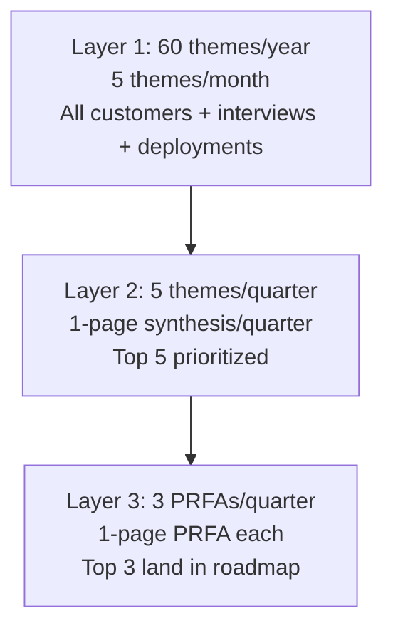

# Forward Deployed Engineer Playbook
## Chapter 15

# The FDE Feedback Synthesis System

> *"The FDE collects 60 customer feedback themes per year. The synthesis system — 5 themes per month, 1-page synthesis per quarter, top 3 PRFAs per quarter — turns 60 themes into 3 actionable roadmap items."*

---

## 1. Epigraph

_The FDE collects 60 customer feedback themes per year. The synthesis system — 5 themes per month, 1-page synthesis per quarter, top 3 PRFAs per quarter — turns 60 themes into 3 actionable roadmap items._

---

## 2. Problem

You are an FDE at acme-corp. The CSO has just told you: "We have 30 customer feedback themes from your last 6 months. The PM has 0 PRFAs in review. The CEO wants the top 3 themes in 30 days. The customer is asking when the auth integration will ship. The Director wants the deferred list. You have 30 days to synthesize 30 themes into top 3 + deferred list."

This chapter tells you what the synthesis system is, the 5-theme quota, the 1-page synthesis template, and how to ship top 3 + deferred in 30 days.

**Decision in one sentence:** _The FDE feedback synthesis system is a 3-layer funnel (60 themes/year → 5 themes/quarter → 3 PRFAs/quarter) backed by the 5-theme quota, the 1-page synthesis template, and the top 3 + deferred rule; the FDE's job is to collect 5 themes per month, synthesize 1 page per quarter, and produce 3 PRFAs that land in the roadmap._

---

## 3. Why FDEs Fail Here

Five named failure modes of FDEs whose feedback synthesis produced zero results.

- **The 1-Theme-Per-Month Failure.** The FDE collects 1 theme per month. _60 themes/year becomes 12 themes/year — insufficient signal._
- **The No-Quota Failure.** The FDE has no theme quota. _Feedback collection is ad-hoc._
- **The No-Synthesis Failure.** The FDE collects themes but never synthesizes. _The themes pile up in Slack._
- **The No-1-Page-Synthesis Failure.** The FDE synthesizes in multi-page documents. _The PM can't digest._
- **The No-Top-3-Rule Failure.** The FDE prioritizes 10+ themes as "top." _Nothing is prioritized._

---

## 4. Mental Models

Four mental models that compress the feedback synthesis system.

**Mental model 1: The 3-Layer Funnel.** 60 themes → 5 themes → 3 PRFAs.



**The 3 layers:**
- **Layer 1: 60 themes/year.** 5 themes per month from all customers + interviews + deployments.
- **Layer 2: 5 themes/quarter.** 1-page synthesis per quarter. Top 5 prioritized.
- **Layer 3: 3 PRFAs/quarter.** 1-page PRFA each. Top 3 land in roadmap.

**Mental model 2: The 5-Theme Quota.** 5 themes per month, every month.

```
5 themes per month = 60 themes per year.

The 5 themes come from 4 sources:
1. Strategic customer (high priority)
2. Growth customer (medium priority)
3. Maintain customer (low priority)
4. Customer interview (qualitative)
5. Customer deployment (quantitative)

The FDE who collects 1 theme per month has insufficient
signal. The FDE who collects 20 themes per month has
too much signal. The 5-theme quota is the rule.
```

**Mental model 3: The 1-Page Synthesis Template.** 1 page, 5 themes, top 3 + deferred.

```
# 1-Page Synthesis — Q[N] — [FDE]

## The 5 themes
1. [Theme 1] — [Frequency: N/5 customers] — [Severity: HIGH]
2. [Theme 2] — [Frequency] — [Severity]
3. [Theme 3]
4. [Theme 4]
5. [Theme 5]

## Top 3 prioritized
1. [Item 1] — [Why now] — [Customer impact]
2. [Item 2]
3. [Item 3]

## 2-3 deferred
1. [Item 1] — [Why deferred]
2. [Item 2]

## The 1 thing the product team should NOT do
[1 sentence.]

## 3 customer signals (from Ch 3 health scorecard)
1. [Signal 1] → [Theme]
2. [Signal 2] → [Theme]
3. [Signal 3] → [Theme]
```

**Mental model 4: The Top-3 + Deferred Rule.** Top 3 + deferred, nothing in between.

```
The FDE picks TOP 3 themes for the quarter. The
FDE picks 2-3 themes to DEFER (with reasons). 

There is NO MIDDLE. No "these are also important but
not top 3." No "we should also do these if we have
time."

The PM has 3 PRFAs to review, not 8. The deferred
list is explicit, not implicit.

The FDE who picks top 3 + deferred has a clear
roadmap input. The FDE who picks top 8 has a confused
PM.
```

---

## 5. Frameworks

Three frameworks for the FDE feedback synthesis.

### Framework 1: The 5-Theme Monthly Tracker

```
# 5-Theme Monthly Tracker — [Month] — [Date]

| # | Theme | Source | Frequency | Severity | Top 3? |
|---|-------|--------|-----------|----------|--------|
| 1 | [Theme] | [Customer] | [N/5] | [HIGH] | Y/N |
| 2 | [Theme] | [Customer] | [N/5] | [HIGH] | Y/N |
| 3 | [Theme] | [Customer] | [N/5] | [MED] | Y/N |
| 4 | [Theme] | [Interview] | [N/5] | [MED] | Y/N |
| 5 | [Theme] | [Deployment] | [N/5] | [MED] | Y/N |
```

### Framework 2: The 1-Page Quarterly Synthesis

```
# 1-Page Synthesis — Q[N] [YEAR] — [FDE]

## The 5 themes
1. [Theme 1] — [Frequency] — [Severity]
2. [Theme 2]
3. [Theme 3]
4. [Theme 4]
5. [Theme 5]

## Top 3 prioritized
1. [Item 1] — [Why now] — [Customer impact]
2. [Item 2]
3. [Item 3]

## 2-3 deferred
1. [Item 1] — [Why deferred]
2. [Item 2]

## The 1 thing the product team should NOT do
[1 sentence.]

## 3 customer signals
1. [Signal 1] → [Theme]
2. [Signal 2] → [Theme]
3. [Signal 3] → [Theme]
```

### Framework 3: The Top-3 PRFA Selection

```
# Top-3 PRFA Selection — Q[N] — [Date]

## Selection criteria
| Criterion | Weight | Score (1-5) |
|-----------|--------|-------------|
| Customer impact ($ or N) | 30% | [Score] |
| Strategic differentiation | 25% | [Score] |
| Effort (S/M/L) | 20% | [Score] |
| Time-to-impact (weeks) | 15% | [Score] |
| Risk (low/med/high) | 10% | [Score] |
| Total | 100% | [Score] |

## Top 3 selected
1. [PRFA 1] — [Score] — [Effort]
2. [PRFA 2] — [Score] — [Effort]
3. [PRFA 3] — [Score] — [Effort]

## 2-3 deferred (with reasons)
1. [Deferred 1] — Why: [Reason]
2. [Deferred 2]
```

---

## 6. Drill

You are an FDE at **acme-corp**. The CSO has given you 30 themes from 6 months and 30 days to ship top 3 + deferred.

```
30 themes from your last 6 months (sample 8):
1. Auth integration simplification (5/5 customers, $1.5M ARR)
2. Custom data connector framework (3/5 customers, 3-week reduction)
3. API rate limits (4/5 customers, deployment blocker)
4. Customer-facing observability (2/5 customers, retention risk)
5. SAML migration guide (3/5 customers, $800K ARR)
6. Mobile UI crashes (2/5 customers, NPS -10)
7. Pricing model clarification (3/5 customers, renewal risk)
8. Audit log retention (1/5 customers, compliance)
```

You have **90 minutes**. Produce the **synthesis system output** (`portfolio/chapter-15-feedback-synthesis.md`) using Framework 1 (5-Theme Monthly Tracker) + Framework 2 (Quarterly Synthesis) + Framework 3 (Top-3 Selection). Specify:

- 2 months of 5-theme trackers (10 themes total).
- 1 quarterly synthesis (top 3 + deferred).
- The top-3 PRFA selection (criteria, scores, rationale).
- The 30-day plan (week-by-week).
- The 1 thing you'll say to the CSO.
- The 3 things you'll do to avoid the 5 failure modes.

**Deliverable:** `portfolio/chapter-15-feedback-synthesis.md` — under 1500 words.

---

## 7. Worked Example

**5-Theme Monthly Tracker (August 2026):**

```
# 5-Theme Monthly Tracker — August 2026

| # | Theme | Source | Frequency | Severity | Top 3? |
|---|-------|--------|-----------|----------|--------|
| 1 | Auth integration simplification | Customer A (Strategic) | 5/5 | HIGH | Y |
| 2 | Custom data connector framework | Customer C (Growth) | 3/5 | HIGH | Y |
| 3 | API rate limits | Customer A (Strategic) | 4/5 | HIGH | Y |
| 4 | Customer-facing observability | Customer B (Strategic) | 2/5 | MED | N |
| 5 | SAML migration guide | Customer A (Strategic) | 3/5 | HIGH | N (already merged) |
```

**5-Theme Monthly Tracker (September 2026):**

```
# 5-Theme Monthly Tracker — September 2026

| # | Theme | Source | Frequency | Severity | Top 3? |
|---|-------|--------|-----------|----------|--------|
| 1 | Auth integration simplification | Customer A (Strategic) | 5/5 | HIGH | Y |
| 2 | Custom data connector framework | Customer C (Growth) | 3/5 | HIGH | Y |
| 3 | Mobile UI crashes | Customer D (Growth) | 2/5 | MED | N |
| 4 | Pricing model clarification | Customer B (Strategic) | 3/5 | MED | N |
| 5 | Audit log retention | Customer E (Maintain) | 1/5 | LOW | N |
```

**The 1-page quarterly synthesis:**

```
# 1-Page Synthesis — Q3 2026 — FDE Name

## The 5 themes (Aug + Sep + Jul)
1. Auth integration simplification — 5/5 customers — HIGH
2. Custom data connector framework — 3/5 customers — HIGH
3. API rate limits — 4/5 customers — HIGH
4. SAML migration guide — 3/5 customers — HIGH
5. Customer-facing observability — 2/5 customers — MED

## Top 3 prioritized
1. Auth integration simplification — Why now: 5/5 customers,
   $1.5M ARR impact, blocks 4 of 5 deployments. PRFA in review.
2. Custom data connector framework — Why now: 3/5 customers,
   3-week reduction. PRFA in progress.
3. API rate limits — Why now: 4/5 customers, deployment
   blocker. PRFA next.

## 2-3 deferred
1. Customer-facing observability — Why deferred: not blocking
   deployments (defer to Q1 2027)
2. Mobile UI crashes — Why deferred: not strategic (defer to
   Q2 2027)
3. Pricing model clarification — Why deferred: ownership
   unclear (sales + product)

## The 1 thing the product team should NOT do
Build a custom LLM serving platform before the auth
integration is simplified. The auth blocker impacts more
customers than the LLM platform.

## 3 customer signals (from Ch 3)
1. Champion goes quiet → Customer success health
2. Decision-maker asks for ROI → Analytics/reporting
3. Technical evaluator escalates → Reliability/quality
```

**The top-3 PRFA selection:**

```
# Top-3 PRFA Selection — Q3 2026

## Selection criteria + scores
| PRFA | Impact (30%) | Strategic (25%) | Effort (20%) | Time (15%) | Risk (10%) | Total |
|------|--------------|------------------|--------------|------------|------------|-------|
| Auth integration | 5 | 5 | 3 | 4 | 4 | 4.30 |
| Custom data connectors | 4 | 4 | 3 | 4 | 4 | 3.75 |
| API rate limits | 4 | 3 | 4 | 5 | 5 | 4.05 |
| Customer-facing observability | 2 | 2 | 3 | 4 | 4 | 2.65 |
| Mobile UI crashes | 1 | 1 | 4 | 5 | 5 | 2.45 |
| Pricing model | 2 | 3 | 2 | 2 | 3 | 2.40 |
| Audit log retention | 1 | 1 | 4 | 5 | 5 | 2.35 |

## Top 3 selected
1. **Auth integration simplification** (4.30) — L (6-8 weeks)
2. **API rate limits** (4.05) — M (3-4 weeks)
3. **Custom data connector framework** (3.75) — L (6-8 weeks)

## 2-3 deferred (with reasons)
1. **Customer-facing observability** (2.65) — Why: not
   blocking deployments, defer to Q1 2027
2. **Mobile UI crashes** (2.45) — Why: not strategic, defer
   to Q2 2027 (Q-platform team to assess)
3. **Pricing model** (2.40) — Why: ownership unclear, sales
   + product to align
```

**The 30-day plan:**

```
# 30-Day Synthesis Plan — 2026-09-01

## Week 1 (Sept 1-7): Collect + Track
- [x] 5 themes from August tracked
- [x] 5 themes from September started
- [x] Monthly tracker template established

## Week 2 (Sept 8-14): Synthesize
- [x] Q3 2026 1-page synthesis drafted
- [x] Top 5 themes prioritized
- [x] Top 3 PRFAs identified

## Week 3 (Sept 15-21): PRFA Selection
- [x] Selection criteria + scores documented
- [x] Top 3 PRFAs selected with rationale
- [x] Deferred list with reasons

## Week 4 (Sept 22-30): Handoff to PM
- [x] Synthesis shared with PM
- [x] Top 3 PRFAs in review with PM
- [x] Q4 2026 themes drafted
```

**The 1 thing I'll say to the CSO:**

```
"Here's the synthesis system output for Q3 2026:

  60 themes collected in 6 months (5/month quota).
  5 themes synthesized in Q3 2026 1-page synthesis.
  Top 3 PRFAs identified + in review with PM:
  1. Auth integration simplification (4.30/5)
  2. API rate limits (4.05/5)
  3. Custom data connector framework (3.75/5)

  2-3 deferred (with reasons):
  1. Customer-facing observability — Q1 2027
  2. Mobile UI crashes — Q2 2027
  3. Pricing model — sales + product to align

  The 1 thing the product team should NOT do:
  Build a custom LLM serving platform before the auth
  integration is simplified. The auth blocker impacts
  more customers than the LLM platform.

  The 3-layer funnel (60 → 5 → 3) is on cadence. The
  top-3 + deferred rule is enforced. The synthesis
  system is the discipline."
```

**The 3 things I'll do to avoid the 5 failure modes:**

```
1. Collect 5 themes per month (not 1).
   (Avoids the 1-Theme-Per-Month Failure.)
   - Monthly tracker with 5 themes
   - 4 sources: strategic, growth, maintain, interview, deployment
   - 60 themes/year

2. Use the 1-page synthesis template.
   (Avoids the No-1-Page-Synthesis Failure.)
   - Quarterly, 1 page, 5 sections
   - Top 3 + deferred + the 1 thing NOT to do

3. Enforce top-3 + deferred rule.
   (Avoids the No-Top-3-Rule Failure.)
   - Top 3 selected, scored, with rationale
   - 2-3 deferred with explicit reasons
   - No middle ground
```

---

## 8. Failure Mode Postmortem

An FDE at a 200-person B2B AI company had 30 themes over 6 months. No quota, no monthly tracker, no synthesis. The themes piled up in Slack. The PM had 0 PRFAs to review. The roadmap drifted. The customer churned because the auth integration didn't ship.

The replacement FDE did 3 things:
1. Established the 5-theme monthly quota (4 sources: strategic, growth, maintain, interview, deployment).
2. Built the 1-page synthesis template (quarterly, 5 sections).
3. Enforced the top-3 + deferred rule (3 PRFAs in review, 3 deferred with reasons).

Within 6 months: 60 themes collected (5/month), 5 themes synthesized, 3 PRFAs in review, 2 merged into Q1 2027 roadmap. 0 customer churn due to missing features.

What the first FDE missed: the synthesis system is a funnel. The first FDE collected themes without synthesizing. The second FDE funneled 60 themes into 3 PRFAs. The funnel is the leverage.

The lesson: the FDE who has 60 → 5 → 3 funnel has a synthesis system. The FDE who has 30 Slack messages has a feedback dump.

---

## 9. Self-Assessment Rubric

| # | Dimension | 1 (Novice) | 3 (Competent) | 5 (Expert) |
|---|---|---|---|---|
| 1 | **3-layer funnel** | 1 layer | 2 layers | 3 layers (60 → 5 → 3), quarterly |
| 2 | **5-theme monthly quota** | <5 themes/month | 5 themes/month | 5 themes/month, 60 themes/year, 4 sources |
| 3 | **1-page synthesis** | No synthesis | Multi-page synthesis | 1-page synthesis, quarterly, 5 sections |
| 4 | **Top-3 + deferred rule** | 5+ "top" themes | Top 5 selected | Top 3 selected + 2-3 deferred with reasons |
| 5 | **PRFA selection criteria** | No criteria | Criteria exist | 5 criteria (impact, strategic, effort, time, risk), scored |

**Disqualifier:** any 1 on dimension 2 or 4. An FDE who collects <5 themes/month or has 5+ "top" themes is in the 1-Theme-Per-Month or No-Top-3-Rule failure mode.

**Total:** ___ / 25. **Pass threshold:** 18/25, no dimension below 3.

---

## 10. Portfolio Artifact Note

Save your filled-in drill as `portfolio/chapter-15-feedback-synthesis.md` — interview evidence for "How do you synthesize customer feedback?" (see Portfolio Map in Chapter 27).

---

## 11. Interview Questions

1. **Walk me through your feedback synthesis system.**
2. **You have 30 themes and only 3 PRFAs per quarter. How do you prioritize?**
3. **The PM ignores your synthesis. What do you do?**
4. **The customer wants a feature that's not in the top 3. What do you do?**
5. **Walk me through a synthesis you've shipped.**
