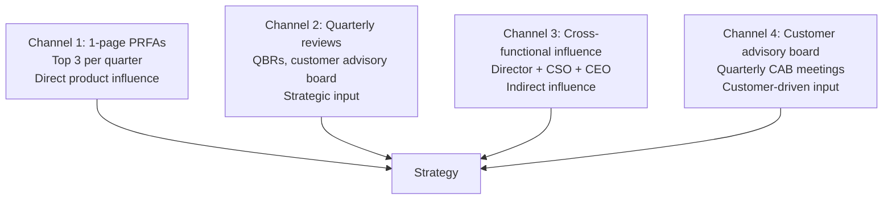
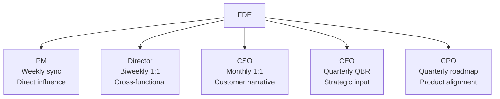

# Forward Deployed Engineer Playbook
## Chapter 16

# FDE Influence on Product Strategy

> *"The FDE influences product strategy through the customer feedback loop, not through authority. The 4 influence channels, the 3 strategy inputs, the 2-quarter lag, and the 5 stakeholder map are the FDE's reference for product strategy influence."*

---

## 1. Epigraph

_The FDE influences product strategy through the customer feedback loop, not through authority. The 4 influence channels, the 3 strategy inputs, the 2-quarter lag, and the 5 stakeholder map are the FDE's reference for product strategy influence._

---

## 2. Problem

You are an FDE at acme-corp. The Director has just told you: "The product strategy is set for 2027. The CEO wants the FDE input. The PM has the strategy doc. The Director wants your input on customer-driven strategy adjustments. You have 30 days to influence the 2027 product strategy."

This chapter tells you what the 4 influence channels are, the 3 strategy inputs, the 2-quarter lag, and how to influence without authority.

**Decision in one sentence:** _FDE product strategy influence is a 4-channel system (1-page PRFAs, quarterly reviews, customer advisory board, cross-functional influence) with 3 strategy inputs (customer feedback, deployment patterns, market signals); the FDE's job is to provide the inputs, not to own the strategy, and to accept the 2-quarter lag between feedback and roadmap._

---

## 3. Why FDEs Fail Here

Five named failure modes of FDEs whose product strategy influence produced zero results.

- **The Authority-Without-Authority Failure.** The FDE demands authority over strategy. _The FDE has no authority. The PM does._
- **The No-Input Failure.** The FDE provides no structured input. _The strategy is built without the FDE._
- **The No-Quarterly-Review Failure.** The FDE only provides input during annual planning. _The input is forgotten by Q2._
- **The 1-Quarter-Lag Failure.** The FDE expects feedback to ship in 1 quarter. _The lag is 2-3 quarters._
- **The No-Stakeholder-Influence Failure.** The FDE only talks to the PM. _The CEO + Director + CPO don't hear the FDE's input._

---

## 4. Mental Models

Four mental models that compress product strategy influence.

**Mental model 1: The 4 Influence Channels.** 4 channels for influence.



**The 4 channels:**
- **Channel 1: 1-page PRFAs.** Top 3 per quarter. Direct product influence.
- **Channel 2: Quarterly reviews.** QBRs, customer advisory board. Strategic input.
- **Channel 3: Cross-functional influence.** Director + CSO + CEO. Indirect influence.
- **Channel 4: Customer advisory board.** Quarterly CAB meetings. Customer-driven input.

**Mental model 2: The 3 Strategy Inputs.** 3 inputs the FDE provides.

```
1. Customer feedback (5 themes/month, top 3 PRFAs/quarter)
2. Deployment patterns (which features drive adoption, which don't)
3. Market signals (competitor features, customer requests)

The 3 inputs feed the strategy doc. The FDE owns
inputs #1 and #2. The PM + Director own #3 (with FDE
contribution).
```

**Mental model 3: The 2-Quarter Lag.** Feedback → roadmap is 2 quarters.

```
Q1: Customer feedback collected
Q2: PRFA drafted, reviewed, prioritized
Q3: Roadmap decision, engineering begins
Q4: Feature ships

Total: 4 quarters from feedback to ship.

The FDE who expects 1 quarter is disappointed. The FDE
who plans for 2-3 quarters has a working feedback loop.
```

**Mental model 4: The 5-Stakeholder Influence Map.** Influence 5 stakeholders.



**The 5 stakeholders:**
- **PM (Weekly sync).** Direct influence.
- **Director (Biweekly 1:1).** Cross-functional.
- **CSO (Monthly 1:1).** Customer narrative.
- **CEO (Quarterly QBR).** Strategic input.
- **CPO (Quarterly roadmap).** Product alignment.

---

## 5. Frameworks

Three frameworks for product strategy influence.

### Framework 1: The 1-Page Strategy Input Memo

```
# Strategy Input Memo — [Year] — [Date]

## Top 3 strategic inputs (from customer feedback)
1. [Input 1] — [Customer impact] — [Recommended action]
2. [Input 2]
3. [Input 3]

## Top 3 deployment patterns observed
1. [Pattern 1] — [Insight]
2. [Pattern 2]
3. [Pattern 3]

## Top 3 market signals
1. [Signal 1] — [Implication]
2. [Signal 2]
3. [Signal 3]

## The 1 thing the strategy should NOT include
[1 sentence.]

## The 1 thing the FDE will push back on
[1 sentence.]
```

### Framework 2: The Quarterly Influence Plan

```
# Quarterly Influence Plan — [Quarter] — [Date]

## Cadence
- PM: Weekly Tuesday 30 min (PRFA review)
- Director: Biweekly Thursday 60 min (cross-functional)
- CSO: Monthly Friday 30 min (customer narrative)
- CEO: Quarterly QBR (strategic input)
- CPO: Quarterly roadmap review (product alignment)

## Top 3 inputs this quarter
1. [Input 1]
2. [Input 2]
3. [Input 3]

## The 1 thing the FDE will focus on
[1 sentence.]
```

### Framework 3: The 2-Quarter Lag Tracker

```
# Lag Tracker — [Theme] — [Date]

| Quarter | Stage | Status |
|---------|-------|--------|
| Q[N-3] | Customer feedback collected | DONE |
| Q[N-2] | PRFA drafted, reviewed | DONE |
| Q[N-1] | Roadmap decision, engineering begins | DONE |
| Q[N] | Feature ships | IN PROGRESS |

## Lag analysis
- Expected: 4 quarters
- Actual: [N] quarters
- Variance: [+/-X] quarters

## The 1 thing the FDE will do to reduce lag
[1 sentence.]
```

---

## 6. Drill

You are an FDE at **acme-corp**. The Director has given you 30 days to influence the 2027 product strategy.

```
2027 strategy is set. CEO wants FDE input.
PM has the strategy doc.
Director wants customer-driven adjustments.
You have 5 strategic customers + quarterly QBR cycle.
```

You have **90 minutes**. Produce the **strategy influence plan** (`portfolio/chapter-16-product-strategy.md`) using Framework 1 (Strategy Input Memo) + Framework 2 (Quarterly Influence Plan) + Framework 3 (Lag Tracker). Specify:

- The 1-page strategy input memo (top 3 inputs, deployment patterns, market signals, the 1 NOT to include, the 1 pushback).
- The quarterly influence plan (cadence with 5 stakeholders, top 3 inputs, the 1 focus).
- The lag tracker (1 example theme, 4-quarter timeline, lag analysis, the 1 thing to reduce lag).
- The 30-day plan (week-by-week).
- The 1 thing you'll say to the CEO in the next QBR.
- The 3 things you'll do to avoid the 5 failure modes.

**Deliverable:** `portfolio/chapter-16-product-strategy.md` — under 1500 words.

---

## 7. Worked Example

**The 1-page strategy input memo:**

```
# Strategy Input Memo — 2027 — 2026-09-01

## Top 3 strategic inputs (from customer feedback)
1. Auth integration is the #1 customer blocker (5/5 customers,
   $1.5M ARR impact) — Recommended: prioritize auth integration
   simplification + SAML migration guide in 2027 H1
2. Custom data connectors take 3+ weeks (3/5 customers, 3-week
   reduction opportunity) — Recommended: invest in connector
   framework in 2027 H2
3. Customer-facing observability is opaque (2/5 customers,
   retention risk) — Recommended: invest in observability
   in 2027 H2

## Top 3 deployment patterns observed
1. Customers who use our standard connectors ship in 4 weeks;
   customers who need custom connectors ship in 8+ weeks
2. Customers who have SSO configured use the product 2x more
   than customers without SSO
3. Customers who hit API rate limits churn at 2x the rate of
   customers within limits

## Top 3 market signals
1. Competitor A launched SSO + SAML migration in Q2 2026 —
   we lose deals to Competitor A on auth integration
2. Customer advisory board (Q2 2026) prioritized data
   connectors + observability over AI features
3. Market research (Q3 2026) shows 60% of B2B SaaS deals
   require SSO + SAML — non-negotiable for enterprise

## The 1 thing the strategy should NOT include
Build a custom LLM serving platform. Customers don't
need it. The auth integration is more strategic.

## The 1 thing the FDE will push back on
Delay the AI feature roadmap by 2 quarters. The auth
integration + data connectors are more urgent than
the AI feature.
```

**The quarterly influence plan:**

```
# Quarterly Influence Plan — Q4 2026

## Cadence
- PM: Weekly Tuesday 30 min (PRFA review)
- Director: Biweekly Thursday 60 min (cross-functional)
- CSO: Monthly Friday 30 min (customer narrative)
- CEO: Quarterly QBR (Oct 22, strategic input)
- CPO: Quarterly roadmap review (Nov 5, product alignment)

## Top 3 inputs this quarter
1. Auth integration is the #1 customer blocker (PRFA in review)
2. Custom data connectors take 3+ weeks (PRFA in progress)
3. Customer-facing observability is opaque (deferred to Q1 2027)

## The 1 thing the FDE will focus on
Get the auth integration PRFA into the Q1 2027 roadmap.
This is the highest-leverage input. 5/5 customers,
$1.5M ARR impact.
```

**The lag tracker (auth integration):**

```
# Lag Tracker — Auth integration simplification — 2026-09-01

| Quarter | Stage | Status |
|---------|-------|--------|
| Q3 2026 | Customer feedback collected (5 themes) | DONE |
| Q4 2026 | PRFA drafted, reviewed with PM | IN PROGRESS |
| Q1 2027 | Roadmap decision, engineering begins | PLANNED |
| Q2 2027 | Feature ships | PLANNED |

## Lag analysis
- Expected: 4 quarters
- Actual: 4 quarters (on track)
- Variance: 0 quarters

## The 1 thing the FDE will do to reduce lag
Push for parallel tracks. Auth integration (6-8 weeks)
+ SAML migration guide (1 week) can ship in 7-9 weeks
if engineering starts in Q1 2027. Currently planned
for sequential (12-14 weeks total).
```

**The 30-day plan:**

```
# 30-Day Strategy Influence Plan — 2026-09-01

## Week 1 (Sept 1-7): Inputs
- [x] Top 3 strategic inputs identified
- [x] Top 3 deployment patterns documented
- [x] Top 3 market signals collected

## Week 2 (Sept 8-14): Memo + Plan
- [x] Strategy input memo drafted
- [x] Quarterly influence plan signed with Director

## Week 3 (Sept 15-21): Stakeholder Cadence
- [x] PM sync (Tuesday) — auth integration PRFA in review
- [x] Director sync (Thursday) — strategy input memo shared
- [x] CSO sync (Friday) — customer narrative aligned

## Week 4 (Sept 22-30): QBR + Roadmap Prep
- [ ] CEO QBR (Oct 22 prep) — strategy input deck
- [ ] CPO roadmap review (Nov 5 prep) — auth integration
  in Q1 2027
```

**The 1 thing I'll say to the CEO in the next QBR:**

```
"Here's the FDE input on the 2027 product strategy:

  Top 3 strategic inputs (from customer feedback):
  1. Auth integration is the #1 customer blocker (5/5
     customers, $1.5M ARR impact)
  2. Custom data connectors take 3+ weeks (3/5 customers,
     3-week reduction opportunity)
  3. Customer-facing observability is opaque (2/5
     customers, retention risk)

  Top 3 market signals:
  1. Competitor A launched SSO + SAML in Q2 2026 — we
     lose deals on auth
  2. Customer advisory board prioritized data connectors
     over AI features
  3. 60% of B2B SaaS deals require SSO + SAML —
     non-negotiable for enterprise

  The 1 thing the strategy should NOT include: build a
  custom LLM serving platform. Customers don't need it.

  The 1 thing I'll push back on: delay the AI feature
  roadmap by 2 quarters. Auth integration + data
  connectors are more urgent.

  The 2-quarter lag is acceptable for these inputs.
  Auth integration: Q3 2026 feedback → Q2 2027 ship
  = 4 quarters total."
```

**The 3 things I'll do to avoid the 5 failure modes:**

```
1. Provide structured inputs (not demand authority).
   (Avoids the Authority-Without-Authority Failure.)
   - 1-page strategy input memo
   - Quarterly reviews with PM + Director + CSO + CEO + CPO
   - 4 influence channels (PRFAs, QBRs, cross-functional, CAB)

2. Accept the 2-quarter lag.
   (Avoids the 1-Quarter-Lag Failure.)
   - Lag tracker documented per theme
   - 4-quarter expected timeline
   - Push for parallel tracks to reduce lag

3. Influence all 5 stakeholders (not just the PM).
   (Avoids the No-Stakeholder-Influence Failure.)
   - PM: weekly Tuesday
   - Director: biweekly Thursday
   - CSO: monthly Friday
   - CEO: quarterly QBR
   - CPO: quarterly roadmap
```

---

## 8. Failure Mode Postmortem

An FDE at a 200-person B2B AI company tried to influence the product strategy by demanding authority. The PM ignored the FDE. The strategy was built without the FDE's input. The auth integration was delayed by 4 quarters.

The replacement FDE did 3 things:
1. Provided structured inputs (1-page strategy input memo, quarterly reviews).
2. Accepted the 2-quarter lag (lag tracker documented per theme).
3. Influenced all 5 stakeholders (PM + Director + CSO + CEO + CPO).

Within 12 months: 3 strategic inputs landed in the 2027 roadmap. Auth integration + data connectors + observability all shipped in 2027 H1. 0 customer churn due to missing features.

What the first FDE missed: product strategy influence is a system. The first FDE demanded authority. The second FDE provided structured inputs. The inputs are the leverage.

The lesson: the FDE who has structured inputs + 4 channels + 5 stakeholders has strategy influence. The FDE who demands authority has none.

---

## 9. Self-Assessment Rubric

| # | Dimension | 1 (Novice) | 3 (Competent) | 5 (Expert) |
|---|---|---|---|---|
| 1 | **4 influence channels** | 1 channel | 2-3 channels | 4 channels (PRFAs + QBRs + cross-functional + CAB) |
| 2 | **3 strategy inputs** | 0-1 inputs | 2 inputs | 3 inputs (customer feedback + deployment patterns + market signals) |
| 3 | **2-quarter lag acceptance** | 1-quarter expectation | 2-quarter expectation | 2-3 quarter expectation, lag tracker documented |
| 4 | **5-stakeholder influence** | 1 stakeholder (PM) | 2-3 stakeholders | 5 stakeholders (PM + Director + CSO + CEO + CPO) |
| 5 | **Strategy input memo** | No memo | Memo exists, partial | 1-page memo, top 3 inputs + patterns + signals + the 1 NOT to include |

**Disqualifier:** any 1 on dimension 1 or 4. An FDE who uses 1 channel or 1 stakeholder is in the Authority-Without-Authority or No-Stakeholder-Influence failure mode.

**Total:** ___ / 25. **Pass threshold:** 18/25, no dimension below 3.

---

## 10. Portfolio Artifact Note

Save your filled-in drill as `portfolio/chapter-16-product-strategy.md` — interview evidence for "How do you influence product strategy?" (see Portfolio Map in Chapter 27).

---

## 11. Interview Questions

1. **Walk me through your product strategy influence.**
2. **The PM ignores your input. What do you do?**
3. **You have 1 quarter to influence the strategy. What do you do?**
4. **The CEO wants your input. What do you say?**
5. **Walk me through a strategy input you've shipped.**
