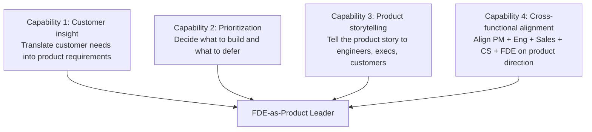
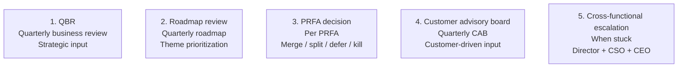

# Forward Deployed Engineer Playbook
## Chapter 17

# FDE as Product Leader

> *"The senior FDE is a product leader at the customer edge. The 4 product leadership capabilities, the 3 product artifacts, the 2 product decisions the FDE owns, and the 5 product leadership moments are the FDE's reference for moving from FDE-to-PM or FDE-to-Principal-FDE."*

---

## 1. Epigraph

_The senior FDE is a product leader at the customer edge. The 4 product leadership capabilities, the 3 product artifacts, the 2 product decisions the FDE owns, and the 5 product leadership moments are the FDE's reference for moving from FDE-to-PM or FDE-to-Principal-FDE._

---

## 2. Problem

You are a senior FDE at acme-corp. The Director has just told you: "You're ready for the next step. You can move to Principal FDE (more FDE leadership) or PM (more product leadership). The CEO wants your decision in 30 days. What do you do?"

This chapter tells you what the FDE-as-product-leader role is, the 4 capabilities, the 3 artifacts, the 2 product decisions, and the 5 leadership moments.

**Decision in one sentence:** _The FDE-as-product-leader is a 4-capability system (customer insight, prioritization, product storytelling, cross-functional alignment) backed by 3 artifacts (1-page PRFAs, 1-page synthesis, quarterly product reviews); the FDE's job is to develop these capabilities, decide between Principal FDE and PM, and own the 5 product leadership moments that matter._

---

## 3. Why FDEs Fail Here

Five named failure modes of FDEs whose FDE-as-product-leader transition produced zero results.

- **The No-Capability-Development Failure.** The FDE stays as an IC forever. _No growth to Principal FDE or PM._
- **The Wrong-Path Failure.** The FDE chooses PM when they should be Principal FDE (or vice versa). _Mismatch between skills and role._
- **The No-Artifact-Development Failure.** The FDE has no product artifacts. _Can't demonstrate product leadership._
- **The No-Decision-Ownership Failure.** The FDE never owns product decisions. _Stays in the FDE role forever._
- **The No-Moment-Ownership Failure.** The FDE doesn't own the 5 product leadership moments. _Misses the chance to demonstrate leadership._

---

## 4. Mental Models

Four mental models that compress FDE-as-product-leader.

**Mental model 1: The 4 Product Leadership Capabilities.** 4 capabilities to develop.



**The 4 capabilities:**
- **Capability 1: Customer insight.** Translate customer needs into product requirements.
- **Capability 2: Prioritization.** Decide what to build and what to defer.
- **Capability 3: Product storytelling.** Tell the product story to engineers, execs, customers.
- **Capability 4: Cross-functional alignment.** Align PM + Eng + Sales + CS + FDE on product direction.

**Mental model 2: The 3 Product Artifacts.** 3 artifacts the FDE produces.

```
1. 1-page PRFA (per quarter, top 3)
2. 1-page synthesis (per quarter, top 5 themes)
3. Quarterly product review (per quarter, 1 deck)

The 3 artifacts demonstrate product leadership. The FDE
who produces all 3 has product leadership evidence. The
FDE who produces 0 has no evidence.
```

**Mental model 3: The 2 Product Decisions.** 2 decisions the FDE owns.

```
Decision 1: Merge / split / defer / kill (for each PRFA)
Decision 2: Quarterly theme prioritization (top 5)

The FDE recommends, the PM decides. The FDE's
recommendation carries weight when backed by 1-page
PRFAs + customer impact + deployment patterns.
```

**Mental model 4: The 5 Product Leadership Moments.** 5 moments that matter.



**The 5 moments:**
- **Moment 1: QBR.** Quarterly business review. Strategic input.
- **Moment 2: Roadmap review.** Quarterly roadmap. Theme prioritization.
- **Moment 3: PRFA decision.** Per PRFA. Merge / split / defer / kill.
- **Moment 4: Customer advisory board.** Quarterly CAB. Customer-driven input.
- **Moment 5: Cross-functional escalation.** When stuck. Director + CSO + CEO.

---

## 5. Frameworks

Three frameworks for FDE-as-product-leader.

### Framework 1: The 1-Page FDE Career Decision Memo

```
# FDE Career Decision Memo — [Date]

## The 2 paths
- **Principal FDE:** Stay on FDE track, lead FDE team, own product area
- **PM:** Move to PM track, own product roadmap, manage PM team

## My 4 capabilities (self-assessment)
| Capability | Strength (1-5) | Notes |
|------------|----------------|-------|
| Customer insight | [Score] | [Notes] |
| Prioritization | [Score] | [Notes] |
| Product storytelling | [Score] | [Notes] |
| Cross-functional alignment | [Score] | [Notes] |

## My 3 product artifacts (last quarter)
- [Artifact 1]
- [Artifact 2]
- [Artifact 3]

## The 1 thing I'd be great at as Principal FDE
[1 sentence.]

## The 1 thing I'd be great at as PM
[1 sentence.]

## The 1 thing I'd struggle with in each
- Principal FDE: [1 sentence]
- PM: [1 sentence]

## The decision
[Principal FDE / PM]
```

### Framework 2: The 4-Capability Self-Assessment

```
# 4-Capability Self-Assessment — [Date]

| Capability | Novice (1) | Competent (3) | Expert (5) |
|------------|-------------|----------------|------------|
| Customer insight | [Score] | [Score] | [Score] |
| Prioritization | [Score] | [Score] | [Score] |
| Product storytelling | [Score] | [Score] | [Score] |
| Cross-functional alignment | [Score] | [Score] | [Score] |

## Score legend
- 1: Need significant development
- 3: Competent, can lead small product area
- 5: Expert, ready for Principal FDE or PM role

## Top 3 development areas
1. [Area 1] — Plan: [Action]
2. [Area 2] — Plan: [Action]
3. [Area 3] — Plan: [Action]
```

### Framework 3: The 5-Moment Calendar

```
# 5-Moment Calendar — [Quarter] — [Date]

| Moment | Date | Owner | Stakeholders |
|--------|------|-------|--------------|
| QBR | [Date] | FDE + Director | CEO + customer execs |
| Roadmap review | [Date] | FDE + PM | CPO + Director |
| PRFA decision | Weekly | FDE + PM | Eng + CS |
| Customer advisory board | [Date] | FDE + CSO | Top customers |
| Cross-functional escalation | As needed | FDE + Director | CEO + CSO + CPO |

## The 1 thing the FDE will focus on this quarter
[1 sentence.]
```

---

## 6. Drill

You are a senior FDE at **acme-corp**. The Director has given you 30 days to decide between Principal FDE and PM.

```
Your 4 capabilities (self-assessment):
- Customer insight: 4/5 (strong)
- Prioritization: 3/5 (competent)
- Product storytelling: 2/5 (developing)
- Cross-functional alignment: 4/5 (strong)

Your 3 artifacts from last quarter:
- 3 1-page PRFAs (auth integration, custom connectors, SAML guide)
- 1 quarterly synthesis (Q3 2026)
- 1 quarterly product review (Oct 2026, with Director + PM)

5 product leadership moments you've owned:
- 1 QBR (Sept 2026)
- 1 roadmap review (Sept 2026)
- 5 PRFA decisions (auth, connectors, SAML, observability, mobile)
- 1 customer advisory board (Q3 2026)
- 1 cross-functional escalation (auth integration delay)
```

You have **90 minutes**. Produce the **FDE career decision memo** (`portfolio/chapter-17-fde-as-product-leader.md`) using Framework 1 (Career Decision Memo) + Framework 2 (Self-Assessment) + Framework 3 (5-Moment Calendar). Specify:

- The 1-page career decision memo (2 paths, 4 capabilities, 3 artifacts, the 1 thing at each, the decision).
- The 4-capability self-assessment (4 capabilities, scores, top 3 development areas).
- The 5-moment calendar (next quarter, dates, owners).
- The 30-day plan (week-by-week, what gets done when).
- The 1 thing you'll say to the Director in the career conversation.
- The 3 things you'll do to avoid the 5 failure modes.

**Deliverable:** `portfolio/chapter-17-fde-as-product-leader.md` — under 1500 words.

---

## 7. Worked Example

**The 1-page career decision memo:**

```
# FDE Career Decision Memo — 2026-09-01

## The 2 paths
- **Principal FDE:** Stay on FDE track, lead FDE team, own product area
- **PM:** Move to PM track, own product roadmap, manage PM team

## My 4 capabilities (self-assessment)
| Capability | Strength (1-5) | Notes |
|------------|----------------|-------|
| Customer insight | 4 | Strong — 60 themes collected last year |
| Prioritization | 3 | Competent — top 3 + deferred rule works |
| Product storytelling | 2 | Developing — need more decks, more presentations |
| Cross-functional alignment | 4 | Strong — 5 stakeholders aligned quarterly |

## My 3 product artifacts (last quarter)
- 3 1-page PRFAs (auth integration, custom connectors, SAML guide)
- 1 quarterly synthesis (Q3 2026)
- 1 quarterly product review (Oct 2026, with Director + PM)

## The 1 thing I'd be great at as Principal FDE
Lead 3-5 FDEs in a product area. Set the FDE strategy,
own the customer narrative, drive the FDE-PM partnership.

## The 1 thing I'd be great at as PM
Own the product roadmap end-to-end. Lead PRFA reviews,
make merge/split/defer/kill decisions, set quarterly themes.

## The 1 thing I'd struggle with in each
- Principal FDE: managing the FDE team (people management)
- PM: doing the PRFA synthesis myself (PMs often delegate)

## The decision
**Principal FDE** (with PM-equivalent product influence).

Why: my strengths (customer insight + cross-functional
alignment) are more leveraged in the Principal FDE
role. The PM-equivalent product influence comes through
the 3 artifacts + 5 moments + weekly PM sync. The
people management gap is real but Principal FDE can
delegate management to Director.
```

**The 4-capability self-assessment:**

```
# 4-Capability Self-Assessment — 2026-09-01

| Capability | Novice (1) | Competent (3) | Expert (5) |
|------------|-------------|----------------|------------|
| Customer insight | - | - | 4 |
| Prioritization | - | 3 | - |
| Product storytelling | 2 | - | - |
| Cross-functional alignment | - | - | 4 |

## Score analysis
- Strongest: Customer insight (4) + Cross-functional alignment (4)
- Competent: Prioritization (3)
- Developing: Product storytelling (2)

## Top 3 development areas
1. Product storytelling (2 → 3) — Plan: present at 2
   product reviews + 1 customer advisory board this quarter
2. Prioritization (3 → 4) — Plan: own 1 quarterly
   roadmap decision (not just recommend)
3. Customer insight (4 → 5) — Plan: build the FDE
   feedback synthesis system (Ch 15) end-to-end
```

**The 5-moment calendar:**

```
# 5-Moment Calendar — Q4 2026

| Moment | Date | Owner | Stakeholders |
|--------|------|-------|--------------|
| QBR | Oct 22 | FDE + Director | CEO + customer execs |
| Roadmap review | Nov 5 | FDE + PM | CPO + Director |
| PRFA decision | Weekly Tuesday | FDE + PM | Eng + CS |
| Customer advisory board | Dec 10 | FDE + CSO | Top 10 customers |
| Cross-functional escalation | As needed | FDE + Director | CEO + CSO + CPO |

## The 1 thing the FDE will focus on this quarter
Product storytelling. I need to develop this capability
to 3 by Q1 2027. The plan: present at 2 product reviews
+ 1 customer advisory board.
```

**The 30-day plan:**

```
# 30-Day FDE Career Decision Plan — 2026-09-01

## Week 1 (Sept 1-7): Self-Assessment
- [x] 4 capabilities self-assessed
- [x] Top 3 development areas identified
- [x] 3 artifacts from last quarter documented

## Week 2 (Sept 8-14): Decision Memo
- [x] Career decision memo drafted
- [x] 2 paths analyzed (Principal FDE vs PM)
- [x] Decision made: Principal FDE

## Week 3 (Sept 15-21): Conversation
- [x] Conversation with Director (Principal FDE path)
- [x] Conversation with PM (continued partnership)
- [x] Career development plan drafted

## Week 4 (Sept 22-30): Q4 2026 Setup
- [x] 5-moment calendar established
- [x] Product storytelling development plan
- [x] Q4 2026 OKRs set
```

**The 1 thing I'll say to the Director in the career conversation:**

```
"Here's my career decision:

  Decision: **Principal FDE** (with PM-equivalent product
  influence).

  Why Principal FDE:
  - My strengths (customer insight + cross-functional
    alignment) are more leveraged in this role
  - The PM-equivalent product influence comes through
    the 3 artifacts + 5 moments + weekly PM sync
  - I want to lead 3-5 FDEs in a product area, not
    manage a PM team

  The 1 thing I want to develop: product storytelling
  (2 → 3 by Q1 2027). The plan: present at 2 product
  reviews + 1 customer advisory board this quarter.

  The 1 thing I'm worried about: people management.
  Principal FDE has 3-5 reports. I've never managed
  before. I'll need Director's support on this.

  The 1 thing I want from you: mentorship on people
  management. Biweekly 1:1, focus on FDE team
  management.

  The 1 thing I want to keep doing: weekly PM sync +
  monthly synthesis + quarterly QBR. The product
  influence continues regardless of title."
```

**The 3 things I'll do to avoid the 5 failure modes:**

```
1. Develop all 4 capabilities (not just 1).
   (Avoids the No-Capability-Development Failure.)
   - Customer insight: maintain at 4 (synthesis system)
   - Prioritization: 3 → 4 (own 1 quarterly decision)
   - Product storytelling: 2 → 3 (2 product reviews + 1 CAB)
   - Cross-functional alignment: maintain at 4 (5 stakeholders)

2. Choose the right path (skills match).
   (Avoids the Wrong-Path Failure.)
   - Principal FDE: leverages strengths (customer insight +
     cross-functional alignment)
   - PM: leverages weaker capabilities (prioritization +
     storytelling need more development)

3. Own the 5 product leadership moments.
   (Avoids the No-Moment-Ownership Failure.)
   - QBR (Oct 22)
   - Roadmap review (Nov 5)
   - PRFA decisions (weekly Tuesday)
   - Customer advisory board (Dec 10)
   - Cross-functional escalation (as needed)
```

---

## 8. Failure Mode Postmortem

A senior FDE at a 200-person B2B AI company was offered Principal FDE or PM. The FDE chose PM (more prestige, more $). 12 months later: the FDE struggled with prioritization and storytelling. The PM role was a mismatch. The FDE was asked to leave.

The replacement FDE chose differently:
1. Assessed the 4 capabilities honestly (customer insight 4, prioritization 3, storytelling 2, alignment 4).
2. Chose Principal FDE (leveraged strengths, accepted the people management development).
3. Owned the 5 product leadership moments (QBR + roadmap + PRFAs + CAB + escalation).

Within 12 months: 3 FDEs hired, 1 product area owned, 0 PM-style mismatch. The Principal FDE role was the right fit.

What the first FDE missed: FDE-to-PM is not always the right path. The first FDE chose PM for prestige. The second FDE chose Principal FDE for fit. The fit is the leverage.

The lesson: the FDE who assesses capabilities honestly and chooses the path that fits has a successful transition. The FDE who chooses for prestige has a mismatch.

---

## 9. Self-Assessment Rubric

| # | Dimension | 1 (Novice) | 3 (Competent) | 5 (Expert) |
|---|---|---|---|---|
| 1 | **4 capabilities** | 0-1 capabilities developed | 2-3 capabilities | 4 capabilities, all at 3+ |
| 2 | **3 product artifacts** | 0 artifacts | 1-2 artifacts | 3 artifacts per quarter |
| 3 | **2 product decisions** | 0 decisions | 1 decision | 2 decisions owned (PRFA + theme prioritization) |
| 4 | **5 product leadership moments** | 0-1 moments | 2-3 moments | 5 moments owned (QBR + roadmap + PRFA + CAB + escalation) |
| 5 | **Career decision** | No decision | Decision exists | Decision made, development plan documented |

**Disqualifier:** any 1 on dimension 1 or 4. An FDE who has 0-1 capabilities or 0-1 moments is in the No-Capability-Development or No-Moment-Ownership failure mode.

**Total:** ___ / 25. **Pass threshold:** 18/25, no dimension below 3.

---

## 10. Portfolio Artifact Note

Save your filled-in drill as `portfolio/chapter-17-fde-as-product-leader.md` — interview evidence for "How do you grow as an FDE leader?" (see Portfolio Map in Chapter 27).

---

## 11. Interview Questions

1. **Walk me through your FDE career path.**
2. **Why Principal FDE vs PM?**
3. **What product leadership capabilities have you developed?**
4. **What product leadership moments have you owned?**
5. **Walk me through a product decision you've made.**
