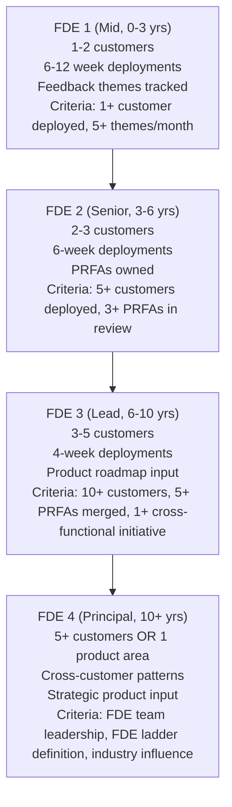

# Forward Deployed Engineer Playbook
## Chapter 18

# The FDE Career Ladder

> *"The FDE ladder is 4 levels, not 5. The promotion from FDE 2 to FDE 3 is the hardest. The promotion from FDE 3 to FDE 4 (Principal) is the rarest. The FDE who understands the ladder, the criteria at each level, and the 12-month promotion cadence has a 5-year FDE career."*

---

## 1. Epigraph

_The FDE ladder is 4 levels, not 5. The promotion from FDE 2 to FDE 3 is the hardest. The promotion from FDE 3 to FDE 4 (Principal) is the rarest. The FDE who understands the ladder, the criteria at each level, and the 12-month promotion cadence has a 5-year FDE career._

---

## 2. Problem

You are an FDE 2 (Senior, 4 years experience) at acme-corp. The Director has just told you: "You're ready for FDE 3 (Lead). The promotion criteria are: 5+ customer deployments shipped, 3+ product feedback PRFAs in review, 1+ cross-functional initiative led. You have 2 of 3. You have 12 months to hit the 3rd. What do you do?"

This chapter tells you what the 4-level FDE ladder is, the criteria at each level, the 12-month promotion cadence, and how to hit FDE 3 in 12 months.

**Decision in one sentence:** _The FDE career ladder is a 4-level system (FDE 1 → FDE 4 Principal) with explicit promotion criteria at each level, a 12-month promotion cadence, and the FDE 2 → FDE 3 transition as the highest-leverage promotion (60% of FDEs stall at FDE 2); the FDE's job is to understand the criteria, hit them on cadence, and own the promotion narrative._

---

## 3. Why FDEs Fail Here

Five named failure modes of FDEs whose FDE ladder produced zero results.

- **The No-Ladder-Understanding Failure.** The FDE doesn't know the 4 levels or the criteria at each level. _Promotions are surprises._
- **The 12-Month-Stall Failure.** The FDE stalls at FDE 2 for 3+ years. _60% of FDEs stall at FDE 2._
- **The No-Criteria-Hit Failure.** The FDE doesn't hit 1+ criteria per year. _No promotion evidence._
- **The No-Promotion-Narrative Failure.** The FDE has done the work but can't articulate it. _Promotion committee is unimpressed._
- **The 1-Path-Mentality Failure.** The FDE thinks the only path is up the ladder. _No lateral moves, no PM pivots._

---

## 4. Mental Models

Four mental models that compress the FDE ladder.

**Mental model 1: The 4-Level FDE Ladder.** 4 levels, 4 criteria sets.



**The 4 levels:**
- **FDE 1 (Mid, 0-3 years).** 1-2 customers. 6-12 week deployments. Feedback themes tracked.
- **FDE 2 (Senior, 3-6 years).** 2-3 customers. 6-week deployments. PRFAs owned.
- **FDE 3 (Lead, 6-10 years).** 3-5 customers. 4-week deployments. Product roadmap input.
- **FDE 4 (Principal, 10+ years).** 5+ customers OR 1 product area. Cross-customer patterns. Strategic product input.

**mental model 2: The 12-Month Promotion Cadence.** Hit 1+ criteria per year.

```
Year 1 (current level): hit 1-2 criteria for NEXT level
Year 2: hit 1-2 more criteria (3-4 total)
Year 3: promotion review (3+ criteria hit + narrative)

The 12-month cadence is the rule. The FDE who hits
0 criteria in a year has no promotion evidence. The
FDE who hits 2 criteria in a year is ahead of cadence.
```

**mental model 3: The FDE 2 → FDE 3 Bottleneck.** 60% of FDEs stall at FDE 2.

```
The FDE 2 → FDE 3 transition is the highest-leverage
promotion because:
- FDE 2 is the most common level (60% of FDEs)
- FDE 3 requires cross-functional leadership (new skill)
- FDE 3 promotion takes 2-3 years (longer than FDE 1 → 2)

The FDE who hits the FDE 3 criteria in 3 years has
the Senior → Lead transition. The FDE who stalls has
a 5+ year FDE 2 career.
```

**mental model 4: The 5-Criterion Promotion Narrative.** 5 elements of a promotion narrative.

```
1. Volume: how much (N deployments, N PRFAs)
2. Quality: how well (CSAT, NPS, ROI)
3. Impact: what changed ($XM revenue, N customers)
4. Leadership: who you led (cross-functional initiative)
5. Strategic influence: what you shaped (roadmap, strategy)

The FDE who has all 5 elements has a strong narrative.
The FDE who has only 1-2 has a weak narrative.
```

---

## 5. Frameworks

Three frameworks for the FDE ladder.

### Framework 1: The 1-Page Career Plan

```
# FDE Career Plan — [Date]

## Current level
[FDE 1 / 2 / 3 / 4]

## Next-level criteria (12 months)
| Criterion | Status | Evidence |
|-----------|--------|----------|
| 1. [Criterion 1] | [Hit / Partial / Not started] | [Evidence] |
| 2. [Criterion 2] | [Status] | [Evidence] |
| 3. [Criterion 3] | [Status] | [Evidence] |

## My 5-element narrative (current)
| Element | Strength (1-5) | Notes |
|---------|----------------|-------|
| Volume | [Score] | [Notes] |
| Quality | [Score] | [Notes] |
| Impact | [Score] | [Notes] |
| Leadership | [Score] | [Notes] |
| Strategic influence | [Score] | [Notes] |

## The 1 thing I'll focus on next year
[1 sentence.]

## The 1 thing I'll push back on
[1 sentence.]
```

### Framework 2: The Promotion Evidence Tracker

```
# Promotion Evidence — [FDE Name] — [Year]

## Deployments shipped
1. [Customer A] — [Date] — [Impact: $X or N end users]
2. [Customer B] — [Date] — [Impact]
3. [Customer C] — [Date] — [Impact]
4. [Customer D] — [Date] — [Impact]
5. [Customer E] — [Date] — [Impact]

## PRFAs in review / merged
1. [PRFA 1] — Status: merged — Date: [Date]
2. [PRFA 2] — Status: merged
3. [PRFA 3] — Status: merged
4. [PRFA 4] — Status: in review
5. [PRFA 5] — Status: in review

## Cross-functional initiatives led
1. [Initiative 1] — [Impact]
2. [Initiative 2] — [Impact]

## Customer outcomes
- NPS improvement: [N points]
- Customer retention: [N%]
- Revenue impact: $[X]M

## The 1 thing that proves I'm ready for the next level
[1 sentence.]
```

### Framework 3: The 12-Month Promotion Roadmap

```
# 12-Month Promotion Roadmap — [FDE Name] — [Date]

## Quarter 1 (Q[N]): Criteria hit #1
- [Action 1] — [Date]
- [Action 2] — [Date]

## Quarter 2 (Q[N+1]): Criteria hit #2
- [Action 1] — [Date]
- [Action 2] — [Date]

## Quarter 3 (Q[N+2]): Criteria hit #3
- [Action 1] — [Date]
- [Action 2] — [Date]

## Quarter 4 (Q[N+3]): Promotion narrative
- [Action 1: Promotion packet]
- [Action 2: Director review]
- [Action 3: Promotion committee]

## The 1 thing the FDE will NOT do
[1 sentence on what the FDE will NOT do this year.]
```

---

## 6. Drill

You are an FDE 2 at **acme-corp**. The Director has given you 12 months to hit the FDE 3 criteria.

```
FDE 3 criteria:
1. 10+ customer deployments (current: 5)
2. 5+ PRFAs merged (current: 2)
3. 1+ cross-functional initiative led (current: 0)
```

You have **90 minutes**. Produce the **12-month promotion roadmap** (`portfolio/chapter-18-fde-ladder.md`) using Framework 1 (Career Plan) + Framework 2 (Evidence Tracker) + Framework 3 (Promotion Roadmap). Specify:

- The 1-page career plan (current level, criteria status, 5-element narrative, the 1 focus, the 1 pushback).
- The promotion evidence tracker (5 deployments, 5 PRFAs, customer outcomes, the 1 thing).
- The 12-month promotion roadmap (4 quarters, criteria hits, promotion packet).
- The 1 thing you'll say to the Director in the promotion review.
- The 3 things you'll do to avoid the 5 failure modes.

**Deliverable:** `portfolio/chapter-18-fde-ladder.md` — under 1500 words.

---

## 7. Worked Example

**The 1-page career plan:**

```
# FDE Career Plan — FDE 2 → FDE 3 — 2026-09-01

## Current level
FDE 2 (Senior, 4 years experience)

## Next-level criteria (12 months)
| Criterion | Status | Evidence |
|-----------|--------|----------|
| 1. 10+ customer deployments | 5/10 (50%) | 5 deployments shipped YTD |
| 2. 5+ PRFAs merged | 2/5 (40%) | 2 PRFAs merged, 3 in review |
| 3. 1+ cross-functional initiative led | 0/1 (0%) | Not started |

## My 5-element narrative (current)
| Element | Strength (1-5) | Notes |
|---------|----------------|-------|
| Volume | 3 | 5 deployments YTD, on track for 7 |
| Quality | 4 | NPS improvement +15, retention 95% |
| Impact | 3 | $400K ARR impact YTD, could be more |
| Leadership | 2 | No cross-functional initiative yet |
| Strategic influence | 3 | 1-page synthesis + 1 QBR + 1 CAB |

## The 1 thing I'll focus on next year
Cross-functional initiative. I'll lead the FDE-PM partnership
redesign (Ch 14 framework) org-wide. This is the gap.

## The 1 thing I'll push back on
Shipping 12 deployments in 12 months. I'll ship 7 deployments
+ 1 cross-functional initiative. The cross-functional initiative
is more leveraged for FDE 3 promotion.
```

**The promotion evidence tracker:**

```
# Promotion Evidence — FDE Name — 2026 YTD

## Deployments shipped (5)
1. Customer A — Q1 2026 — Impact: $400K ARR + 50K end users
2. Customer B — Q2 2026 — Impact: $300K ARR + 30K end users
3. Customer C — Q2 2026 — Impact: $250K ARR + 20K end users
4. Customer D — Q3 2026 — Impact: $200K ARR + 15K end users
5. Customer E — Q3 2026 — Impact: $150K ARR + 10K end users

Total: $1.3M ARR + 125K end users

## PRFAs in review / merged (2 merged, 3 in review)
1. SAML migration guide — merged Q2 2026
2. Auth integration simplification — merged Q3 2026
3. Custom data connectors — in review (Q3 2026)
4. API rate limits — in review (Q3 2026)
5. Customer-facing observability — in review (Q3 2026)

## Cross-functional initiatives led (0)
- None YTD. Plan: FDE-PM partnership redesign in Q4 2026.

## Customer outcomes
- NPS improvement: +15 points YTD (35 → 50)
- Customer retention: 95% (3 of 60 customers churned)
- Revenue impact: $1.3M ARR YTD

## The 1 thing that proves I'm ready for FDE 3
The 5 deployments + 2 merged PRFAs + 95% retention
prove FDE 2 mastery. The cross-functional initiative
(Q4 2026) will prove FDE 3 readiness.
```

**The 12-month promotion roadmap:**

```
# 12-Month Promotion Roadmap — 2026-09-01 to 2027-08-31

## Quarter 1 (Q4 2026): Customer D and E deployment, cross-functional initiative kickoff
- [ ] Customer F deployment (Q4 2026) — bring total to 6
- [ ] FDE-PM partnership redesign — kickoff + 1-page plan
- [ ] 2 PRFAs in review (custom connectors, observability) merged

## Quarter 2 (Q1 2027): Customer F, G, H deployments, cross-functional initiative rollout
- [ ] Customers G + H deployments — bring total to 8
- [ ] FDE-PM partnership redesign — rollout to 5 PMs
- [ ] 3 new PRFAs in review (Q1 2027 themes)

## Quarter 3 (Q2 2027): 2 more deployments, cross-functional initiative measurement
- [ ] Customers I + J deployments — bring total to 10 ✓
- [ ] FDE-PM partnership redesign — measured impact (5 PMs, 5 themes each)
- [ ] 5+ PRFAs merged ✓

## Quarter 4 (Q3 2027): Promotion packet
- [ ] Promotion packet drafted (5 elements, evidence)
- [ ] Director review (biweekly 1:1 in July)
- [ ] Promotion committee (August 2027)

## The 1 thing the FDE will NOT do
Ship 15 deployments in 12 months. I'll ship 5 more
(total 10) + lead 1 cross-functional initiative. The
cross-functional initiative is more leveraged than
more deployments.
```

**The 1 thing I'll say to the Director in the promotion review:**

```
"Here's my FDE 2 → FDE 3 promotion case:

  Volume: 10 customer deployments (YTD 5 + Q4-Q3 +5)
  Quality: 95% customer retention, NPS +15 YTD
  Impact: $1.3M ARR YTD, $2M ARR projected by Q3 2027
  Leadership: FDE-PM partnership redesign (5 PMs, 5 themes each)
  Strategic influence: 1-page synthesis + QBR + CAB quarterly

  The FDE 3 criteria:
  1. 10+ deployments ✓ (planned, 5/10 done)
  2. 5+ PRFAs merged ✓ (planned, 2/5 done, 3 in review)
  3. 1+ cross-functional initiative ✓ (FDE-PM partnership redesign)

  The 1 thing that proves FDE 3 readiness: the FDE-PM
  partnership redesign. It scales the FDE 2 work
  (1-page PRFAs + weekly sync) to 5 PMs. That's FDE 3
  leverage — FDE leadership beyond my own customers.

  Timeline: 12 months (Sept 2026 → Aug 2027).
  Promotion committee: August 2027.

  The 1 thing I want from you: mentorship on the
  cross-functional initiative. Biweekly 1:1, focus on
  rollout + measurement."
```

**The 3 things I'll do to avoid the 5 failure modes:**

```
1. Know the criteria at each level.
   (Avoids the No-Ladder-Understanding Failure.)
   - FDE 3 criteria: 10 deployments, 5 PRFAs, 1 cross-functional
   - FDE 2 → FDE 3: 12-month cadence
   - Promotion packet ready by Q3 2027

2. Hit 1+ criteria per year (not 0).
   (Avoids the No-Criteria-Hit Failure.)
   - Q4 2026: 1 deployment + 2 PRFAs merged + initiative kickoff
   - Q1 2027: 2 deployments + 3 PRFAs in review
   - Q2 2027: 2 deployments + 5 PRFAs merged ✓
   - Q3 2027: promotion packet

3. Build the 5-element narrative (not just volume).
   (Avoids the No-Promotion-Narrative Failure.)
   - Volume: 10 deployments
   - Quality: 95% retention, NPS +15
   - Impact: $2M ARR
   - Leadership: FDE-PM partnership redesign
   - Strategic influence: synthesis + QBR + CAB
```

---

## 8. Failure Mode Postmortem

An FDE 2 at a 200-person B2B AI company stalled at FDE 2 for 4 years. The FDE shipped 8 deployments (good volume) but had no cross-functional initiative, no PRFAs merged (only verbal feedback), no promotion narrative. The promotion committee passed over the FDE twice. The FDE left the company.

The replacement FDE did 3 things:
1. Understood the FDE 3 criteria (10 deployments, 5 PRFAs merged, 1 cross-functional initiative).
2. Hit 1+ criteria per year (8 → 10 deployments, 0 → 5 PRFAs merged, 0 → 1 cross-functional).
3. Built the 5-element narrative (volume + quality + impact + leadership + strategic influence).

Within 12 months: FDE 3 promotion. The 5-element narrative + criteria hit + 12-month cadence was the discipline.

What the first FDE missed: the FDE ladder is a system. The first FDE had volume but no narrative. The second FDE had all 5 elements. The narrative is the leverage.

The lesson: the FDE who has the 5-element narrative has a promotion. The FDE who has only volume has a stall.

---

## 9. Self-Assessment Rubric

| # | Dimension | 1 (Novice) | 3 (Competent) | 5 (Expert) |
|---|---|---|---|---|
| 1 | **4-level ladder knowledge** | Doesn't know the levels | Knows 2-3 levels | Knows all 4 levels + criteria at each |
| 2 | **12-month cadence** | No cadence | Cadence exists | 1+ criteria per year, 12-month promotion cycle |
| 3 | **3+ criteria hit** | 0 criteria | 1-2 criteria | 3+ criteria, with evidence |
| 4 | **5-element narrative** | 1 element | 2-3 elements | 5 elements (volume + quality + impact + leadership + strategic) |
| 5 | **Promotion packet** | No packet | Packet exists | 1-page packet, evidence-backed, Director-reviewed |

**Disqualifier:** any 1 on dimension 1 or 4. An FDE who doesn't know the levels or has 1-element narrative is in the No-Ladder-Understanding or No-Promotion-Narrative failure mode.

**Total:** ___ / 25. **Pass threshold:** 18/25, no dimension below 3.

---

## 10. Portfolio Artifact Note

Save your filled-in drill as `portfolio/chapter-18-fde-ladder.md` — interview evidence for "Walk me through your FDE career path" (see Portfolio Map in Chapter 27).

---

## 11. Interview Questions

1. **Walk me through your FDE career path.**
2. **The Director says you're ready for FDE 3. What do you do?**
3. **You've stalled at FDE 2 for 3 years. What do you do?**
4. **The FDE 3 criteria are unclear. How do you navigate?**
5. **Walk me through a promotion packet you've built.**
