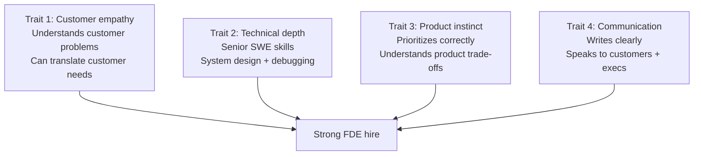
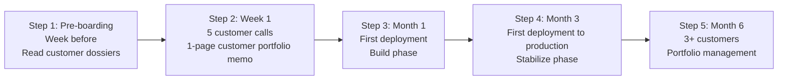

# Forward Deployed Engineer Playbook
## Chapter 19

# FDE Hiring and Onboarding

> *"Hiring FDEs is different from hiring SWEs. The 4 FDE-hire traits, the 3-stage FDE interview loop, the 5-step FDE onboarding, and the 30-60-90 plan for new FDEs are the hiring reference for building an FDE team."*

---

## 1. Epigraph

_Hiring FDEs is different from hiring SWEs. The 4 FDE-hire traits, the 3-stage FDE interview loop, the 5-step FDE onboarding, and the 30-60-90 plan for new FDEs are the hiring reference for building an FDE team._

---

## 2. Problem

You are a Principal FDE at acme-corp. The Director has just told you: "We're hiring 2 FDEs this quarter. The candidates are senior SWEs who want to move to FDE. We need a 4-trait FDE profile, a 3-stage interview loop, a 5-step onboarding system, and a 30-60-90 plan. We have 60 days to hire, onboard, and have the new FDEs shipping. What do you do?"

This chapter tells you the 4 FDE-hire traits, the 3-stage loop, the 5-step onboarding, and the 30-60-90 plan.

**Decision in one sentence:** _FDE hiring is a 4-trait profile (customer empathy + technical depth + product instinct + communication) + 3-stage loop (screen + onsite + customer simulation) + 5-step onboarding (pre-boarding → week 1 → month 1 → month 3 → month 6); the FDE's job is to design the hiring system, run the loop, and own the onboarding._

---

## 3. Why FDEs Fail Here

Five named failure modes of FDE hiring that produced zero results.

- **The SWE-Profile Failure.** The FDE hire is screened like a SWE. _Customer empathy is not tested._
- **The No-Customer-Simulation Failure.** The FDE interview loop has no customer simulation. _The candidate can't demonstrate FDE skills._
- **The No-Onboarding Failure.** The FDE is hired but not onboarded. _The FDE is unproductive for 3-6 months._
- **The 30-60-90-Without-Customers Failure.** The FDE's 30-60-90 has no customer assignments. _The FDE has no real work for 90 days._
- **The No-Mentor Failure.** The new FDE has no mentor. _The FDE learns by trial and error._

---

## 4. Mental Models

Four mental models that compress FDE hiring.

**mental model 1: The 4 FDE-Hire Traits.** 4 traits, not 1.



**The 4 traits:**
- **Trait 1: Customer empathy.** Understands customer problems. Can translate customer needs.
- **Trait 2: Technical depth.** Senior SWE skills. System design + debugging.
- **Trait 3: Product instinct.** Prioritizes correctly. Understands product trade-offs.
- **Trait 4: Communication.** Writes clearly. Speaks to customers + execs.

**mental model 2: The 3-Stage FDE Interview Loop.** 3 stages, customer simulation included.

```
Stage 1: Screen (60 min, video call)
- 30 min: customer empathy (past customer interactions)
- 30 min: technical depth (system design)

Stage 2: Onsite (4 hours, half-day)
- 1 hour: customer simulation (mock customer call)
- 1 hour: product instinct (1-page PRFA from scratch)
- 1 hour: technical depth (live coding or system design)
- 1 hour: cross-functional alignment (mock PM + Director conversation)

Stage 3: Customer reference (30 min)
- 1 reference from a past customer (if available)
- 1 reference from a past PM/Eng collaborator
```

**mental model 3: The 5-Step FDE Onboarding.** 5 steps, 6 months.



**The 5 steps:**
- **Step 1: Pre-boarding (week before).** Read customer dossiers.
- **Step 2: Week 1.** 5 customer calls. 1-page customer portfolio memo.
- **Step 3: Month 1.** First deployment. Build phase.
- **Step 4: Month 3.** First deployment to production. Stabilize phase.
- **Step 5: Month 6.** 3+ customers. Portfolio management.

**mental model 4: The 30-60-90 Plan for New FDEs.** 30-60-90 with real work.

```
Day 1-30: Assess
- 5 customer calls (60 min each)
- 1-page customer portfolio memo
- Top 3 risks identified per customer
- FDE charter signed

Day 31-60: Plan
- 1-page PRFA for top 1 feedback
- 1 customer design review
- 1-page product feedback synthesis
- Stakeholder cadence established

Day 61-90: Execute
- 1 customer deployment to production
- 1 customer deployment to pilot
- 1 retrospective
- 1-page 90-day report
```

---

## 5. Frameworks

Three frameworks for FDE hiring.

### Framework 1: The 1-Page FDE-Hire Profile

```
# FDE-Hire Profile — [Date]

## The 4 traits
| Trait | Must-have | Nice-to-have |
|-------|-----------|---------------|
| 1. Customer empathy | Past customer-facing work | FDE experience |
| 2. Technical depth | Senior SWE (IC3+ equivalent) | System design experience |
| 3. Product instinct | 1-page PRFA writing | PM experience |
| 4. Communication | Clear writing, customer-facing | Public speaking |

## The 3-stage loop
- Stage 1 (60 min): customer empathy + technical depth screen
- Stage 2 (4 hours): customer simulation + product instinct + technical depth + cross-functional
- Stage 3 (30 min): customer + PM reference

## The 1 thing the FDE will NOT compromise on
[1 sentence.]
```

### Framework 2: The Customer Simulation Rubric

```
# Customer Simulation Rubric — [Candidate] — [Date]

## Scenario
You are an FDE at acme-corp. Customer A's deployment
just went down at 2am. The customer's CTO is calling
you. Walk me through your response in the first 30 min.

## The 4 dimensions
| Dimension | 1 (Novice) | 3 (Competent) | 5 (Expert) |
|-----------|-------------|----------------|------------|
| 1. Crisis response | No plan | Plan exists | 4-phase playbook (Ch 12) |
| 2. Stakeholder comms | 1 stakeholder | 2-3 stakeholders | 5 stakeholders, tailored |
| 3. Technical depth | Surface-level | Medium | System-level debugging |
| 4. Customer empathy | Reactive | Proactive | Anticipates customer needs |

## The 1 thing the candidate got right
[1 sentence.]

## The 1 thing the candidate missed
[1 sentence.]
```

### Framework 3: The 5-Step Onboarding Checklist

```
# FDE Onboarding Checklist — [New FDE] — [Start Date]

## Step 1: Pre-boarding (week before)
- [ ] Customer dossiers sent (5 customers)
- [ ] Architecture diagrams sent
- [ ] Tool access granted (Slack, GitHub, Datadog, PagerDuty)
- [ ] Mentor assigned (existing FDE)

## Step 2: Week 1
- [ ] 5 customer calls scheduled
- [ ] Customer portfolio memo drafted
- [ ] 1-page FDE charter signed
- [ ] Stakeholder introductions (PM, EM, Director, CSO)

## Step 3: Month 1
- [ ] First deployment assigned (Build phase)
- [ ] First PRFA drafted (top 1 customer feedback)
- [ ] First 1-page synthesis drafted
- [ ] 30-day check-in with Director

## Step 4: Month 3
- [ ] First deployment to production
- [ ] First retrospective run
- [ ] 60-day check-in with Director
- [ ] Stakeholder cadence established

## Step 5: Month 6
- [ ] 3+ customers in portfolio
- [ ] 1+ deployment to production
- [ ] 5+ PRFAs in review or merged
- [ ] 90-day check-in with Director
```

---

## 6. Drill

You are a Principal FDE at **acme-corp**. The Director has given you 60 days to hire 2 FDEs.

```
Hiring needs:
- 2 FDEs this quarter
- Senior SWE background (IC3+)
- Customer-facing experience preferred
- 60-day timeline

Candidates: 5 SWE candidates from referrals
- 2 have customer-facing experience (CS, Sales Eng)
- 3 are pure SWEs (no customer work)
```

You have **90 minutes**. Produce the **FDE hiring plan** (`portfolio/chapter-19-fde-hiring.md`) using Framework 1 (Hire Profile) + Framework 2 (Customer Simulation) + Framework 3 (Onboarding Checklist). Specify:

- The 1-page FDE-hire profile (4 traits, 3-stage loop, the 1 not compromise).
- The customer simulation rubric (4 dimensions, the 1 right, the 1 missed).
- The 5-step onboarding checklist (for 2 new FDEs, 6-month plan).
- The 60-day hiring timeline.
- The 1 thing you'll say to a candidate in the screen.
- The 3 things you'll do to avoid the 5 failure modes.

**Deliverable:** `portfolio/chapter-19-fde-hiring.md` — under 1500 words.

---

## 7. Worked Example

**The 1-page FDE-hire profile:**

```
# FDE-Hire Profile — 2026-09-01

## The 4 traits
| Trait | Must-have | Nice-to-have |
|-------|-----------|---------------|
| 1. Customer empathy | Past customer-facing work | FDE experience |
| 2. Technical depth | Senior SWE (IC3+ equivalent) | System design experience |
| 3. Product instinct | 1-page PRFA writing | PM experience |
| 4. Communication | Clear writing, customer-facing | Public speaking |

## The 3-stage loop
- Stage 1 (60 min): customer empathy (30m) + technical depth screen (30m)
- Stage 2 (4 hours): customer simulation (1h) + product instinct (1h, 1-page PRFA) + technical depth (1h) + cross-functional (1h)
- Stage 3 (30 min): customer + PM references

## The 1 thing the FDE will NOT compromise on
Customer empathy. A SWE with no customer-facing work
cannot become an FDE in 6 months. Hire for customer
empathy first, technical depth second.
```

**The customer simulation rubric:**

```
# Customer Simulation Rubric — Sample Candidate — 2026-09-15

## Scenario
You are an FDE at acme-corp. Customer A's deployment
just went down at 2am. 50K end users affected. Walk
me through your response in the first 30 min.

## The 4 dimensions
| Dimension | Score (1-5) | Notes |
|-----------|-------------|-------|
| 1. Crisis response | 4 | Named the 4-phase playbook (Detect, Contain, Resolve, Learn). Didn't explicitly call it "playbook" but had the structure. |
| 2. Stakeholder comms | 3 | Mentioned 3 stakeholders (champion, CTO, technical evaluator). Missed decision-maker + end user lead. |
| 3. Technical depth | 4 | Knew how to rollback, knew how to check monitoring, knew how to escalate. |
| 4. Customer empathy | 5 | Anticipated customer's concern about SLA breach. Suggested proactive communication. |

## Overall: 4/5 — Strong hire

## The 1 thing the candidate got right
Proactive customer communication. Suggested sending
the user-facing message within 30 minutes (before
root cause known). This is FDE-level customer empathy.

## The 1 thing the candidate missed
Decision-maker + end user lead stakeholders. The
candidate focused on technical stakeholders but missed
business stakeholders. This is a 5/5 vs 3/5 distinction.
```

**The 5-step onboarding checklist:**

```
# FDE Onboarding Checklist — 2 New FDEs — Start: 2026-10-01

## Step 1: Pre-boarding (week of Sept 24)
- [ ] Customer dossiers sent (5 customers each)
- [ ] Architecture diagrams sent
- [ ] Tool access granted (Slack, GitHub, Datadog, PagerDuty)
- [ ] Mentors assigned (existing FDEs: Alex + Sarah)

## Step 2: Week 1 (Sept 30 - Oct 4)
- [ ] 5 customer calls each (10 total)
- [ ] Customer portfolio memos drafted (2 memos)
- [ ] 1-page FDE charters signed (2 charters)
- [ ] Stakeholder introductions (PM, EM, Director, CSO)

## Step 3: Month 1 (October)
- [ ] First deployment assigned (Build phase, 2 customers)
- [ ] First PRFA drafted (top 1 customer feedback each)
- [ ] First 1-page synthesis drafted
- [ ] 30-day check-in with Director (Nov 1)

## Step 4: Month 3 (December)
- [ ] First deployment to production
- [ ] First retrospective run (each FDE)
- [ ] 60-day check-in with Director (Dec 1)
- [ ] Stakeholder cadence established

## Step 5: Month 6 (March 2027)
- [ ] 3+ customers in portfolio each
- [ ] 1+ deployment to production each
- [ ] 5+ PRFAs in review or merged each
- [ ] 90-day check-in with Director (Jan 1)
- [ ] 6-month check-in with Director (Mar 1)
```

**The 60-day hiring timeline:**

```
# 60-Day FDE Hiring Timeline — 2026-09-01 to 2026-11-01

## Week 1 (Sept 1-7): Define + Source
- [x] FDE-hire profile defined (4 traits)
- [x] Interview loop designed (3 stages)
- [x] Customer simulation rubric drafted
- [x] 5 candidates sourced (referrals)

## Week 2-3 (Sept 8-21): Screens
- [ ] 5 phone screens (60 min each)
- [ ] 3 candidates advance to onsite

## Week 4-5 (Sept 22 - Oct 5): Onsites
- [ ] 3 onsites (4 hours each)
- [ ] Customer simulations run (1 hour each)
- [ ] References checked (30 min each)

## Week 6-7 (Oct 6-19): Decisions + Offers
- [ ] Hiring committee reviews
- [ ] 2 offers extended (target: FDE 2 level)
- [ ] 2 offers accepted (target: Oct 19)

## Week 8 (Oct 20-26): Pre-boarding
- [ ] Customer dossiers sent
- [ ] Tool access granted
- [ ] Mentors assigned

## Week 9 (Oct 27 - Nov 1): Week 1 onboarding
- [ ] 5 customer calls each
- [ ] 1-page charters signed
```

**The 1 thing I'll say to a candidate in the screen:**

```
"Thanks for your interest in the FDE role at acme-corp.
I want to start by understanding your customer-facing
experience:

  1. Tell me about a time you worked directly with a
     customer. What did you learn?
  2. Tell me about a time you translated customer
     feedback into a product change. What was the outcome?
  3. Tell me about a time you had to balance a customer's
     request against engineering constraints. How did you
     decide?

I want to hear specific stories, not generic 'I like
working with customers' answers. The FDE role is 60%
customer time, 40% coding. Customer empathy is the #1
trait I'm screening for.

Technical depth matters too — I'll ask 30 min of system
design questions. But customer empathy is the gate.

What's the most interesting customer interaction
you've had?"
```

**The 3 things I'll do to avoid the 5 failure modes:**

```
1. Hire for customer empathy first.
   (Avoids the SWE-Profile Failure.)
   - 4-trait profile with customer empathy as must-have
   - 30 min of screen dedicated to customer empathy
   - Past customer-facing work is required

2. Include customer simulation in the loop.
   (Avoids the No-Customer-Simulation Failure.)
   - 1 hour customer simulation in onsite
   - Mock customer call scenario (deployment down at 2am)
   - 4-dimension rubric (crisis + comms + tech + empathy)

3. Use the 5-step onboarding (not just hire).
   (Avoids the No-Onboarding Failure.)
   - Pre-boarding: customer dossiers + tool access
   - Week 1: 5 customer calls + charter
   - Month 1: first deployment (Build)
   - Month 3: first deployment to production (Stabilize)
   - Month 6: 3+ customers in portfolio
```

---

## 8. Failure Mode Postmortem

A 200-person B2B AI company hired 2 FDEs as senior SWEs. The interview loop had no customer simulation. Both hires were strong technically but weak on customer empathy. Within 6 months, both FDEs were reassigned to SWE roles. The FDE team was back to 0.

The replacement Principal FDE did 3 things:
1. Hired for customer empathy first (4-trait profile with customer empathy as gate).
2. Included customer simulation in the interview loop (1-hour mock customer call).
3. Used the 5-step onboarding (not just hire-and-pray).

Within 6 months: 2 FDEs hired + onboarded + shipping. 0 churn. The 4-trait profile + customer simulation + 5-step onboarding was the discipline.

What the first Principal FDE missed: FDE hiring is a system. The first Principal FDE hired like a SWE. The second Principal FDE hired like an FDE. The FDE-specific system is the leverage.

The lesson: the Principal FDE who has the 4-trait profile + customer simulation + 5-step onboarding has a working FDE team. The Principal FDE who hires like a SWE has a SWE-with-FDE-title.

---

## 9. Self-Assessment Rubric

| # | Dimension | 1 (Novice) | 3 (Competent) | 5 (Expert) |
|---|---|---|---|---|
| 1 | **4 FDE-hire traits** | 1 trait (technical) | 2-3 traits | 4 traits, customer empathy as gate |
| 2 | **3-stage interview loop** | 1 stage | 2 stages | 3 stages (screen + onsite + reference), customer simulation included |
| 3 | **Customer simulation rubric** | No simulation | Simulation exists | 4-dimension rubric, used for every candidate |
| 4 | **5-step onboarding** | No onboarding | Onboarding exists | 5 steps, 6-month plan, weekly check-ins |
| 5 | **30-60-90 plan** | No plan or 90-day only | 30-60-90 plan | 30-60-90 with real customer work + Director check-ins |

**Disqualifier:** any 1 on dimension 1 or 2. An FDE who hires on 1 trait or runs 1 stage is in the SWE-Profile or No-Customer-Simulation failure mode.

**Total:** ___ / 25. **Pass threshold:** 18/25, no dimension below 3.

---

## 10. Portfolio Artifact Note

Save your filled-in drill as `portfolio/chapter-19-fde-hiring.md` — interview evidence for "How do you hire FDEs?" (see Portfolio Map in Chapter 27).

---

## 11. Interview Questions

1. **Walk me through your FDE hiring process.**
2. **A candidate has strong technical skills but no customer experience. Hire?**
3. **The customer simulation reveals a candidate can't handle a 2am call. What do you do?**
4. **The new FDE is struggling in month 1. What do you do?**
5. **Walk me through a great FDE hire you've made.**
