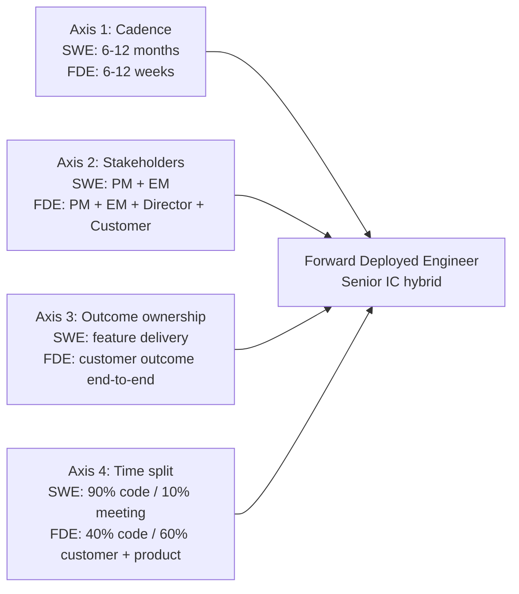
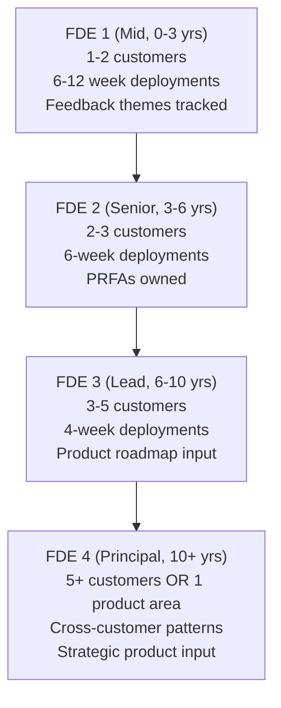

# Forward Deployed Engineer Playbook
## Chapter 2

# The IC-to-FDE Category Change

> *"The FDE is not a senior SWE who talks to customers. The FDE is a category change — a senior IC hybrid who owns the customer outcome end-to-end. The shift is from 'I build features' to 'I own the customer outcome.' That shift is the difference between a 6-month FDE and a 5-year FDE."*

---

## 1. Epigraph

_The FDE is not a senior SWE who talks to customers. The FDE is a category change — a senior IC hybrid who owns the customer outcome end-to-end. The shift is from "I build features" to "I own the customer outcome." That shift is the difference between a 6-month FDE and a 5-year FDE._

---

## 2. Problem

You are a senior SWE (IC4, 8 years experience) interviewing for an FDE role at acme-corp, a 200-person B2B AI company. The Director has just told you: "The FDE role is different from the SWE role. You'll spend 60% of your time with customers, 40% writing code. You'll own the customer outcome end-to-end. We'll pay you $50K more in base than your SWE4 base, but you won't get the IC5 promotion track for 2-3 years. Most SWEs who move to FDE fail in year 1. Why do you want to do this?"

You have 30 minutes to explain the IC-to-FDE shift, what changes about your day-to-day work, and why you want to do this. This chapter tells you what the shift actually is, what changes, and what the 5-year FDE looks like.

**Decision in one sentence:** _The IC-to-FDE shift is a category change from "I build features for our product" to "I own the customer outcome end-to-end"; the FDE's job is to ship a working solution in 6-12 weeks (not 6-12 months), drive the feedback loop, and accept that the FDE ladder is shorter and higher-leverage than the SWE ladder._

---

## 3. Why FDEs Fail Here

Five named failure modes of SWEs whose FDE transition produced zero results.

- **The Senior-SWE-Who-Talks-To-Customers Failure.** The SWE is in their FDE role but acts like a senior SWE who occasionally checks in with the customer. _The FDE who is not embedded with the customer is a senior SWE, not an FDE._
- **The Feature-Builder-Without-Feedback Failure.** The FDE builds features the customer asks for without driving the feedback loop to the product team. _The FDE who builds without feedback is a professional services consultant._
- **The 6-Month-Deployment Failure.** The FDE ships deployments in 6-12 months (the SWE cadence). _The FDE ships in 6-12 weeks or the customer churns._
- **The Promo-Track-Confusion Failure.** The FDE expects to be promoted on the SWE ladder (IC5 in 2-3 years). _The FDE ladder is 4 levels, not 5. Promo timing is 2-3 years longer._
- **The "I-Just-Want-to-Code" Failure.** The FDE misses the customer relationship work. _The FDE spends 40% of their time on product, but 60% is customer time. The relationship is the work._

---

## 4. Mental Models

Four mental models that compress the IC-to-FDE shift.

**Mental model 1: The 4 Difference Axes.** The FDE role differs from the SWE role on 4 axes.



**The 4 axes:**
- **Axis 1: Cadence.** SWE ships in 6-12 months. FDE ships in 6-12 weeks. 3-5x faster.
- **Axis 2: Stakeholders.** SWE has 2 (PM + EM). FDE has 4 (PM + EM + Director + Customer).
- **Axis 3: Outcome ownership.** SWE owns feature delivery. FDE owns the customer outcome end-to-end.
- **Axis 4: Time split.** SWE spends 90% coding, 10% meeting. FDE spends 40% coding, 60% customer + product.

**Mental model 2: The 5-Point FDE vs SWE Comparison.** Side-by-side role comparison.

```
# FDE vs SWE: 5-point comparison

### dim1. Daily work
SWE: 8 hours of coding, 1-2 hours of meetings, 0 customer calls
FDE: 4 hours of coding, 2-3 hours of meetings, 2-3 hours of customer calls

### dim2. Stakeholders
SWE: 2 (PM + EM)
FDE: 4 (PM + EM + Director + Customer)

### dim3. Cadence
SWE: 6-12 months per project (quarterly milestones)
FDE: 6-12 weeks per deployment (weekly milestones)

### dim4. Outcome ownership
SWE: feature delivered to spec
FDE: customer outcome achieved (not just feature delivered)

### dim5. Promo track
SWE: 5 levels (IC1 → IC5) over 12+ years
FDE: 4 levels (FDE1 → Principal FDE) over 10+ years, 2-3 years longer per level
```

**Mental model 3: The 3 Skills the FDE Needs That the SWE Doesn't.**

```
1. Customer relationship management.
   - The FDE owns the customer relationship
   - The SWE has limited customer contact
   - The skill: managing expectations, surfacing blockers, building trust

2. Product feedback synthesis.
   - The FDE turns customer feedback into product requirements
   - The SWE has limited product feedback responsibility
   - The skill: theme identification, prioritization, 1-page PRFAs

3. Cross-functional coordination.
   - The FDE coordinates 4 stakeholders
   - The SWE coordinates 2 stakeholders
   - The skill: stakeholder management, narrative translation, conflict resolution
```

**Mental model 4: The 4-Level FDE Ladder.** The FDE ladder is shorter than the SWE ladder.



**The 4 levels:**
- **FDE 1 (Mid, 0-3 years).** 1-2 customers. 6-12 week deployments. Feedback themes tracked.
- **FDE 2 (Senior, 3-6 years).** 2-3 customers. 6-week deployments. PRFAs owned.
- **FDE 3 (Lead, 6-10 years).** 3-5 customers. 4-week deployments. Product roadmap input.
- **FDE 4 (Principal, 10+ years).** 5+ customers OR 1 product area. Cross-customer patterns. Strategic product input.

---

## 5. Frameworks

Three frameworks for the IC-to-FDE shift.

### Framework 1: The IC-to-FDE Decision Memo (1 page)

```
# IC-to-FDE Decision Memo — [Date]

## The role
[1 sentence on the FDE role at this company.]

## What's different from my SWE role
- Cadence: 6-12 weeks vs. 6-12 months
- Stakeholders: 4 vs. 2 (PM, EM, Director, Customer)
- Outcome ownership: customer outcome end-to-end vs. feature delivery
- Time split: 40% code / 60% customer+product vs. 90% code / 10% meeting
- Promo track: 4 levels, 2-3 years longer per level

## What I'll miss about the SWE role
[1-2 sentences on what you'll miss.]

## What I'm excited about
[1-2 sentences on what excites you about the FDE role.]

## The 1 thing I'll push back on
[1 sentence on the 1 thing you'll push back on in the FDE role.]

## The 1 thing I'll need to learn
[1 sentence on the 1 skill you'll need to develop (e.g., customer relationship management).]
```

### Framework 2: The FDE vs SWE Comp Comparison

```
# FDE vs SWE Comp — [Date]

## Base salary
- SWE 4 (current): $XK
- FDE 2 (offer): $YK
- Delta: $YK (typically 5-15% more for FDE)

## Bonus
- SWE 4: 10-20% target bonus
- FDE 2: 5-15% target bonus (typically lower for FDE)

## Equity
- SWE 4 refresh: every 2 years
- FDE 2 refresh: every 2-3 years (typically slower)

## Promo timing
- SWE 4 → 5: 2-3 years
- FDE 2 → 3: 3-4 years

## Total comp over 4 years
- SWE 4: $XK total comp, $YK equity vest
- FDE 2: $XK total comp, $YK equity vest
- Delta: $YK total

## The trade-off
- FDE has higher base, lower bonus, slower equity
- FDE promo is 1 year slower
- FDE is higher-leverage (customer impact, product impact)
```

### Framework 3: The First 30/60/90 as a New FDE

```
# FDE 30/60/90 — [Date]

## Phase 1: 0-30 days (Assess)
- 5 customer calls (60 min each)
- 1-page customer portfolio memo
- Top 3 risks identified
- FDE charter signed by CSO + PM + Director

## Phase 2: 30-60 days (Plan)
- 1-page PRFA for top 1 feedback
- 1 customer design review
- 1-page product feedback synthesis
- Stakeholder cadence established (PM, EM, Director, Customer)

## Phase 3: 60-90 days (Execute)
- 1 customer deployment to production
- 1 customer deployment to pilot
- 1 retrospective
- 1-page 90-day report to Director

## The 1 thing the FDE will NOT do
Ship 3 customer deployments. The FDE will ship 2.
The 3rd sacrifices the feedback loop.
```

---

## 6. Drill

You are a senior SWE (IC4, 8 years experience) interviewing for an FDE role at **acme-corp**. The Director has asked: "Why do you want to do this? Most SWEs who move to FDE fail in year 1."

You have **90 minutes**. Produce the **IC-to-FDE decision memo** (`portfolio/chapter-02-ic-to-fde-memo.md`) using Framework 1 (Decision Memo) + Framework 2 (Comp Comparison) + Framework 3 (30/60/90). Specify:

- The 1-page IC-to-FDE decision memo (role, what's different, what you'll miss, what excites you, pushback, the 1 thing to learn).
- The FDE vs SWE comp comparison (base, bonus, equity, promo timing, total comp over 4 years).
- The first 30/60/90 plan.
- The 5 differences between the SWE and FDE role.
- The 1 thing you'll say to the Director in the interview.
- The 3 things you'll do to avoid the 5 failure modes.

**Deliverable:** `portfolio/chapter-02-ic-to-fde-memo.md` — under 1500 words.

---

## 7. Worked Example

**The 1-page IC-to-FDE decision memo:**

```
# IC-to-FDE Decision Memo — 2026-09-01

## The role
Forward Deployed Engineer at acme-corp. Embed with
3-5 strategic customers, ship working deployments in
6-12 weeks, drive the product feedback loop.

## What's different from my SWE role
- Cadence: 6-12 weeks vs. 6-12 months (3-5x faster)
- Stakeholders: 4 vs. 2 (PM, EM, Director, Customer)
- Outcome ownership: customer outcome end-to-end vs. feature delivery
- Time split: 40% code / 60% customer+product vs. 90% code / 10% meeting
- Promo track: 4 levels, 2-3 years longer per level

## What I'll miss about the SWE role
The deep technical work. The SWE role lets me go 2-3
levels deep into a system. The FDE role is broader, with
less depth per system. I'll miss the deep focus.

## What I'm excited about
The customer impact. The FDE role lets me own the customer
outcome end-to-end. The SWE role has indirect customer
impact (via the product team). The FDE role has direct
customer impact. I want the direct impact.

## The 1 thing I'll push back on
Shipping 3 customer deployments per quarter. I'll push for
2 + 1 product feedback synthesis. The 3rd deployment
sacrifices the feedback loop.

## The 1 thing I'll need to learn
Customer relationship management. The SWE role has
limited customer contact. The FDE role has 60% customer
time. I need to learn managing expectations, surfacing
blockers, and building trust under time pressure.
```

**The FDE vs SWE comp comparison:**

```
# FDE vs SWE Comp — 2026-09-01

## Base salary
- SWE 4 (current): $220K
- FDE 2 (offer): $240K
- Delta: +$20K (8.3%)

## Bonus
- SWE 4: 15% target bonus ($33K)
- FDE 2: 10% target bonus ($24K)
- Delta: -$9K

## Equity
- SWE 4 refresh: every 2 years, ~$300K/yr vest
- FDE 2 refresh: every 3 years, ~$300K/yr vest
- Same $/yr vest, slower refresh

## Promo timing
- SWE 4 → 5: 2-3 years
- FDE 2 → 3: 3-4 years
- Delta: +1 year

## Total comp over 4 years (Y1-Y4)
| | SWE 4 | FDE 2 | Delta |
|---|-------|-------|-------|
| Base | $880K | $960K | +$80K |
| Bonus | $132K | $96K | -$36K |
| Equity | $1.2M | $1.2M | $0 |
| Total | $2.21M | $2.26M | +$50K |

## The trade-off
- FDE has +$80K base, -$36K bonus, $0 equity delta
- FDE promo is +1 year slower
- FDE is higher-leverage (direct customer + product impact)
- Net over 4 years: +$50K total
- Net over 8 years: +$100-200K (assuming FDE 3 promotion)
```

**The first 30/60/90 plan:**

```
# FDE 30/60/90 — 2026-09-01

## Phase 1: 0-30 days (Assess)
- 5 customer calls (60 min each)
- 1-page customer portfolio memo
- Top 3 risks identified
- FDE charter signed by CSO + PM + Director

## Phase 2: 30-60 days (Plan)
- 1-page PRFA for top 1 feedback (auth integration)
- 1 customer design review (Customer A)
- 1-page product feedback synthesis (Q3 2026)
- Stakeholder cadence established (PM Tue 30m, EM Wed 30m, Director biweekly Thu 60m)

## Phase 3: 60-90 days (Execute)
- Customer A deployment to production (auth integration)
- Customer E deployment to pilot (data connectors)
- 1 customer retrospective (Customer A)
- 1-page 90-day report to Director

## The 1 thing the FDE will NOT do
Ship 3 customer deployments. The FDE will ship 2.
The 3rd sacrifices the feedback loop.
```

**The 5 differences between the SWE and FDE role:**

```
# FDE vs SWE: 5 Differences

### dim1. Daily work
SWE: 8 hours coding, 1-2 hours meetings, 0 customer calls
FDE: 4 hours coding, 2-3 hours meetings, 2-3 hours customer calls

### dim2. Stakeholders
SWE: 2 (PM, EM)
FDE: 4 (PM, EM, Director, Customer)

### dim3. Cadence
SWE: 6-12 months per project, quarterly milestones
FDE: 6-12 weeks per deployment, weekly milestones

### dim4. Outcome ownership
SWE: feature delivered to spec
FDE: customer outcome achieved (not just feature delivered)

### dim5. Promo track
SWE: 5 levels (IC1-IC5) over 12+ years
FDE: 4 levels (FDE1-Principal FDE) over 10+ years
```

**The 1 thing I'll say to the Director in the interview:**

```
"I want to be a senior IC who ships direct customer impact,
not a senior IC who ships features to the product team.
The FDE role is the path to direct customer impact.

I know the trade-offs. I know the FDE promo is slower.
I know the FDE work is broader, not deeper. I know the
FDE role has higher variance — some customers are great,
some are not. I accept the trade-offs.

The 1 thing I want to push back on: shipping 3 deployments
per quarter. I'll push for 2 + 1 product feedback synthesis.
The 3rd deployment sacrifices the feedback loop.

The 1 thing I need to learn: customer relationship
management. I've been a SWE for 8 years. I have 1-2 hours
of customer contact per week. I need to scale to 60% of
my time on customer work. The skill is managing
expectations, surfacing blockers, and building trust
under time pressure. I'm a fast learner.

Why this works: 8 years of SWE gives me the technical
depth to debug customer issues at the system level. The
FDE role lets me apply that depth to direct customer
impact. The combination is rare and high-leverage."
```

**The 3 things I'll do to avoid the 5 failure modes:**

```
1. Write code daily (2-3 hours per day, customer deployment
   repo, PRs merged). Avoids the Senior-SWE-Who-Talks-To-
   Customers and Feature-Builder-Without-Feedback failures.
   - 2-3 hours of coding per day
   - PRs merged to the customer deployment repo
   - Code review from EM or peer
   - No "all meetings, no code" weeks

2. Drive the feedback loop weekly (5 themes tracked, weekly
   PM sync, 1-page PRFAs). Avoids the Feature-Without-
   Feedback failure.
   - 5 themes tracked
   - Weekly PM sync (Tuesday 30 min)
   - 1-page PRFA per top-1 feedback
   - 1-page synthesis per quarter

3. Accept the 6-12 week cadence (not 6-12 months). Avoids
   the 6-Month-Deployment failure.
   - Decompose customer needs into 2-3 week milestones
   - Weekly customer check-ins
   - Deploy weekly, not quarterly
   - The customer is the deadline, not the engineering sprint
```

---

## 8. Failure Mode Postmortem

A senior SWE (IC4, 8 years experience) moved to an FDE role at a 200-person B2B AI company. The SWE's first 30 days: 5 customer calls, 5 customer retrospective memos, 5 customer success plans. The SWE did not write code. The SWE did not drive the product feedback loop. The SWE was acting like a CSM with a SWE background.

Within 6 months: 0 customer deployments shipped, 0 product feedback themes synthesized, 2 customer churns. The customers were confused ("the FDE is a CSM, not an engineer"). The PM had no customer feedback. The FDE was asked to leave.

The replacement FDE did 3 things differently:
1. Wrote code daily (2-3 hours per day, customer deployment repo).
2. Drove the feedback loop weekly (5 themes tracked, weekly PM sync, 1-page PRFAs).
3. Built a relationship between the company and the customer (2-3 internal stakeholders per customer, 1-page customer doc, hand-off plan).

Within 6 months: 2 customer deployments shipped, 3 product feedback PRFAs in review, 0 customer churn. The PM had a clear product feedback story. The Director was unblocked.

What the first FDE missed: the FDE role is a category change, not a title change. The first FDE was a senior SWE in title only. The second FDE was a senior IC hybrid. The senior IC hybrid is the leverage.

The lesson: the SWE who treats the FDE role as a title change has a CSM in title. The SWE who treats the FDE role as a category change has a senior IC hybrid.

---

## 9. Self-Assessment Rubric

| # | Dimension | 1 (Novice) | 3 (Competent) | 5 (Expert) |
|---|---|---|---|---|
| 1 | **4 difference axes** | 0-1 axes understood | 2-3 axes understood | 4 axes understood, named in interview |
| 2 | **3 new skills** | 0-1 skills developed | 2 skills developed | 3 skills developed, with concrete examples |
| 3 | **4-level FDE ladder** | Doesn't know the ladder | Knows the ladder | Knows the ladder, knows where they fit, knows the promo criteria |
| 4 | **Comp trade-off** | Doesn't know the trade-off | Knows the trade-off | Knows the trade-off, can negotiate it in the offer |
| 5 | **30/60/90 plan** | No plan or 90-day plan only | 30/60/90 plan | 30/60/90 plan with concrete deliverables + the 1 thing NOT to do |

**Disqualifier:** any 1 on dimension 1 or 2. A SWE who doesn't understand the 4 axes or hasn't developed the 3 new skills is in the Senior-SWE-Who-Talks-To-Customers or Feature-Builder-Without-Feedback failure mode.

**Total:** ___ / 25. **Pass threshold:** 18/25, no dimension below 3.

---

## 10. Portfolio Artifact Note

Save your filled-in drill as `portfolio/chapter-02-ic-to-fde-memo.md` — interview evidence for "Why do you want to move to FDE?" (see Portfolio Map in Chapter 27).

---

## 11. Interview Questions

1. **Why do you want to move to FDE?**
2. **What's different about the FDE role vs your current SWE role?**
3. **The Director says "FDE promo is slower." What do you say?**
4. **The customer asks for a feature the product team won't build. What do you do?**
5. **Walk me through a customer deployment you've shipped.**