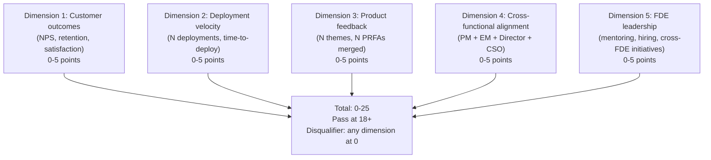
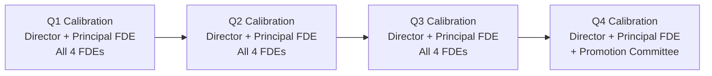

# Forward Deployed Engineer Playbook
## Chapter 20

# FDE Performance and Career Development

> *"The FDE performance system is different from the SWE system. The 5 FDE performance dimensions, the 3-tier rubric, the quarterly calibration, and the 12-month career development plan are the FDE's reference for performance management."*

---

## 1. Epigraph

_The FDE performance system is different from the SWE system. The 5 FDE performance dimensions, the 3-tier rubric, the quarterly calibration, and the 12-month career development plan are the FDE's reference for performance management._

---

## 2. Problem

You are a Principal FDE at acme-corp. The Director has just told you: "The FDE team's performance review is in 30 days. The 4 FDEs have varying levels of customer work, product feedback, and code output. We need a 5-dimension rubric, a 3-tier calibration, and a 12-month development plan for each FDE. The CEO wants the rubric in 7 days."

This chapter tells you the 5 dimensions, the 3-tier rubric, the calibration, and the 12-month development plan.

**Decision in one sentence:** _FDE performance management is a 5-dimension rubric (customer outcomes, deployment velocity, product feedback, cross-functional alignment, FDE leadership) with 3-tier calibration (exceeds / meets / below) and a 12-month development plan per FDE; the FDE's job is to design the rubric, run quarterly calibration, and own the development plans._

---

## 3. Why FDEs Fail Here

Five named failure modes of FDE performance systems that produced zero results.

- **The SWE-Rubric Failure.** The FDE team uses the SWE rubric. _Customer outcomes are not measured._
- **The 1-Dimension Failure.** The rubric measures only code output. _Customer feedback and product impact are invisible._
- **The No-Calibration Failure.** The FDE team has no cross-FDE calibration. _Each Director rates differently._
- **The No-Development-Plan Failure.** The FDE has no 12-month plan. _No growth trajectory._
- **The Annual-Only-Performance-Review Failure.** The FDE team only reviews annually. _No course correction._

---

## 4. Mental Models

Four mental models that compress FDE performance.

**mental model 1: The 5-Dimension FDE Rubric.** 5 dimensions, 0-25 total.



**The 5 dimensions:**
- **Dim 1: Customer outcomes.** NPS, retention, satisfaction. 0-5 points.
- **Dim 2: Deployment velocity.** N deployments, time-to-deploy. 0-5 points.
- **Dim 3: Product feedback.** N themes, N PRFAs merged. 0-5 points.
- **Dim 4: Cross-functional alignment.** PM + EM + Director + CSO. 0-5 points.
- **Dim 5: FDE leadership.** Mentoring, hiring, cross-FDE initiatives. 0-5 points.

**mental model 2: The 3-Tier Calibration.** 3 tiers per dimension.

```
5 (Exceeds): Far above bar. Promotion candidate.
4 (Strong): Above bar. High performer.
3 (Meets): At bar. Solid contributor.
2 (Below): Below bar. Needs improvement.
1 (Far below): Far below bar. PIP candidate.
0 (Disqualifier): Critical issue (e.g., customer churned, product damage).
```

**mental model 3: The Quarterly Calibration.** 4 times a year.



**The 4 calibrations:**
- **Q1.** Director + Principal FDE. All FDEs.
- **Q2.** Same.
- **Q3.** Same.
- **Q4.** Same + promotion committee.

**mental model 4: The 12-Month Development Plan.** 1 plan per FDE.

```
Quarter 1: Top 1 development area
- [Action 1] — [Date]
- [Action 2] — [Date]

Quarter 2: Top 2 development area
- [Action 1] — [Date]
- [Action 2] — [Date]

Quarter 3: Promotion criteria (if applicable)
- [Action 1] — [Date]
- [Action 2] — [Date]

Quarter 4: Year-end review
- [Action 1] — [Date]
- [Action 2] — [Date]
```

---

## 5. Frameworks

Three frameworks for FDE performance.

### Framework 1: The 5-Dimension Performance Rubric

```
# FDE Performance Rubric — [FDE Name] — [Quarter] — [Date]

| Dimension | Score (0-5) | Notes |
|-----------|-------------|-------|
| 1. Customer outcomes | [Score] | [Notes: NPS, retention, satisfaction] |
| 2. Deployment velocity | [Score] | [Notes: N deployments, time-to-deploy] |
| 3. Product feedback | [Score] | [Notes: N themes, N PRFAs merged] |
| 4. Cross-functional alignment | [Score] | [Notes: PM/EM/Director/CSO engagement] |
| 5. FDE leadership | [Score] | [Notes: mentoring, hiring, initiatives] |
| Total | ___ / 25 | Pass at 18+ |

## Disqualifier check
- Any dimension at 0? Y/N
- Customer churned? Y/N
- Product damage? Y/N

## Tier
- Exceeds (22+): Promotion candidate
- Strong (20-21): High performer
- Meets (18-19): Solid contributor
- Below (15-17): Needs improvement
- Far below (<15): PIP candidate
```

### Framework 2: The Quarterly Calibration Memo

```
# Quarterly Calibration — [Quarter] — [Date]

## All FDEs
| FDE | Customer | Velocity | Feedback | Alignment | Leadership | Total | Tier |
|-----|----------|----------|----------|-----------|------------|-------|------|
| [FDE 1] | [Score] | [Score] | [Score] | [Score] | [Score] | [Total] | [Tier] |
| [FDE 2] | [Score] | [Score] | [Score] | [Score] | [Score] | [Total] | [Tier] |
| [FDE 3] | [Score] | [Score] | [Score] | [Score] | [Score] | [Total] | [Tier] |
| [FDE 4] | [Score] | [Score] | [Score] | [Score] | [Score] | [Total] | [Tier] |

## Top 3 calibration outcomes
1. [FDE 1] — Promotion candidate (Q[N+1])
2. [FDE 2] — PIP candidate (next 90 days)
3. [FDE 3] — Solid contributor (no action)

## The 1 thing the team will focus on next quarter
[1 sentence.]
```

### Framework 3: The 12-Month Development Plan

```
# 12-Month Development Plan — [FDE Name] — [Date]

## Current level
[FDE 1 / 2 / 3 / 4]

## Target level (12 months)
[FDE 2 / 3 / 4]

## Top 3 development areas
1. [Area 1] — Why: [Reason]
2. [Area 2] — Why: [Reason]
3. [Area 3] — Why: [Reason]

## Quarterly plan
### Q1
- [Action 1] — [Date]
- [Action 2] — [Date]

### Q2
- [Action 1] — [Date]
- [Action 2] — [Date]

### Q3
- [Action 1] — [Date]
- [Action 2] — [Date]

### Q4
- [Action 1] — [Date]
- [Action 2] — [Date]

## The 1 thing the FDE will push back on
[1 sentence.]
```

---

## 6. Drill

You are a Principal FDE at **acme-corp**. The Director has given you 30 days to design the FDE performance system.

```
4 FDEs on the team:
- FDE A (3 yrs, 2 customers, NPS +10)
- FDE B (5 yrs, 3 customers, NPS +15, 5 PRFAs merged)
- FDE C (2 yrs, 1 customer, NPS +5)
- FDE D (8 yrs, 5 customers, NPS +20, 10 PRFAs merged, leads FDE-PM partnership redesign)

Performance review in 30 days.
CEO wants rubric in 7 days.
```

You have **90 minutes**. Produce the **FDE performance system** (`portfolio/chapter-20-fde-performance.md`) using Framework 1 (5-Dim Rubric) + Framework 2 (Quarterly Calibration) + Framework 3 (12-Month Plan). Specify:

- The 5-dimension rubric applied to all 4 FDEs (scores, tier).
- The quarterly calibration memo (4 FDEs ranked, top 3 outcomes).
- The 12-month development plan for 1 FDE (FDE C, who is below bar).
- The 1 thing you'll say to the Director in the calibration.
- The 3 things you'll do to avoid the 5 failure modes.

**Deliverable:** `portfolio/chapter-20-fde-performance.md` — under 1500 words.

---

## 7. Worked Example

**The 5-dimension rubric applied to all 4 FDEs:**

```
# FDE Performance Rubric — Q3 2026 — 2026-09-30

| FDE | Customer | Velocity | Feedback | Alignment | Leadership | Total | Tier |
|-----|----------|----------|----------|-----------|------------|-------|------|
| FDE A | 4 (NPS +10) | 3 (2 customers, on track) | 3 (3 PRFAs in review) | 3 (steady) | 2 (developing) | 15 | Below |
| FDE B | 4 (NPS +15) | 4 (3 customers, ahead of plan) | 5 (5 PRFAs merged) | 4 (strong PM sync) | 4 (mentoring FDE A) | 21 | Strong |
| FDE C | 2 (NPS +5) | 2 (1 customer, behind plan) | 2 (0 PRFAs merged) | 2 (weak PM sync) | 1 (no leadership) | 9 | Far below |
| FDE D | 5 (NPS +20) | 5 (5 customers, ahead) | 5 (10 PRFAs merged) | 5 (cross-functional redesign) | 5 (FDE leadership) | 25 | Exceeds |

## Disqualifier check
- FDE A: No
- FDE B: No
- FDE C: No (but close — NPS +5 is below target +10)
- FDE D: No

## Tier summary
- Exceeds (22+): FDE D — Promotion candidate (FDE 4)
- Strong (20-21): FDE B — High performer
- Meets (18-19): None
- Below (15-17): FDE A — Needs improvement
- Far below (<15): FDE C — PIP candidate
```

**The quarterly calibration memo:**

```
# Quarterly Calibration — Q3 2026 — 2026-09-30

## All 4 FDEs
(see table above)

## Top 3 calibration outcomes
1. **FDE D — Promotion candidate** (Q1 2027 FDE 4 promotion)
   - 25/25, exceeds on all dimensions
   - Promotion packet: 10 PRFAs merged, 5 customers, FDE-PM redesign
2. **FDE B — High performer** (no action needed, monitor)
   - 21/25, strong on all dimensions
   - Track for FDE 3 promotion in 12-18 months
3. **FDE C — PIP candidate** (90-day PIP starting Oct 1)
   - 9/25, far below on all dimensions
   - PIP goals: 1 deployment to production + 1 PRFA merged + 2 PM syncs/month

## The 1 thing the team will focus on next quarter
FDE C's PIP. The 90-day PIP is the highest-leverage
intervention. FDE A's development plan + FDE D's
promotion packet are secondary.
```

**The 12-month development plan for FDE C:**

```
# 12-Month Development Plan — FDE C — 2026-09-30

## Current level
FDE 1 (Mid, 2 years experience)

## Target level (12 months)
FDE 2 (Senior, promotion Q4 2027)

## Top 3 development areas
1. **Deployment velocity** (current 2/5) — Why: only 1 customer
   deployed, far below FDE 1 expectation of 2-3 customers
2. **Product feedback** (current 2/5) — Why: 0 PRFAs merged,
   no customer feedback synthesis
3. **Cross-functional alignment** (current 2/5) — Why: weak PM
   sync, no weekly cadence

## Quarterly plan

### Q4 2026 (PIP quarter)
- [ ] 1 deployment to production (Customer F)
- [ ] 1 PRFA in review (top 1 customer feedback)
- [ ] Weekly PM sync (every Tuesday, 30 min)
- [ ] Biweekly Director 1:1 (PIP check-in)
- [ ] 90-day PIP review (Dec 30)

### Q1 2027 (recovery quarter)
- [ ] 1 deployment to production (Customer G)
- [ ] 2 PRFAs in review or merged
- [ ] 1-page product feedback synthesis
- [ ] End of PIP, transition to performance plan

### Q2 2027 (growth quarter)
- [ ] 2 deployments to production (Customer H + I)
- [ ] 3+ PRFAs in review or merged
- [ ] Cross-functional initiative (small, e.g., customer onboarding)

### Q3 2027 (promotion prep)
- [ ] 3+ deployments YTD
- [ ] 5+ PRFAs YTD
- [ ] FDE 2 promotion packet (Q4 2027)

## The 1 thing the FDE will push back on
The PIP. The FDE will argue that the original hire
was under-scoped and the customer assignment was unfair.
The Director will respond: the PIP is fair, the goals
are achievable, and the FDE has 90 days to demonstrate
FDE 1-level work.
```

**The 1 thing I'll say to the Director in the calibration:**

```
"Here's the FDE team calibration for Q3 2026:

  FDE D (25/25): Promotion candidate for FDE 4 in Q1 2027.
    Strong on all 5 dimensions. The 10 PRFAs merged +
    cross-functional redesign are the highlights.

  FDE B (21/25): High performer. On track for FDE 3 in
    12-18 months. The mentoring of FDE A is the standout.

  FDE A (15/25): Below bar. Needs improvement plan.
    The customer work is good (NPS +10) but velocity
    and leadership are weak. 90-day development plan
    starting Oct 1.

  FDE C (9/25): Far below bar. PIP candidate. 90-day
    PIP starting Oct 1. Goals: 1 deployment to
    production + 1 PRFA merged + 2 PM syncs/month.
    If PIP goals not met by Dec 30: managed out.

  Top 3 outcomes:
  1. FDE D promotion packet (Q1 2027)
  2. FDE A development plan (90-day)
  3. FDE C PIP (90-day, managed-out decision Dec 30)

  The 5-dimension rubric + 3-tier calibration is the
  discipline. The 4 FDEs are clearly differentiated.
  The PIP for FDE C is the hardest decision but the
  right one."
```

**The 3 things I'll do to avoid the 5 failure modes:**

```
1. Use the 5 FDE dimensions (not SWE rubric).
   (Avoids the SWE-Rubric Failure.)
   - Customer outcomes (not just code output)
   - Product feedback (not just shipping)
   - FDE leadership (not just IC work)

2. Run quarterly calibration (not annual).
   (Avoids the Annual-Only-Performance-Review Failure.)
   - Q1, Q2, Q3 quarterly calibration
   - Q4 quarterly + promotion committee
   - Course correction every 90 days

3. Give every FDE a 12-month development plan.
   (Avoids the No-Development-Plan Failure.)
   - Top 3 development areas
   - Quarterly actions
   - Promotion criteria (if applicable)
   - PIP (if applicable)
```

---

## 8. Failure Mode Postmortem

A 200-person B2B AI company had 4 FDEs and used the SWE rubric for performance reviews. The SWE rubric measured only code output (commits, PRs, on-call). Customer outcomes and product feedback were invisible. The 4 FDEs were rated "meets" across the board. The Director couldn't differentiate. The best FDE left.

The replacement Principal FDE did 3 things:
1. Built the 5 FDE dimensions (customer outcomes, deployment velocity, product feedback, cross-functional alignment, FDE leadership).
2. Ran quarterly calibration (Q1, Q2, Q3 quarterly, Q4 quarterly + promotion).
3. Built 12-month development plans for every FDE.

Within 6 months: 1 FDE promoted (FDE 2 → FDE 3), 1 FDE on PIP, 2 FDEs with clear development plans. The 5-dimension rubric + quarterly calibration + development plans was the discipline.

What the first Principal FDE missed: FDE performance is a system. The first Principal FDE used the SWE rubric. The second Principal FDE built the FDE rubric. The FDE-specific system is the leverage.

The lesson: the Principal FDE who has the 5 FDE dimensions + quarterly calibration + development plans has a high-performing FDE team. The Principal FDE who uses the SWE rubric has a SWE-rated FDE team.

---

## 9. Self-Assessment Rubric

| # | Dimension | 1 (Novice) | 3 (Competent) | 5 (Expert) |
|---|---|---|---|---|
| 1 | **5-dimension rubric** | 1-2 dimensions | 3-4 dimensions | 5 dimensions, customer outcomes as gate |
| 2 | **3-tier calibration** | 1 tier only | 2 tiers | 3 tiers (exceeds / meets / below), with disqualifier |
| 3 | **Quarterly calibration** | Annual review | Semi-annual | Quarterly (Q1-Q4), with promotion committee in Q4 |
| 4 | **12-month development plan** | No plan | Plan exists | 1 plan per FDE, top 3 areas, quarterly actions |
| 5 | **PIP process** | No PIP process | PIP exists | 90-day PIP with measurable goals, decision at day 90 |

**Disqualifier:** any 1 on dimension 1 or 2. A Principal FDE who uses 1-2 dimensions or 1 tier is in the SWE-Rubric or 1-Dimension failure mode.

**Total:** ___ / 25. **Pass threshold:** 18/25, no dimension below 3.

---

## 10. Portfolio Artifact Note

Save your filled-in drill as `portfolio/chapter-20-fde-performance.md` — interview evidence for "How do you run FDE performance management?" (see Portfolio Map in Chapter 27).

---

## 11. Interview Questions

1. **Walk me through your FDE performance system.**
2. **The FDE team uses the SWE rubric. What do you do?**
3. **An FDE is below bar. What do you do?**
4. **An FDE is far below bar. PIP or managed out?**
5. **Walk me through a performance review you've run.**
