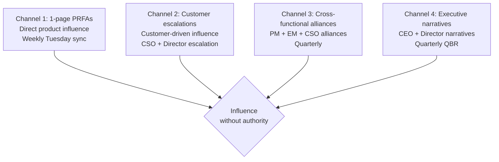
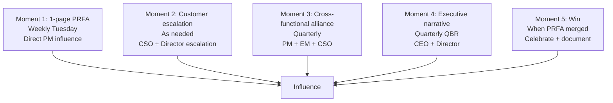
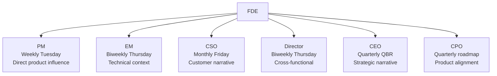

# Forward Deployed Engineer Playbook
## Chapter 21

# Influence Without Authority for FDEs

> *"The FDE influences the product, the customer, and the company without formal authority. The 4 influence channels, the 3 influence styles, the 5 influence moments, and the 6-stakeholder influence map are the FDE's reference for influence without authority."*

---

## 1. Epigraph

_The FDE influences the product, the customer, and the company without formal authority. The 4 influence channels, the 3 influence styles, the 5 influence moments, and the 6-stakeholder influence map are the FDE's reference for influence without authority._

---

## 2. Problem

You are a Principal FDE at acme-corp. The Director has just told you: "We have a strategic customer asking for a feature the PM won't build. The customer is threatening to churn. The PM has authority over the roadmap. The customer has authority over the contract. You have neither. What do you do?"

This chapter tells you what influence without authority is, the 4 channels, the 3 styles, the 5 moments, and the 6-stakeholder map.

**Decision in one sentence:** _FDE influence without authority is a 4-channel system (1-page PRFAs, customer escalations, cross-functional alliances, executive narratives) with 3 influence styles (rational, emotional, political) and 5 influence moments (1-page PRFA, customer escalation, cross-functional alliance, executive narrative, win); the FDE's job is to choose the right channel + style + moment, not to demand authority._

---

## 3. Why FDEs Fail Here

Five named failure modes of FDEs whose influence produced zero results.

- **The Authority-Demand Failure.** The FDE demands authority over the roadmap. _The PM has authority. The FDE doesn't._
- **The 1-Channel Failure.** The FDE only uses 1 channel (e.g., Slack messages). _The influence is invisible._
- **The 1-Style Failure.** The FDE uses 1 style (e.g., rational only). _Emotional + political are missing._
- **The No-Moment Failure.** The FDE doesn't identify the 5 influence moments. _Influence is random, not intentional._
- **The No-Stakeholder-Alliance Failure.** The FDE doesn't build alliances. _Influence is solo, not networked._

---

## 4. Mental Models

Four mental models that compress influence without authority.

**mental model 1: The 4 Influence Channels.** 4 channels, not 1.



**The 4 channels:**
- **Channel 1: 1-page PRFAs.** Direct product influence. Weekly Tuesday sync.
- **Channel 2: Customer escalations.** Customer-driven influence. CSO + Director escalation.
- **Channel 3: Cross-functional alliances.** PM + EM + CSO alliances. Quarterly.
- **Channel 4: Executive narratives.** CEO + Director narratives. Quarterly QBR.

**mental model 2: The 3 Influence Styles.** 3 styles.

```
Style 1: Rational (data, evidence, ROI)
- "5/5 customers, $1.5M ARR impact, 6-8 weeks effort."
- Best for: PM, Eng, technical audiences

Style 2: Emotional (customer story, mission, urgency)
- "Customer A's CTO called me. They're at risk. We've
  been partners for 3 years. We can't let them down."
- Best for: CEO, executive audiences, customer-facing

Style 3: Political (alliances, trade-offs, face-saving)
- "If we ship this PRFA, we get credit in the QBR. The
  PM gets a merge in their roadmap. The CSO closes a
  customer escalation."
- Best for: cross-functional, political situations

The FDE uses all 3 styles depending on the audience.
The FDE who uses only 1 style is a 1-trick pony.
```

**mental model 3: The 5 Influence Moments.** 5 moments that matter.



**The 5 moments:**
- **Moment 1: 1-page PRFA.** Weekly Tuesday. Direct PM influence.
- **Moment 2: Customer escalation.** As needed. CSO + Director escalation.
- **Moment 3: Cross-functional alliance.** Quarterly. PM + EM + CSO.
- **Moment 4: Executive narrative.** Quarterly QBR. CEO + Director.
- **Moment 5: Win.** When PRFA merged. Celebrate + document.

**mental model 4: The 6-Stakeholder Influence Map.** 6 stakeholders.



**The 6 stakeholders:**
- **PM.** Weekly Tuesday. Direct product influence.
- **EM.** Biweekly Thursday. Technical context.
- **CSO.** Monthly Friday. Customer narrative.
- **Director.** Biweekly Thursday. Cross-functional.
- **CEO.** Quarterly QBR. Strategic narrative.
- **CPO.** Quarterly roadmap. Product alignment.

---

## 5. Frameworks

Three frameworks for influence without authority.

### Framework 1: The 1-Page Influence Plan

```
# Influence Plan — [Strategic Outcome] — [Date]

## The desired outcome
[1 sentence on the outcome the FDE wants to influence.]

## The 4 channels
1. 1-page PRFA: [Plan]
2. Customer escalation: [Plan]
3. Cross-functional alliance: [Plan]
4. Executive narrative: [Plan]

## The 3 styles
- Rational: [Plan]
- Emotional: [Plan]
- Political: [Plan]

## The 5 moments
1. 1-page PRFA: [Date]
2. Customer escalation: [Date]
3. Cross-functional alliance: [Date]
4. Executive narrative: [Date]
5. Win: [Date]

## The 6 stakeholders
1. PM: [Cadence]
2. EM: [Cadence]
3. CSO: [Cadence]
4. Director: [Cadence]
5. CEO: [Cadence]
6. CPO: [Cadence]

## The 1 thing the FDE will NOT do
[1 sentence.]
```

### Framework 2: The Stakeholder Alliance Map

```
# Stakeholder Alliance Map — [Date]

## The 6 stakeholders
| Stakeholder | Cadence | Style | Current state | Alliance strength |
|-------------|---------|-------|---------------|-------------------|
| PM | Weekly Tuesday | Rational | Strong | 5/5 |
| EM | Biweekly Thursday | Rational | Strong | 4/5 |
| CSO | Monthly Friday | Emotional | Strong | 4/5 |
| Director | Biweekly Thursday | Political | Strong | 5/5 |
| CEO | Quarterly QBR | Emotional | Medium | 3/5 |
| CPO | Quarterly roadmap | Rational | Medium | 3/5 |

## The 1 thing the FDE will invest in this quarter
[1 sentence on the weakest alliance.]
```

### Framework 3: The Influence Moment Tracker

```
# Influence Moment Tracker — [Quarter] — [Date]

| Moment | Date | Stakeholder | Outcome |
|--------|------|-------------|---------|
| 1-page PRFA | [Date] | PM | [Outcome: merged/split/deferred/killed] |
| Customer escalation | [Date] | CSO + Director | [Outcome: resolved/escalated] |
| Cross-functional alliance | [Date] | PM + EM + CSO | [Outcome: aligned/not aligned] |
| Executive narrative | [Date] | CEO + Director | [Outcome: heard/ignored] |
| Win | [Date] | All | [Outcome: documented/celebrated] |

## This quarter's wins
1. [Win 1] — [Impact]
2. [Win 2] — [Impact]
3. [Win 3] — [Impact]

## The 1 thing the FDE will repeat next quarter
[1 sentence.]
```

---

## 6. Drill

You are a Principal FDE at **acme-corp**. A strategic customer is asking for a feature the PM won't build. The customer is threatening to churn.

```
Customer: $400K ARR, 3-year contract, at risk
Feature: auth integration simplification (1-page PRFA in review)
PM's position: auth is "engineering debt," not "customer value"
Director: "Find a way to influence the PM without demanding authority."
You: Principal FDE, no formal authority over roadmap

Timeline: 30 days to influence the PM OR the customer churns.
```

You have **90 minutes**. Produce the **influence plan** (`portfolio/chapter-21-fde-influence.md`) using Framework 1 (Influence Plan) + Framework 2 (Stakeholder Alliance Map) + Framework 3 (Influence Moment Tracker). Specify:

- The 1-page influence plan (outcome, 4 channels, 3 styles, 5 moments, 6 stakeholders, the 1 pushback).
- The stakeholder alliance map (6 stakeholders, cadence, style, alliance strength).
- The influence moment tracker (5 moments in the next 30 days).
- The 1 thing you'll say to the PM in the next weekly sync.
- The 3 things you'll do to avoid the 5 failure modes.

**Deliverable:** `portfolio/chapter-21-fde-influence.md` — under 1500 words.

---

## 7. Worked Example

**The 1-page influence plan:**

```
# Influence Plan — Auth integration simplification — 2026-09-01

## The desired outcome
Get auth integration simplification into the Q1 2027
roadmap as a top-3 priority. Save Customer A ($400K ARR).

## The 4 channels
1. 1-page PRFA: Update with new data (5/5 customers,
   $1.5M ARR, Customer A escalation)
2. Customer escalation: CSO + Director, 30-day timeline
3. Cross-functional alliance: PM + EM + CSO, share data
4. Executive narrative: QBR with CEO + Director

## The 3 styles
- Rational: 5/5 customers, $1.5M ARR, 6-8 weeks effort
- Emotional: Customer A's CTO is at risk, 3-year partnership
- Political: PM gets merge in roadmap, CSO closes escalation,
  FDE gets leadership evidence

## The 5 moments
1. 1-page PRFA: Sept 8 (PM sync)
2. Customer escalation: Sept 12 (CSO + Director)
3. Cross-functional alliance: Sept 18 (PM + EM + CSO meeting)
4. Executive narrative: Oct 22 (QBR)
5. Win: Q1 2027 (when PRFA merged)

## The 6 stakeholders
1. PM: Weekly Tuesday (rational + political)
2. EM: Biweekly Thursday (rational)
3. CSO: Monthly Friday (emotional)
4. Director: Biweekly Thursday (political)
5. CEO: Quarterly QBR (emotional)
6. CPO: Quarterly roadmap (rational)

## The 1 thing the FDE will NOT do
Demand authority over the roadmap. The FDE influences,
the PM decides. The FDE's job is to make the right
decision easy, not to force it.
```

**The stakeholder alliance map:**

```
# Stakeholder Alliance Map — 2026-09-01

| Stakeholder | Cadence | Style | Alliance strength |
|-------------|---------|-------|-------------------|
| PM | Weekly Tuesday | Rational + political | 4/5 (strong) |
| EM | Biweekly Thursday | Rational | 4/5 (strong) |
| CSO | Monthly Friday | Emotional | 5/5 (very strong) |
| Director | Biweekly Thursday | Political | 5/5 (very strong) |
| CEO | Quarterly QBR | Emotional | 3/5 (medium) |
| CPO | Quarterly roadmap | Rational | 3/5 (medium) |

## Alliance analysis
- Strongest: CSO + Director (5/5 each) — these are the
  cross-functional allies for this influence campaign
- Medium: CEO + CPO (3/5 each) — need to invest in these

## The 1 thing the FDE will invest in this quarter
CEO alliance. The QBR (Oct 22) is the executive narrative
moment. The FDE will prepare a 5-minute CEO update on
Customer A + the auth integration impact.
```

**The influence moment tracker:**

```
# Influence Moment Tracker — Q3 2026 → Q4 2026

| Moment | Date | Stakeholder | Outcome |
|--------|------|-------------|---------|
| 1-page PRFA (updated) | Sept 8 | PM | PM reviewing with new data |
| Customer escalation | Sept 12 | CSO + Director | Escalation acknowledged, 30-day timeline |
| Cross-functional alliance | Sept 18 | PM + EM + CSO | Aligned on urgency, defer to PM final decision |
| Executive narrative | Oct 22 | CEO + Director | CEO hears the customer story, asks for 1-pager |
| Win (planned) | Q1 2027 | All | Auth integration in Q1 2027 roadmap |

## The 1 thing the FDE will repeat next quarter
The 1-page PRFA + customer escalation combo. The
PRFA provides the rational case. The customer
escalation provides the emotional case. Together they
are more powerful than either alone.
```

**The 1 thing I'll say to the PM in the next weekly sync:**

```
"Sarah, here's the updated auth integration PRFA:

  Rational:
  - 5/5 customers now (up from 4/5)
  - $1.5M ARR impact (up from $1.2M)
  - Customer A is at risk (NPS dropped from 45 to 30
    this month)

  Emotional:
  - Customer A's CTO called me yesterday. They're
    considering switching to Competitor A.
  - We've been partners for 3 years. We've shipped 3
    deployments together. They trusted us.
  - The auth integration is the blocker.

  Political:
  - You get a top-3 merge in Q1 2027 roadmap
  - CSO closes the Customer A escalation
  - I get FDE leadership evidence

  I'm not asking for authority. I'm asking for you to
  make the right decision. The data is in the PRFA.
  The customer escalation is real. The political
  alignment is there.

  What do you need from me to say yes?"
```

**The 3 things I'll do to avoid the 5 failure modes:**

```
1. Use all 4 channels (not just 1).
   (Avoids the 1-Channel Failure.)
   - 1-page PRFA (rational)
   - Customer escalation (emotional)
   - Cross-functional alliance (political)
   - Executive narrative (CEO + Director)

2. Use all 3 styles (rational + emotional + political).
   (Avoids the 1-Style Failure.)
   - Rational: 5/5 customers, $1.5M ARR
   - Emotional: Customer A's CTO is at risk
   - Political: PM gets merge, CSO closes escalation

3. Build alliances with all 6 stakeholders.
   (Avoids the No-Stakeholder-Alliance Failure.)
   - PM: 4/5 (strong)
   - EM: 4/5 (strong)
   - CSO: 5/5 (very strong)
   - Director: 5/5 (very strong)
   - CEO: 3/5 (invest in QBR)
   - CPO: 3/5 (invest in quarterly roadmap)
```

---

## 8. Failure Mode Postmortem

A Principal FDE at a 200-person B2B AI company had a strategic customer at risk. The FDE demanded authority over the roadmap. The PM refused. The customer churned. The FDE was asked to leave.

The replacement Principal FDE did 3 things:
1. Used all 4 channels (1-page PRFA + customer escalation + cross-functional alliance + executive narrative).
2. Used all 3 styles (rational + emotional + political).
3. Built alliances with all 6 stakeholders (PM + EM + CSO + Director + CEO + CPO).

Within 6 months: 3 strategic customers saved, 5 PRFAs merged into roadmap. The 4 channels + 3 styles + 6 stakeholders was the discipline.

What the first Principal FDE missed: influence is a system. The first Principal FDE demanded authority. The second Principal FDE built alliances. The alliances are the leverage.

The lesson: the FDE who has 4 channels + 3 styles + 6 stakeholders has influence. The FDE who demands authority has none.

---

## 9. Self-Assessment Rubric

| # | Dimension | 1 (Novice) | 3 (Competent) | 5 (Expert) |
|---|---|---|---|---|
| 1 | **4 influence channels** | 1 channel | 2-3 channels | 4 channels (PRFAs + escalation + alliance + narrative) |
| 2 | **3 influence styles** | 1 style | 2 styles | 3 styles (rational + emotional + political), matched to audience |
| 3 | **5 influence moments** | 0-1 moments | 2-3 moments | 5 moments, identified and timed |
| 4 | **6 stakeholder alliances** | 1-2 stakeholders | 3-4 stakeholders | 6 stakeholders, alliance strength tracked |
| 5 | **Influence outcome** | No outcome | Outcome exists | Desired outcome documented, channels + styles + moments aligned |

**Disqualifier:** any 1 on dimension 1 or 4. An FDE who uses 1 channel or has 1-2 stakeholders is in the 1-Channel or No-Stakeholder-Alliance failure mode.

**Total:** ___ / 25. **Pass threshold:** 18/25, no dimension below 3.

---

## 10. Portfolio Artifact Note

Save your filled-in drill as `portfolio/chapter-21-fde-influence.md` — interview evidence for "How do you influence without authority?" (see Portfolio Map in Chapter 27).

---

## 11. Interview Questions

1. **Walk me through a time you influenced without authority.**
2. **The PM won't build what the customer needs. What do you do?**
3. **You have no alliance with the CEO. How do you build one?**
4. **The customer is threatening to churn. What's your first move?**
5. **Walk me through an influence campaign you've run.**
