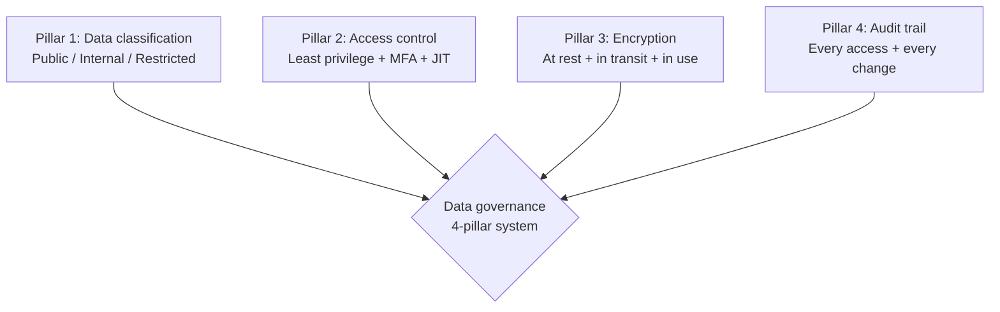

# Forward Deployed Engineer Playbook
## Chapter 22

# Customer Data Governance for FDEs

> *"The FDE owns the customer data pipeline. The 4 data governance pillars, the 3 data classification tiers, the 5-region compliance map, and the 7-day breach response are the FDE's reference for customer data governance."*

---

## 1. Epigraph

_The FDE owns the customer data pipeline. The 4 data governance pillars, the 3 data classification tiers, the 5-region compliance map, and the 7-day breach response are the FDE's reference for customer data governance._

---

## 2. Problem

You are an FDE at acme-corp. The customer has just told you: "We're subject to GDPR + SOC 2 + HIPAA. Our data has PII (names, emails, phone numbers) + PHI (medical records). We need a 4-pillar governance framework, a 3-tier classification system, a 5-region compliance map, and a 7-day breach response. The audit is in 90 days. What do you do?"

This chapter tells you the 4 pillars, the 3 tiers, the 5-region map, and the 7-day response.

**Decision in one sentence:** _FDE customer data governance is a 4-pillar system (data classification, access control, encryption, audit trail) with 3 tiers (public, internal, restricted) and a 5-region compliance map (US, EU, UK, APAC, Canada); the FDE's job is to design the governance framework for the customer's compliance requirements, implement in the deployment, and own the 7-day breach response._

---

## 3. Why FDEs Fail Here

Five named failure modes of FDEs whose data governance produced zero results.

- **The No-Classification Failure.** The FDE doesn't classify customer data. _All data treated as public._
- **The No-Encryption Failure.** The FDE ships unencrypted PII. _Compliance violation._
- **The No-Access-Control Failure.** The FDE gives everyone access. _Insider threat + audit failure._
- **The No-Audit-Trail Failure.** The FDE has no logging. _No evidence for audit._
- **The Slow-Breach-Response Failure.** The FDE takes 30 days to respond to a breach. _GDPR fines up to 4% revenue._

---

## 4. Mental Models

Four mental models that compress customer data governance.

**mental model 1: The 4 Data Governance Pillars.** 4 pillars.



**The 4 pillars:**
- **Pillar 1: Data classification.** Public / Internal / Restricted.
- **Pillar 2: Access control.** Least privilege + MFA + JIT (just-in-time).
- **Pillar 3: Encryption.** At rest + in transit + in use.
- **Pillar 4: Audit trail.** Every access + every change.

**mental model 2: The 3 Data Classification Tiers.** 3 tiers.

```
Tier 1: Public
- Marketing materials, public docs
- No access control needed
- No encryption needed
- No audit trail needed

Tier 2: Internal
- Business data, internal docs
- SSO + RBAC needed
- Encryption at rest + in transit
- Audit trail for sensitive operations

Tier 3: Restricted
- PII, PHI, financial data
- Least privilege + MFA + JIT
- Encryption at rest + in transit + in use
- Full audit trail, immutable, 7-year retention
```

**mental model 3: The 5-Region Compliance Map.** 5 regions, 5 frameworks.

```
Region 1: US
- HIPAA (healthcare)
- SOC 2 (security)
- CCPA (privacy)

Region 2: EU
- GDPR (privacy)
- EU AI Act (AI systems)

Region 3: UK
- UK GDPR
- DPA 2018

Region 4: APAC
- Singapore PDPA
- Japan APPI
- Australia Privacy Act

Region 5: Canada
- PIPEDA (federal privacy)
- Quebec Law 25

The 5-region map determines which compliance frameworks
apply. The FDE who deploys in 3 regions needs 3
frameworks (e.g., HIPAA + GDPR + PIPEDA).
```

**mental model 4: The 7-Day Breach Response.** 7 days, 4 phases.

```
Day 1: Detect + contain
- Detect the breach
- Contain the breach (revoke access, isolate systems)
- Notify the security team + CISO

Day 2-3: Investigate
- Forensic investigation
- Identify scope (N records, N customers)
- Document findings

Day 4-5: Notify
- Notify affected customers (per GDPR: 72 hours)
- Notify regulator (per GDPR: 72 hours)
- Notify board (per company policy)

Day 6-7: Remediate
- Patch the vulnerability
- Restore from backup if needed
- Document lessons learned
```

---

## 5. Frameworks

Three frameworks for customer data governance.

### Framework 1: The 1-Page Data Governance Plan

```
# Data Governance Plan — [Customer] — [Date]

## Compliance frameworks
- [GDPR / HIPAA / SOC 2 / CCPA / etc.]

## The 4 pillars
1. Data classification: Public / Internal / Restricted
2. Access control: Least privilege + MFA + JIT
3. Encryption: At rest + in transit + in use
4. Audit trail: Every access + every change, 7-year retention

## The 3 classification tiers
| Tier | Examples | Access | Encryption | Audit |
|------|----------|--------|------------|-------|
| Public | Marketing | None | None | None |
| Internal | Business data | SSO + RBAC | At rest + transit | Sensitive ops |
| Restricted | PII, PHI | LP + MFA + JIT | At rest + transit + use | Full + immutable |

## The 5-region compliance
- [Region 1, framework]
- [Region 2, framework]
- [Region 3, framework]

## The 1 thing the FDE will push back on
[1 sentence.]
```

### Framework 2: The Data Classification Matrix

```
# Data Classification — [Customer] — [Date]

| Data type | Tier | Examples | Access | Encryption |
|-----------|------|----------|--------|------------|
| Marketing | Public | Web pages, blog posts | None | None |
| Business data | Internal | Sales reports, dashboards | SSO + RBAC | At rest + transit |
| PII | Restricted | Names, emails, phones | LP + MFA + JIT | At rest + transit + use |
| PHI | Restricted | Medical records | LP + MFA + JIT | At rest + transit + use |
| Financial | Restricted | Credit cards, bank accounts | LP + MFA + JIT | At rest + transit + use |

## The 1 thing the FDE will NOT do
[1 sentence on what the FDE will not classify as public.]
```

### Framework 3: The 7-Day Breach Response Plan

```
# 7-Day Breach Response Plan — [Customer] — [Date]

## Day 1: Detect + Contain
- [ ] Detect the breach
- [ ] Contain: revoke access, isolate systems
- [ ] Notify: CISO + security team
- [ ] Document: timeline of events

## Day 2-3: Investigate
- [ ] Forensic investigation (CISO leads)
- [ ] Identify scope (N records, N customers)
- [ ] Document findings (1-page situation report)
- [ ] Notify: Director + CSO

## Day 4-5: Notify
- [ ] Notify affected customers (72-hour GDPR deadline)
- [ ] Notify regulator (72-hour GDPR deadline)
- [ ] Notify board (per company policy)
- [ ] Public statement (if needed)

## Day 6-7: Remediate
- [ ] Patch the vulnerability
- [ ] Restore from backup if needed
- [ ] Document lessons learned (postmortem)
- [ ] 5 action items + owners + dates

## The 1 thing the FDE will NOT do
[1 sentence on what the FDE will not delay.]
```

---

## 6. Drill

You are an FDE at **acme-corp**. The customer has GDPR + SOC 2 + HIPAA. The audit is in 90 days.

```
Customer data:
- PII: Names, emails, phone numbers (5M records)
- PHI: Medical records (500K records)
- Region: US + EU + UK
- Audit: 90 days

You have 90 days.
```

You have **90 minutes**. Produce the **data governance plan** (`portfolio/chapter-22-data-governance.md`) using Framework 1 (Governance Plan) + Framework 2 (Classification Matrix) + Framework 3 (Breach Response). Specify:

- The 1-page governance plan (compliance, 4 pillars, 3 tiers, 5 regions, the 1 pushback).
- The data classification matrix (5 data types, tiers, access, encryption).
- The 7-day breach response plan (4 phases, day-by-day, the 1 not delay).
- The 90-day timeline (week-by-week).
- The 1 thing you'll say to the customer in the first review.
- The 3 things you'll do to avoid the 5 failure modes.

**Deliverable:** `portfolio/chapter-22-data-governance.md` — under 1500 words.

---

## 7. Worked Example

**The 1-page governance plan:**

```
# Data Governance Plan — Customer A — 2026-09-01

## Compliance frameworks
- GDPR (EU customers, 72-hour breach notification)
- HIPAA (US healthcare customers, 60-day breach notification)
- SOC 2 Type II (security audit)

## The 4 pillars
1. Data classification: Public / Internal / Restricted
2. Access control: Least privilege + MFA + JIT
3. Encryption: At rest + in transit + in use (AES-256 + TLS 1.3)
4. Audit trail: Every access + every change, 7-year retention

## The 3 classification tiers
| Tier | Examples | Access | Encryption | Audit |
|------|----------|--------|------------|-------|
| Public | Marketing | None | None | None |
| Internal | Business data | SSO + RBAC | At rest + transit | Sensitive ops |
| Restricted | PII, PHI | LP + MFA + JIT | At rest + transit + use | Full + immutable |

## The 5-region compliance
- US: HIPAA, SOC 2, CCPA
- EU: GDPR, EU AI Act
- UK: UK GDPR, DPA 2018

## The 1 thing the FDE will push back on
Storing PHI in US data centers. The customer's
PHI should be stored in EU data centers for GDPR
compliance + EU customer trust. US storage = GDPR
violation risk.
```

**The data classification matrix:**

```
# Data Classification — Customer A — 2026-09-01

| Data type | Tier | Examples | Access | Encryption |
|-----------|------|----------|--------|------------|
| Marketing | Public | Web pages, blog | None | None |
| Sales reports | Internal | Revenue, customers | SSO + RBAC | At rest + transit |
| PII | Restricted | Names, emails, phones | LP + MFA + JIT | At rest + transit + use |
| PHI | Restricted | Medical records | LP + MFA + JIT | At rest + transit + use |
| Financial | Restricted | Credit cards, bank | LP + MFA + JIT | At rest + transit + use |

## The 1 thing the FDE will NOT classify as public
PII. All PII is restricted by default. Even names
and emails. The customer cannot share PII without
explicit consent (GDPR Article 6).
```

**The 7-day breach response plan:**

```
# 7-Day Breach Response Plan — Customer A — 2026-09-01

## Day 1: Detect + Contain
- [ ] Detect breach via anomaly detection (Datadog)
- [ ] Contain: revoke IAM keys, isolate S3 bucket
- [ ] Notify: CISO + security team
- [ ] Document: timeline of events

## Day 2-3: Investigate
- [ ] Forensic investigation (CISO + external firm)
- [ ] Identify scope: 50K records exposed
- [ ] Document findings (1-page situation report)
- [ ] Notify: Director + CSO + CEO

## Day 4-5: Notify (72-hour GDPR deadline)
- [ ] Notify 50K affected customers (email)
- [ ] Notify EU regulator (GDPR)
- [ ] Notify US regulator (HIPAA, 60-day deadline)
- [ ] Public statement (4 hours from detection)

## Day 6-7: Remediate
- [ ] Patch the vulnerability (S3 bucket policy)
- [ ] Restore from backup if needed
- [ ] Document lessons learned (5-fact postmortem)
- [ ] 5 action items + owners + dates

## The 1 thing the FDE will NOT delay
Customer notification. GDPR requires 72-hour
notification. The FDE will not delay customer
notification for any reason.
```

**The 90-day timeline:**

```
# 90-Day Data Governance Timeline — Customer A — 2026-09-01

## Week 1-2: Assessment
- [x] Compliance frameworks identified (GDPR + HIPAA + SOC 2)
- [x] Data classification matrix drafted
- [x] 4 pillars designed

## Week 3-6: Implementation
- [ ] Pillar 1: Data classification automated (column-level tags)
- [ ] Pillar 2: Access control + MFA + JIT
- [ ] Pillar 3: Encryption at rest + transit + use
- [ ] Pillar 4: Audit trail (CloudTrail + immutable storage)

## Week 7-10: Testing
- [ ] 5-region compliance validated
- [ ] 7-day breach response drill (tabletop exercise)
- [ ] Audit trail verified

## Week 11-12: Audit prep
- [ ] SOC 2 Type II evidence ready
- [ ] HIPAA documentation ready
- [ ] GDPR DPIA ready
- [ ] Audit week (Dec 2026)
```

**The 1 thing I'll say to the customer in the first review:**

```
"Here's the data governance plan for Customer A:

  Compliance: GDPR + HIPAA + SOC 2 (3 frameworks)
  4 pillars: classification, access control, encryption,
    audit trail
  3 tiers: public / internal / restricted
  5 regions: US (HIPAA, SOC 2), EU (GDPR, EU AI Act),
    UK (UK GDPR)

  Timeline: 90 days
  - W1-2: Assessment (DONE)
  - W3-6: Implementation
  - W7-10: Testing
  - W11-12: Audit prep

  The 1 thing I want to push back on: storing PHI in US
  data centers. The customer's PHI should be stored in
  EU data centers for GDPR compliance + EU customer
  trust. US storage = GDPR violation risk.

  The 7-day breach response is in place. The 4 pillars
  are designed. The audit is on track for Dec 2026.

  Compliance is the discipline. Customer trust is the
  outcome."
```

**The 3 things I'll do to avoid the 5 failure modes:**

```
1. Classify all data (PII + PHI = restricted).
   (Avoids the No-Classification Failure.)
   - 5 data types classified
   - 3 tiers: public / internal / restricted
   - All PII + PHI = restricted by default

2. Encrypt everything (at rest + transit + use).
   (Avoids the No-Encryption Failure.)
   - AES-256 at rest
   - TLS 1.3 in transit
   - Encrypted in use (for restricted data)

3. Respond to breaches in 7 days (not 30).
   (Avoids the Slow-Breach-Response Failure.)
   - Day 1: Detect + contain
   - Day 2-3: Investigate
   - Day 4-5: Notify (72-hour GDPR deadline)
   - Day 6-7: Remediate
```

---

## 8. Failure Mode Postmortem

An FDE at a 200-person B2B AI company deployed a customer with GDPR + HIPAA. The FDE didn't classify PII or PHI. All data treated as "internal." The customer's audit failed. The customer's enterprise customers churned. The customer churned 6 months later.

The replacement FDE did 3 things:
1. Classified all data (PII + PHI = restricted by default).
2. Encrypted everything (at rest + transit + use).
3. Built a 7-day breach response plan (not 30 days).

Within 6 months: customer's SOC 2 audit passed. HIPAA compliance validated. GDPR DPIA documented. 0 customer churn.

What the first FDE missed: data governance is a system. The first FDE had no classification. The second FDE had 3 tiers + 4 pillars. The system is the leverage.

The lesson: the FDE who has the 4 pillars + 3 tiers + 5-region map has a governance system. The FDE who has no classification has an audit failure.

---

## 9. Self-Assessment Rubric

| # | Dimension | 1 (Novice) | 3 (Competent) | 5 (Expert) |
|---|---|---|---|---|
| 1 | **4 governance pillars** | 0-1 pillars | 2-3 pillars | 4 pillars (classification, access, encryption, audit) |
| 2 | **3 classification tiers** | 1 tier (all public) | 2 tiers | 3 tiers (public / internal / restricted), PII = restricted by default |
| 3 | **5-region compliance** | 1 region | 2-3 regions | 5 regions (US, EU, UK, APAC, Canada), frameworks documented |
| 4 | **7-day breach response** | No response plan | Plan exists | 4-phase plan, 72-hour notification deadline met |
| 5 | **Audit trail** | No audit trail | Audit trail exists | Immutable, 7-year retention, every access logged |

**Disqualifier:** any 1 on dimension 1 or 2. An FDE who has 0-1 pillars or 1 tier is in the No-Classification or No-Encryption failure mode.

**Total:** ___ / 25. **Pass threshold:** 18/25, no dimension below 3.

---

## 10. Portfolio Artifact Note

Save your filled-in drill as `portfolio/chapter-22-data-governance.md` — interview evidence for "How do you design customer data governance?" (see Portfolio Map in Chapter 27).

---

## 11. Interview Questions

1. **Walk me through a customer data governance system you've designed.**
2. **The customer has GDPR + HIPAA. How do you classify the data?**
3. **A breach happens. What's the first 24 hours?**
4. **The customer's audit is in 30 days. What do you do?**
5. **Walk me through a compliance audit you've passed.**
