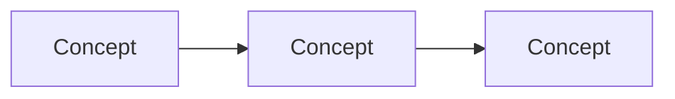
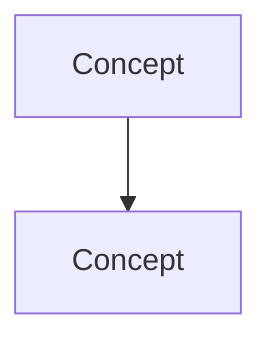

# Forward Deployed Engineer Playbook
## Chapter 22

# Customer Data Governance

> *"Epigraph placeholder — set the tone. One line. To be written by the chapter author."*

---

## 1. Epigraph

_Epigraph to be added by the chapter author. Sets the tone and previews the core tension._

---

## 2. Problem

You are 30 days into the FDE seat at acme-corp, a 200-person B2B AI company. The CSO has just told you: "We have 5 strategic customers. 2 of them are at risk of churning because the deployment isn't working. The CEO wants a status update in 60 days. You have 5 customer deployments to manage, a PM who needs customer feedback, an EM who needs technical context, and a Director who needs the customer story. The first decision you make will set the tone for the next 12 months." This is the chapter that tells you what to optimize for in those first 30 days — and what to avoid.

**Decision in one sentence:** _to be filled in by the chapter author._

---

## 3. Why FDEs Fail Here

- **The Lone-FDE Failure.** The FDE works in isolation, not building relationships with the PM, the EM, the Director, the customer success team, or the customer. The deployment is a 6-month project that doesn't fit the customer's timeline.

- **The Feature-Without-Feedback Failure.** The FDE ships features without driving the product feedback loop. The product team doesn't know what the customer needs. The next deployment has the same gaps.

- **The Hero-FDE Failure.** The FDE is the only person who knows the customer. The customer is blocked when the FDE is on vacation, sick, or leaves. The institutional knowledge leaves with the FDE.

---

## 4. Mental Models

2–4 reusable lenses. Each gets a one-paragraph definition + one Mermaid diagram.

**Mental model 1: _Name._** _One-paragraph definition that the reader can use for problems the chapter didn't cover._



**Mental model 2: _Name._** _One-paragraph definition._



---

## 5. Frameworks

The actual decision-making tools. Templates the reader can fill in.

### Framework 1: _Name_

A template the reader fills in:

```
[Field 1]: _______________
[Field 2]: _______________
[Field 3]: _______________
```

### Framework 2: _Name_

```
[Field A]: _______________
[Field B]: _______________
```

### Framework 3: _Name_

```
[Step 1]: _______________
[Step 2]: _______________
[Step 3]: _______________
```

---

## 6. Drill

You are the FDE at **acme-corp**. _Concrete scenario, specific constraints, named stakeholders._

You have **90 minutes**. Deliver _single artifact_ as `portfolio/chapter-22-customer-data-governance.md`.

**Deliverable:** `portfolio/chapter-22-customer-data-governance.md` — _one sentence description._

---

## 7. Worked Example

A fully completed drill. Plausible, not aspirational.

**Decision:** _One sentence._

**Constraints:** _Budget, time, regulatory, customer._

**Options considered:** _2-3 alternatives with pros/cons._

**Decision:** _What they chose and why._

---

## 8. Failure Mode Postmortem

A real (anonymized) or realistic case where an FDE got this wrong.

What they missed. What they should have done. What they learned.

---

## 9. Self-Assessment Rubric

| # | Dimension | 1 (Novice) | 3 (Competent) | 5 (Expert) |
|---|---|---|---|---|
| 1 | _Dimension 1_ | _What 1/5 looks like_ | _What 3/5 looks like_ | _What 5/5 looks like_ |
| 2 | _Dimension 2_ | _..._ | _..._ | _..._ |
| 3 | _Dimension 3_ | _..._ | _..._ | _..._ |
| 4 | _Dimension 4_ | _..._ | _..._ | _..._ |
| 5 | _Dimension 5_ | _..._ | _..._ | _..._ |

**Disqualifier:** any 1 on dimension 1 or 3.

**Total:** ___ / 25. **Pass threshold:** 18/25, no dimension below 3.

---

## 10. Portfolio Artifact Note

Save your filled-in drill as `portfolio/chapter-22-customer-data-governance.md` — this is interview evidence for _[specific question type]_ (see Portfolio Map in Chapter 27).

---

## 11. Interview Questions

1. _Question that probes this material, with grading notes._
2. _Question._
3. _Question._
4. _Question._
5. _Question._
