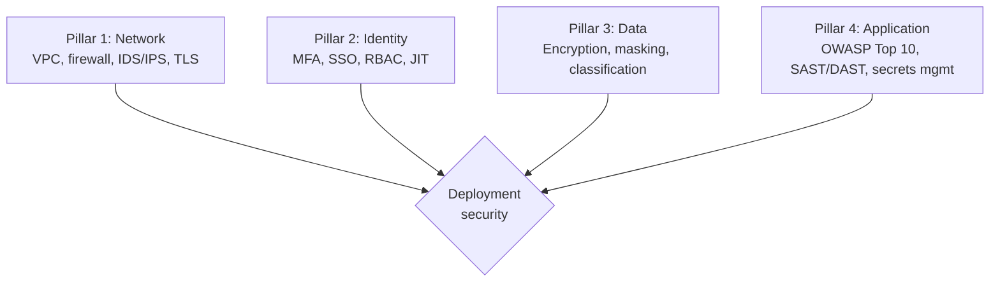
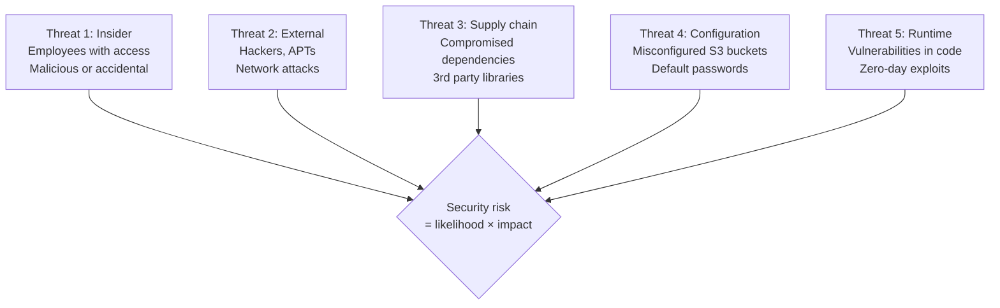

# Forward Deployed Engineer Playbook
## Chapter 23

# Security in Customer Deployments

> *"The FDE ships customer deployments that handle sensitive data. The 4 security pillars, the 3 security tiers, the 5-threat model, and the 7-day security incident response are the FDE's reference for security in customer deployments."*

---

## 1. Epigraph

_The FDE ships customer deployments that handle sensitive data. The 4 security pillars, the 3 security tiers, the 5-threat model, and the 7-day security incident response are the FDE's reference for security in customer deployments._

---

## 2. Problem

You are an FDE at acme-corp. The customer's CISO has just told you: "We need a 4-pillar security framework, a 3-tier security model, a 5-threat model, and a 7-day security incident response. Our deployment handles PII + PHI. We have 60 days. What do you do?"

This chapter tells you the 4 pillars, the 3 tiers, the 5 threats, and the 7-day response.

**Decision in one sentence:** _FDE customer deployment security is a 4-pillar system (network, identity, data, application) with 3 security tiers (low, medium, high) and a 5-threat model (insider, external, supply chain, configuration, runtime); the FDE's job is to design the security framework, implement in the deployment, and own the 7-day security incident response._

---

## 3. Why FDEs Fail Here

Five named failure modes of FDEs whose deployment security produced zero results.

- **The 1-Pillar Failure.** The FDE focuses on 1 pillar (e.g., data) and ignores the others. _Customer is exposed._
- **The No-Threat-Model Failure.** The FDE has no threat model. _Unknown risks._
- **The No-MFA Failure.** The FDE deploys without MFA. _Insider + external threats._
- **The Slow-Security-Incident-Response Failure.** The FDE takes 30 days to respond. _Customer trust lost._
- **The No-Supply-Chain-Security Failure.** The FDE uses unverified dependencies. _Supply chain attack._

---

## 4. Mental Models

Four mental models that compress deployment security.

**mental model 1: The 4 Security Pillars.** 4 pillars.



**The 4 pillars:**
- **Pillar 1: Network.** VPC, firewall, IDS/IPS, TLS.
- **Pillar 2: Identity.** MFA, SSO, RBAC, JIT.
- **Pillar 3: Data.** Encryption, masking, classification.
- **Pillar 4: Application.** OWASP Top 10, SAST/DAST, secrets mgmt.

**mental model 2: The 3 Security Tiers.** 3 tiers.

```
Tier 1: Low (internal demos, dev environments)
- Basic firewall
- Basic auth
- No PII/PHI
- No customer data

Tier 2: Medium (customer deployments, prod)
- VPC + firewall + IDS/IPS
- MFA + SSO + RBAC
- Encryption at rest + transit
- Application security scanning

Tier 3: High (regulated industries: healthcare, finance)
- All Medium + private VPC peering
- MFA + SSO + RBAC + JIT + privileged access management
- Encryption at rest + transit + use + tokenization
- Application security + runtime application self-protection
```

**mental model 3: The 5-Threat Model.** 5 threats.



**The 5 threats:**
- **Threat 1: Insider.** Employees with access. Malicious or accidental.
- **Threat 2: External.** Hackers, APTs. Network attacks.
- **Threat 3: Supply chain.** Compromised dependencies. 3rd party libraries.
- **Threat 4: Configuration.** Misconfigured S3 buckets. Default passwords.
- **Threat 5: Runtime.** Vulnerabilities in code. Zero-day exploits.

**mental model 4: The 7-Day Security Incident Response.** 7 days.

```
Day 1: Detect + contain
- Detect the incident
- Contain: revoke access, isolate system
- Notify: CISO + security team

Day 2-3: Investigate
- Forensic investigation
- Identify scope
- Document findings

Day 4-5: Eradicate + recover
- Remove threat actor access
- Patch vulnerability
- Restore from backup

Day 6-7: Post-incident
- Postmortem (5-fact, blameless)
- 5 action items + owners + dates
- Customer notification (per SLA)
```

---

## 5. Frameworks

Three frameworks for deployment security.

### Framework 1: The 1-Page Security Plan

```
# Security Plan — [Customer] — [Date]

## Compliance frameworks
- [GDPR / HIPAA / SOC 2 / PCI-DSS / etc.]

## The 4 pillars
1. Network: VPC + firewall + IDS/IPS + TLS 1.3
2. Identity: MFA + SSO + RBAC + JIT
3. Data: Encryption (rest + transit + use) + masking + classification
4. Application: OWASP Top 10 + SAST/DAST + secrets mgmt

## The 3 tiers
- Tier 1 (Low): dev/staging
- Tier 2 (Medium): customer deployments (most cases)
- Tier 3 (High): regulated industries (healthcare, finance)

## The 5 threats
1. Insider: MFA + JIT + least privilege
2. External: VPC + firewall + IDS/IPS
3. Supply chain: SBOM + dependency scanning + signed images
4. Configuration: config scanning + IaC + secrets mgmt
5. Runtime: SAST/DAST + RASP + vulnerability patching

## The 1 thing the FDE will push back on
[1 sentence.]
```

### Framework 2: The Threat Model Matrix

```
# Threat Model — [Customer] — [Date]

| Threat | Likelihood | Impact | Risk | Mitigation |
|--------|------------|--------|------|------------|
| Insider | Med | High | Med-High | MFA + JIT + least privilege |
| External | Med | High | Med-High | VPC + firewall + IDS/IPS |
| Supply chain | Med | High | Med-High | SBOM + dep scanning + signed images |
| Configuration | High | Med | High-Med | Config scanning + IaC |
| Runtime | Med | High | Med-High | SAST/DAST + RASP |

## Top 3 risks (highest risk × likelihood)
1. [Risk 1] — [Mitigation]
2. [Risk 2]
3. [Risk 3]

## The 1 thing the FDE will invest in
[1 sentence on the highest-risk threat.]
```

### Framework 3: The 7-Day Security Incident Response

```
# 7-Day Security Incident Response — [Customer] — [Date]

## Day 1: Detect + Contain
- [ ] Detect (anomaly detection, IDS/IPS, security alerts)
- [ ] Contain: revoke IAM keys, isolate affected systems
- [ ] Notify: CISO + security team
- [ ] Document: timeline of events

## Day 2-3: Investigate
- [ ] Forensic investigation
- [ ] Identify scope (N records, N systems affected)
- [ ] Document findings (1-page situation report)
- [ ] Notify: Director + CSO + CEO

## Day 4-5: Eradicate + Recover
- [ ] Remove threat actor access
- [ ] Patch vulnerability
- [ ] Restore from backup if needed
- [ ] Verify recovery (runbook + monitoring)

## Day 6-7: Post-Incident
- [ ] Postmortem (5-fact, blameless)
- [ ] 5 action items + owners + dates
- [ ] Customer notification (per SLA)
- [ ] Board summary (1 page)

## The 1 thing the FDE will NOT delay
[1 sentence on what the FDE will not delay.]
```

---

## 6. Drill

You are an FDE at **acme-corp**. The customer's CISO has given you 60 days to design the security framework.

```
Customer:
- PII: 5M records
- PHI: 500K records
- Compliance: GDPR + HIPAA + SOC 2
- Region: US + EU + UK
- Time: 60 days

You have 60 days.
```

You have **90 minutes**. Produce the **security plan** (`portfolio/chapter-23-deployment-security.md`) using Framework 1 (Security Plan) + Framework 2 (Threat Model) + Framework 3 (Incident Response). Specify:

- The 1-page security plan (compliance, 4 pillars, 3 tiers, 5 threats, the 1 pushback).
- The threat model matrix (5 threats, likelihood, impact, risk, mitigation).
- The 7-day security incident response (4 phases, day-by-day, the 1 not delay).
- The 60-day timeline.
- The 1 thing you'll say to the CISO in the first review.
- The 3 things you'll do to avoid the 5 failure modes.

**Deliverable:** `portfolio/chapter-23-deployment-security.md` — under 1500 words.

---

## 7. Worked Example

**The 1-page security plan:**

```
# Security Plan — Customer A — 2026-09-01

## Compliance frameworks
- GDPR (EU customers)
- HIPAA (US healthcare customers)
- SOC 2 Type II (security audit)

## The 4 pillars
1. Network: VPC + firewall + IDS/IPS + TLS 1.3
2. Identity: MFA + SSO + RBAC + JIT
3. Data: AES-256 + tokenization + 3-tier classification
4. Application: OWASP Top 10 + SAST/DAST + AWS Secrets Manager

## The 3 tiers
- Tier 2 (Medium) for most deployments
- Tier 3 (High) for healthcare deployments (PHI)
- Tier 1 (Low) for dev/staging only

## The 5 threats
1. Insider: MFA + JIT + least privilege
2. External: VPC + firewall + IDS/IPS + WAF
3. Supply chain: SBOM + Dependabot + signed images
4. Configuration: AWS Config + IaC (Terraform) + Secrets Manager
5. Runtime: SAST/DAST + RASP + monthly vulnerability patching

## The 1 thing the FDE will push back on
Tier 3 (High) for ALL deployments. The customer wants
all deployments to be Tier 3. The FDE will push for
Tier 2 for non-healthcare deployments (cost-effective)
and Tier 3 for healthcare deployments (PHI required).
```

**The threat model matrix:**

```
# Threat Model — Customer A — 2026-09-01

| Threat | Likelihood | Impact | Risk | Mitigation |
|--------|------------|--------|------|------------|
| Insider | Med | High | Med-High | MFA + JIT + least privilege + audit |
| External | Med | High | Med-High | VPC + firewall + WAF + IDS/IPS |
| Supply chain | Med | High | Med-High | SBOM + Dependabot + signed images |
| Configuration | High | Med | High-Med | AWS Config + IaC + Secrets Manager |
| Runtime | Med | High | Med-High | SAST/DAST + RASP + monthly patching |

## Top 3 risks (highest risk × likelihood)
1. Configuration (High × Med = High-Med) — Mitigation:
   AWS Config + IaC + Secrets Manager
2. Insider (Med × High = Med-High) — Mitigation: MFA +
   JIT + least privilege
3. Supply chain (Med × High = Med-High) — Mitigation:
   SBOM + Dependabot

## The 1 thing the FDE will invest in
Configuration. It's the highest-likelihood threat.
AWS Config + IaC eliminates 80% of configuration errors.
```

**The 7-day security incident response:**

```
# 7-Day Security Incident Response — Customer A — 2026-09-01

## Day 1: Detect + Contain
- [ ] Detect via anomaly detection (Datadog + AWS GuardDuty)
- [ ] Contain: revoke IAM keys, isolate affected systems
- [ ] Notify: CISO + security team
- [ ] Document: timeline of events

## Day 2-3: Investigate
- [ ] Forensic investigation (CISO + external firm if needed)
- [ ] Identify scope (N records, N systems)
- [ ] Document findings (1-page situation report)
- [ ] Notify: Director + CSO + CEO

## Day 4-5: Eradicate + Recover
- [ ] Remove threat actor access
- [ ] Patch vulnerability
- [ ] Restore from backup if needed
- [ ] Verify recovery (runbook + monitoring)

## Day 6-7: Post-Incident
- [ ] Postmortem (5-fact, blameless)
- [ ] 5 action items + owners + dates
- [ ] Customer notification (per SLA, 72-hour GDPR)
- [ ] Board summary (1 page)

## The 1 thing the FDE will NOT delay
Revoking threat actor access. The FDE will revoke
access within 1 hour of detection.
```

**The 60-day timeline:**

```
# 60-Day Security Timeline — Customer A — 2026-09-01

## Week 1-2: Assessment
- [x] Compliance frameworks identified (GDPR + HIPAA + SOC 2)
- [x] 4 pillars designed
- [x] Threat model matrix built

## Week 3-5: Implementation
- [ ] Pillar 1: VPC + firewall + IDS/IPS
- [ ] Pillar 2: MFA + SSO + RBAC + JIT
- [ ] Pillar 3: AES-256 + tokenization + classification
- [ ] Pillar 4: OWASP Top 10 + SAST/DAST + Secrets Manager

## Week 6-7: Testing
- [ ] Penetration test (annual)
- [ ] 5-threat model validated
- [ ] 7-day incident response drill (tabletop)

## Week 8: Audit prep
- [ ] SOC 2 Type II evidence ready
- [ ] HIPAA documentation ready
- [ ] GDPR DPIA documented
```

**The 1 thing I'll say to the CISO in the first review:**

```
"Here's the security plan for Customer A:

  Compliance: GDPR + HIPAA + SOC 2 (3 frameworks)
  4 pillars: Network + Identity + Data + Application
  3 tiers: Tier 2 (Medium) for most, Tier 3 (High) for
    healthcare deployments
  5 threats: Insider + External + Supply chain +
    Configuration + Runtime

  Top 3 risks (highest risk × likelihood):
  1. Configuration (High × Med) — AWS Config + IaC
  2. Insider (Med × High) — MFA + JIT + least privilege
  3. Supply chain (Med × High) — SBOM + Dependabot

  The 1 thing I want to push back on: Tier 3 (High)
  for ALL deployments. I'll push for Tier 2 for
  non-healthcare deployments (cost-effective) and Tier
  3 for healthcare (PHI required).

  The 7-day incident response is in place. The 4 pillars
  are designed. The audit is on track for Nov 2026.

  Security is the discipline. Customer trust is the
  outcome."
```

**The 3 things I'll do to avoid the 5 failure modes:**

```
1. Implement all 4 pillars (not just 1).
   (Avoids the 1-Pillar Failure.)
   - Network + Identity + Data + Application
   - Each pillar = dedicated workstream

2. Use the 5-threat model (not ad-hoc).
   (Avoids the No-Threat-Model Failure.)
   - Insider + External + Supply chain + Configuration
     + Runtime
   - Threat model matrix with likelihood × impact

3. Respond to incidents in 7 days (not 30).
   (Avoids the Slow-Security-Incident-Response Failure.)
   - Day 1: Detect + contain (1-hour SLA)
   - Day 2-3: Investigate
   - Day 4-5: Eradicate + recover
   - Day 6-7: Post-incident
```

---

## 8. Failure Mode Postmortem

An FDE at a 200-person B2B AI company deployed a customer with PHI. The FDE focused only on data encryption (Pillar 3) and ignored network, identity, and application. The customer's penetration test found 10 critical vulnerabilities. The customer's HIPAA audit failed. The customer churned.

The replacement FDE did 3 things:
1. Implemented all 4 pillars (Network + Identity + Data + Application).
2. Built the 5-threat model (insider + external + supply chain + configuration + runtime).
3. Built the 7-day incident response (1-hour containment SLA).

Within 6 months: customer's HIPAA audit passed, SOC 2 validated, penetration test passed. 0 customer churn.

What the first FDE missed: security is a system. The first FDE focused on 1 pillar. The second FDE implemented all 4. The 4-pillar system is the leverage.

The lesson: the FDE who has 4 pillars + 5 threats + 7-day response has a secure deployment. The FDE who has 1 pillar has a vulnerable deployment.

---

## 9. Self-Assessment Rubric

| # | Dimension | 1 (Novice) | 3 (Competent) | 5 (Expert) |
|---|---|---|---|---|
| 1 | **4 security pillars** | 1 pillar | 2-3 pillars | 4 pillars (network, identity, data, application) |
| 2 | **3 security tiers** | 1 tier | 2 tiers | 3 tiers (low, medium, high), per-deployment |
| 3 | **5-threat model** | 0-1 threats | 2-3 threats | 5 threats (insider, external, supply chain, configuration, runtime) |
| 4 | **7-day incident response** | No response | Plan exists | 4-phase plan, 1-hour containment SLA |
| 5 | **Penetration test** | Never tested | Annual test | Annual pen test + monthly vulnerability scan |

**Disqualifier:** any 1 on dimension 1 or 3. An FDE who has 1 pillar or 0-1 threats is in the 1-Pillar or No-Threat-Model failure mode.

**Total:** ___ / 25. **Pass threshold:** 18/25, no dimension below 3.

---

## 10. Portfolio Artifact Note

Save your filled-in drill as `portfolio/chapter-23-deployment-security.md` — interview evidence for "How do you secure customer deployments?" (see Portfolio Map in Chapter 27).

---

## 11. Interview Questions

1. **Walk me through a deployment security framework you've designed.**
2. **The customer's penetration test failed. What do you do?**
3. **A security incident happens at 2am. What's the first hour?**
4. **The customer has HIPAA + GDPR. How do you classify the data?**
5. **Walk me through a security incident you've managed.**
