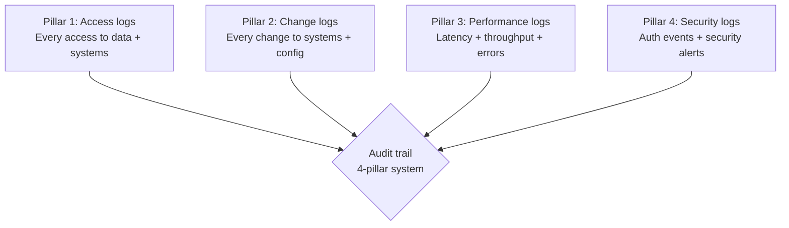
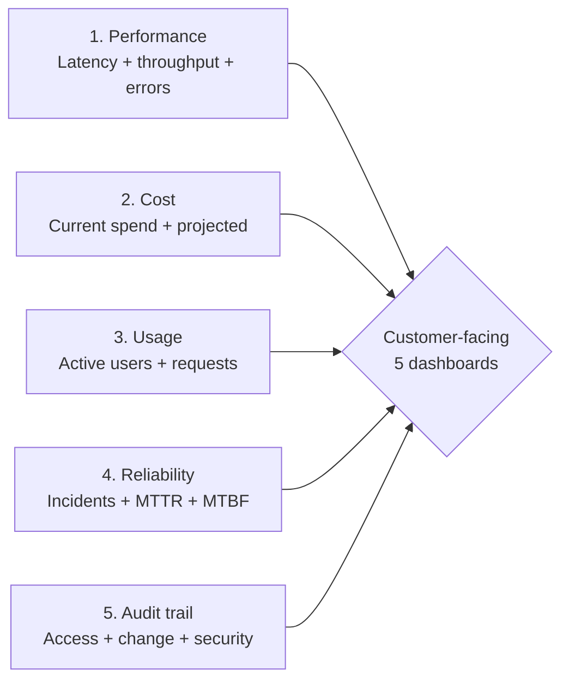

# Forward Deployed Engineer Playbook
## Chapter 25

# Audit Trail and Observability for FDEs

> *"The FDE owns the customer's deployment, including the audit trail. The 4 audit trail pillars, the 3 observability tiers, the 5-dashboard customer view, and the 7-day audit evidence checklist are the FDE's reference for audit trail and observability."*

---

## 1. Epigraph

_The FDE owns the customer's deployment, including the audit trail. The 4 audit trail pillars, the 3 observability tiers, the 5-dashboard customer view, and the 7-day audit evidence checklist are the FDE's reference for audit trail and observability._

---

## 2. Problem

You are an FDE at acme-corp. The customer's auditor has just told you: "We need 4-pillar audit trail evidence, 3-tier observability, 5-dashboard customer view, and 7-day audit evidence checklist. The audit is in 90 days. What do you do?"

This chapter tells you the 4 pillars, the 3 tiers, the 5 dashboards, and the 7-day checklist.

**Decision in one sentence:** _FDE audit trail and observability is a 4-pillar system (access logs, change logs, performance logs, security logs) with 3 observability tiers (basic, intermediate, advanced) and a 5-dashboard customer view; the FDE's job is to design the audit trail, implement the 3 tiers, share the 5 dashboards with the customer, and own the 7-day audit evidence checklist._

---

## 3. Why FDEs Fail Here

Five named failure modes of FDEs whose audit trail produced zero results.

- **The 1-Pillar Failure.** The FDE tracks only access logs. _Audit finds gaps in change/performance/security._
- **The No-Customer-View Failure.** The FDE has internal dashboards but no customer view. _Customer can't see what the FDE sees._
- **The No-Immutable-Storage Failure.** The FDE stores logs in mutable storage. _Audit questions integrity._
- **The 7-Year-Retention-Failure.** The FDE retains logs for 90 days. _Audit requires 7 years._
- **The Manual-Collection Failure.** The FDE collects audit evidence manually. _Audit prep takes 4 weeks._

---

## 4. Mental Models

Four mental models that compress audit trail and observability.

**mental model 1: The 4 Audit Trail Pillars.** 4 pillars.



**The 4 pillars:**
- **Pillar 1: Access logs.** Every access to data + systems.
- **Pillar 2: Change logs.** Every change to systems + config.
- **Pillar 3: Performance logs.** Latency + throughput + errors.
- **Pillar 4: Security logs.** Auth events + security alerts.

**mental model 2: The 3 Observability Tiers.** 3 tiers.

```
Tier 1: Basic
- CloudWatch logs only
- 30-day retention
- Internal only
- Free or low cost

Tier 2: Intermediate
- Datadog + CloudWatch
- 90-day retention
- Internal + customer view (limited)
- $XK/month

Tier 3: Advanced
- Datadog + S3 immutable + custom dashboards
- 7-year retention
- Internal + full customer view
- $XXK/month
```

**mental model 3: The 5-Dashboard Customer View.** 5 dashboards.



**The 5 dashboards:**
- **Dashboard 1: Performance.** Latency + throughput + errors.
- **Dashboard 2: Cost.** Current spend + projected.
- **Dashboard 3: Usage.** Active users + requests.
- **Dashboard 4: Reliability.** Incidents + MTTR + MTBF.
- **Dashboard 5: Audit trail.** Access + change + security.

**mental model 4: The 7-Day Audit Evidence Checklist.** 7 days, 4 phases.

```
Day 1-2: Evidence collection
- Automated export of 4 pillars to immutable S3
- 7-year retention configured
- Access logs (Pillar 1)
- Change logs (Pillar 2)
- Performance logs (Pillar 3)
- Security logs (Pillar 4)

Day 3-4: Evidence review
- Auditor reviews 4 pillars
- Sample testing (5 events per pillar)
- Gap analysis

Day 5-6: Gap remediation
- Close gaps found
- Re-export evidence if needed
- Update documentation

Day 7: Audit submission
- Submit evidence package
- Auditor reviews and signs off
```

---

## 5. Frameworks

Three frameworks for audit trail and observability.

### Framework 1: The 1-Page Audit Trail Plan

```
# Audit Trail Plan — [Customer] — [Date]

## The 4 pillars
1. Access logs: CloudTrail + app logs, 7-year retention, immutable S3
2. Change logs: Git + Jira + Terraform, 7-year retention, immutable S3
3. Performance logs: Datadog + CloudWatch, 90-day hot + 7-year cold
4. Security logs: CloudTrail + GuardDuty + WAF, 7-year retention, immutable S3

## The 3 observability tiers
- Tier 1 (Basic): CloudWatch logs only
- Tier 2 (Intermediate): Datadog + CloudWatch, customer view
- Tier 3 (Advanced): Datadog + S3 immutable + custom dashboards, full customer view

## The 5 customer dashboards
1. Performance
2. Cost
3. Usage
4. Reliability
5. Audit trail

## The 1 thing the FDE will push back on
[1 sentence.]
```

### Framework 2: The 4-Pillar Evidence Checklist

```
# 4-Pillar Audit Evidence — [Customer] — [Date]

## Pillar 1: Access logs
- [ ] CloudTrail enabled (every AWS API call)
- [ ] App logs enabled (every data access)
- [ ] Immutable S3 retention configured
- [ ] 7-year retention configured
- [ ] Sample testing: 5 events reviewed

## Pillar 2: Change logs
- [ ] Git history (every code change)
- [ ] Jira history (every ticket)
- [ ] Terraform state (every infra change)
- [ ] Immutable S3 retention configured
- [ ] Sample testing: 5 changes reviewed

## Pillar 3: Performance logs
- [ ] Datadog metrics (latency, throughput, errors)
- [ ] CloudWatch logs (application logs)
- [ ] 90-day hot + 7-year cold retention
- [ ] Customer-facing dashboard
- [ ] Sample testing: 5 metrics reviewed

## Pillar 4: Security logs
- [ ] CloudTrail (every auth event)
- [ ] GuardDuty (every security alert)
- [ ] WAF (every web request)
- [ ] Immutable S3 retention configured
- [ ] Sample testing: 5 events reviewed

## The 1 thing the FDE will NOT skip
Immutable S3 retention. Without it, audit questions integrity.
```

### Framework 3: The 7-Day Audit Evidence Collection

```
# 7-Day Audit Evidence — [Customer] — [Date]

## Day 1-2: Evidence collection
- [ ] Automated export of 4 pillars to immutable S3
- [ ] 7-year retention configured
- [ ] 4 pillars evidence collected

## Day 3-4: Evidence review
- [ ] Auditor reviews 4 pillars
- [ ] Sample testing (5 events per pillar = 20 total)
- [ ] Gap analysis documented

## Day 5-6: Gap remediation
- [ ] Close gaps found
- [ ] Re-export evidence if needed
- [ ] Update documentation

## Day 7: Audit submission
- [ ] Submit evidence package
- [ ] Auditor review + sign-off

## The 1 thing the FDE will automate
Evidence collection. Manual collection = 4 weeks of audit prep.
Automated collection = 1 day.
```

---

## 6. Drill

You are an FDE at **acme-corp**. The customer's auditor has given you 90 days.

```
Customer:
- 4 audit trail pillars required
- 7-year retention
- Immutable S3 storage
- 5 customer-facing dashboards
- Audit week: Day 90

You have 90 days.
```

You have **90 minutes**. Produce the **audit trail plan** (`portfolio/chapter-25-audit-trail.md`) using Framework 1 (Audit Trail Plan) + Framework 2 (4-Pillar Evidence) + Framework 3 (7-Day Collection). Specify:

- The 1-page audit trail plan (4 pillars, 3 tiers, 5 dashboards, the 1 pushback).
- The 4-pillar evidence checklist (20 items, sample testing).
- The 7-day audit evidence collection (4 phases, the 1 automate).
- The 90-day timeline.
- The 1 thing you'll say to the auditor in the first review.
- The 3 things you'll do to avoid the 5 failure modes.

**Deliverable:** `portfolio/chapter-25-audit-trail.md` — under 1500 words.

---

## 7. Worked Example

**The 1-page audit trail plan:**

```
# Audit Trail Plan — Customer A — 2026-09-01

## The 4 pillars
1. Access logs: CloudTrail + app logs, 7-year retention, immutable S3
2. Change logs: Git + Jira + Terraform, 7-year retention, immutable S3
3. Performance logs: Datadog + CloudWatch, 90-day hot + 7-year cold
4. Security logs: CloudTrail + GuardDuty + WAF, 7-year retention, immutable S3

## The 3 observability tiers
- Tier 2 (Intermediate): Datadog + CloudWatch, customer view (limited)
- Tier 3 (Advanced): Datadog + S3 immutable + custom dashboards, full customer view

## The 5 customer dashboards
1. Performance (latency + throughput + errors)
2. Cost (current spend + projected)
3. Usage (active users + requests)
4. Reliability (incidents + MTTR + MTBF)
5. Audit trail (access + change + security)

## The 1 thing the FDE will push back on
Tier 3 (Advanced) for all customers. The customer wants
all deployments to be Tier 3. The FDE will push for Tier 2
for non-regulated deployments (cost-effective) and Tier 3
for regulated deployments (audit-required).
```

**The 4-pillar evidence checklist:**

```
# 4-Pillar Audit Evidence — Customer A — 2026-09-01

## Pillar 1: Access logs
- [x] CloudTrail enabled (every AWS API call)
- [x] App logs enabled (every data access)
- [x] Immutable S3 retention configured
- [x] 7-year retention configured
- [ ] Sample testing: 5 events reviewed

## Pillar 2: Change logs
- [x] Git history (every code change)
- [x] Jira history (every ticket)
- [x] Terraform state (every infra change)
- [x] Immutable S3 retention configured
- [ ] Sample testing: 5 changes reviewed

## Pillar 3: Performance logs
- [x] Datadog metrics (latency, throughput, errors)
- [x] CloudWatch logs (application logs)
- [x] 90-day hot + 7-year cold retention
- [x] Customer-facing dashboard
- [ ] Sample testing: 5 metrics reviewed

## Pillar 4: Security logs
- [x] CloudTrail (every auth event)
- [x] GuardDuty (every security alert)
- [x] WAF (every web request)
- [x] Immutable S3 retention configured
- [ ] Sample testing: 5 events reviewed

## The 1 thing the FDE will NOT skip
Immutable S3 retention. Without it, audit questions integrity.
```

**The 7-day audit evidence collection:**

```
# 7-Day Audit Evidence — Customer A — 2026-09-01

## Day 1-2: Evidence collection
- [ ] Automated export of 4 pillars to immutable S3
- [ ] 7-year retention configured
- [ ] 4 pillars evidence collected (S3 export)
- [ ] 20 sample events identified (5 per pillar)

## Day 3-4: Evidence review
- [ ] Auditor reviews 4 pillars (S3 access)
- [ ] Sample testing (20 events total)
- [ ] Gap analysis documented

## Day 5-6: Gap remediation
- [ ] Close gaps found (if any)
- [ ] Re-export evidence if needed
- [ ] Update documentation (DPIA, compliance report)

## Day 7: Audit submission
- [ ] Submit evidence package (S3 + 1-page summary)
- [ ] Auditor review + sign-off
- [ ] Customer communication (audit passed)

## The 1 thing the FDE will automate
Evidence collection. Manual = 4 weeks of audit prep.
Automated = 1 day. The FDE will set up automated
export to immutable S3 from day 1 of deployment.
```

**The 90-day timeline:**

```
# 90-Day Audit Trail Timeline — Customer A — 2026-09-01

## Week 1-4: Tier 1 + Tier 2 setup
- [x] 4 pillars identified
- [x] 3 observability tiers designed
- [x] 5 dashboards scoped
- [ ] CloudTrail + Datadog + S3 immutable configured

## Week 5-8: Customer dashboards
- [ ] Performance dashboard
- [ ] Cost dashboard
- [ ] Usage dashboard
- [ ] Reliability dashboard
- [ ] Audit trail dashboard

## Week 9-11: Evidence collection
- [ ] 4 pillars evidence collected (S3)
- [ ] 7-year retention configured
- [ ] Sample testing (20 events)

## Week 12: Audit week
- [ ] Auditor reviews 4 pillars
- [ ] Gap remediation
- [ ] Audit sign-off
```

**The 1 thing I'll say to the auditor in the first review:**

```
"Here's the audit trail plan for Customer A:

  4 pillars:
  1. Access logs (CloudTrail + app logs)
  2. Change logs (Git + Jira + Terraform)
  3. Performance logs (Datadog + CloudWatch)
  4. Security logs (CloudTrail + GuardDuty + WAF)

  All 4 pillars exported to immutable S3 with 7-year
  retention. Sample testing: 5 events per pillar
  = 20 events total.

  3 observability tiers:
  - Tier 2 (Intermediate): Datadog + CloudWatch
  - Tier 3 (Advanced): Datadog + S3 immutable +
    custom dashboards

  5 customer dashboards:
  - Performance + Cost + Usage + Reliability + Audit trail

  The 1 thing I want to push back on: Tier 3 (Advanced)
  for all customers. I'll push for Tier 2 for non-regulated
  deployments (cost-effective) and Tier 3 for regulated
  (audit-required).

  The 7-year retention is in place. The immutable S3
  is configured. The 4 pillars are designed.

  Audit is the discipline. Compliance is the outcome."
```

**The 3 things I'll do to avoid the 5 failure modes:**

```
1. Implement all 4 pillars (not just 1).
   (Avoids the 1-Pillar Failure.)
   - Access + Change + Performance + Security logs
   - Each pillar = dedicated workstream
   - Sample testing: 5 events per pillar

2. Use immutable S3 with 7-year retention.
   (Avoids the No-Immutable-Storage or 7-Year-Retention Failure.)
   - S3 Object Lock (immutable)
   - 7-year retention policy
   - Cross-region replication for DR

3. Automate evidence collection (not manual).
   (Avoids the Manual-Collection Failure.)
   - Daily automated export to immutable S3
   - 1-day audit prep (not 4 weeks)
   - Auditor self-serve via S3 access
```

---

## 8. Failure Mode Postmortem

An FDE at a 200-person B2B AI company deployed a customer with audit requirements. The FDE tracked only access logs. The audit found gaps in change, performance, and security logs. The customer's SOC 2 audit failed. The customer churned.

The replacement FDE did 3 things:
1. Implemented all 4 pillars (access + change + performance + security).
2. Used immutable S3 with 7-year retention.
3. Automated evidence collection (daily export to immutable S3).

Within 6 months: customer's SOC 2 audit passed. 4 pillars validated. 0 customer churn.

What the first FDE missed: audit trail is a 4-pillar system. The first FDE tracked 1 pillar. The second FDE tracked 4. The 4-pillar system is the leverage.

The lesson: the FDE who has 4 pillars + immutable S3 + 7-year retention has an audit trail. The FDE who has 1 pillar has an audit failure.

---

## 9. Self-Assessment Rubric

| # | Dimension | 1 (Novice) | 3 (Competent) | 5 (Expert) |
|---|---|---|---|---|
| 1 | **4 audit pillars** | 1 pillar | 2-3 pillars | 4 pillars (access, change, performance, security) |
| 2 | **3 observability tiers** | 1 tier | 2 tiers | 3 tiers, per-deployment |
| 3 | **5 customer dashboards** | 0-1 dashboards | 2-3 dashboards | 5 dashboards (perf, cost, usage, reliability, audit) |
| 4 | **7-year retention + immutable** | Mutable, 30-day | Immutable, 90-day | Immutable S3 + 7-year retention |
| 5 | **Automated evidence collection** | Manual | Partial automation | Daily automated export, 1-day audit prep |

**Disqualifier:** any 1 on dimension 1 or 4. An FDE who has 1 pillar or mutable storage is in the 1-Pillar or No-Immutable-Storage failure mode.

**Total:** ___ / 25. **Pass threshold:** 18/25, no dimension below 3.

---

## 10. Portfolio Artifact Note

Save your filled-in drill as `portfolio/chapter-25-audit-trail.md` — interview evidence for "How do you design audit trails for customer deployments?" (see Portfolio Map in Chapter 27).

---

## 11. Interview Questions

1. **Walk me through an audit trail system you've designed.**
2. **The auditor finds gaps in change logs. What do you do?**
3. **The customer has 4 audit pillars. How do you implement all 4?**
4. **The audit requires 7-year retention. How do you configure it?**
5. **Walk me through an audit you've passed.**
