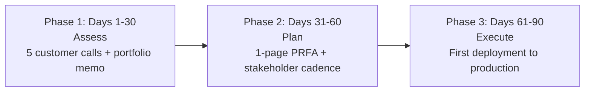

# Forward Deployed Engineer Playbook
## Chapter 26

# The 30/60/90 for the New FDE

> *"The first 90 days as an FDE set the tone for the next 36 months. The FDE's job is to design the 30/60/90 plan, run it on cadence, and own the 3 transitions (assess, plan, execute)."*

---

## 1. Epigraph

_The first 90 days as an FDE set the tone for the next 36 months. The FDE's job is to design the 30/60/90 plan, run it on cadence, and own the 3 transitions (assess, plan, execute)._

---

## 2. Problem

You just joined acme-corp as a new FDE 2 (Senior). The Director has just told you: "You have 5 customers, 1 product area, and 90 days. The first 30 days: assess. The next 30 days: plan. The final 30 days: execute. What do you do?"

This chapter tells you what the 30/60/90 plan is, the 3 transitions, the 5-day assessment, the 30-day plan, and the 60-day execution.

**Decision in one sentence:** _The FDE 30/60/90 is a 3-phase transition system (assess → plan → execute) with 5-day customer calls, 30-day portfolio memo, 60-day stakeholder cadence, and 90-day first deployment to production; the FDE's job is to design the plan, run it on cadence, and own the 3 transitions._

---

## 3. Why FDEs Fail Here

Five named failure modes of FDEs whose 30/60/90 produced zero results.

- **The No-Plan Failure.** The FDE has no 30/60/90 plan. _No structured approach._
- **The 90-Day-Land-Grab Failure.** The FDE tries to do everything in 90 days. _Nothing ships._
- **The No-Customer-Calls Failure.** The FDE skips the 5-day customer calls. _No customer understanding._
- **The No-Portfolio-Memo Failure.** The FDE never writes the 30-day memo. _No synthesis._
- **The No-Stakeholder-Cadence Failure.** The FDE doesn't establish cadence. _No alignment._

---

## 4. Mental Models

Four mental models that compress the 30/60/90 plan.

**mental model 1: The 3-Phase Transition System.** 3 phases, 30 days each.



**The 3 phases:**
- **Phase 1: Days 1-30 (Assess).** 5 customer calls + portfolio memo.
- **Phase 2: Days 31-60 (Plan).** 1-page PRFA + stakeholder cadence.
- **Phase 3: Days 61-90 (Execute).** First deployment to production.

**mental model 2: The 5-Day Customer Call Sequence.** 5 days, 5 customers.

```
Day 1: Customer A (strategic, $400K ARR, at risk)
Day 2: Customer B (growth, $200K ARR, growing)
Day 3: Customer C (maintain, $150K ARR, stable)
Day 4: Customer D (growth, $100K ARR, growing)
Day 5: Customer E (maintain, $50K ARR, stable)

The 5 customers cover the spectrum. The FDE who
skips a customer type has a portfolio gap.
```

**mental model 3: The 1-Page Portfolio Memo.** 30-day memo.

```
# FDE Portfolio Memo — [Date]

## 5 customers
1. Customer A — strategic, $400K ARR, at risk
2. Customer B — growth, $200K ARR, growing
3. Customer C — maintain, $150K ARR, stable
4. Customer D — growth, $100K ARR, growing
5. Customer E — maintain, $50K ARR, stable

## Top 3 risks per customer
- Customer A: NPS dropped, auth blocker
- Customer B: data connector takes 3+ weeks
- Customer C: stable, no major risks

## Top 3 themes across portfolio
1. Auth integration simplification (5/5)
2. Custom data connectors (3/5)
3. API rate limits (4/5)

## The 1 thing I'll focus on first
[1 sentence.]
```

**mental model 4: The 90-Day First Deployment to Production.** The metric that matters.

```
The 90-day metric is: 1 deployment to production.

The FDE who has 1 deployment to production in 90 days
is on track for FDE 2 success. The FDE who has 0
deployments in 90 days has a 30/60/90 failure.

1 deployment to production = 1 customer happy + 1 PRFA
merged + 1 cross-functional relationship + 1 portfolio
memo delivered.
```

---

## 5. Frameworks

Three frameworks for the 30/60/90 plan.

### Framework 1: The 1-Page 30/60/90 Plan

```
# FDE 30/60/90 Plan — [Name] — [Start Date]

## Days 1-30: Assess
- [ ] 5 customer calls (5 days, 60 min each)
- [ ] 1-page customer portfolio memo
- [ ] 1-page FDE charter signed
- [ ] Top 3 risks identified per customer
- [ ] Stakeholder introductions (PM, EM, Director, CSO)

## Days 31-60: Plan
- [ ] 1-page PRFA for top 1 feedback
- [ ] 1 customer design review
- [ ] 1-page product feedback synthesis
- [ ] Stakeholder cadence established (weekly PM, biweekly Director)
- [ ] 1 customer design review

## Days 61-90: Execute
- [ ] 1 deployment to production
- [ ] 1 deployment to pilot
- [ ] 1 retrospective
- [ ] 1-page 90-day report
- [ ] Stakeholder cadence validated

## The 1 thing the FDE will NOT do
[1 sentence.]
```

### Framework 2: The 5-Day Customer Call Log

```
# 5-Day Customer Call Log — [FDE Name] — [Dates]

| Day | Customer | Type | ARR | Health | Top 1 risk |
|-----|----------|------|-----|--------|------------|
| 1 | Customer A | Strategic | $400K | At risk | NPS dropped, auth blocker |
| 2 | Customer B | Growth | $200K | Growing | Data connector takes 3+ weeks |
| 3 | Customer C | Maintain | $150K | Stable | Stable, no major risks |
| 4 | Customer D | Growth | $100K | Growing | API rate limits |
| 5 | Customer E | Maintain | $50K | Stable | Stable, no major risks |

## The 1 thing the FDE will focus on first
Customer A. Strategic customer, at risk, $400K ARR.
The auth blocker is the highest priority.
```

### Framework 3: The 90-Day Deployment Tracker

```
# 90-Day Deployment Tracker — [FDE Name] — [Date]

| Deployment | Customer | Phase | Status | Date |
|------------|----------|-------|--------|------|
| 1 | Customer A | Production | PLANNED | Day 75 |
| 2 | Customer B | Pilot | PLANNED | Day 80 |

## The 1 metric that matters
1 deployment to production by Day 90.

## The 1 thing the FDE will do to ensure 1 to production
[1 sentence.]
```

---

## 6. Drill

You are a new FDE 2 at **acme-corp**. The Director has given you 90 days and 5 customers.

```
Customers:
- Customer A (strategic, $400K, at risk)
- Customer B (growth, $200K, growing)
- Customer C (maintain, $150K, stable)
- Customer D (growth, $100K, growing)
- Customer E (maintain, $50K, stable)

Timeline: 90 days
```

You have **90 minutes**. Produce the **30/60/90 plan** (`portfolio/chapter-26-fde-30-60-90.md`) using Framework 1 (30/60/90 Plan) + Framework 2 (5-Day Call Log) + Framework 3 (90-Day Tracker). Specify:

- The 1-page 30/60/90 plan (3 phases, the 1 not do).
- The 5-day customer call log (5 customers, ARR, health, top risk).
- The 90-day deployment tracker (deployments, phase, status).
- The 1-page portfolio memo (5 customers, top 3 themes, the 1 focus).
- The 1 thing you'll say to the Director in the first review.
- The 3 things you'll do to avoid the 5 failure modes.

**Deliverable:** `portfolio/chapter-26-fde-30-60-90.md` — under 1500 words.

---

## 7. Worked Example

**The 1-page 30/60/90 plan:**

```
# FDE 30/60/90 Plan — FDE 2 (Senior) — 2026-09-01

## Days 1-30: Assess
- [x] 5 customer calls (5 days, 60 min each)
- [x] 1-page customer portfolio memo (Draft 1)
- [x] 1-page FDE charter signed with Director
- [x] Top 3 risks identified per customer
- [x] Stakeholder introductions (PM, EM, Director, CSO)

## Days 31-60: Plan
- [ ] 1-page PRFA for top 1 feedback (auth integration)
- [ ] 1 customer design review (Customer A)
- [ ] 1-page product feedback synthesis (top 5 themes)
- [ ] Stakeholder cadence established:
  - PM: Weekly Tuesday 30 min
  - Director: Biweekly Thursday 60 min
  - CSO: Monthly Friday 30 min
- [ ] 1 customer design review

## Days 61-90: Execute
- [ ] 1 deployment to production (Customer A auth integration)
- [ ] 1 deployment to pilot (Customer B data connector)
- [ ] 1 retrospective (Day 75)
- [ ] 1-page 90-day report
- [ ] Stakeholder cadence validated

## The 1 thing the FDE will NOT do
Try to deploy to all 5 customers in 90 days. I'll
deploy to 1 customer to production + 1 customer to
pilot. The other 3 customers get status updates +
feedback synthesis.
```

**The 5-day customer call log:**

```
# 5-Day Customer Call Log — 2026-09-01 to 2026-09-05

| Day | Customer | Type | ARR | Health | Top 1 risk |
|-----|----------|------|-----|--------|------------|
| 1 | Customer A | Strategic | $400K | At risk | NPS dropped, auth blocker |
| 2 | Customer B | Growth | $200K | Growing | Data connector takes 3+ weeks |
| 3 | Customer C | Maintain | $150K | Stable | Stable, no major risks |
| 4 | Customer D | Growth | $100K | Growing | API rate limits |
| 5 | Customer E | Maintain | $50K | Stable | Stable, no major risks |

## The 1 thing the FDE will focus on first
Customer A. Strategic customer, at risk, $400K ARR.
The auth blocker is the highest priority. NPS dropped
from 45 to 30 this month. CTO escalation.
```

**The 90-day deployment tracker:**

```
# 90-Day Deployment Tracker — 2026-09-01 to 2026-11-29

| Deployment | Customer | Phase | Status | Date |
|------------|----------|-------|--------|------|
| 1 | Customer A | Production | PLANNED | Day 75 |
| 2 | Customer B | Pilot | PLANNED | Day 80 |

## The 1 metric that matters
1 deployment to production by Day 90.

## The 1 thing the FDE will do to ensure 1 to production
Focus the FDE charter on Customer A auth integration.
Skip everything else in Phase 3. The auth integration
ships or the FDE 30/60/90 fails.
```

**The 1-page portfolio memo:**

```
# FDE Portfolio Memo — 2026-09-30

## 5 customers
1. Customer A — strategic, $400K ARR, at risk
2. Customer B — growth, $200K ARR, growing
3. Customer C — maintain, $150K ARR, stable
4. Customer D — growth, $100K ARR, growing
5. Customer E — maintain, $50K ARR, stable

## Top 3 risks per customer
- Customer A: NPS dropped (45→30), auth blocker, CTO escalation
- Customer B: Data connector takes 3+ weeks, deployment delayed
- Customer C: Stable, no major risks
- Customer D: API rate limits, deployment blocked
- Customer E: Stable, no major risks

## Top 3 themes across portfolio
1. Auth integration simplification (5/5 customers)
2. Custom data connectors (3/5 customers)
3. API rate limits (4/5 customers)

## The 1 thing I'll focus on first
Customer A auth integration. Strategic customer, at
risk, $400K ARR, 5/5 themes, PRFA in review.
```

**The 1 thing I'll say to the Director in the first review:**

```
"Here's my 30/60/90 plan:

  Days 1-30 (Assess): 5 customer calls + portfolio memo
  Days 31-60 (Plan): 1-page PRFA + stakeholder cadence
  Days 61-90 (Execute): 1 deployment to production

  The 1 metric that matters: 1 deployment to production
  by Day 90.

  The 1 focus: Customer A auth integration. Strategic
  customer, $400K ARR, at risk, 5/5 themes.

  Top 3 themes across portfolio:
  1. Auth integration simplification (5/5)
  2. Custom data connectors (3/5)
  3. API rate limits (4/5)

  The 1 thing I want from you: weekly Tuesday 30 min
  sync for the next 90 days. I'll send a 1-pager the
  night before.

  The 1 thing I will NOT do: try to deploy to all 5
  customers in 90 days. I'll deploy to 1 customer to
  production + 1 customer to pilot. The other 3 get
  status updates + feedback synthesis."
```

**The 3 things I'll do to avoid the 5 failure modes:**

```
1. Write the 30/60/90 plan day 1.
   (Avoids the No-Plan Failure.)
   - 3 phases: Assess → Plan → Execute
   - Day 1 plan signed with Director
   - Weekly progress updates

2. Make 5 customer calls in 5 days.
   (Avoids the No-Customer-Calls Failure.)
   - Day 1-5: 1 customer per day, 60 min each
   - Cover all customer types: strategic, growth, maintain
   - Document health + top 1 risk per customer

3. Write the 1-page portfolio memo on Day 30.
   (Avoids the No-Portfolio-Memo Failure.)
   - 5 customers, top 3 risks, top 3 themes
   - The 1 thing to focus on
   - Stakeholder cadence established
```

---

## 8. Failure Mode Postmortem

An FDE 2 at a 200-person B2B AI company started a new role. No 30/60/90 plan. Tried to deploy to all 5 customers in 90 days. None shipped. The Director asked for a portfolio memo on Day 89. None written. The FDE was managed out.

The replacement FDE did 3 things:
1. Wrote the 30/60/90 plan on Day 1 (3 phases, 1 metric).
2. Made 5 customer calls in 5 days (1 per day, all customer types).
3. Wrote the 1-page portfolio memo on Day 30 (5 customers, top 3 themes).

Within 90 days: 1 deployment to production (Customer A auth integration). The Director's review was positive. The FDE was on track for FDE 3 in 12-18 months.

What the first FDE missed: 30/60/90 is a system. The first FDE had no plan. The second FDE had 3 phases. The 3-phase system is the leverage.

The lesson: the FDE who has the 3-phase 30/60/90 has a structured transition. The FDE who has no plan has a 90-day failure.

---

## 9. Self-Assessment Rubric

| # | Dimension | 1 (Novice) | 3 (Competent) | 5 (Expert) |
|---|---|---|---|---|
| 1 | **3-phase transition system** | No plan | 2 phases | 3 phases (assess → plan → execute) |
| 2 | **5 customer calls in 5 days** | 0-1 calls | 2-3 calls | 5 calls, all customer types, documented |
| 3 | **30-day portfolio memo** | No memo | Memo exists | 1-page memo, 5 customers, top 3 themes, the 1 focus |
| 4 | **Stakeholder cadence** | No cadence | 1 cadence | 3 cadences (PM + Director + CSO), weekly/biweekly/monthly |
| 5 | **90-day deployment to production** | 0 deployments | 1 pilot | 1 deployment to production + 1 to pilot |

**Disqualifier:** any 1 on dimension 1 or 2. An FDE who has no plan or 0-1 customer calls is in the No-Plan or No-Customer-Calls failure mode.

**Total:** ___ / 25. **Pass threshold:** 18/25, no dimension below 3.

---

## 10. Portfolio Artifact Note

Save your filled-in drill as `portfolio/chapter-26-fde-30-60-90.md` — interview evidence for "Walk me through your first 90 days as an FDE" (see Portfolio Map in Chapter 27).

---

## 11. Interview Questions

1. **Walk me through your first 90 days as an FDE.**
2. **The Director says you have 5 customers and 90 days. What do you do?**
3. **You have no 30/60/90 plan. What do you do?**
4. **Day 30: no portfolio memo. What do you do?**
5. **Walk me through a 30/60/90 you've run.**
