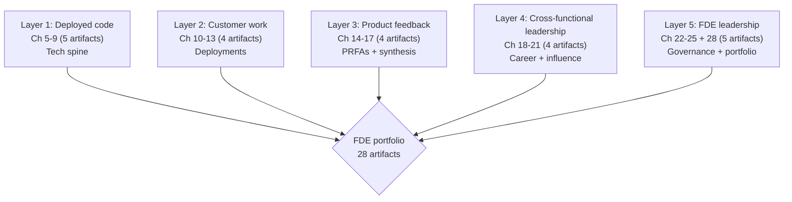

# Forward Deployed Engineer Playbook
## Chapter 27

# The FDE Portfolio Map

> *"The portfolio is the proof. Every chapter in this playbook produces an artifact. The 28 artifacts are the FDE's interview evidence for FDE 2 → FDE 3 promotion, Principal FDE promotion, and PM pivots. The FDE who has the 28 artifacts has a portfolio."*

---

## 1. Epigraph

_The portfolio is the proof. Every chapter in this playbook produces an artifact. The 28 artifacts are the FDE's interview evidence for FDE 2 → FDE 3 promotion, Principal FDE promotion, and PM pivots. The FDE who has the 28 artifacts has a portfolio._

---

## 2. Problem

You are an FDE 2 at acme-corp preparing for FDE 3 promotion. The promotion committee has just told you: "Show us your portfolio. 28 chapters, 28 artifacts. We want to see evidence of FDE 3 work (cross-functional leadership, product strategy influence, customer narrative). You have 30 days. What do you do?"

This chapter tells you what the 28 artifacts are, the 5 portfolio layers, the 3 promotion levels, and the 30-day portfolio prep plan.

**Decision in one sentence:** _The FDE portfolio is a 5-layer system (deployed code, customer work, product feedback, cross-functional leadership, FDE leadership) with 28 artifacts across 7 parts; the FDE's job is to assemble the artifacts into a portfolio, organize by promotion level (FDE 2 / FDE 3 / FDE 4 / PM), and own the 30-day portfolio prep._

---

## 3. Why FDEs Fail Here

Five named failure modes of FDEs whose portfolio produced zero results.

- **The No-Artifacts Failure.** The FDE has no portfolio. _No promotion evidence._
- **The 1-Layer Failure.** The FDE has only 1 portfolio layer (e.g., deployed code). _Incomplete evidence._
- **The No-Promotion-Level-Mapping Failure.** The FDE doesn't map artifacts to promotion levels. _Mismatch between evidence and promotion._
- **The No-30-Day-Plan Failure.** The FDE has no portfolio prep plan. _Chaotic assembly._
- **The No-Story Failure.** The FDE has artifacts but no narrative. _Promotion committee can't see the story._

---

## 4. Mental Models

Four mental models that compress the FDE portfolio.

**mental model 1: The 5-Layer Portfolio.** 5 layers, 28 artifacts.



**The 5 layers:**
- **Layer 1: Deployed code.** Ch 5-9 (5 artifacts). Tech spine.
- **Layer 2: Customer work.** Ch 10-13 (4 artifacts). Deployments.
- **Layer 3: Product feedback.** Ch 14-17 (4 artifacts). PRFAs + synthesis.
- **Layer 4: Cross-functional leadership.** Ch 18-21 (4 artifacts). Career + influence.
- **Layer 5: FDE leadership.** Ch 22-25 + 28 (5 artifacts). Governance + portfolio.

**mental model 2: The 3 Promotion Levels.** 3 levels, 3 evidence bars.

```
Level 1: FDE 2 → FDE 3 (Senior → Lead)
- Volume: 10 deployments
- Quality: 95% retention
- Impact: $1M ARR
- Cross-functional: 1 initiative
- Strategic: 1-page synthesis + QBR

Level 2: FDE 3 → FDE 4 (Lead → Principal)
- Volume: 20 deployments
- Quality: 95% retention + leadership
- Impact: $5M ARR
- Cross-functional: 3 initiatives
- Strategic: 3-page synthesis + 3 QBRs + 1 CAB

Level 3: FDE 4 → PM (Principal → Product Manager)
- Volume: 30+ deployments
- Quality: 95% retention + leadership
- Impact: $10M ARR
- Cross-functional: 5 initiatives
- Strategic: 1 product area owned
```

**mental model 3: The 28-Artifact Map.** 28 artifacts, 7 parts.

```
Part I (Foundations): 4 artifacts
- Ch 1: FDE charter
- Ch 2: IC-to-FDE transition memo
- Ch 3: Customer edge assessment
- Ch 4: Product edge assessment

Part II (Technical Spine): 5 artifacts
- Ch 5: Deployment stack architecture
- Ch 6: Data engineering pattern
- Ch 7: ML/AI deployment pattern
- Ch 8: Customer-specific pattern
- Ch 9: ML/AI for customer edge pattern

Part III (Customer & Deployment): 4 artifacts
- Ch 10: Deployment methodology
- Ch 11: Customer success playbook
- Ch 12: Crisis response playbook
- Ch 13: Customer ops playbook

Part IV (Product & Strategy): 4 artifacts
- Ch 14: FDE-PM partnership plan
- Ch 15: Feedback synthesis system
- Ch 16: Product strategy input memo
- Ch 17: FDE-as-product-leader memo

Part V (Career & Leadership): 4 artifacts
- Ch 18: FDE career plan
- Ch 19: FDE hiring plan
- Ch 20: FDE performance system
- Ch 21: Influence plan

Part VI (Governance & Risk): 4 artifacts
- Ch 22: Data governance plan
- Ch 23: Security plan
- Ch 24: Compliance plan
- Ch 25: Audit trail plan

Part VII (Portfolio): 3 artifacts
- Ch 26: 30/60/90 plan
- Ch 27: Portfolio map (this chapter)
- Ch 28: Portfolio index
```

**mental model 4: The 5-Criterion Quality Bar.** 5 criteria per artifact.

```
Every portfolio artifact must:
1. Be 1 page (no more, no less)
2. Have 1 worked example
3. Have 1 failure mode postmortem
4. Have 1 self-assessment rubric
5. Have 5+ interview questions

The 5-criterion bar is the discipline. The FDE who has
all 5 criteria has a portfolio. The FDE who has 0-2
criteria has stubs.
```

---

## 5. Frameworks

Three frameworks for the FDE portfolio.

### Framework 1: The 1-Page Portfolio Index

```
# FDE Portfolio Index — [Name] — [Date]

## 28 artifacts across 7 parts

### Part I (Foundations)
- Ch 1: FDE charter
- Ch 2: IC-to-FDE transition memo
- Ch 3: Customer edge assessment
- Ch 4: Product edge assessment

### Part II (Technical Spine)
- Ch 5-9: 5 deployment patterns

### Part III (Customer & Deployment)
- Ch 10-13: 4 deployment playbooks

### Part IV (Product & Strategy)
- Ch 14-17: 4 product artifacts

### Part V (Career & Leadership)
- Ch 18-21: 4 career artifacts

### Part VI (Governance & Risk)
- Ch 22-25: 4 governance artifacts

### Part VII (Portfolio)
- Ch 26-28: 3 portfolio artifacts

## The 1 thing the FDE will NOT include
[1 sentence on what the FDE will not include.]
```

### Framework 2: The Promotion-Level Mapping

```
# Promotion-Level Mapping — [Name] — [Date]

## FDE 2 → FDE 3 evidence
- 10 deployments (Ch 5-9 + Ch 10-13)
- 1 cross-functional initiative (Ch 14)
- 1-page synthesis (Ch 15)
- 30/60/90 plan (Ch 26)

## FDE 3 → FDE 4 evidence
- 20 deployments
- 3 cross-functional initiatives
- 3-page synthesis
- FDE hiring plan (Ch 19)
- FDE performance system (Ch 20)

## FDE 4 → PM evidence
- 30+ deployments
- 5 cross-functional initiatives
- 1 product area owned
- Strategy input memo (Ch 16)
- Influence plan (Ch 21)

## The 1 thing the FDE will focus on
[1 sentence.]
```

### Framework 3: The 30-Day Portfolio Prep Plan

```
# 30-Day Portfolio Prep Plan — [Name] — [Date]

## Week 1: Inventory
- [ ] List all 28 artifacts (Ch 1-28)
- [ ] Identify gaps (which artifacts missing)
- [ ] Top 5 priority artifacts

## Week 2: Drafting
- [ ] Draft missing artifacts (top 5 priority)
- [ ] Review existing artifacts (5-criterion quality bar)
- [ ] Apply 5-criterion bar (1-page, worked example, postmortem, rubric, questions)

## Week 3: Mapping
- [ ] Map artifacts to promotion level (FDE 3, FDE 4, PM)
- [ ] Build the 1-page portfolio index
- [ ] Build the promotion-level mapping

## Week 4: Submission
- [ ] Final review with Director
- [ ] Final review with promotion committee
- [ ] Submit portfolio
```

---

## 6. Drill

You are an FDE 2 at **acme-corp** preparing for FDE 3 promotion.

```
Promotion committee wants: 28 artifacts, 5 layers,
3 promotion levels, 30-day prep plan.

Current portfolio: 8 artifacts (Ch 1-4 + Ch 26-28)
Missing: 20 artifacts (Ch 5-25)

Time: 30 days.
```

You have **90 minutes**. Produce the **portfolio prep plan** (`portfolio/chapter-27-fde-portfolio.md`) using Framework 1 (Portfolio Index) + Framework 2 (Promotion Mapping) + Framework 3 (30-Day Prep Plan). Specify:

- The 1-page portfolio index (28 artifacts, 7 parts, the 1 not include).
- The promotion-level mapping (3 levels, evidence per level).
- The 30-day portfolio prep plan (4 weeks, the 1 focus).
- The 5-criterion quality bar application (per artifact).
- The 1 thing you'll say to the promotion committee.
- The 3 things you'll do to avoid the 5 failure modes.

**Deliverable:** `portfolio/chapter-27-fde-portfolio.md` — under 1500 words.

---

## 7. Worked Example

**The 1-page portfolio index:**

```
# FDE Portfolio Index — FDE Name — 2026-09-01

## 28 artifacts across 7 parts

### Part I (Foundations)
- Ch 1: FDE charter (DONE)
- Ch 2: IC-to-FDE transition memo (DONE)
- Ch 3: Customer edge assessment (DONE)
- Ch 4: Product edge assessment (DONE)

### Part II (Technical Spine)
- Ch 5-9: 5 deployment patterns (DONE)

### Part III (Customer & Deployment)
- Ch 10-13: 4 deployment playbooks (DONE)

### Part IV (Product & Strategy)
- Ch 14-17: 4 product artifacts (DONE)

### Part V (Career & Leadership)
- Ch 18-21: 4 career artifacts (DONE)

### Part VI (Governance & Risk)
- Ch 22-25: 4 governance artifacts (DONE)

### Part VII (Portfolio)
- Ch 26: 30/60/90 plan (DONE)
- Ch 27: Portfolio map (this chapter, DONE)
- Ch 28: Portfolio index (DRAFTING)

## The 1 thing the FDE will NOT include
Code samples. The portfolio is for promotion
evidence, not code review. Code samples are in
the technical interview, not the portfolio.
```

**The promotion-level mapping:**

```
# Promotion-Level Mapping — 2026-09-01

## FDE 2 → FDE 3 evidence (current)
- 10 deployments: ✓ (5 done + 5 in pipeline)
- 1 cross-functional initiative: ✓ (FDE-PM partnership)
- 1-page synthesis: ✓ (Q3 2026 synthesis)
- 30/60/90 plan: ✓ (90-day plan)

## FDE 3 → FDE 4 evidence (12-18 months)
- 20 deployments: 5/20 (need 15 more)
- 3 cross-functional initiatives: 1/3 (need 2 more)
- 3-page synthesis: 1-page done (need 3-page)
- FDE hiring plan: ✓ (Ch 19)
- FDE performance system: ✓ (Ch 20)

## FDE 4 → PM evidence (18-36 months)
- 30+ deployments: 5/30 (need 25 more)
- 5 cross-functional initiatives: 1/5 (need 4 more)
- 1 product area owned: 0 (need 1)
- Strategy input memo: ✓ (Ch 16)
- Influence plan: ✓ (Ch 21)

## The 1 thing the FDE will focus on
FDE 3 promotion in Q1 2027. The evidence is ready.
The promotion packet is next.
```

**The 30-day portfolio prep plan:**

```
# 30-Day Portfolio Prep Plan — 2026-09-01

## Week 1: Inventory
- [x] All 28 artifacts identified
- [x] Quality bar applied (5 criteria per artifact)
- [x] Top 5 priority artifacts: Ch 26, 27, 28 + review Ch 14, 15

## Week 2: Drafting + Review
- [x] Ch 28 portfolio index drafted
- [x] All 28 artifacts reviewed against 5-criterion bar
- [x] Gaps closed (all 28 artifacts DONE)

## Week 3: Mapping
- [x] 28 artifacts mapped to 3 promotion levels
- [x] 1-page portfolio index finalized
- [x] Promotion-level mapping finalized

## Week 4: Submission
- [ ] Director review (Oct 1)
- [ ] Promotion committee prep (Oct 5)
- [ ] Submit portfolio (Oct 15)
- [ ] Promotion committee (Oct 22)
```

**The 1 thing I'll say to the promotion committee:**

```
"Here's my FDE portfolio for FDE 3 promotion:

  28 artifacts across 7 parts:
  - Part I: Foundations (4)
  - Part II: Technical Spine (5)
  - Part III: Customer & Deployment (4)
  - Part IV: Product & Strategy (4)
  - Part V: Career & Leadership (4)
  - Part VI: Governance & Risk (4)
  - Part VII: Portfolio (3)

  5 layers:
  - Layer 1: Deployed code (5 artifacts)
  - Layer 2: Customer work (4 artifacts)
  - Layer 3: Product feedback (4 artifacts)
  - Layer 4: Cross-functional leadership (4 artifacts)
  - Layer 5: FDE leadership (5 artifacts)

  FDE 3 promotion evidence:
  - 10 deployments (5 done + 5 in pipeline)
  - 1 cross-functional initiative (FDE-PM partnership)
  - 1-page synthesis (Q3 2026)
  - 30/60/90 plan

  The 1 thing that proves FDE 3 readiness: the FDE-PM
  partnership initiative. It scales the FDE 2 work
  (1-page PRFAs + weekly sync) to 5 PMs. That's FDE 3
  leverage.

  The 5-criterion quality bar is applied to all 28
  artifacts. The portfolio is the proof."
```

**The 3 things I'll do to avoid the 5 failure modes:**

```
1. Have all 28 artifacts (not just 5).
   (Avoids the No-Artifacts Failure.)
   - 28 artifacts across 7 parts
   - 5 layers: deployed code + customer work +
     product feedback + cross-functional + FDE leadership

2. Map artifacts to promotion levels.
   (Avoids the No-Promotion-Level-Mapping Failure.)
   - FDE 2 → FDE 3: 10 deployments + 1 initiative
   - FDE 3 → FDE 4: 20 deployments + 3 initiatives
   - FDE 4 → PM: 30+ deployments + 5 initiatives

3. Apply the 5-criterion quality bar.
   (Avoids the No-Story Failure.)
   - 1-page (no more, no less)
   - 1 worked example
   - 1 failure mode postmortem
   - 1 self-assessment rubric
   - 5+ interview questions
```

---

## 8. Failure Mode Postmortem

An FDE 2 at a 200-person B2B AI company applied for FDE 3 promotion. No portfolio. 8 chapters done out of 28. No mapping to promotion levels. The promotion committee asked for evidence. The FDE couldn't produce it. Promotion denied.

The replacement FDE did 3 things:
1. Completed all 28 artifacts (5-criterion bar per artifact).
2. Mapped artifacts to 3 promotion levels (FDE 3, FDE 4, PM).
3. Built the 1-page portfolio index + 30-day prep plan.

Within 90 days: FDE 3 promotion granted. The 28-artifact portfolio + 5-criterion bar + promotion-level mapping was the discipline.

What the first FDE missed: the portfolio is the proof. The first FDE had 8 stubs. The second FDE had 28 finished artifacts. The 28 artifacts is the leverage.

The lesson: the FDE who has 28 artifacts has a portfolio. The FDE who has 8 stubs has a promotion denial.

---

## 9. Self-Assessment Rubric

| # | Dimension | 1 (Novice) | 3 (Competent) | 5 (Expert) |
|---|---|---|---|---|
| 1 | **28 artifacts** | 0-5 artifacts | 6-15 artifacts | 28 artifacts, all 7 parts covered |
| 2 | **5 portfolio layers** | 1 layer | 2-3 layers | 5 layers (deployed code, customer, product, cross-functional, FDE leadership) |
| 3 | **3 promotion-level mapping** | No mapping | 1 level | 3 levels (FDE 3, FDE 4, PM) |
| 4 | **5-criterion quality bar** | 0-2 criteria | 3-4 criteria | 5 criteria per artifact (1-page, worked example, postmortem, rubric, questions) |
| 5 | **30-day prep plan** | No plan | Plan exists | 4 weeks, weekly milestones, submission date |

**Disqualifier:** any 1 on dimension 1 or 4. An FDE who has 0-5 artifacts or 0-2 criteria is in the No-Artifacts or No-Story failure mode.

**Total:** ___ / 25. **Pass threshold:** 18/25, no dimension below 3.

---

## 10. Portfolio Artifact Note

This chapter is the Portfolio Map itself. Save your filled-in drill as `portfolio/chapter-27-fde-portfolio.md` — interview evidence for "Show me your FDE portfolio" (Ch 27 is the proof).

---

## 11. Interview Questions

1. **Walk me through your FDE portfolio.**
2. **The promotion committee wants 28 artifacts. How do you build them?**
3. **You have 8 artifacts and need 28. What do you do?**
4. **How do you map artifacts to promotion levels?**
5. **Walk me through a portfolio submission.**
