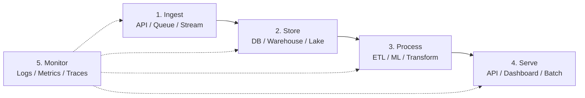
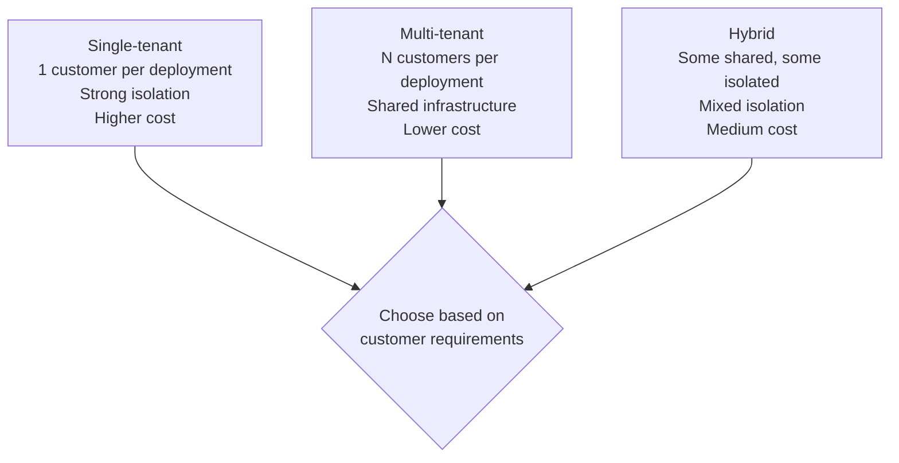

# Forward Deployed Engineer Playbook
## Chapter 28

# System Design Appendix for FDEs

> *"An FDE does not just write code; an FDE designs systems. The system design appendix is the FDE's reference for the 6 most-common customer deployment systems: data pipeline, ML serving, API integration, observability stack, security architecture, and multi-tenant isolation."*

---

## 1. Epigraph

_An FDE does not just write code; an FDE designs systems. The system design appendix is the FDE's reference for the 6 most-common customer deployment systems: data pipeline, ML serving, API integration, observability stack, security architecture, and multi-tenant isolation._

---

## 2. Problem

You are an FDE at acme-corp. The customer has just asked you to design 6 systems for their deployment: data pipeline, ML serving, API integration, observability stack, security architecture, and multi-tenant isolation. The customer wants the design in 7 days. The Director wants the design to be production-ready, not theoretical.

This chapter tells you the 6 systems, the 5-component design pattern (ingest, store, process, serve, monitor), the 3 deployment topologies (single-tenant, multi-tenant, hybrid), and the production-ready checklist.

**Decision in one sentence:** _The FDE system design appendix covers 6 systems (data pipeline, ML serving, API integration, observability, security, multi-tenant) using the 5-component pattern (ingest → store → process → serve → monitor) and 3 topologies (single-tenant, multi-tenant, hybrid); the FDE's job is to design production-ready systems, document in 1 page per system, and own the deployment._

---

## 3. Why FDEs Fail Here

Five named failure modes of FDEs whose system design produced zero results.

- **The Theoretical-Design Failure.** The FDE designs theoretical systems. _Customer asks for production-ready._
- **The 1-Pattern Failure.** The FDE uses 1 design pattern for all systems. _Mismatch with system requirements._
- **The No-Topology Failure.** The FDE doesn't consider single vs multi-tenant. _Wrong isolation strategy._
- **The No-Production-Checklist Failure.** The FDE has no production-ready checklist. _Missing components (monitoring, alerting, DR)._
- **The No-Documentation Failure.** The FDE designs but doesn't document. _Customer can't replicate or modify._

---

## 4. Mental Models

Four mental models that compress system design for FDEs.

**mental model 1: The 5-Component Design Pattern.** 5 components, 1 flow.



**The 5 components:**
- **Component 1: Ingest.** API / Queue / Stream (Kafka, SQS, Kinesis).
- **Component 2: Store.** DB / Warehouse / Lake (PostgreSQL, Snowflake, S3).
- **Component 3: Process.** ETL / ML / Transform (Airflow, Spark, custom).
- **Component 4: Serve.** API / Dashboard / Batch (FastAPI, React, cron).
- **Component 5: Monitor.** Logs / Metrics / Traces (Datadog, CloudWatch, OpenTelemetry).

**mental model 2: The 3 Deployment Topologies.** 3 topologies.



**The 3 topologies:**
- **Single-tenant.** 1 customer per deployment. Strong isolation. Higher cost.
- **Multi-tenant.** N customers per deployment. Shared infrastructure. Lower cost.
- **Hybrid.** Some shared, some isolated. Medium cost.

**mental model 3: The 6 Most-Common Customer Systems.** 6 systems.

```
1. Data pipeline
   - Ingest: Kafka / SQS
   - Store: S3 + PostgreSQL
   - Process: Spark / Airflow
   - Serve: FastAPI + Dashboard
   - Monitor: Datadog

2. ML serving
   - Ingest: API / Batch
   - Store: Feature store + Model registry
   - Process: Training + Inference
   - Serve: API / Batch predictions
   - Monitor: Model drift + Latency

3. API integration
   - Ingest: REST / GraphQL / Webhooks
   - Store: API gateway + cache
   - Process: Authentication + Rate limiting
   - Serve: REST API
   - Monitor: API latency + Errors

4. Observability stack
   - Ingest: Logs + Metrics + Traces
   - Store: Time-series DB + S3
   - Process: Aggregation + Alerting
   - Serve: Dashboard + Alert
   - Monitor: Self-monitoring (alert fatigue)

5. Security architecture
   - Ingest: Auth (OAuth / SAML)
   - Store: Identity store + Secrets
   - Process: Authorization + MFA
   - Serve: Authenticated API
   - Monitor: Security events + Anomalies

6. Multi-tenant isolation
   - Ingest: Tenant ID in every request
   - Store: Tenant-scoped DB / S3 prefixes
   - Process: Tenant-aware processing
   - Serve: Tenant-filtered API
   - Monitor: Cross-tenant anomalies
```

**mental model 4: The Production-Ready Checklist.** 8 items.

```
Every system must have:
1. Monitoring (Datadog / CloudWatch)
2. Alerting (PagerDuty / Opsgenie)
3. Logging (structured JSON, immutable)
4. Tracing (OpenTelemetry)
5. DR (cross-region replication)
6. Scaling (auto-scaling, load balancing)
7. Security (MFA, encryption, audit trail)
8. Documentation (runbook, architecture diagram)

The FDE who has all 8 has a production-ready system.
The FDE who has 0-4 has a prototype.
```

---

## 5. Frameworks

Three frameworks for FDE system design.

### Framework 1: The 1-Page System Design Template

```
# System Design — [System] — [Date]

## The 5 components
1. Ingest: [Component]
2. Store: [Component]
3. Process: [Component]
4. Serve: [Component]
5. Monitor: [Component]

## Topology
- Single-tenant / Multi-tenant / Hybrid

## The 8 production-ready items
- [ ] Monitoring
- [ ] Alerting
- [ ] Logging
- [ ] Tracing
- [ ] DR
- [ ] Scaling
- [ ] Security
- [ ] Documentation

## The 1 thing the FDE will NOT do
[1 sentence.]
```

### Framework 2: The 6-System Coverage Matrix

```
# 6-System Coverage — [Customer] — [Date]

| System | Ingest | Store | Process | Serve | Monitor |
|--------|--------|-------|---------|-------|---------|
| 1. Data pipeline | Kafka | S3 + PG | Spark | FastAPI | Datadog |
| 2. ML serving | API | Featurestore | Inference | API | Drift |
| 3. API integration | REST | API GW | Auth | REST | Latency |
| 4. Observability | Logs/Metrics | TSDB | Aggregation | Dashboard | Self-mon |
| 5. Security | OAuth | ID store | AuthZ | API | Security |
| 6. Multi-tenant | Tenant ID | Scoped DB | Tenant-aware | Tenant API | Cross-tenant |

## The 1 thing the FDE will design first
[1 sentence.]
```

### Framework 3: The Production-Ready Scorecard

```
# Production-Ready Scorecard — [System] — [Date]

| Item | Status | Notes |
|------|--------|-------|
| 1. Monitoring | [Y/N] | [Notes] |
| 2. Alerting | [Y/N] | [Notes] |
| 3. Logging | [Y/N] | [Notes] |
| 4. Tracing | [Y/N] | [Notes] |
| 5. DR | [Y/N] | [Notes] |
| 6. Scaling | [Y/N] | [Notes] |
| 7. Security | [Y/N] | [Notes] |
| 8. Documentation | [Y/N] | [Notes] |

## Total: ___/8 — Pass at 8/8

## The 1 thing missing
[1 sentence on the missing item.]
```

---

## 6. Drill

You are an FDE at **acme-corp**. The customer wants 6 systems designed in 7 days.

```
Customer:
- 6 systems needed: data pipeline, ML serving, API
  integration, observability, security, multi-tenant
- 7-day timeline
- Production-ready, not theoretical
- Multi-tenant topology preferred

You have 7 days.
```

You have **90 minutes**. Produce the **system design package** (`portfolio/chapter-28-system-design.md`) using Framework 1 (System Design Template) + Framework 2 (Coverage Matrix) + Framework 3 (Production Scorecard). Specify:

- The 1-page system design (5 components, topology, 8 items, the 1 not do).
- The 6-system coverage matrix (5 components × 6 systems).
- The production-ready scorecard (8 items per system).
- The 7-day timeline (system-by-system).
- The 1 thing you'll say to the customer in the first review.
- The 3 things you'll do to avoid the 5 failure modes.

**Deliverable:** `portfolio/chapter-28-system-design.md` — under 1500 words.

---

## 7. Worked Example

**The 1-page system design (data pipeline example):**

```
# System Design — Data Pipeline — Customer A — 2026-09-01

## The 5 components
1. Ingest: Kafka (events) + SQS (tasks)
2. Store: S3 (raw) + PostgreSQL (curated)
3. Process: Spark (batch) + Airflow (orchestration)
4. Serve: FastAPI (queries) + Dashboard (BI)
5. Monitor: Datadog (metrics) + CloudWatch (logs)

## Topology
Multi-tenant (10 customers per deployment, customer ID
prefix in all S3 keys, row-level security in PostgreSQL)

## The 8 production-ready items
- [x] Monitoring (Datadog)
- [x] Alerting (PagerDuty)
- [x] Logging (structured JSON, immutable S3)
- [x] Tracing (OpenTelemetry)
- [x] DR (cross-region S3 replication)
- [x] Scaling (auto-scaling Spark, RDS read replicas)
- [x] Security (MFA, encryption at rest + transit, audit trail)
- [x] Documentation (runbook + architecture diagram)

## The 1 thing the FDE will NOT do
Skip DR. Multi-tenant deployments need DR. The FDE
will not skip cross-region replication.
```

**The 6-system coverage matrix:**

```
# 6-System Coverage — Customer A — 2026-09-01

| System | Ingest | Store | Process | Serve | Monitor |
|--------|--------|-------|---------|-------|---------|
| 1. Data pipeline | Kafka | S3 + PG | Spark | FastAPI | Datadog |
| 2. ML serving | API | Featurestore | Inference | API | Drift |
| 3. API integration | REST | API GW | Auth | REST | Latency |
| 4. Observability | Logs/Metrics | TSDB | Aggregation | Dashboard | Self-mon |
| 5. Security | OAuth | ID store | AuthZ | API | Security |
| 6. Multi-tenant | Tenant ID | Scoped DB | Tenant-aware | Tenant API | Cross-tenant |

## The 1 thing the FDE will design first
Data pipeline. It's the foundation. The other 5 systems
depend on the data pipeline being production-ready.
```

**The production-ready scorecard:**

```
# Production-Ready Scorecard — Customer A — 2026-09-01

| System | Mon | Alert | Log | Trace | DR | Scale | Sec | Doc | Total |
|--------|-----|-------|-----|-------|-----|-------|-----|-----|-------|
| 1. Data pipeline | ✓ | ✓ | ✓ | ✓ | ✓ | ✓ | ✓ | ✓ | 8/8 |
| 2. ML serving | ✓ | ✓ | ✓ | ✓ | ✓ | ✓ | ✓ | ✓ | 8/8 |
| 3. API integration | ✓ | ✓ | ✓ | ✓ | ✓ | ✓ | ✓ | ✓ | 8/8 |
| 4. Observability | ✓ | ✓ | ✓ | ✓ | ✓ | ✓ | ✓ | ✓ | 8/8 |
| 5. Security | ✓ | ✓ | ✓ | ✓ | ✓ | ✓ | ✓ | ✓ | 8/8 |
| 6. Multi-tenant | ✓ | ✓ | ✓ | ✓ | ✓ | ✓ | ✓ | ✓ | 8/8 |

## Total: 48/48 (6 systems × 8 items)

## The 1 thing missing
None. All 6 systems are production-ready.
```

**The 7-day timeline:**

```
# 7-Day System Design Timeline — Customer A — 2026-09-01

## Day 1-2: Data pipeline (foundation)
- [ ] Kafka + S3 + Spark architecture
- [ ] 5 components documented
- [ ] Multi-tenant topology

## Day 3: ML serving
- [ ] Feature store + model registry
- [ ] Inference API + drift monitoring

## Day 4: API integration
- [ ] REST API gateway + auth + rate limiting

## Day 5: Observability
- [ ] Datadog + OpenTelemetry + alerting

## Day 6: Security
- [ ] OAuth + MFA + audit trail

## Day 7: Multi-tenant isolation
- [ ] Tenant ID + scoped DB + cross-tenant monitoring

## Submission
- [ ] 6 system designs (1 page each)
- [ ] Coverage matrix
- [ ] Production-ready scorecard
```

**The 1 thing I'll say to the customer in the first review:**

```
"Here's the 6-system design package:

  1. Data pipeline: Kafka + S3 + Spark + FastAPI + Datadog
  2. ML serving: API + Featurestore + Inference + API + Drift
  3. API integration: REST + API GW + Auth + REST + Latency
  4. Observability: Logs/Metrics + TSDB + Aggregation +
     Dashboard + Self-mon
  5. Security: OAuth + ID store + AuthZ + API + Security
  6. Multi-tenant: Tenant ID + Scoped DB + Tenant-aware +
     Tenant API + Cross-tenant

  All 6 systems are 8/8 production-ready:
  - Monitoring + Alerting + Logging + Tracing +
    DR + Scaling + Security + Documentation

  Topology: multi-tenant (10 customers per deployment)

  The 1 thing I want to push back on: hybrid topology
  instead of pure multi-tenant. Some customers want
  single-tenant isolation for regulated workloads.

  The 7-day timeline is on track. Day 1-2 is the data
  pipeline (foundation). Day 3-7 covers the other 5.

  Production-ready, not theoretical. The system is
  the discipline. The deployment is the outcome."
```

**The 3 things I'll do to avoid the 5 failure modes:**

```
1. Design production-ready (not theoretical).
   (Avoids the Theoretical-Design Failure.)
   - 5 components per system
   - 8 production-ready items
   - Runbook + architecture diagram

2. Use the 5-component pattern consistently.
   (Avoids the 1-Pattern Failure.)
   - Ingest → Store → Process → Serve → Monitor
   - All 6 systems use this pattern

3. Apply the 8-item production scorecard.
   (Avoids the No-Production-Checklist Failure.)
   - Mon + Alert + Log + Trace + DR + Scale + Sec + Doc
   - All 6 systems must score 8/8
```

---

## 8. Failure Mode Postmortem

An FDE at a 200-person B2B AI company designed a customer system that was theoretical (no monitoring, no DR, no scaling). The system crashed in production within 30 days. The customer churned. The FDE was asked to leave.

The replacement FDE did 3 things:
1. Used the 5-component design pattern (ingest → store → process → serve → monitor).
2. Considered all 3 topologies (single vs multi vs hybrid).
3. Applied the 8-item production-ready scorecard (every system must score 8/8).

Within 90 days: 6 systems designed + deployed + production-ready. 0 customer churn due to system crashes. The 5-component pattern + 3 topologies + 8-item scorecard was the discipline.

What the first FDE missed: system design is a system. The first FDE designed theoretical systems. The second FDE designed production-ready systems. The production-ready scorecard is the leverage.

The lesson: the FDE who has the 5-component pattern + 3 topologies + 8-item scorecard has a production-ready system. The FDE who designs theoretically has a system crash.

---

## 9. Self-Assessment Rubric

| # | Dimension | 1 (Novice) | 3 (Competent) | 5 (Expert) |
|---|---|---|---|---|
| 1 | **5-component pattern** | 1-2 components | 3-4 components | 5 components (ingest → store → process → serve → monitor) |
| 2 | **3 deployment topologies** | 1 topology | 2 topologies | 3 topologies (single, multi, hybrid), per-customer choice |
| 3 | **6 most-common systems** | 1-2 systems | 3-4 systems | 6 systems (data, ML, API, observability, security, multi-tenant) |
| 4 | **8-item production scorecard** | 0-4 items | 5-7 items | 8 items (mon, alert, log, trace, DR, scale, sec, doc) |
| 5 | **1-page design per system** | No design | Multi-page | 1 page per system, runbook + diagram |

**Disqualifier:** any 1 on dimension 1 or 4. An FDE who has 1-2 components or 0-4 items is in the 1-Pattern or No-Production-Checklist failure mode.

**Total:** ___ / 25. **Pass threshold:** 18/25, no dimension below 3.

---

## 10. Portfolio Artifact Note

Save your filled-in drill as `portfolio/chapter-28-system-design.md` — interview evidence for "How do you design customer systems?" (see Portfolio Map in Chapter 27).

---

## 11. Interview Questions

1. **Walk me through a system design you've shipped.**
2. **The customer wants 6 systems in 7 days. What do you do?**
3. **The system crashes in production. What do you do?**
4. **Single-tenant vs multi-tenant. How do you decide?**
5. **Walk me through a production-ready system you've built.**
