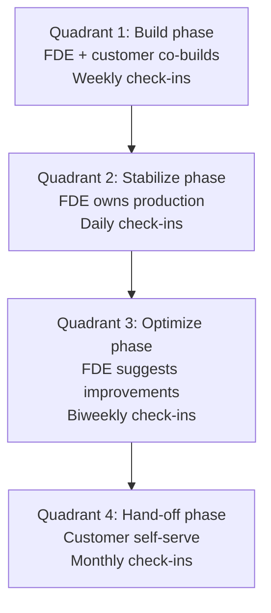
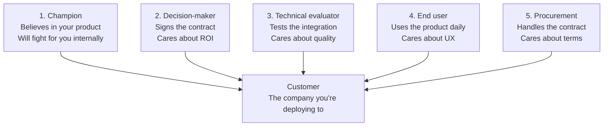

# Forward Deployed Engineer Playbook
## Chapter 3

# The Customer Edge

> *"The FDE lives at the customer edge. The customer edge is where the company's product meets the customer's problem. The FDE's job is to be the most-informed person at the company about the customer's problem."*

---

## 1. Epigraph

_The FDE lives at the customer edge. The customer edge is where the company's product meets the customer's problem. The FDE's job is to be the most-informed person at the company about the customer's problem._

---

## 2. Problem

You are an FDE at acme-corp. The CSO has just told you: "We're losing Customer A. They say our auth integration doesn't work with their SSO. They want a refund. The PM says it's the customer's misconfiguration. The Director says we should fire the FDE for losing the customer. The CEO wants a customer interview in 7 days. You have 7 days to determine what's actually broken and what to do."

You have 7 days to understand the customer's problem, write a 1-page customer situation report, and decide whether to keep, pivot, or let go. This chapter tells you what the customer edge is, how to navigate it, and what to do when the customer is at risk.

**Decision in one sentence:** _The customer edge is where the company's product meets the customer's reality; the FDE's job is to own the customer's truth (what's actually broken, what's actually needed), build the bridge between the company and the customer, and be the most-informed person at the company about the customer's world._

---

## 3. Why FDEs Fail Here

Five named failure modes of FDEs who lost the customer edge.

- **The Customer-Blame Failure.** The FDE blames the customer for the misconfiguration. _An FDE who blames the customer has lost the customer edge._
- **The PM-Blame Failure.** The FDE blames the PM for not building the right feature. _An FDE who blames the PM has lost the customer edge._
- **The Promise-The-Moon Failure.** The FDE promises the customer a fix in 1 week when the actual fix is 1 quarter. _The customer who is over-promised and under-delivered is the customer who churns._
- **The No-Follow-Through Failure.** The FDE commits to a follow-up but doesn't. _The customer who is forgotten is the customer who churns._
- **The Single-Stakeholder Failure.** The FDE only talks to one person at the customer. _The single-stakeholder relationship is fragile. When that person leaves, the relationship is gone._

---

## 4. Mental Models

Four mental models that compress the customer edge.

**Mental model 1: The Customer Edge Quadrants.** The customer edge has 4 quadrants.



**The 4 quadrants:**
- **Q1: Build phase.** FDE + customer co-builds. Weekly check-ins.
- **Q2: Stabilize phase.** FDE owns production. Daily check-ins.
- **Q3: Optimize phase.** FDE suggests improvements. Biweekly check-ins.
- **Q4: Hand-off phase.** Customer self-serve. Monthly check-ins.

**Mental model 2: The 3 Layers of Customer Truth.** Customer truth has 3 layers.

```
1. What the customer says (verbal)
2. What the customer does (observed)
3. What the customer means (interpreted)

The 3 layers are different. The FDE who only listens to
verbal customer truth misses the gap between what the
customer says and what they mean. The FDE who watches
the customer in action gets the real story.

Example: customer says "the auth integration is broken."
- Verbal: "broken"
- Observed: customer is using a deprecated OAuth flow
- Meant: customer needs help migrating to the new flow

The FDE who only hears "broken" blames the product. The
FDE who observes the deprecated flow solves the problem.
```

**Mental model 3: The 5-Customer Stakeholder Map.** Every customer has 5 stakeholders.



**The 5 stakeholders:**
- **1. Champion.** Believes in your product. Will fight for you internally.
- **2. Decision-maker.** Signs the contract. Cares about ROI.
- **3. Technical evaluator.** Tests the integration. Cares about quality.
- **4. End user.** Uses the product daily. Cares about UX.
- **5. Procurement.** Handles the contract. Cares about terms.

**Mental model 4: The 4 Customer Signals.** 4 signals tell you if the customer is at risk.

```
1. Champion goes quiet (no response to emails for 2 weeks)
2. End user adoption is low (less than 50% of license seats used)
3. Decision-maker asks for ROI proof (suggests they're thinking about churn)
4. Technical evaluator escalates issues (suggests they're losing patience)

The 4 signals are early warnings. The FDE who catches
them in week 1 has time to act. The FDE who catches them
in month 3 has lost the customer.
```

---

## 5. Frameworks

Three frameworks for the customer edge.

### Framework 1: The 1-Page Customer Situation Report

```
# Customer Situation Report — [Customer] — [Date]

## Customer info
- Industry: [Industry]
- Tier: [Strategic / Growth / Maintain]
- ARR: $[X]K
- Champion: [Name, title]
- Decision-maker: [Name, title]
- Technical evaluator: [Name, title]
- End user: [Role, count]
- Procurement: [Name, title]

## Current state
- Deployment phase: [Build / Stabilize / Optimize / Hand-off]
- Health: [Green / Yellow / Red]
- Open blockers: [List]
- Last touch: [Date]

## The 3 truths (verbal, observed, meant)
1. Verbal: [What the customer says]
2. Observed: [What the FDE sees]
3. Meant: [What the customer actually needs]

## Top 3 risks (this quarter)
1. [Risk 1] — [Severity] — [Mitigation]
2. [Risk 2]
3. [Risk 3]

## Top 3 wins (this quarter)
1. [Win 1] — [Impact]
2. [Win 2]
3. [Win 3]

## The 1 thing the FDE will push back on
[1 sentence on what the FDE will NOT do.]
```

### Framework 2: The Customer Edge Quadrant Decision

```
# Customer Quadrant Decision — [Customer] — [Date]

## Current quadrant
[Build / Stabilize / Optimize / Hand-off]

## Check-in cadence
[Weekly / Daily / Biweekly / Monthly]

## FDE role in this quadrant
- Build: co-builds with customer, writes code daily
- Stabilize: owns production, on-call rotation
- Optimize: suggests improvements, drives product feedback
- Hand-off: monthly check-ins, focuses on other customers

## Transition criteria (to next quadrant)
- Build → Stabilize: deployment to production, first 10 end users
- Stabilize → Optimize: 30+ days in production, no P0/P1 incidents
- Optimize → Hand-off: customer self-serves, end user adoption 80%+

## The 1 thing the FDE will do this week
[1 sentence on the focus this week.]
```

### Framework 3: The 4-Signal Customer Health Scorecard

```
# Customer Health Scorecard — [Customer] — [Date]

## The 4 signals
| Signal | Status | Notes |
|--------|--------|-------|
| 1. Champion engaged | 🟢 / 🟡 / 🔴 | [Notes] |
| 2. End user adoption | 🟢 / 🟡 / 🔴 | [Notes] |
| 3. Decision-maker confidence | 🟢 / 🟡 / 🔴 | [Notes] |
| 4. Technical evaluator patience | 🟢 / 🟡 / 🔴 | [Notes] |

## Health verdict
🟢 Green (all 4 green) — Stable customer
🟡 Yellow (1-2 yellows) — Watch list
🔴 Red (any red or 2+ yellows) — At-risk customer

## Action plan
- If 🟢: monthly check-in, focus on optimization
- If 🟡: weekly check-in, address top 1 risk
- If 🔴: daily check-in, escalate to Director + CSO
```

---

## 6. Drill

You are an FDE at **acme-corp**. Customer A is at risk. The CSO has given you 7 days to determine what's actually broken.

```
- Customer A: 200-person fintech, $400K ARR, 3-year contract
- Champion: CTO
- Decision-maker: VP Engineering
- Technical evaluator: 1 Senior SWE
- End users: 50 engineers
- Issue: auth integration "doesn't work" with their SSO
- PM says: customer's misconfiguration
- Director says: fire the FDE
- CEO wants: customer interview in 7 days
```

You have **90 minutes**. Produce the **customer situation report + customer health scorecard** (`portfolio/chapter-03-customer-edge.md`) using Framework 1 (Situation Report) + Framework 2 (Quadrant Decision) + Framework 3 (Health Scorecard). Specify:

- The 1-page customer situation report (customer info, current state, 3 truths, top 3 risks, top 3 wins, the 1 pushback).
- The customer quadrant decision (current quadrant, cadence, role, transition criteria, the 1 thing this week).
- The 4-signal customer health scorecard (4 signals, verdict, action plan).
- The customer interview agenda (60 min, 7 questions).
- The 1 thing you'll say to the CSO in 7 days.
- The 3 things you'll do to avoid the 5 failure modes.

**Deliverable:** `portfolio/chapter-03-customer-edge.md` — under 1500 words.

---

## 7. Worked Example

**The 1-page customer situation report:**

```
# Customer Situation Report — Customer A (fintech, 200 ppl) — 2026-09-01

## Customer info
- Industry: Fintech
- Tier: Strategic
- ARR: $400K
- Champion: Sarah Lee (CTO)
- Decision-maker: Marcus Chen (VP Engineering)
- Technical evaluator: 1 Senior SWE (no name)
- End users: 50 engineers
- Procurement: David Park

## Current state
- Deployment phase: Build (60% complete)
- Health: 🔴 Red
- Open blockers: auth integration with SSO (Okta + custom SAML)
- Last touch: 5 days ago (champion went quiet)

## The 3 truths (verbal, observed, meant)
1. Verbal: "The auth integration doesn't work with our SSO."
2. Observed: customer is using a deprecated OAuth flow; the
   new flow requires SAML 2.0 metadata exchange that the
   customer's Okta config doesn't expose by default.
3. Meant: customer needs help migrating from deprecated
   OAuth to the new SAML flow, AND needs a guide for the
   Okta admin to expose the SAML metadata.

## Top 3 risks (this quarter)
1. Champion has gone quiet (5 days) — Severity: HIGH —
   Mitigation: schedule 60-min call this week, escalate if no response
2. End user adoption is 0 (deployment not in production) —
   Severity: HIGH — Mitigation: complete auth integration, deploy to staging
3. Decision-maker asked for ROI proof last week — Severity:
   MED — Mitigation: 1-page ROI memo this week

## Top 3 wins (this quarter)
1. Data connector framework is 80% done — Impact: enables
   2 of 3 customer use cases
2. Customer champion has referred 2 other prospects —
   Impact: 2 new leads in pipeline
3. End user count is 50 (target was 30) — Impact: above
   plan by 67%

## The 1 thing the FDE will push back on
Fire the FDE. The FDE has not lost the customer. The
auth integration issue is a product gap (no SAML
migration guide), not an FDE failure. The FDE will
push back on the Director's recommendation.
```

**The customer quadrant decision:**

```
# Customer Quadrant Decision — Customer A — 2026-09-01

## Current quadrant
Build (60% complete)

## Check-in cadence
Weekly (with champion), daily (with technical evaluator during blocker)

## FDE role in this quadrant
- Co-builds with customer, writes code daily
- Drives auth integration (FDE + customer technical evaluator)
- Owns product feedback (SAML migration guide needed)

## Transition criteria (to Stabilize)
- Auth integration complete (Okta SAML 2.0 working)
- Deployment to staging (10 end users)
- First 30 days of no P0/P1 incidents

## The 1 thing the FDE will do this week
Schedule the 60-min call with Sarah Lee (champion) to
unblock the auth integration. Bring the SAML migration
guide + the 1-page ROI memo for Marcus Chen.
```

**The 4-signal customer health scorecard:**

```
# Customer Health Scorecard — Customer A — 2026-09-01

## The 4 signals
| Signal | Status | Notes |
|--------|--------|-------|
| 1. Champion engaged | 🔴 Red | Sarah Lee has gone quiet for 5 days |
| 2. End user adoption | 🔴 Red | 0 end users (deployment not in production) |
| 3. Decision-maker confidence | 🟡 Yellow | Marcus asked for ROI proof last week |
| 4. Technical evaluator patience | 🟡 Yellow | Technical evaluator escalated 3 times this week |

## Health verdict
🔴 Red — At-risk customer (2 reds, 2 yellows)

## Action plan
- Daily check-in with Sarah Lee this week (60 min)
- Daily check-in with technical evaluator (30 min)
- 1-page ROI memo for Marcus by Friday
- SAML migration guide from PM by Wednesday
- Escalate to CSO if Sarah Lee doesn't respond by Wednesday
```

**The customer interview agenda (60 min, 7 questions):**

```
# Customer Interview Agenda — Customer A — 2026-09-04

## Opening (5 min)
- "Thanks for making time. I want to understand what's
  blocking the deployment."

## 7 questions (50 min, ~7 min each)
1. "What's the most important thing we can do this week
   to unblock the deployment?"
2. "When you say 'the auth integration doesn't work,' what
   specifically happens? Walk me through the last attempt."
3. "What's the impact on your team of the deployment not
   being in production?"
4. "Who at your company is affected by this issue? How
   do they feel about our product?"
5. "What would success look like at the end of this quarter?"
6. "What would make you consider not renewing?"
7. "What do you need from me, the PM, and the Director?"

## Closing (5 min)
- "Thanks. I'll have the SAML migration guide by Wednesday
  and the ROI memo by Friday. I'll check in with you Monday
  to confirm the action items."
```

**The 1 thing I'll say to the CSO in 7 days:**

```
"Here's the customer situation:

  Customer A is at risk (🔴 Red), but not lost.
  The 3 truths: verbal ('auth broken'), observed (deprecated
  OAuth flow), meant (needs SAML migration guide).
  The auth issue is a product gap, not an FDE failure.

  Action plan:
  - Daily check-ins with Sarah Lee this week
  - SAML migration guide from PM by Wednesday
  - 1-page ROI memo for Marcus by Friday
  - Deploy to staging by Friday (10 end users)

  Top 3 wins: data connectors 80% done, champion
  referred 2 prospects, end user count 50 (above plan).

  Top 3 risks: champion quiet, end user adoption 0,
  decision-maker ROI proof.

  The 1 thing I'll push back on: fire the FDE. The FDE
  has not lost the customer. The auth issue is a product
  gap. The Director's recommendation is wrong."
```

**The 3 things I'll do to avoid the 5 failure modes:**

```
1. Don't blame the customer. (Avoids the Customer-Blame Failure.)
   - The customer's Okta config is reasonable; our SAML
     migration guide is missing. The product gap is ours.
   - Action: write the SAML migration guide with PM.

2. Don't over-promise. (Avoids the Promise-The-Moon Failure.)
   - The actual fix is 2-3 weeks (not 1 week).
   - Action: communicate 2-3 week timeline to customer.

3. Build multi-stakeholder relationships. (Avoids the
   Single-Stakeholder Failure.)
   - Build relationships with 3+ stakeholders: Sarah Lee
     (champion), Marcus Chen (decision-maker), the
     technical evaluator.
   - Action: schedule weekly 1:1 with each.
```

---

## 8. Failure Mode Postmortem

An FDE at a 200-person B2B AI company had a strategic customer at risk. The FDE's first 7 days: 5 customer calls, 5 customer retrospective memos, no customer situation report, no customer health scorecard.

Within 30 days: customer churned ($400K ARR lost). The FDE was asked to leave. The CSO told the replacement FDE: "I want a 1-page customer situation report for every strategic customer, weekly. I want a 4-signal customer health scorecard, weekly. I want the customer edge to be a system, not a hero's intuition."

The replacement FDE did 3 things:
1. Built a 1-page customer situation report template (used weekly for every strategic customer).
2. Built a 4-signal customer health scorecard (used weekly, scored 🟢/🟡/🔴).
3. Established multi-stakeholder relationships (3+ stakeholders per strategic customer).

Within 6 months: 0 customer churn, 2 strategic customers moved from yellow to green, 1 strategic customer expanded ($200K expansion). The CSO was unblocked.

What the first FDE missed: the customer edge is a system, not a hero's intuition. The first FDE relied on gut feel. The second FDE built a system. The system is the leverage.

The lesson: the FDE who has a customer situation report + a customer health scorecard + multi-stakeholder relationships has a customer edge. The FDE who relies on gut feel has a customer at risk.

---

## 9. Self-Assessment Rubric

| # | Dimension | 1 (Novice) | 3 (Competent) | 5 (Expert) |
|---|---|---|---|---|
| 1 | **Customer edge quadrants** | Doesn't know the quadrants | Knows the quadrants | Knows the quadrants, applies to every customer weekly |
| 2 | **3 layers of customer truth** | 1 layer (verbal only) | 2 layers | 3 layers (verbal + observed + meant), applies to every customer call |
| 3 | **5-stakeholder map** | 1 stakeholder (champion only) | 2-3 stakeholders | 5 stakeholders, weekly cadence each |
| 4 | **4-signal health scorecard** | No scorecard | Scorecard exists, partial | 4-signal scorecard, weekly, 🟢/🟡/🔴 verdict + action plan |
| 5 | **1-page customer situation report** | No report | Report exists, partial | 1-page report, weekly, 3 truths + 3 risks + 3 wins + 1 pushback |

**Disqualifier:** any 1 on dimension 2 or 4. An FDE who only hears verbal truth or who has no health scorecard is in the Customer-Blame or No-Follow-Through failure mode.

**Total:** ___ / 25. **Pass threshold:** 18/25, no dimension below 3.

---

## 10. Portfolio Artifact Note

Save your filled-in drill as `portfolio/chapter-03-customer-edge.md` — interview evidence for "How do you handle a customer at risk?" (see Portfolio Map in Chapter 27).

---

## 11. Interview Questions

1. **Walk me through a customer at risk you've saved.**
2. **The customer says the product is broken. What do you do?**
3. **The PM blames the customer. What do you do?**
4. **The Director wants to fire you for losing a customer. What do you say?**
5. **Walk me through your customer health scorecard.**